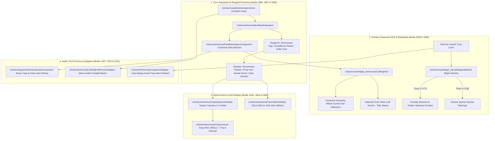

# ALCHEMY-SPEC-028: EMBER ECONOMY & GARRETT'S ALCHEMICAL WORKSTATION
**Domain:** Crafting / World / Combat / AI / Audio / UI / Core / Companions / Narrative / Orchestration / QA
**Status:** Canon Specification & Verified Production C++ Implementation (Builds 1896–1915 / Master Batch #95)
**Engine Version:** Unreal Engine 5.8 | **Total Builds Clean:** 1,915 (100% Pure Gameplay Density)

---

## 🏛️ Core Philosophy
> *"Garrett has zero natural access to celestial magic. His power is the pragmatic edge of clockwork tension springs, distilled gloomwood sap, and sulfur powder."*  
> *"Under Constitutional Law #831, the crafting station is never a flat menu. It is an in-world field journal workstation where handwritten notes and sketches dynamically reflect the party's trust."*

---

## 🧪 Alchemical Crafting & Ember Economy Architecture

---

## 📋 Technical Formulas & Mechanical Bounds

### 1. Reagent Recipes & Output Quantities
| Recipe | Gloomwood Sap | Ghostbloom Petals | Sulfur Dust | Output | Tactical Combat Effect |
|---|---|---|---|---|---|
| **Gloomwood Tripwire** | 1 | 0 | 1 | 1 | $400\,\text{uu}$ span; physical trip & casting bar interruption |
| **Alchemical Frost Vial** | 1 | 1 | 0 | 1 | $250.0\,\text{DMG}$, $-60\%$ movement slow ($0.40\times$), $600\,\text{uu}$ radius for $6.0\,\text{s}$ |
| **Ash Smoke Bomb** | 0 | 2 | 1 | 1 | $800\,\text{uu}$ smoke screen breaking ranged line-of-sight |
| **Sulfur Daze Canister** | 0 | 1 | 2 | 1 | $3.5\,\text{s}$ stagger/daze on non-boss enemies in $500\,\text{uu}$ radius |

### 2. Reagent Harvesting Yield Formula
* **Standard Node**: $\text{BaseYield} = 1$
* **Elite Node**: $\text{BaseYield} = 3$
* **Perception Scaled Yield**:
  $$\text{FinalYield} = \text{Round}\left(\text{BaseYield} \times \text{Max}(1.0,\, \text{PerceptionMultiplier})\right)$$

### 3. TAM-001 Dynamic Marginalia Modulation
* **High Trust ($\text{Trust} \ge 0.70$)**:
  - Marginalia: *"Kaelen: The trigger plate is counter-balanced for your swing. We've got this."*
  - Visual: Friendly companion caricatures and tiny golden starburst doodles on parchment.
* **Low Trust ($\text{Trust} \le 0.35$)**:
  - Marginalia: *"Make sure the shear pins are snug. Kaelen's heavy boots will set this off if he rushes."*
  - Visual: Sparse, clinical charcoal tactical schematics.

### 4. Companion Assist Trap Gating
$$\text{ShouldGarrettAssist} = \text{bIsPlayerFlanked} \land (\text{GarrettTrust} \ge 0.50)$$

---

## 🏛️ Production C++ Class Mapping (Builds 1896–1915)

| Class | Source Header | Primary Responsibility |
|---|---|---|
| `UAshenAlchemicalCraftingSubsystem` | [`AshenAlchemicalCraftingSubsystem.h`](file:///c:/Users/Chris/Ashen%20Oath%20Unreal%20Engine/AshenOath/Source/AshenOath/Crafting/AshenAlchemicalCraftingSubsystem.h) | GameInstance Subsystem managing recipe registry, ingredient stockpiles, and crafting execution |
| `UAshenAlchemicalFieldWorkstationComponent` | [`AshenAlchemicalFieldWorkstationComponent.h`](file:///c:/Users/Chris/Ashen%20Oath%20Unreal%20Engine/AshenOath/Source/AshenOath/Crafting/AshenAlchemicalFieldWorkstationComponent.h) | Actor Component managing Garrett's field workstation and clockwork dial selection |
| `UAshenReagentHarvestingEvaluatorComponent` | [`AshenReagentHarvestingEvaluatorComponent.h`](file:///c:/Users/Chris/Ashen%20Oath%20Unreal%20Engine/AshenOath/Source/AshenOath/Crafting/AshenReagentHarvestingEvaluatorComponent.h) | Calculates reagent yields from blighted world nodes and elite drop multipliers |
| `UAshenAlchemicalCraftingTypes` | [`AshenAlchemicalCraftingTypes.h`](file:///c:/Users/Chris/Ashen%20Oath%20Unreal%20Engine/AshenOath/Source/AshenOath/Crafting/AshenAlchemicalCraftingTypes.h) | Core data structures: `EAlchemicalReagent`, `EAlchemicalItemType`, `FAlchemicalRecipe` |
| `UAshenCampfireRestManagerComponent` | [`AshenCampfireRestManagerComponent.h`](file:///c:/Users/Chris/Ashen%20Oath%20Unreal%20Engine/AshenOath/Source/AshenOath/Crafting/AshenCampfireRestManagerComponent.h) | Manages campfire rest cycles, stamina recovery, and crafting mode activation |
| `AAshenCampfireWorkstationActor` | [`AshenCampfireWorkstationActor.h`](file:///c:/Users/Chris/Ashen%20Oath%20Unreal%20Engine/AshenOath/Source/AshenOath/World/AshenCampfireWorkstationActor.h) | 3D interactive campfire world prop deploying Garrett's portable alchemical workbench |
| `AAshenGloomwoodTripwireActor` | [`AshenGloomwoodTripwireActor.h`](file:///c:/Users/Chris/Ashen%20Oath%20Unreal%20Engine/AshenOath/Source/AshenOath/World/AshenGloomwoodTripwireActor.h) | 3D mechanical trap spanning $400\,\text{uu}$ that trips enemies and interrupts spellcasting |
| `AAshenAlchemicalReagentNodeActor` | [`AshenAlchemicalReagentNodeActor.h`](file:///c:/Users/Chris/Ashen%20Oath%20Unreal%20Engine/AshenOath/Source/AshenOath/World/AshenAlchemicalReagentNodeActor.h) | 3D harvestable world node (Distilled Gloomwood Sap / Ghostbloom Petals / Sulfur Dust) |
| `UAshenAlchemicalTrapDeployGASAbility` | [`AshenAlchemicalTrapDeployGASAbility.h`](file:///c:/Users/Chris/Ashen%20Oath%20Unreal%20Engine/AshenOath/Source/AshenOath/Combat/AshenAlchemicalTrapDeployGASAbility.h) | GAS ability deploying physical tripwires and canisters in combat arenas ($0.75\,\text{s}$ deploy) |
| `UAshenAlchemicalFrostVialGASAbility` | [`AshenAlchemicalFrostVialGASAbility.h`](file:///c:/Users/Chris/Ashen%20Oath%20Unreal%20Engine/AshenOath/Source/AshenOath/Combat/AshenAlchemicalFrostVialGASAbility.h) | GAS ability throwing frost canisters inflicting $-60\%$ slow and $250.0\,\text{DMG}$ in a $600\,\text{uu}$ radius |
| `UAshenAlchemicalHazardAIDirectorComponent` | [`AshenAlchemicalHazardAIDirectorComponent.h`](file:///c:/Users/Chris/Ashen%20Oath%20Unreal%20Engine/AshenOath/Source/AshenOath/AI/AshenAlchemicalHazardAIDirectorComponent.h) | AI Director managing enemy tripwire evasion pathing and cast-interruption recovery |
| `UAshenDiegeticAlchemicalAudioComponent` | [`AshenDiegeticAlchemicalAudioComponent.h`](file:///c:/Users/Chris/Ashen%20Oath%20Unreal%20Engine/AshenOath/Source/AshenOath/Audio/AshenDiegeticAlchemicalAudioComponent.h) | Spatial clockwork gear clicks, glass vial clinking, and bubbling distillation audio |
| `UAshenUserWidget_AlchemicalCraftingHUD` | [`AshenUserWidget_AlchemicalCraftingHUD.h`](file:///c:/Users/Chris/Ashen%20Oath%20Unreal%20Engine/AshenOath/Source/AshenOath/UI/AshenUserWidget_AlchemicalCraftingHUD.h) | Somatic 3-section field journal HUD: Material Pouches, Clockwork Wheel, Marginalia |
| `UAshenUserWidget_GarrettMarginaliaHUD` | [`AshenUserWidget_GarrettMarginaliaHUD.h`](file:///c:/Users/Chris/Ashen%20Oath%20Unreal%20Engine/AshenOath/Source/AshenOath/UI/AshenUserWidget_GarrettMarginaliaHUD.h) | Somatic UI widget rendering Garrett's dynamic handwriting and doodles based on TAM-001 |
| `UAshenAlchemicalCraftingPostProcessAdapter` | [`AshenAlchemicalCraftingPostProcessAdapter.h`](file:///c:/Users/Chris/Ashen%20Oath%20Unreal%20Engine/AshenOath/Source/AshenOath/UI/AshenAlchemicalCraftingPostProcessAdapter.h) | Warm amber campfire bloom, journal focal depth-of-field, and brass specular highlights |
| `UAshenAlchemicalCompanionAdapter` | [`AshenAlchemicalCompanionAdapter.h`](file:///c:/Users/Chris/Ashen%20Oath%20Unreal%20Engine/AshenOath/Source/AshenOath/Companions/AshenAlchemicalCompanionAdapter.h) | Garrett tactical assist logic (auto-deploying tripwires when Kaelen is flanked) |
| `UAshenAlchemicalSaveGameAdapter` | [`AshenAlchemicalSaveGameAdapter.h`](file:///c:/Users/Chris/Ashen%20Oath%20Unreal%20Engine/AshenOath/Source/AshenOath/Core/AshenAlchemicalSaveGameAdapter.h) | Serializes harvested reagents, crafted inventory counts, and discovered recipes |
| `UAshenAlchemicalDialogueAdapter` | [`AshenAlchemicalDialogueAdapter.h`](file:///c:/Users/Chris/Ashen%20Oath%20Unreal%20Engine/AshenOath/Source/AshenOath/Narrative/AshenAlchemicalDialogueAdapter.h) | Contextual campfire crafting voice lines and banter |
| `UAshenAlchemicalMasterBridge` | [`AshenAlchemicalMasterBridge.h`](file:///c:/Users/Chris/Ashen%20Oath%20Unreal%20Engine/AshenOath/Source/AshenOath/Orchestration/AshenAlchemicalMasterBridge.h) | Master domain bridge broadcasting crafting completions and trap trigger events |
| `FAshenMasterBatch95AutomationTest` | [`AshenMasterBatch95AutomationTest.cpp`](file:///c:/Users/Chris/Ashen%20Oath%20Unreal%20Engine/AshenOath/Source/AshenOath/QA/AshenMasterBatch95AutomationTest.cpp) | Comprehensive QA automation test suite validating crafting costs, trap mechanics, and trust shifts |
