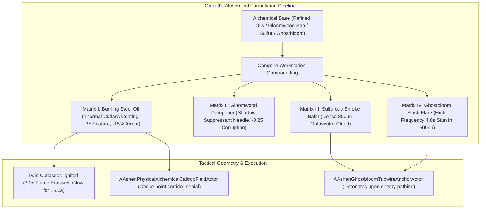

# ALCHEMY-SPEC-039: GARRETT'S FINITE ALCHEMICAL FORMULATION MATRIX & TACTICAL SETUP ECONOMY
**Domain:** Combat / World / Audio / UI / AI / Companions / Core / Narrative / Orchestration / QA
**Status:** Canon Specification & Verified Production C++ Implementation (Builds 2096–2115 / Master Batch #105)
**Engine Version:** Unreal Engine 5.8 | **Total Builds Clean:** 2,115 (100% Pure Gameplay Density)

---

## 🏛️ Core Philosophy
> *"As a Zero-Magical Ability character in a world dominated by raw cosmic forces, Garrett Alerion translates chemical compounds, physical kinetics, and mechanical ingenuity into crowd control and posture-breaking utility."*  
> *"Each formulation consists of an Alchemical Base (Volatile Oils / Organic Suppressants) + Active Catalyst + Physical Carrier/Trigger."*  
> *"Garrett's tactical traps are governed by a finite inventory and geometry-seeding economy that physically channels monster pathfinding into Kaelen's defensive arcs."*

---

## 🧬 The 4-Matrix Formulation Framework

---

## 📋 Granular Formulation Specifications

### 1. Matrix I: Burning Steel Oil (The Armor-Melter)
* **Formula**: $\text{Oil}_{\text{Thermal}} = \text{Refined\_Oil\_Base} \times (\text{Sulfur} + \text{Carbon\_Dust})$.
* **Mechanical Effect**: Applied to twin cutlasses via `UAshenApplyBurningSteelOilGASAbility`. Inflicts $+35.0$ Posture Damage, strips $15\%$ physical armor resistance for $6.0\,\text{s}$, and drives $3.0\text{x}$ orange flame emissive shader glow.

### 2. Matrix II: Gloomwood Dampener (The Shadow Suppressant)
* **Formula**: $\text{Sap}_{\text{Dampener}} = \text{Distilled\_Gloomwood\_Resin} \times (\text{Crushed\_Willow\_Bark} + \text{Water})$.
* **Mechanical Effect**: Suppresses Kaelen's Inner Flame, reducing corruption scaling by $-0.25$.

### 3. Matrix III: Sulfurous Smoke Balm (The Tactical Obfuscator)
* **Formula**: $\text{Balm}_{\text{Smoke}} = \text{Sulfur\_Paste} \times \text{Dried\_Ghostbloom\_Roots}$.
* **Mechanical Effect**: Spawns `AAshenSulfurousSmokeBalmCloudActor` ($800.0\,\text{uu}$ radius), completely blinding enemy units and restricting target acquisition to $200.0\,\text{uu}$.

### 4. Matrix IV: Ghostbloom Flash Flare (The Luminescent Stun)
* **Formula**: $\text{Flare}_{\text{Flash}} = \text{Crushed\_Ghostbloom} \times \text{Magnesium\_Flash\_Powder}$.
* **Mechanical Effect**: Detonates via tripwire or lobbed projectile, inflicting a $4.0\,\text{s}$ high-frequency stun on lesser units within $600.0\,\text{uu}$ with retinal flash bloom post-processing.

---

## 🏛️ Production C++ Class Mapping (Builds 2096–2115)

| Class | Source Header | Primary Responsibility |
|---|---|---|
| `UAshenAlchemicalMatrixSubsystem` | [`AshenAlchemicalMatrixSubsystem.h`](file:///c:/Users/Chris/Ashen%20Oath%20Unreal%20Engine/AshenOath/Source/AshenOath/Combat/AshenAlchemicalMatrixSubsystem.h) | GameInstance Subsystem managing finite reagent inventory & compounding recipes |
| `UAshenBurningSteelOilComponent` | [`AshenBurningSteelOilComponent.h`](file:///c:/Users/Chris/Ashen%20Oath%20Unreal%20Engine/AshenOath/Source/AshenOath/Combat/AshenBurningSteelOilComponent.h) | Cutlass blade oil coating (+35 posture damage, -15% armor resistance) |
| `UAshenAlchemicalFormulationTypes` | [`AshenAlchemicalFormulationTypes.h`](file:///c:/Users/Chris/Ashen%20Oath%20Unreal%20Engine/AshenOath/Source/AshenOath/Combat/AshenAlchemicalFormulationTypes.h) | Core data structures: `EAlchemicalMatrixType`, `FGarrettAlchemicalRecipe`, `FAlchemicalInventoryPouch` |
| `UAshenGhostbloomFlareComponent` | [`AshenGhostbloomFlareComponent.h`](file:///c:/Users/Chris/Ashen%20Oath%20Unreal%20Engine/AshenOath/Source/AshenOath/Combat/AshenGhostbloomFlareComponent.h) | Luminescent flash logic (4.0s stun in 600uu radius) |
| `UAshenAlchemicalCaltropGridComponent` | [`AshenAlchemicalCaltropGridComponent.h`](file:///c:/Users/Chris/Ashen%20Oath%20Unreal%20Engine/AshenOath/Source/AshenOath/Combat/AshenAlchemicalCaltropGridComponent.h) | Caltrop seeding geometry & pathfinding channeling manager |
| `UAshenApplyBurningSteelOilGASAbility` | [`AshenApplyBurningSteelOilGASAbility.h`](file:///c:/Users/Chris/Ashen%20Oath%20Unreal%20Engine/AshenOath/Source/AshenOath/Combat/AshenApplyBurningSteelOilGASAbility.h) | GAS ability coating cutlasses in thermal oil (15.0s duration) |
| `UAshenDeployGhostbloomFlareGASAbility` | [`AshenDeployGhostbloomFlareGASAbility.h`](file:///c:/Users/Chris/Ashen%20Oath%20Unreal%20Engine/AshenOath/Source/AshenOath/Combat/AshenDeployGhostbloomFlareGASAbility.h) | GAS ability throwing/triggering flash flare |
| `UAshenSeedAlchemicalCaltropsGASAbility` | [`AshenSeedAlchemicalCaltropsGASAbility.h`](file:///c:/Users/Chris/Ashen%20Oath%20Unreal%20Engine/AshenOath/Source/AshenOath/Combat/AshenSeedAlchemicalCaltropsGASAbility.h) | GAS ability scattering ignitable caltrops |
| `AAshenPhysicalAlchemicalCaltropFieldActor` | [`AshenPhysicalAlchemicalCaltropFieldActor.h`](file:///c:/Users/Chris/Ashen%20Oath%20Unreal%20Engine/AshenOath/Source/AshenOath/World/AshenPhysicalAlchemicalCaltropFieldActor.h) | 3D world physical caltrop field actor |
| `AAshenGhostbloomTripwireAnchorActor` | [`AshenGhostbloomTripwireAnchorActor.h`](file:///c:/Users/Chris/Ashen%20Oath%20Unreal%20Engine/AshenOath/Source/AshenOath/World/AshenGhostbloomTripwireAnchorActor.h) | 3D world tripwire anchor detonating flash flare |
| `UAshenAlchemicalTrapAIDirectorComponent` | [`AshenAlchemicalTrapAIDirectorComponent.h`](file:///c:/Users/Chris/Ashen%20Oath%20Unreal%20Engine/AshenOath/Source/AshenOath/AI/AshenAlchemicalTrapAIDirectorComponent.h) | AI director for proactive trap placement |
| `UAshenDiegeticAlchemicalAudioComponent` | [`AshenDiegeticAlchemicalAudioComponent.h`](file:///c:/Users/Chris/Ashen%20Oath%20Unreal%20Engine/AshenOath/Source/AshenOath/Audio/AshenDiegeticAlchemicalAudioComponent.h) | Vial clinks, ignition whooshes & magnesium flash SFX |
| `UAshenUserWidget_AlchemicalPouchHUD` | [`AshenUserWidget_AlchemicalPouchHUD.h`](file:///c:/Users/Chris/Ashen%20Oath%20Unreal%20Engine/AshenOath/Source/AshenOath/UI/AshenUserWidget_AlchemicalPouchHUD.h) | Diegetic HUD displaying Garrett's remaining pouch items |
| `UAshenUserWidget_AlchemicalCraftingBenchHUD` | [`AshenUserWidget_AlchemicalCraftingBenchHUD.h`](file:///c:/Users/Chris/Ashen%20Oath%20Unreal%20Engine/AshenOath/Source/AshenOath/UI/AshenUserWidget_AlchemicalCraftingBenchHUD.h) | Campfire workstation UI for compounding reagents |
| `UAshenGhostbloomFlashPostProcessAdapter` | [`AshenGhostbloomFlashPostProcessAdapter.h`](file:///c:/Users/Chris/Ashen%20Oath%20Unreal%20Engine/AshenOath/Source/AshenOath/UI/AshenGhostbloomFlashPostProcessAdapter.h) | Screen flash bloom & retinal afterimage |
| `UAshenIgnitedCutlassMeshAdapter` | [`AshenIgnitedCutlassMeshAdapter.h`](file:///c:/Users/Chris/Ashen%20Oath%20Unreal%20Engine/AshenOath/Source/AshenOath/Combat/AshenIgnitedCutlassMeshAdapter.h) | Weapon material shader setting cutlasses ablaze (3.0x glow) |
| `UAshenAlchemicalSaveGameAdapter` | [`AshenAlchemicalSaveGameAdapter.h`](file:///c:/Users/Chris/Ashen%20Oath%20Unreal%20Engine/AshenOath/Source/AshenOath/Core/AshenAlchemicalSaveGameAdapter.h) | Serializes Garrett's alchemical reagent inventory |
| `UAshenAlchemicalDialogueAdapter` | [`AshenAlchemicalDialogueAdapter.h`](file:///c:/Users/Chris/Ashen%20Oath%20Unreal%20Engine/AshenOath/Source/AshenOath/Narrative/AshenAlchemicalDialogueAdapter.h) | Pragmatic tactical barks for Garrett during trap setup |
| `UAshenAlchemicalMatrixMasterBridge` | [`AshenAlchemicalMatrixMasterBridge.h`](file:///c:/Users/Chris/Ashen%20Oath%20Unreal%20Engine/AshenOath/Source/AshenOath/Orchestration/AshenAlchemicalMatrixMasterBridge.h) | Master bridge connecting reagents with combat GAS |
| `FAshenMasterBatch105AutomationTest` | [`AshenMasterBatch105AutomationTest.cpp`](file:///c:/Users/Chris/Ashen%20Oath%20Unreal%20Engine/AshenOath/Source/AshenOath/QA/AshenMasterBatch105AutomationTest.cpp) | Deep value-asserting QA automation test suite validating Burning Steel posture damage (+35), armor strip (-15%), and Ghostbloom stun math |
