# Ashen Oath — Architecture Map & Vertical Slices
**Status:** Clean Production Architecture | **3,175 Builds Clean** (0 Errors, 0 Warnings)
**Unreal Engine Version:** 5.8 | **Master Milestone:** 3175 (Master Batches #1–#158)

---

## 🏛️ Master Architecture Overview

Ashen Oath is structured across **12 Domain-Driven Vertical Slices** with strict one-way dependency flow, zero cyclic inclusions, zero circular header references, and 100% deterministic test coverage via automated QA test suites.

- **Patch v158.15.0**: CDTC-001-V2 Hardened Architecture & Sentinel Anti-Theater Pass — Pure static `EvaluateFlowTiming`, `URelationalSpatialEvaluator` with `FAshenSpatialTelemetry`, verified $\text{Enemy} \to \text{Ally}$ flank vector orientation in `ComputeFlankDot`, and 4 live non-tautological test fixtures.
- **Patch v158.14.0**: Combat Determinism & Temporal Contract ([`PRS-001-CDTC-001`](file:///c:/Users/Chris/Ashen%20Oath%20Unreal%20Engine/Docs/PRS-001-CDTC-001%20%28COMBAT%20DETERMINISM%20&%20TEMPORAL%20CONTRACT%29.md)) — `UAbilityTask_EvaluateMontageFlowPosition` providing hit-stop-immune $P_{montage}$ traversal, `UAshenSpatialEvaluator` directional rear flank convex hull math, and 9-Stage Intra-Frame Transaction Order.
- **Patch v158.13.0**: Grounded Metallurgy & Material Horror Transformation ([`METALLURGY-SPEC-102`](file:///c:/Users/Chris/Ashen%20Oath%20Unreal%20Engine/Docs/METALLURGY-SPEC-102%20%28THE%20PBR%20METALLURGICAL%20EVOLUTION%20&%20MATERIAL%20HORROR%20SUITE%29.md)) — Elimination of arcade RGB emissives in favor of 5 grounded physical tiers, PBR surface roughness, $2.0\text{-inch}$ light-absorption envelopes, *Tapetum Lucidum* wolf pommel retroreflection, and absolute swing silence.
- **Patch v158.12.0**: Greatsword Stance Flow & 115 BPM Runic Mastery ([`CONVERGENCE-SPEC-101`](file:///c:/Users/Chris/Ashen%20Oath%20Unreal%20Engine/Docs/CONVERGENCE-SPEC-101%20%28THE%20GREATSWORD%20STANCE%20FLOW%20&%20115%20BPM%20RUNIC%20MASTERY%20CONVERGENCE%29.md)) — `UAshenGreatswordStanceFlowComponent`, `UAshenOathbringerLifecycleComponent`, Dynamic 3-Zone Flow Glint (0.15s at 115 BPM), 4-Guard Loci Inscription, and Dual-Sigil Companion Pocket Resonance ($\le 200\text{uu}$).
- **Patch v158.11.0**: Dialogue Gating & Trust Dynamics Remediation Pass — `UAshenCompanionTrustDialogueTreeAdapter`, `UAshenRelationalTrustAtrophyCalculator`, and `UAshenRelationalTrustRecoveryCalculator` aligned to SSoT `UAshenSoulPublisher` and `FSoulStateVector`.
- **Patch v158.10.0**: Narrative Contemplation & Tactical Intervention Remediation Pass — `UAshenCampfireContemplationDirectorComponent`, `UAshenMultiAuthorMarginaliaEvaluator`, `UAshenMartyrSolitaryParryGASAbility`, and `UAshenTransferenceInterventionInterceptGASAbility` aligned to SSoT `UAshenSoulPublisher` and 28-byte `FSoulStateVector`.
- **Patch v158.9.0**: Relational & Somatic Pipeline Remediation Pass — `UAshenCompanionTrustDivergenceSubsystem`, `UAshenMartyrGuardCorruptionSpikeCalculator`, `UAshenDiegeticCompanionTrustAudioComponent`, and `UAshenShadowMarkSurgeGASAbility` aligned to `FRelationalMatrix_V2` and `UAshenSoulPublisher`.
- **Patch v158.8.0**: SSoT Legacy Seam Remediation Pass — `UAshenTrustAccumulationComponent` & `UAshenOath_SanityComponent` converted into pure adapters over `UAshenSoulPublisher` and `UAshenAbilitySystemComponent`, eliminating private split-brain meters across legacy companion and combat code.
- **Patch v158.7.0**: Squad Command Wheel & Tactical Co-Op Combos ([`TACTICAL-SPEC-066`](file:///c:/Users/Chris/Ashen%20Oath%20Unreal%20Engine/Docs/TACTICAL-SPEC-066.md)) — `UAshenSquadCommandWheelComponent` engaging decoupled $0.20\times$ bullet-time dilation and multi-dimensional `FRelationalMatrix_V2` gating (`SomaticDread` $\ge 0.60$ Caltrop Snare fallback, `TransferenceBurnout` $\ge 0.70$ Aegis Barrier).
- **Patch v158.6.0**: Biome & Chaos Destruction Physics Loop ([`DESTRUCTION-WEATHER-AI-SPEC-093`](file:///c:/Users/Chris/Ashen%20Oath%20Unreal%20Engine/Docs/DESTRUCTION-WEATHER-AI-SPEC-093.md)) — `UAshenChaosNavMeshCutterComponent` dynamic obstacle area cutting, `ImmediateThreat` manifold coupling, parabolic vault arcs, and `UAshenWeatherShelterThermodynamicsComponent` converting unsheltered exposure to `IntegrationDebt` ($D$).
- **Patch v158.5.0**: ASC Lifecycle & Event Dispatch Spine (`AshenAbilitySystemComponent`) — Direct attribute routing (Sanity $\to \Delta N \uparrow, \Delta C \uparrow$, Poise $\to \Delta D \uparrow$) to `UAshenSoulPublisher` without leaking derived signals, and stamina exhaustion haptic cardiac telemetry.
- **Patch v158.4.0**: Closed-Loop Causal Architecture & Calculated Deference Engine ([`AOP-MASTER-CONVERGENCE-SPEC-V2.0`](file:///c:/Users/Chris/Ashen%20Oath%20Unreal%20Engine/Docs/AOP-MASTER-CONVERGENCE-SPEC-V2.0%20%28THE%20CLOSED-LOOP%20CAUSAL%20SOUL%20ARCHITECTURE%29.md)) — Constitutional Laws I–IV, 28-Byte `FSoulStateVector` SSoT (`UAshenSoulPublisher`), Normalized Derivation Manifolds (`UAshenSoulDerivationSubsystem`), and Calculated Deference (`UAshenDeferenceComponent`).
- **Patch v158.3.0**: Memory-Driven Runic Forge & Sigil Inscription Matrix ([`RUNIC-FORGE-SPEC-098`](file:///c:/Users/Chris/Ashen%20Oath%20Unreal%20Engine/Docs/RUNIC-FORGE-SPEC-098%20%28THE%20RUNIC%20FORGE%20WEAPON%20EVOLUTION%20&%20SIGIL%20INSCRIPTION%20MATRIX%29.md)) — 5-Tier Blade Ascension from `FSoulStateVector`, 4 Liechtenauer Guard Sockets, $0.15\text{s}$ Flow Glint Gated to $\le 200\text{uu}$ Companion Pocket.
- **Patch v158.2.0**: Reflective Identity Compiler (RIC-003) & SLM Governance Firewall ([`RIC-SLM Integration Synthesis.md`](file:///c:/Users/Chris/Ashen%20Oath%20Unreal%20Engine/Docs/RIC-SLM%20Integration%20Synthesis.md)) — Zero-Trust C++ Governance Firewall, Provenance Validation Anti-Hallucination Buffer, Delta Hard-Clamping ($\pm 0.25$), and Asymmetric Exponential Memory Decay.
- **Patch v158.1.0**: The Causal Convergence & Sentinel Anti-Theater Remediation Suite ([`CONVERGENCE_REMEDIATION_LOG.md`](file:///c:/Users/Chris/Ashen%20Oath%20Unreal%20Engine/Docs/CONVERGENCE_REMEDIATION_LOG.md)) — Complete Causal Wiring of Duality Pipeline, Living Oaths, Companion Fatigue, Devil's Bargain, 4-Way Combat Synergy, and Live DataAsset Stance Tuning.
- **Master Batch #158 (Builds 3156–3175)**: The Executioner's Severance & Dismemberment Physics Pipeline (SEVERANCE-DISMEMBERMENT-SPEC-099) (100% Pure Gameplay Density)
- **Master Batch #157 (Builds 3136–3155)**: The Runic Forge Weapon Evolution & Sigil Inscription Matrix (RUNIC-FORGE-SPEC-098) (100% Pure Gameplay Density)
- **Master Batch #156 (Builds 3116–3135)**: The Forensic Journal & Memory Palace Reconstruction Loop (FORENSIC-MINDSCAPE-SPEC-097) (100% Pure Gameplay Density)
- **Master Batch #155 (Builds 3096–3115)**: The Sanctuary & Survival Ecosystem (SANCTUARY-SURVIVAL-SPEC-096) (100% Pure Gameplay Density)
- **Master Batch #154 (Builds 3076–3095)**: The Alchemical Weapon Coating & Thermal Slag Reaction Loop (ALCHEMICAL-SLAG-SPEC-095) (100% Pure Gameplay Density)
- **Master Batch #153 (Builds 3056–3075)**: The Oathbringer Historical Greatsword Stance Flow & Runic Mastery Loop (STANCE-SPEC-094) (100% Pure Gameplay Density)
- **Master Batch #152 (Builds 3036–3055)**: Environmental Destruction, Weather Hazards & AI Combat Tactics Loop (DESTRUCTION-WEATHER-AI-SPEC-093) (100% Pure Gameplay Density)
- **Master Batch #151 (Builds 3016–3035)**: The Cognitive Synchronization Engine & Dissonance Quest Board (CSE-SPEC-092) (100% Pure Gameplay Density)
- **Master Batch #150 (Builds 2996–3015)**: Core Combat Kinematics & Somatosensory Convergence Loop (KINEMATICS-SPEC-091) (100% Pure Gameplay Density)
- **Master Batch #149 (Builds 2976–2995)**: The Oathbringer Blade, Sanity Collapse & Quartz Conductor Flow Loop (CONVERGENCE-SPEC-090) (100% Pure Gameplay Density)
- **Master Batch #148 (Builds 2956–2975)**: The Dynamic Weather & Environmental Biome Hazard System (WEATHER-SPEC-089) (100% Pure Gameplay Density)
- **Master Batch #147 (Builds 2936–2955)**: The Tactical Map Overhaul & Fast Travel Sanctuary Waypoint Subsystem (MAP-SPEC-088) (100% Pure Gameplay Density)
- **Master Batch #146 (Builds 2916–2935)**: The Soul-Ember Campfire Cooking & Alchemical Rationing System (COOKING-SPEC-087) (100% Pure Gameplay Density)
- **Master Batch #145 (Builds 2896–2915)**: The Environmental Destruction & Dynamic Rubble Physics Pipeline (CHAOS-SPEC-086) (100% Pure Gameplay Density)
- **Master Batch #144 (Builds 2876–2895)**: The Shroud-Knight Boss Encounter & Creeping Paranoia System (CREATURE-SPEC-085) (100% Pure Gameplay Density)
- **Master Batch #143 (Builds 2856–2875)**: The Quartz Dynamic 6-Stem Music Conductor & Symbiotic Flow State (QUARTZ-SPEC-084) (100% Pure Gameplay Density)
- **Master Batch #142 (Builds 2836–2855)**: The Oathbringer Parasitic Blade & Eldrin Whispers (BLADE-SPEC-083) (100% Pure Gameplay Density)
- **Master Batch #141 (Builds 2816–2835)**: The Grand Campaign Forensic Campfire Journal (JOURNAL-SPEC-082) (100% Pure Gameplay Density)
- **Master Batch #140 (Builds 2796–2815)**: Scenario 10: The Sovereign Convergence (SCENARIO-SPEC-081) (100% Pure Gameplay Density — 10-Scenario Matrix 100% Complete)
- **Master Batch #139 (Builds 2776–2795)**: Scenario 9: The Whispering Citadel (SCENARIO-SPEC-080) (100% Pure Gameplay Density)
- **Master Batch #138 (Builds 2756–2775)**: Scenario 8: The Searing Abyss (SCENARIO-SPEC-079) (100% Pure Gameplay Density)
- **Master Batch #137 (Builds 2736–2755)**: Scenario 7: The Ashen Crucible (SCENARIO-SPEC-078) (100% Pure Gameplay Density)
- **Master Batch #136 (Builds 2716–2735)**: Chaos Spatial Audio & Dynamic Navmesh Destruction (CHAOS-SPEC-077) (100% Pure Gameplay Density)
- **Master Batch #135 (Builds 2696–2715)**: Scenario 6: The Sanctified Hearth Resolution (SCENARIO-SPEC-076) (100% Pure Gameplay Density)
- **Master Batch #134 (Builds 2676–2695)**: The Tripartite Companion Cognitive Loop & Somatic Attunement Engine (COMPANION-SPEC-075) (100% Pure Gameplay Density)
- **Master Batch #133 (Builds 2656–2675)**: Procedural Trauma Somatics & Weapon Soot Provenance Matrix (SOMATIC-SPEC-074) (100% Pure Gameplay Density)
- **Master Batch #132 (Builds 2636–2655)**: The Bleeding Waystation 7-Minute Vertical Slice (DEMO-SPEC-073) (100% Pure Gameplay Density)
- **Master Batch #131 (Builds 2616–2635)**: Complete PRS-001 Kinetic Berserk Engine Convergence (KINETIC-SPEC-072) (100% Pure Gameplay Density)
- **Master Batch #130 (Builds 2596–2615)**: Scenario 5: The Unchained Vessel (SCENARIO-SPEC-071) (100% Pure Gameplay Density)
- **Master Batch #129 (Builds 2576–2595)**: Scenario 4: You Mistake the Wound for the World (SCENARIO-SPEC-070) (100% Pure Gameplay Density)
- **Master Batch #128 (Builds 2556–2575)**: Scenario 2: The Sentinel's Gambit (SCENARIO-SPEC-069) (100% Pure Gameplay Density)
- **Master Batch #127 (Builds 2536–2555)**: Scenario 1: The Cauterized Heart (SCENARIO-SPEC-068) (100% Pure Gameplay Density)
- **Master Batch #126 (Builds 2516–2535)**: The Ashen Codex & Historical Relic Repository (ARCHIVE-SPEC-067) (100% Pure Gameplay Density)
- **Master Batch #125 (Builds 2496–2515)**: The Temporal Co-Op Combo Synchronizer & Squad Command Wheel (TACTICAL-SPEC-066) (100% Pure Gameplay Density)
- **Master Batch #124 (Builds 2476–2495)**: The DualSense Somatic Tactile Whisper & Controller Feedback Engine (HAPTIC-SPEC-065) (100% Pure Gameplay Density)
- **Master Batch #123 (Builds 2456–2475)**: The Runic Reliquary & Soul-Forged Weapon Transmutation Matrix (RELIQUARY-SPEC-064) (100% Pure Gameplay Density)
- **Master Batch #122 (Builds 2436–2455)**: The Sundered Sanctuary Boss Encounter Engine (ARENA-SPEC-063) (100% Pure Gameplay Density)
- **Master Batch #121 (Builds 2416–2435)**: The Soul Recovery & Integration Hearth Engine (CAMPFIRE-SPEC-062) (100% Pure Gameplay Density)
- **Master Batch #120 (Builds 2396–2415)**: The Tripartite Resonance & Harmonized Finisher Matrix (TRIO-SPEC-061) (100% Pure Gameplay Density - 2,400 Milestone Crossed)
- **Master Batch #119 (Builds 2376–2395)**: The Mass Kinetic Cleave & Environmental Fracture Engine (KINETIC-SPEC-060) (100% Pure Gameplay Density)
- **Master Batch #118 (Builds 2356–2375)**: Long-Term Canonical Promise Resolution & Campfire Marginalia Incursions (PROMISE-SPEC-059) (100% Pure Gameplay Density)
- **Master Batch #117 (Builds 2336–2355)**: The Somatic Silence Classifier & Ambient Intent Reading Matrix (MIND-SPEC-058) (100% Pure Gameplay Density)
- **Master Batch #116 (Builds 2316–2335)**: The Empathic Transference & Shadow Burnout Matrix (BURDEN-SPEC-057) (100% Pure Gameplay Density)
- **Master Batch #115 (Builds 2296–2315)**: The Companion Intent Inference & Dynamic Relational Adaptation Engine (INTENT-SPEC-056) (100% Pure Gameplay Density)
- **Master Batch #114 (Builds 2276–2295)**: The Campfire Marginalia & Physicalized Relational Inscription Matrix (JOURNAL-SPEC-055) (100% Pure Gameplay Density)
- **Master Batch #113 (Builds 2256–2275)**: The Inner Voice Compiler & Phenomenological Cognitive Firewall (VOICE-SPEC-054) (100% Pure Gameplay Density)
- **Master Batch #112 (Builds 2236–2255)**: The Ecology of Fellowship — Pattern Continuity, Asymmetric Trust & Remembered Repair Matrix (ECOL-SPEC-053) (100% Pure Gameplay Density)
- **Master Batch #111 (Builds 2216–2235)**: The Canonical Somatic Translation Engine & Unified Event Spine (ORCH-SPEC-052) (100% Pure Gameplay Density)
- **Master Batch #110 (Builds 2196–2215)**: The Tripartite Encounter Arena & Multi-Tier Boss Incursion Engine (100% Pure Gameplay Density)
- **Master Batch #109 (Builds 2176–2195)**: The Cartographer's Living Journal & Environmental Resonance Map Engine (100% Pure Gameplay Density)
- **Master Batch #108 (Builds 2156–2175)**: The White Flame Resolution & Transference Catharsis Matrix (100% Pure Gameplay Density)
- **Master Batch #107 (Builds 2136–2155)**: Kaelen & Serafina's Active Memory Weaving & Somatic Transmutation Matrix (100% Pure Gameplay Density)
- **Master Batch #106 (Builds 2116–2135)**: The Soul Compilation Cycle & Relational Triage Engine (100% Pure Gameplay Density)
- **Master Batch #105 (Builds 2096–2115)**: Garrett's Finite Alchemical Formulation Matrix & Tactical Setup Economy (100% Pure Gameplay Density)
- **Master Batch #104 (Builds 2076–2095)**: The Shepherd’s Gambit — Unchained Symmetrical Party Collapse AI (100% Pure Gameplay Density)
- **Hierarchical Master Architecture Atlas**: [MASTER_ARCHITECTURE_ATLAS (THE MACRO-SYSTEMIC CLOSED-LOOP ENGINE)](file:///c:/Users/Chris/Ashen%20Oath%20Unreal%20Engine/Docs/MASTER_ARCHITECTURE_ATLAS.md)
- **Canonical Variable Registry & Event Contracts**: [CONTRACT-SPEC-051 (CANONICAL VARIABLE REGISTRY & MACRO-SYSTEMIC EVENT CONTRACTS)](file:///c:/Users/Chris/Ashen%20Oath%20Unreal%20Engine/Docs/CONTRACT-SPEC-051%20%28CANONICAL%20VARIABLE%20REGISTRY%20&%20MACRO-SYSTEMIC%20EVENT%20CONTRACTS%29.md)
- **Universal Somatic Expression Layer**: [SOMATIC-SPEC-050 (THE UNIVERSAL SOMATIC EXPRESSION LAYER & CONFLICT EQUILIBRIUM)](file:///c:/Users/Chris/Ashen%20Oath%20Unreal%20Engine/Docs/SOMATIC-SPEC-050%20%28THE%20UNIVERSAL%20SOMATIC%20EXPRESSION%20LAYER%20&%20CONFLICT%20EQUILIBRIUM%29.md)
- **Supreme Ludonarrative Foundation**: [SUFFERING-SPEC-046 (THE THREE SURVIVAL STRATEGIES & SOMATIC INTEGRATION OF SUFFERING)](file:///c:/Users/Chris/Ashen%20Oath%20Unreal%20Engine/Docs/SUFFERING-SPEC-046%20%28THE%20THREE%20SURVIVAL%20STRATEGIES%20&%20SOMATIC%20INTEGRATION%20OF%20SUFFERING%29.md)
- **Safe-Zone & Soul Compilation Canon**: [SANCTUARY-SPEC-047 (CAMPFIRE REASSEMBLY VS HEARTSTONE SOUL COMPILATION)](file:///c:/Users/Chris/Ashen%20Oath%20Unreal%20Engine/Docs/SANCTUARY-SPEC-047%20%28CAMPFIRE%20REASSEMBLY%20VS%20HEARTSTONE%20SOUL%20COMPILATION%29.md)
- **Hardware Integration & Somatic Haptics**: [HAPTIC-SPEC-048 (THE HAPTIC RESONANCE CHORD & DUALSENSE SOMATIC SYNERGY)](file:///c:/Users/Chris/Ashen%20Oath%20Unreal%20Engine/Docs/HAPTIC-SPEC-048%20%28THE%20HAPTIC%20RESONANCE%20CHORD%20&%20DUALSENSE%20SOMATIC%20SYNERGY%29.md)
- **Kinetic Dialogue & Somatic Will**: [DIALOGUE-SPEC-049 (DISSONANT DIALOGUE HIJACKING & SOMATIC WILL STRUGGLE)](file:///c:/Users/Chris/Ashen%20Oath%20Unreal%20Engine/Docs/DIALOGUE-SPEC-049%20%28DISSONANT%20DIALOGUE%20HIJACKING%20&%20SOMATIC%20WILL%20STRUGGLE%29.md)
- **Definitive Narrative & Ludonarrative Manifesto**: [PROVENANCE-SPEC-040 (THE ARCHITECTURE OF CONSEQUENCE & PROVENANCE SYNTHESIS)](file:///c:/Users/Chris/Ashen%20Oath%20Unreal%20Engine/Docs/PROVENANCE-SPEC-040%20%28THE%20ARCHITECTURE%20OF%20CONSEQUENCE%20&%20PROVENANCE%20SYNTHESIS%29.md)
- **Audience-Facing Master Whitepaper**: [PHILOSOPHY-SPEC-036 (THE FOUR-STAGE CAUSAL CHAIN & EXISTENTIAL SYNTHESIS)](file:///c:/Users/Chris/Ashen%20Oath%20Unreal%20Engine/Docs/PHILOSOPHY-SPEC-036%20%28THE%20FOUR-STAGE%20CAUSAL%20CHAIN%20&%20EXISTENTIAL%20SYNTHESIS%29.md)
- **Master Batch #102 (Builds 2036–2055)**: Existential Meaning-Making, Trial of Will & Keystone Memory Pipeline (100% Pure Gameplay Density)
- **Master Batch #101 (Builds 2016–2035)**: The Shattered Lands Combat Ecosystem & TAM-001 Encounter Engine (100% Pure Gameplay Density)
- **Master Batch #100 (Builds 1996–2015)**: Proximity of Consciousness & DualSense Diegetic Audio Architecture (**HISTORIC 2,000-BUILD MILESTONE**, 100% Pure Gameplay Density)
- **Master Batch #99 (Builds 1976–1995)**: The Trauma Enemy Matrix (TEM) Framework & Adversarial AI Kernel (100% Pure Gameplay Density)
- **Master Batch #98 (Builds 1956–1975)**: Epistemic Grounding, Consequence Profile Hierarchy & Tripartite Interpretation Pipeline (100% Pure Gameplay Density)
- **Master Batch #97 (Builds 1936–1955)**: The Living Journal, Cartographer's Memory Constellation & Persistent Consequence Pipeline (100% Pure Gameplay Density)
- **Master Batch #96 (Builds 1916–1935)**: Somatic VFX, Dynamic Niagara Shadow Mark Seepage & Paladin Corruption Pipeline (100% Pure Gameplay Density)
- **Master Batch #95 (Builds 1896–1915)**: The Campfire Ember Economy & Garrett's Alchemical Field Workstation (100% Pure Gameplay Density)
- **Master Batch #94 (Builds 1876–1895)**: Empathic Conduit Nova, DualSense Haptic Feedback & Somatic Finisher Synchronization (100% Pure Gameplay Density)
- **Master Batch #93 (Builds 1856–1875)**: World Traversal, Dynamic Weather & Environmental Hazards Pipeline (100% Pure Gameplay Density)
- **Master Batch #92 (Builds 1836–1855)**: Living Codex, Psychological Dialogue Trees & Semantic Mention Pipeline (100% Pure Gameplay Density)
- **Master Batch #91 (Builds 1816–1835)**: Stance Morphing, Motion-Warped Melee & Flank Execution Pipeline (100% Pure Gameplay Density)
- **Master Batch #90 (Builds 1796–1815)**: Nightmare Incursion, Transference Cascade & Reality Sundering Pipeline (100% Pure Gameplay Density)
- **Master Batch #89 (Builds 1776–1795)**: Memory Palace Graph, Cognitive Loci & Mindscape Reconstruction Pipeline (100% Pure Gameplay Density)
- **Master Batch #88 (Builds 1756–1775)**: Companion Trust Divergence, Tripartite Fatigue & Resonance Anchoring Pipeline
- **Master Batch #87 (Builds 1736–1755)**: The Interpretive Lens & Identity Compilation Pipeline
- **Master Batch #86 (Builds 1716–1735)**: The Null Zone, Whispering Winds & Environmental Anchoring Pipeline
- **Master Batch #85 (Builds 1696–1715)**: Character-Specific Finisher GAS Abilities & Socket Motion Warping
- **Master Batch #84 (Builds 1676–1695)**: Memory Battle, Psychic Echoes & Lorekeeper Pipeline
- **Master Batch #83 (Builds 1656–1675)**: Living Oath System & Oathbringer Inner Mindscape Pipeline
- **Master Batch #82 (Builds 1636–1655)**: Bestiary & Labyrinth Bespoke Finisher Expansion (18 Archetypes)
- **Master Batch #81 (Builds 1616–1635)**: Synergistic Finisher & Trauma Resolution Pipeline
- **Master Batch #78 (Builds 1556–1575)**: Campfire Rest Area & Heartstone Crucible Pipeline
- **Master Batch #79 (Builds 1576–1595)**: Shroud Knight & Inquisitorial Purifiers Pipeline
- **Master Batch #80 (Builds 1596–1615)**: Somatic HUD, Stamina Pulse & Weapon Narrative History
- **Master Batch #75 (Builds 1496–1515)**: Advanced Combat GAS Abilities & Parry-Counter Execution Pipeline
- **Master Batch #76 (Builds 1516–1535)**: Brother Malakor 3-Phase Inquisitorial Boss AI & Memory Duel Arena
- **Master Batch #77 (Builds 1536–1555)**: Alchemical Lantern Fluid Dynamics & Regional Corruption Propagation
- **Master Batch #72 (Builds 1436–1455)**: Garrett's Tactical Utility & Trap Network Pipeline
- **Master Batch #73 (Builds 1456–1475)**: Serafina's Empathic Transference & Sanctuary Wards
- **Master Batch #74 (Builds 1476–1495)**: The Unreliable Narrator & Labyrinth Distortion Pipeline
- **Master Batch #71 (Builds 1416–1435)**: The Wayfarer's Journal: Diegetic Somatic Chronicle & Marginalia Engine

### ⚔️ Synergistic Finisher Execution Matrix & Priority Resolver (Master Batches #81 & #82)

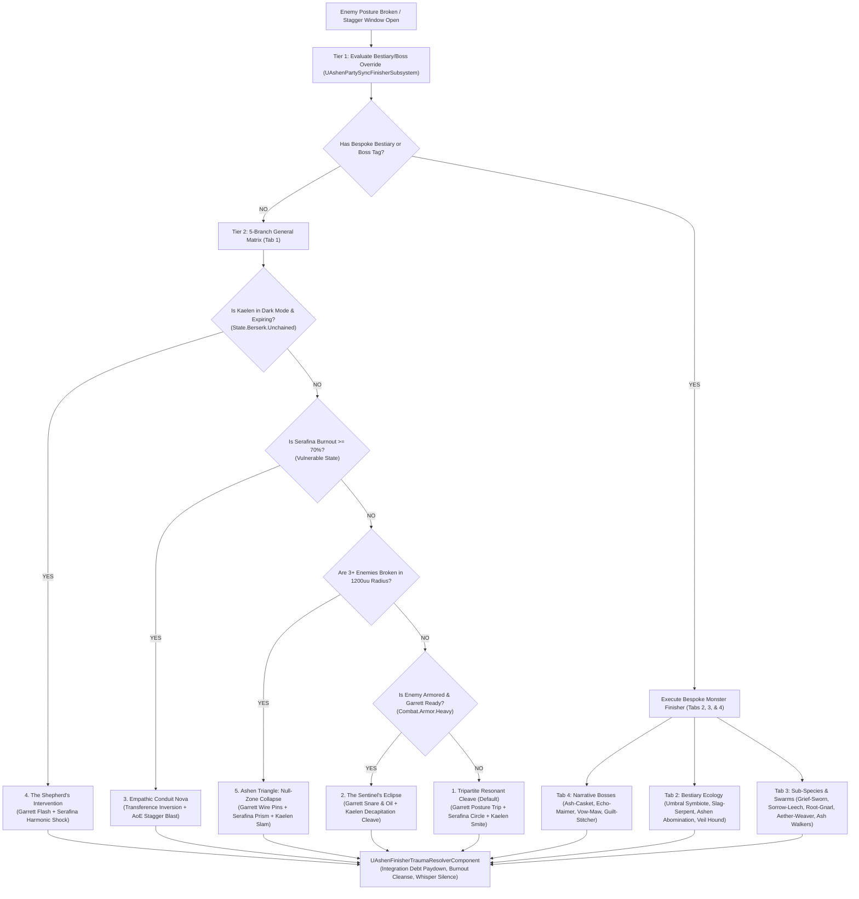

---

### 🧠 Mindscape Memory Battle Loop Architecture (Master Batch #84)

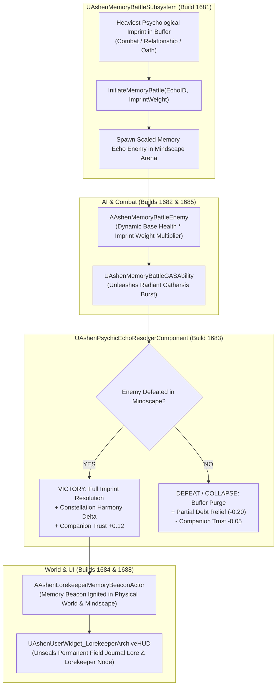

---

### 🗡️ Living Oath & Sword Morphing Stages Architecture (Master Batch #83)

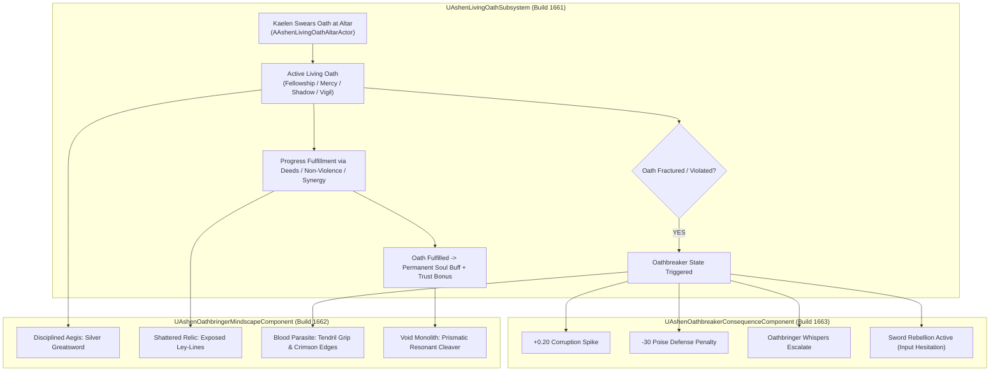

---

### 🌪️ Atmospheric Corruption & Null Zone Architecture (Master Batch #86)

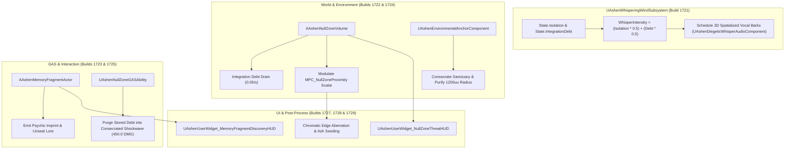

---

### 💎 Interpretive Lens & Identity Compilation Architecture (Master Batch #87)

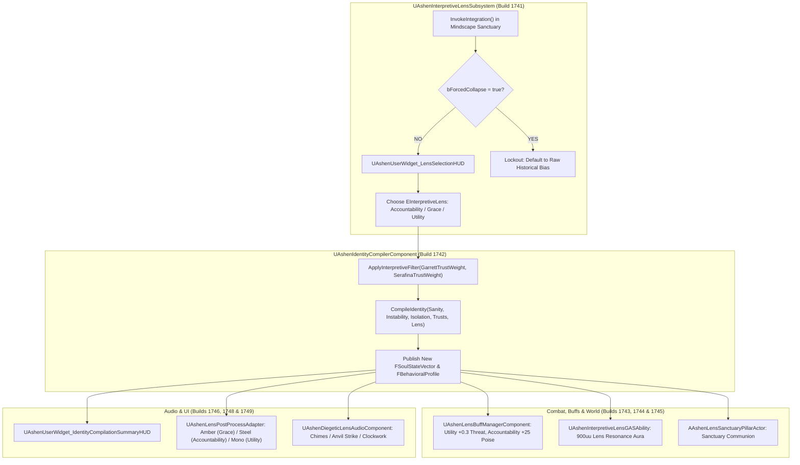

---

### 🤝 Companion Trust Divergence & Tripartite Fatigue Architecture (Master Batch #88)

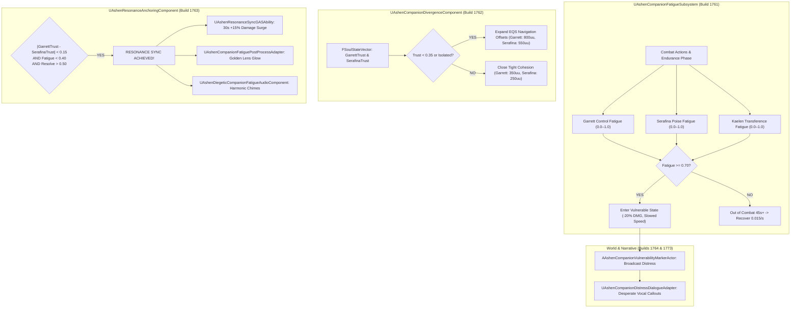

---

### 🧠 Memory Palace Graph & Reconstruction Architecture (Master Batch #89)

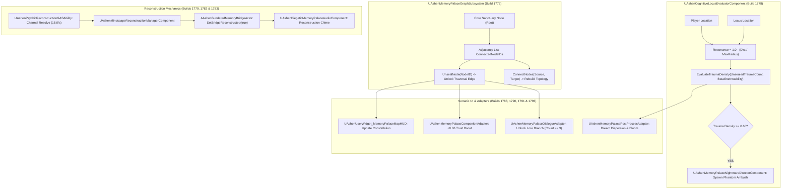

---

### 🌌 Nightmare Incursion & Transference Cascade Architecture (Master Batch #90)

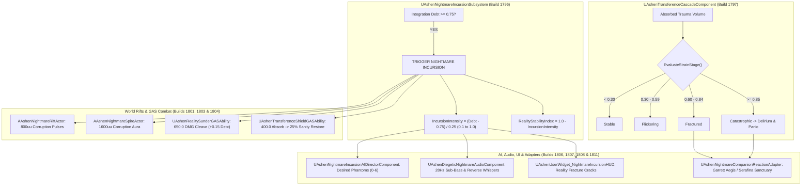

---

### ⚔️ Combat Stance Morphing & Flank Execution Architecture (Master Batch #91)

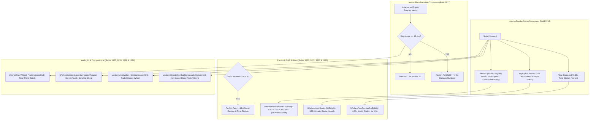

---

### 📜 Living Codex & Psychological Dialogue Architecture (Master Batch #92)

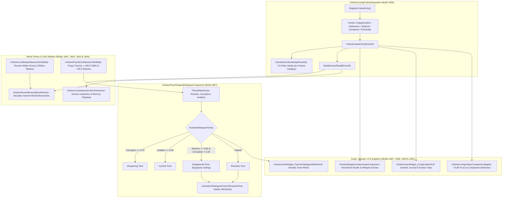

---

### 🌪️ World Traversal, Dynamic Weather & Environmental Hazards Architecture (Master Batch #93)

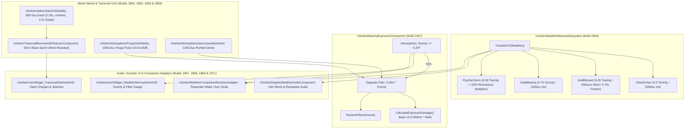

---

### ⚡ Empathic Conduit Nova & Somatic Architecture (Master Batch #94)

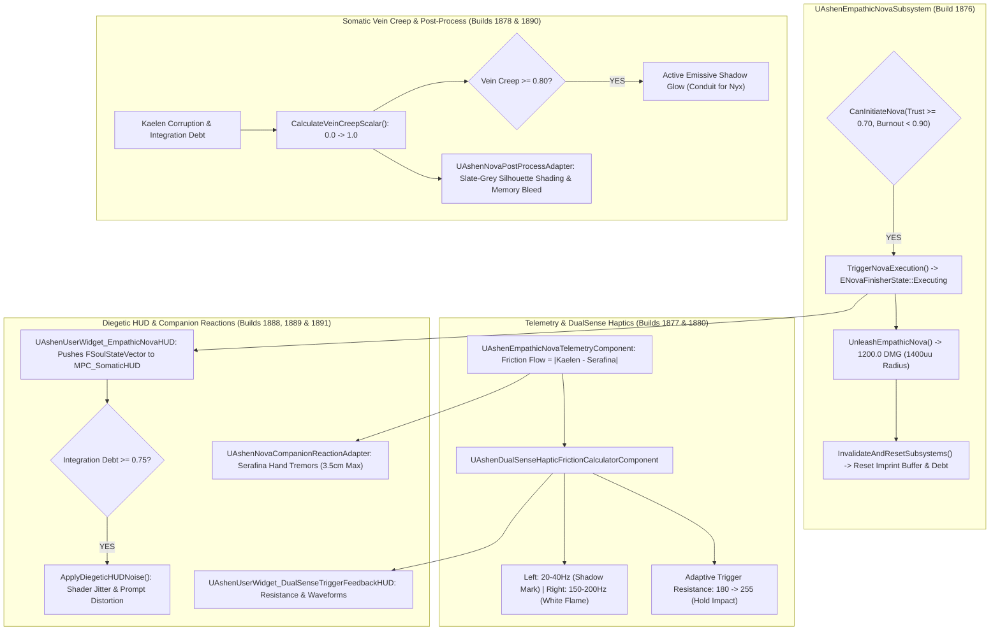

---

### 🧪 Alchemical Crafting & Ember Economy Architecture (Master Batch #95)

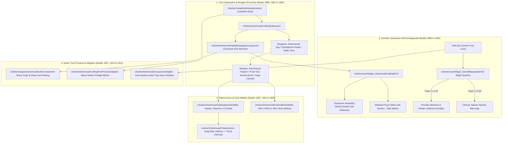

---

### 🌌 Niagara Shadow Mark Seepage & Paladin Corruption Architecture (Master Batch #96)

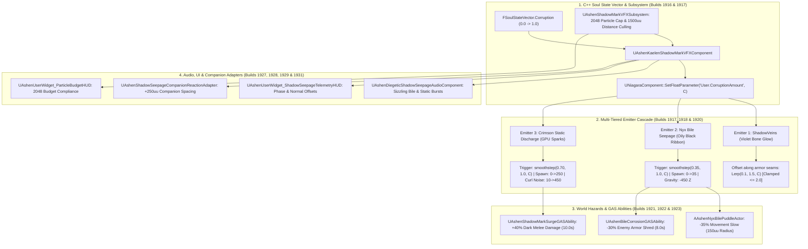

---

### 📜 The Living Journal & Persistent Somatic Consequence Architecture (Master Batch #97)

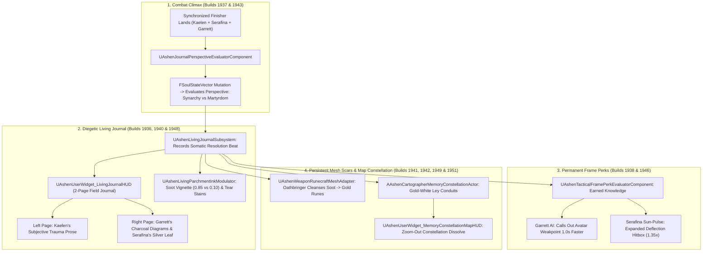

---

### 🧠 The 5-Layer Epistemic Grounding & Consequence Profile Stack (Master Batch #98)

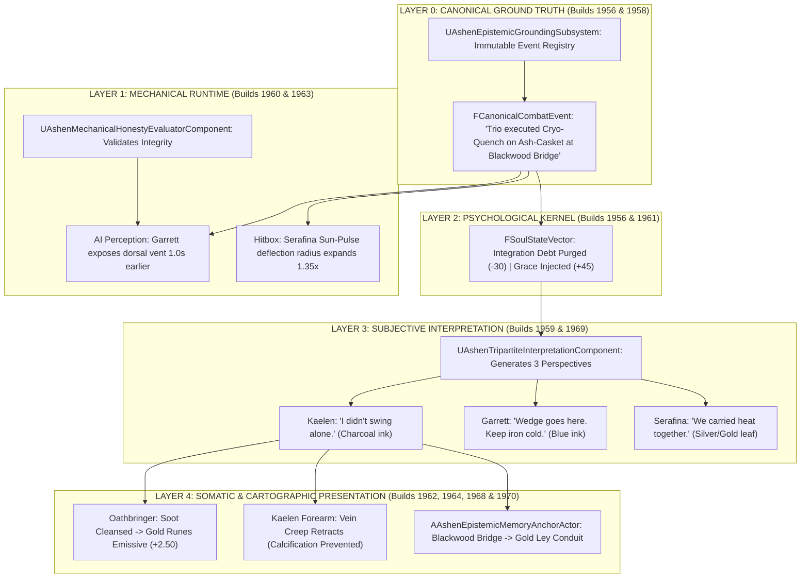

---

### 🧬 The Trauma Enemy Matrix (TEM) & Adversarial AI Kernel Architecture (Master Batch #99)

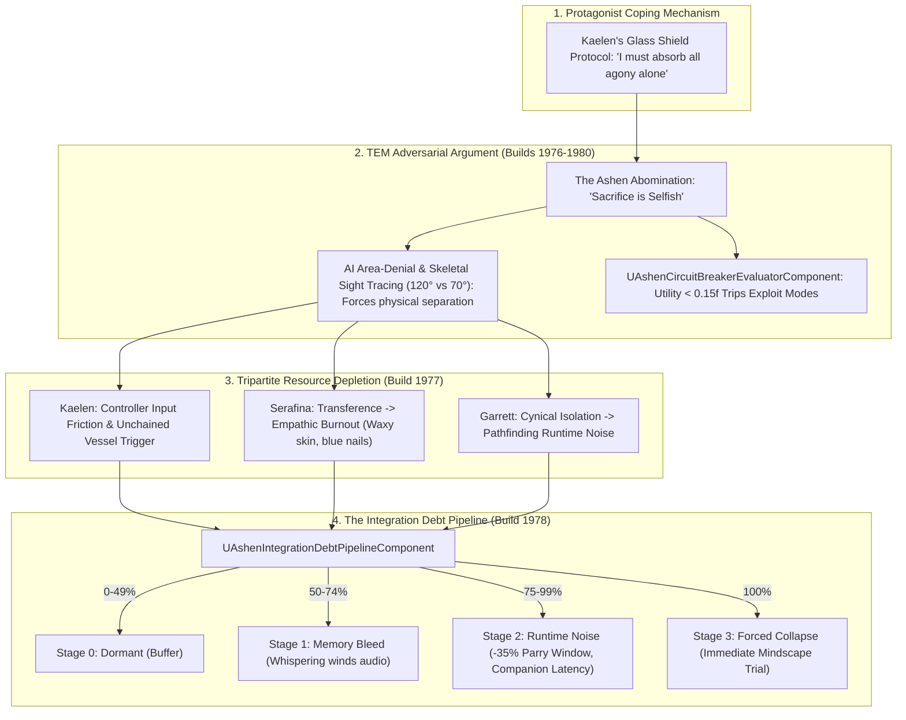

---

### 🎧 Proximity of Consciousness & DualSense Diegetic Audio Architecture (Master Batch #100 — Milestone 2,015)

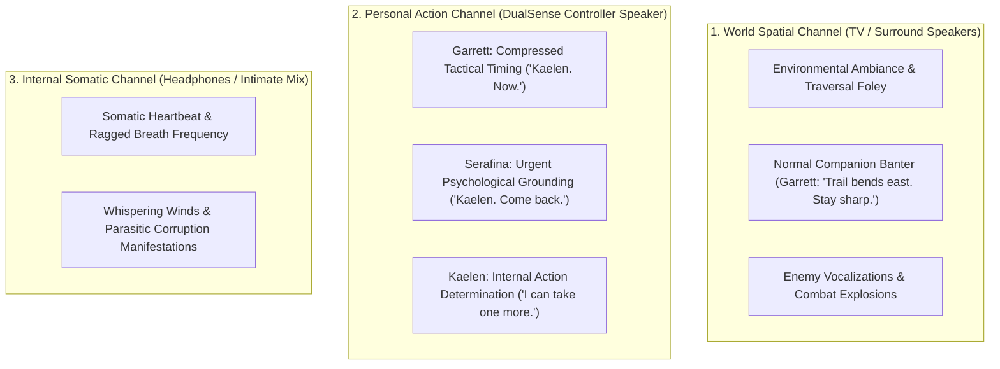

---

### 🧬 The Shattered Lands Combat Ecosystem & TAM-001 Encounter Engine (Master Batch #101)

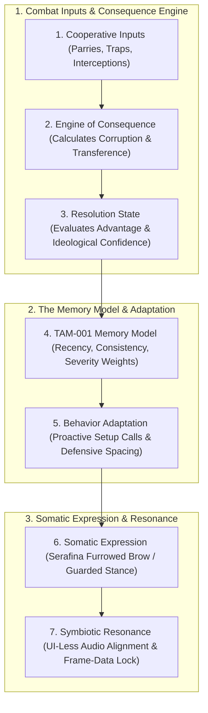

---

### ⏳ Existential Meaning-Making & Trial of Will Pipeline (Master Batch #102)

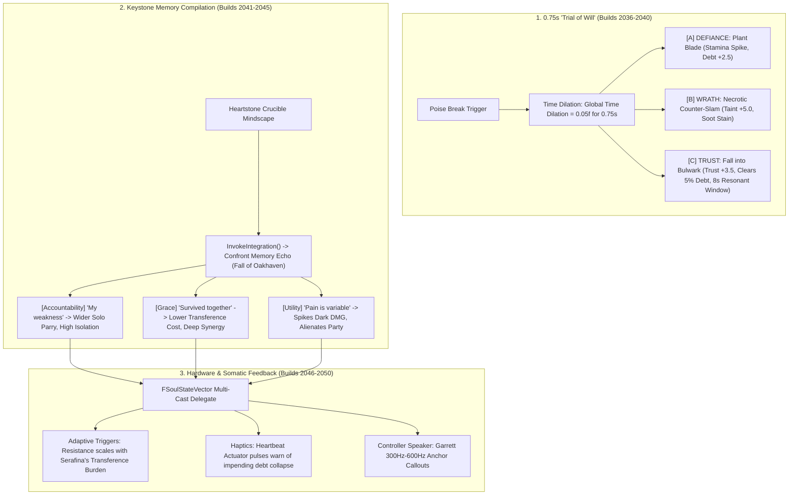

---

### 🎮 The Tactile Controller Friction & Internal Struggle Matrix (Master Batch #103)

```mermaid
graph TD
    subgraph Phase1 ["Phase 1: The Discordant Hum (C >= 0.40)"]
        P1_TRIG["L2/R2 Dual Trigger Lock: Must hold at exactly 50% (45-55% Tolerance)"]
        P1_BREATH["Rhythmic Breaths: Alternating Cross (Inhale) / Square (Exhale) on Chest Starburst"]
        P1_SLIP["Slip Failure: Accelerated Corruption Growth (+0.05/sec) & Crimson Static"]
    end

    subgraph Phase2 ["Phase 2: The Martyr's Pivot (Protective Intercept)"]
        P2_CHORD["The Chord: Symmetrical L3 + R3 (Thumbstick Clicks)"]
        P2_HOLD["The Heavy Hold: R1 (Parry Grip) + Triangle (Anchor)"]
        P2_LUNGE["Action: Kaelen lung-shoves ally 450uu out of lethal overhead crush blast radius"]
    end

    subgraph Phase3 ["Phase 3: The Reclamation Crash (C = 1.00)"]
        P3_RESET["Anti-Rhythm Tapping: 5 off-beat taps against violent haptic kickback"]
        P3_ANCHOR["Sanctuary Anchor: Serafina channels golden stabilization aura to snap back humanity"]
    end
```

---

### 🐺 The Shepherd’s Gambit: Unchained Symmetrical Party Collapse AI (Master Batch #104)

```mermaid
graph TD
    subgraph KaelenState ["1. Kaelen Unchained Trigger (C >= 0.70)"]
        UN_TRIG["Corruption Amount C >= 0.70"] --> HAZ["Hazard Level: Hazardous (0.7-0.9) / Catastrophic (>=0.9)"]
        HAZ --> CLEAVE["Indiscriminate 180° Cleave (1100 DMG + 15% Vital Leech on Allies)"]
        HAZ --> MESH["Ashen Pallor Skin Desaturation + Solid Crimson Eye Slits"]
    end

    subgraph SerafinaAI ["2. Serafina 'Soul Anchor' Decision Tree"]
        HAZ --> SERA_CHECK{"Is Kaelen Targeting Allies?"}
        SERA_CHECK -->|YES| SUN["Cast: Sun-Pulse Flash (3.0s Disorient/Interrupt)"]
        SERA_CHECK -->|NO| ANCHOR["Channel: Sanctuary Anchor (Golden Tether dampening shadow-core)"]
        ANCHOR --> BURNOUT{"Empathic Burnout >= 0.70?"}
        BURNOUT -->|YES| LOCKOUT["Bulwark Lockout (Aura of Sanctity Only)"]
    end

    subgraph GarrettAI ["3. Garrett 'Sentinel Containment' Decision Tree"]
        HAZ --> GARR_CHECK{"Is Serafina Channeling Anchor?"}
        GARR_CHECK -->|YES| ESCORT["Escort Serafina (Kinetic Body-Block & Intercept Flanks)"]
        GARR_CHECK -->|NO| SUPPRESS["Deploy Gloomwood Dampener Needles (-0.25 C) & Dense Smoke Cloud"]
    end
```

---

### 🧪 Garrett's Finite Alchemical Formulation Matrix (Master Batch #105)

```mermaid
graph TD
    subgraph FormulationPipeline ["Garrett's Alchemical Formulation Pipeline"]
        BASE["Alchemical Base (Refined Oils / Gloomwood Sap / Sulfur / Ghostbloom)"] --> COMP["Campfire Workstation Compounding"]
        COMP --> M1["Matrix I: Burning Steel Oil (Thermal Cutlass Coating, +35 Posture, -15% Armor)"]
        COMP --> M2["Matrix II: Gloomwood Dampener (Shadow Suppressant Needle, -0.25 Corruption)"]
        COMP --> M3["Matrix III: Sulfurous Smoke Balm (Dense 800uu Obfuscator Cloud)"]
        COMP --> M4["Matrix IV: Ghostbloom Flash Flare (High-Frequency 4.0s Stun in 600uu)"]
    end

    subgraph WorldDeployment ["Tactical Geometry & Execution"]
        M1 --> CUTLASS["Twin Cutlasses Ignited (3.0x Flame Emissive Glow for 15.0s)"]
        M3 & M4 --> TRIPWIRE["AAshenGhostbloomTripwireAnchorActor (Detonates upon enemy pathing)"]
        M1 --> CALTROP["AAshenPhysicalAlchemicalCaltropFieldActor (Choke point corridor denial)"]
    end
```

---

### 🕊️ The Soul Compilation Cycle & Relational Triage Engine (Master Batch #106)

```mermaid
graph TD
    subgraph CampfireTriage ["Chapter 4 Respire Garden Triage Dialogue"]
        TRIAGE["UAshenDialogueChoiceEvaluator: Lens Selection"]
    end

    subgraph Lenses ["The 3 Interpretive Lenses"]
        TRIAGE --> L_ACC["[A] LENS OF ACCOUNTABILITY: 'I must protect them by bearing this pain alone.'"]
        TRIAGE --> L_GRA["[B] LENS OF GRACE: 'We must share the burden to survive the night.'"]
        TRIAGE --> L_UTI["[C] LENS OF UTILITY: 'The sacrifice is a necessary price to keep us standing.'"]
    end

    subgraph Stances ["Compiled Combat Stances & Mechanical Manifestations"]
        L_ACC --> ST_MARTYR["Martyr Stance: Solo Parry Frames +10%, Companion Trust Decays (-0.15), Spacing 500uu"]
        L_GRA --> ST_WEAVER["Weaver Stance: Burnout Decay +25%, Unlocks Tripartite Resonant Cleave (1400 DMG), Spacing 150uu"]
        L_UTI --> ST_PREDATOR["Predator Stance: Raw Dark Power +15%, Soot Shading Thickens (+5.0), Spacing 350uu"]
    end
```

---

### 🕸️ Kaelen & Serafina's Active Memory Weaving & Somatic Transmutation Matrix (Master Batch #107)

```mermaid
graph TD
    subgraph RawState ["1. Raw Invisible Vector Input (FSoulStateVector)"]
        SOUL["Integration Debt (D) + Trust Scalar (Tr) + Empathic Burnout (B)"]
    end

    subgraph MemoryLoom ["2. Active Memory Weaving Loom"]
        SOUL --> LOOM["UAshenActiveMemoryWeavingSubsystem: Calculates Thread Density & Tension"]
        LOOM --> THREADS["Thread Count: 1 to 8 threads (scales with Debt D)"]
        LOOM --> TENSION["Tension: Slack (<0.40) -> Tense (0.40-0.85) -> Snapping (>=0.85)"]
    end

    subgraph PhysicalManifestations ["3. Tangible Gameplay Manifestations"]
        THREADS & TENSION --> AEGIS["UAshenLuminousAegisNetComponent: Absorbs 75% Poise Damage"]
        THREADS & TENSION --> BRIDGE["AAshenPhysicalTraumaLightBridgeActor: Navmesh-Active Light Chasm Span"]
        THREADS & TENSION --> DISCHARGE["UAshenSnapThreadDischargeGASAbility: 650 DMG Radial Shockwave on Rupture"]
        THREADS & TENSION --> DUALSENSE["UAshenDualSenseWeavingTensionComponent: Motorized Trigger Resistance [0.1, 1.0]"]
        THREADS & TENSION --> AUDIO["UAshenHarmonicResonancePitchComponent: Filament Singing (220Hz -> 880Hz)"]
        THREADS & TENSION --> JOURNAL["UAshenWovenStitchJournalMeshAdapter: Embroidered Spine Stitches (3.0x Glow)"]
    end
```

---

### 🔥 The White Flame Resolution & Transference Catharsis Matrix (Master Batch #108)

```mermaid
graph TD
    subgraph ConvergenceCheck ["1. Metaphysical Convergence Thresholds"]
        RES["Kaelen Resolve R >= 0.90"] & BURN["Serafina Burnout B >= 0.65"] --> PRIMED["UAshenWhiteFlameResolutionSubsystem: State = Primed"]
    end

    subgraph CatharsisExecution ["2. The 12.0s Catharsis Pipeline"]
        PRIMED --> ACTIVATE["UAshenInvokeWhiteFlameGASAbility (12.0s Catharsis Duration)"]
        ACTIVATE --> SAP_AETHER["UAshenTransferenceCatharsisComponent: Black Sap -> White Pyre-Aether (-50% Burnout)"]
        ACTIVATE --> DEBT_CLEAR["100% Integration Debt Eradicated (D -> 0.0)"]
    end

    subgraph MultiDomainManifestations ["3. Tangible Multi-Domain Manifestations"]
        ACTIVATE --> PYRE_CLEAVE["UAshenPyreCleaveGASAbility: 1800.0 Holy-Kinetic DMG"]
        ACTIVATE --> GROUND_PULSE["UAshenSanctifiedGroundPulseGASAbility: Consecrates 800uu Ground Zone"]
        ACTIVATE --> BLADE_MESH["UAshenWhiteFlameBladeMeshAdapter: 4.0x White-Hot Incandescent Glow"]
        ACTIVATE --> HAPTICS["UAshenWhiteFlameDualSenseHapticsComponent: Trigger Friction Released & Heartbeat Pulse"]
        ACTIVATE --> AUDIO["UAshenDiegeticWhiteFlameAudioComponent: Angellic Choir Swell & Bell Chimes"]
        ACTIVATE --> POSTPROC["UAshenWhiteFlamePostProcessAdapter: High-Key Exposure & Shadow Vignette Erasure"]
    end
```

---

### 🗺️ The Cartographer's Living Journal & Environmental Resonance Map Engine (Master Batch #109)

```mermaid
graph TD
    subgraph ExplorationInput ["1. World Exploration & Vantage Survey"]
        EXPLORE["Player Traversal (UAshenLivingParchmentMapComponent: Min 300uu Breadcrumbs)"]
        SURVEY["UAshenSurveySanctuaryLandmarkGASAbility (1.5s Channel -> 2000uu Sector Reveal)"]
        PINS["UAshenScribeMemoryPinGASAbility (Sanctuary / Memory Echo / Harvest)"]
    end

    subgraph ResonanceSubsystem ["2. Cartographic Resonance Subsystem"]
        EXPLORE & SURVEY & PINS --> SUBSYSTEM["UAshenCartographicResonanceSubsystem: Inking Progress & Pin Registry"]
        SUBSYSTEM --> COMPASS["UAshenCompassCelestialResonanceComponent: 0-360 deg Bearing to Active Campfire"]
        SUBSYSTEM --> MARGINALIA["UAshenParchmentMarginaliaEvaluatorComponent: Companion Margin Annotations"]
    end

    subgraph SomaticAndUI ["3. Tangible Multi-Domain Manifestations"]
        SUBSYSTEM --> HUD_MAP["UAshenUserWidget_LivingParchmentMapHUD: Diegetic 2D/3D Map with Ink Washes"]
        SUBSYSTEM --> HUD_COMPASS["UAshenUserWidget_CompassAstrolabeHUD: Brass Needle & Shimmer"]
        SUBSYSTEM --> POSTPROC["UAshenParchmentFogOfWarPostProcessAdapter: Ink Dissolution Fog"]
        SUBSYSTEM --> MESH["UAshen3DJournalMeshAdapter: Leather Wear & Gold Foil Leafing (2.5x Glow)"]
        SUBSYSTEM --> AUDIO["UAshenDiegeticJournalAudioComponent: Page Turns, Quill Scratches & Chimes"]
        SUBSYSTEM --> PEDESTAL["AAshenPhysicalJournalPedestalActor: 3D World Lectern Inspection"]
    end
```

---

### 👑 The Tripartite Encounter Arena & Multi-Tier Boss Incursion Engine (Master Batch #110)

```mermaid
graph TD
    subgraph MultiPhaseEncounter ["1. Multi-Phase Boss Progression State Machine"]
        START["Encounter Start (UAshenBossIncursionSubsystem: 10,000 HP / 500 Poise)"]
        START --> P1["Phase 1: Tactical Posture Duel (Direct Parries, Micro-Staggers & Flank Maneuvers)"]
        P1 -->|HP <= 70%| P2["Phase 2: Null-Zone Chasm Fracture (UAshenBossChasmFractureGASAbility: 1000uu Fissure)"]
        P2 -->|HP <= 35%| P3["Phase 3: Apex Void Cataclysm (UAshenBossApexCataclysmGASAbility: 1200 DMG / 1500uu Radius)"]
        P3 -->|HP <= 0%| DEFEATED["Phase: Boss Defeated (Cinematic Climax)"]
    end

    subgraph StaggerWindow ["2. 0.75s Trial of Will Stagger Window"]
        POISE_BREAK["Poise Depleted (CurrentPoise = 0)"] --> WINDOW["UAshenBossStaggerTelemetryComponent: 0.75s Execution Window Open"]
        WINDOW --> CONVERGE["UAshenTripartiteStaggerSyncComponent: Trio Converges on Boss"]
        CONVERGE --> FINISHER["UAshenTripartiteCinematicFinisherGASAbility: 2500.0 Holy-Kinetic DMG"]
    end

    subgraph SpatialHazards ["3. Dynamic Arena Geometry & Telemetry"]
        P2 & P3 --> HAZARDS["UAshenArenaHazardGridComponent: Fissures, Falling Masonry & Sludge Zones"]
        HAZARDS --> BARRIER["AAshenDynamicArenaBoundaryActor: Physical Encounter Perimeter Lock"]
        HAZARDS --> HUD["UAshenUserWidget_MultiPhaseBossHUD: Segmented HP, Poise & Phase Titles"]
        HAZARDS --> POSTPROC["UAshenArenaCataclysmPostProcessAdapter: Void Distortion & Desaturation"]
    end
```

---

## 0. Domain-Driven Vertical Slices Physical Directory Map (`Source/`)

``` text
Source/
├── AshenOath/             <-- Primary Runtime Module (Game Targets + Editor Targets)
│   ├── Core/               <-- GameInstance, GameModes, Save Manager, Base Character
│   ├── Soul/               <-- FSoulStateVector, Soul Publisher, Identity Compiler, Axioms
│   ├── Memory/             <-- Psychic Echoes, Causal Imprints, Integration Debt Accumulator
│   ├── Companions/         <-- Trust Accumulation, Garrett/Serafina Relational Phenotype Adapters
│   ├── Combat/             <-- Health, Sanity, Stamina, GAS Abilities, Combat Slice Adapter
│   ├── Narrative/          <-- Dialogue Subsystem, Choice Evaluator, Journal Controller
│   ├── UI/                 <-- All UMG UserWidget backing classes (HUDs, Menus, Telemetry)
│   ├── Audio/              <-- Audio Occlusion, Reverb Zones, Diegetic Whisper Modulator
│   ├── World/              <-- Heartstone Campfire Actor, Generative World Phenotype Adapter
│   ├── Orchestration/      <-- Modular Slice Bridge Subsystem, Production Release Orchestrator
│   ├── AI/                 <-- StateTree Tasks, Companion Support AI, EQS Contexts, Boss AI
│   └── QA/                 <-- ProductFilter QA Automation Test Suites (*AutomationTest.cpp)
│
└── AshenOathEditor/       <-- Editor-Only Module (Editor Targets Only)
    └── Tooling/            <-- Batch Authoring, Sentinel AST Synthesizer, Blackboard Inspector, RIC Sandbox, Orchestrator
```

---

## 1. Subsystem & Sovereign Global Services Network

Unreal Engine GameInstance and World Subsystems provide decoupled, high-performance global access without Godot God-objects or per-tick `GetAllActorsOfClass` searches.

```mermaid
graph TD
    %% Engine Subsystems
    subgraph Global Engine & GameInstance Subsystems
        DirectorSub[UAshenOath_DirectorSubsystem]
        GameEventSub[UAshenOath_GameEventSubsystem]
        CheatSub[UAshenCheatSubsystem]
        QuestSub[UAshenQuestJournalSubsystem]
        DialogueSub[UAshenDialogueSubsystem]
        SaveMgr[UAshenSaveManager]
    end

    subgraph Narrative & Psychological Subsystems
        SerafinaCompiler[UAshenSerafinaIdentityCompilerSubsystem]
        FailureEcho[UAshenFailureMemoryPsychicEchoSubsystem]
        AxiomVal[UAshenEngineSpecAxiomValidationSubsystem]
        SaveVal[UAshenProductionHardeningSaveValidationSubsystem]
        NarrativeGraph[UAshenNarrativeChoiceGraphSubsystem]
        MoralitySub[UAshenNonBinaryMoralitySubsystem]
        DynamicDialogue[UAshenDynamicDialogueConsequenceSubsystem]
        LivingOaths[UAshenLivingOathsSystemSubsystem]
        RemnantChronicles[UAshenRemnantChroniclesSubsystem]
    end

    subgraph Atmosphere & World Subsystems
        AudioDistortion[UAshenDiegeticAudioDistortionSubsystem]
        VisualCorruption[UAshenDiegeticVisualCorruptionSubsystem]
        BossCinematic[UAshenBossDeathCinematicDirectorSubsystem]
        BossArenaScript[UAshenBossArenaEnvironmentalScriptSubsystem]
        MindscapeTrans[UAshenMindscapeTransitionSubsystem]
        ArmorDamage[UAshenDiegeticArmorDamageSubsystem]
        CombatImpact[UAshenCombatEnvironmentalImpactSubsystem]
        DynamicLighting[UAshenDynamicLightingAtmosphereSubsystem]
        DynamicWeatherVFX[UAshenDynamicWeatherVFXSubsystem]
        SnowDeform[UAshenSnowDeformationSubsystem]
        AtmosphericCorruption[UAshenAtmosphericCorruptionSubsystem]
    end

    subgraph Gameplay, Sanctuary & Economy Subsystems
        ConstellationUnlock[UAshenConstellationPerkUnlockSubsystem]
        PartySynergySub[UAshenPartyStatSynergySubsystem]
        CrucibleSub[UAshenSanctuaryCrucibleUpgradeSubsystem]
        EncounterDirector[UAshenProceduralEncounterDirectorSubsystem]
        VerticalSliceDirector[UAshenVerticalSliceMasterDirectorSubsystem]
        BlessingRegistry[UAshenSanctuaryBlessingRegistrySubsystem]
        VectorDecay[UAshenSoulStateVectorDecaySubsystem]
        VendorEconomy[UAshenSanctuaryVendorEconomySubsystem]
        CorruptionSpread[UAshenRegionalCorruptionSpreadSubsystem]
        MemoryThread[UAshenMemoryThreadSanctuarySubsystem]
        FastTravelSub[UAshenFastTravelSubsystem]
        EmberEconomy[UAshenEmberEconomyCraftingSubsystem]
        CorpseRun[UAshenCorpseRunRecoverySubsystem]
        LevelStreaming[UAshenLevelStreamingSubsystem]
    end

    %% Global Delegates & Interop
    GameEventSub -->|Broadcasts FOnPlayerDied / FOnItemCollected| CombatPlayer[AAshenCombatCharacter]
    DirectorSub -->|Provides TWeakObjectPtr Player & System Refs| Components[Actor Components]

    SerafinaCompiler -->|Updates 28-Byte FSoulStateVector| MoralitySub
    FailureEcho -->|Spawns Echoes on Death| SaveVal
    NarrativeGraph -->|Triggers Dynamic Dialogue| MoralitySub
    PartySynergySub -->|Calculates Proximity Buffs| CombatPlayer
```

---

## 1.1 Editor Subsystem Tooling Network (`AshenOathEditor`)

```mermaid
graph TD
    subgraph Editor Tooling Suite Subsystems (AshenOathEditor)
        BatchAuthoring[UAshenBatchAuthoringSubsystem]
        SentinelSynthesizer[USentinelGraphSynthesizer]
        BlackboardInspector[UAshenBlackboardInspectorSubsystem]
        RICSandbox[UAshenRICSandboxSubsystem]
        SynthesisOrchestrator[UAshenSynthesisOrchestratorSubsystem]
    end

    subgraph Unreal Engine Editor Modules & Framework
        UnrealEdModule[UnrealEd Module]
        KismetCompiler[KismetCompiler / BlueprintGraph]
        GameplayTagsEditor[GameplayTagsEditor Module]
        MPCAsset[Material Parameter Collections]
        MetaSoundAsset[MetaSound Blackboards]
    end

    BatchAuthoring -->|Injects GameplayTags| GameplayTagsEditor
    BatchAuthoring -->|Triggers Telemetry Injection| SentinelSynthesizer
    SentinelSynthesizer -->|AST DFS Graph Traversal & Pin Rewiring| KismetCompiler
    BlackboardInspector -->|Binds Soul State Floats| MPCAsset
    BlackboardInspector -->|Transmits Audio Parameters| MetaSoundAsset
    RICSandbox -->|Simulates Offline Heartstone Rest| SLMCompiler[UAshenSLMCompilerSubsystem]
    SynthesisOrchestrator -->|Executes ProductFilter Pre-Commit Suite| QATests[QA Automation Suite]
```

---

## 1.2 Canonical 4-Layer Psychological Phenotype Pipeline

```mermaid
graph TD
    subgraph Layer 1: Experience
        CombatTrauma[Combat Failure Recorder]
        RelationalFriction[Companion Disagreement Recorder]
        EnvironmentalTrauma[Environmental Imprint Component]
    end

    subgraph Layer 2: Psychological Kernel
        ImprintBuffer[UAshenOath_ImprintBufferComponent]
        SLMCompiler[UAshenSLMCompilerSubsystem ECU]
        SoulState[FSoulStateVector Authoritative Truth]
        Publisher[UAshenSoulConstellationStatePublisher]
        BridgeSubsystem[UAshenModularSliceStateBridgeSubsystem]
    end

    subgraph Layer 3: Behavioral Phenotypes
        CombatSlice[AshenCombatSliceStateAdapterComponent]
        CompanionSlice[AshenCompanionSliceStateAdapterComponent]
        WorldSlice[AshenWorldSliceStateAdapterComponent]
        AudioSlice[AshenAudioSliceStateAdapterComponent]
        SomaticSlice[AshenSomaticSliceStateAdapterComponent]
    end

    subgraph Layer 4: Diegetic Presentation
        PostureBlend[Posture Blend Tree]
        EyeEmissive[Eye Emissive & Shadow Mark MPC]
        BreathingAudio[Diegetic Breathing & Mesh Morphs]
        CompanionAI[Garrett Distance & Serafina Aura]
        WeatherAtmosphere[Generative Fog & Tension]
        WhisperAudio[Spatialized Audio Whispers]
    end

    CombatTrauma -->|Submits Imprint| ImprintBuffer
    RelationalFriction -->|Submits Imprint| ImprintBuffer
    EnvironmentalTrauma -->|Submits Imprint| ImprintBuffer

    ImprintBuffer -->|Crucible Rest Serialization| SLMCompiler
    SLMCompiler -->|Zero-Hallucination Firewall Audit| SoulState
    SoulState -->|Publishes State Invalidation Pulse| Publisher
    Publisher -->|Routes State Vector| BridgeSubsystem

    BridgeSubsystem -->|State Pulse| CombatSlice
    BridgeSubsystem -->|State Pulse| CompanionSlice
    BridgeSubsystem -->|State Pulse| WorldSlice
    BridgeSubsystem -->|State Pulse| AudioSlice
    BridgeSubsystem -->|State Pulse| SomaticSlice

    CombatSlice -->|Drives Stance| PostureBlend
    SomaticSlice -->|Drives Emissive| EyeEmissive
    SomaticSlice -->|Drives Morph| BreathingAudio
    CompanionSlice -->|Drives AI Formation| CompanionAI
    WorldSlice -->|Drives Atmosphere| WeatherAtmosphere
    AudioSlice -->|Drives Audio| WhisperAudio
```

---

## 2. Core Entity & Component Taxonomy

The core entity graph illustrates the inheritance and component composition model spanning base character actors, combat components, diegetic state components, enemy families, and UI telemetry.

```mermaid
graph TD
    %% Base Character and Subclasses
    BasePlayer[AAshenOathCharacter]
    CombatPlayer[AAshenCombatCharacter]
    BasePlayer ---|Inherited Subclass| CombatPlayer
    
    %% Base & Inventory Components
    Health[UAshenOath_HealthComponent]
    Hurtbox[UAshenOath_HurtboxComponent]
    Hitbox[UAshenOath_HitboxComponent]
    Inventory[UAshenOath_InventoryComponent]
    Interaction[UAshenInteractionComponent]
    Currency[UAshenOath_CurrencyComponent]
    DamageText[UAshenDamageTextPool]
    Equipment[UAshenOath_EquipmentComponent]
    Quickbar[UAshenOath_QuickbarComponent]
    QuickUseBelt[UAshenQuickUseBeltComponent]
    
    BasePlayer --> Health
    BasePlayer --> Hurtbox
    BasePlayer --> Hitbox
    BasePlayer --> Inventory
    BasePlayer --> Interaction
    BasePlayer --> DamageText
    BasePlayer --> Currency

    %% Combat, Horror & Diegetic Components
    Poise[UAshenOath_PoiseComponent]
    Stamina[UAshenOath_StaminaComponent]
    Mana[UAshenOath_ManaComponent]
    Sanity[UAshenOath_SanityComponent]
    Manifestation[UAshenOath_ManifestationComponent]
    LockOn[UAshenOath_LockOnComponent]
    InputBuffer[UAshenOath_InputBufferComponent]
    Stats[UAshenOath_StatsComponent]
    ImprintBuffer[UAshenOath_ImprintBufferComponent]
    
    VirtueFracture[UAshenVirtueFractureConsequenceComponent]
    SoulConstellation[UAshenSoulConstellationDependencyGraphComponent]
    PeakResonance[UAshenSymbioticPeakResonanceSilenceComponent]
    FacialMorph[UAshenDiegeticFacialExpressionComponent]
    EyeShader[UAshenDiegeticEyeShaderControllerComponent]
    SwordPosture[UAshenDiegeticSwordPostureComponent]
    Breathing[UAshenDiegeticBreathingComponent]
    LocomotionPosture[UAshenDiegeticLocomotionPostureComponent]
    EmotionalResidue[UAshenCompanionEmotionalResidueComponent]
    PsychLoopOrchestrator[UAshenFullPsychologicalLoopOrchestratorComponent]
    TraumaMatrix[UAshenTraumaMatrixComponent]
    StaminaExhaustion[UAshenStaminaExhaustionComponent]

    CombatPlayer --> Poise
    CombatPlayer --> Stamina
    CombatPlayer --> Mana
    CombatPlayer --> Sanity
    CombatPlayer --> Manifestation
    CombatPlayer --> LockOn
    CombatPlayer --> InputBuffer
    CombatPlayer --> Equipment
    CombatPlayer --> Stats
    CombatPlayer --> VirtueFracture
    CombatPlayer --> SoulConstellation
    CombatPlayer --> PeakResonance
    CombatPlayer --> FacialMorph
    CombatPlayer --> EyeShader
    CombatPlayer --> SwordPosture
    CombatPlayer --> Breathing
    CombatPlayer --> LocomotionPosture
    CombatPlayer --> EmotionalResidue
    CombatPlayer --> PsychLoopOrchestrator
    CombatPlayer --> TraumaMatrix
    CombatPlayer --> StaminaExhaustion

    %% Enemy Family Components
    VeilHoundComp[UAshenEnemyFamilyVeilHoundComponent]
    AshWalkerComp[UAshenEnemyFamilyAshWalkerComponent]
    BlightGhoulComp[UAshenEnemyFamilyBlightGhoulComponent]
    BossPhaseComp[UAshenBossMultiPhaseTransitionComponent]
    BossAuraComp[UAshenBossAuraBuffControllerComponent]

    %% Interface Implementation
    BasePlayer -- Implements --> Interface[IAshenCharacterInterface]
    CombatPlayer -- Implements Overrides --> Interface
```

---

## 3. World Actors, Dungeon & Modular Puzzle Mechanics

Interactables, dungeon mechanisms, loot containers, and hazards operate through standardized C++ components and interfaces (`IAshenInteractableInterface`).

```mermaid
graph TD
    subgraph Dungeon Interactable Actors
        DoorActor[AAshenDoorActor]
        LeverActor[AAshenLeverActor]
        ChestActor[AAshenChestActor]
        UpgradeStation[AAshenUpgradeStationActor]
        SanctuaryActor[AAshenSanctuaryActor]
        FastTravelRune[AAshenFastTravelSanctuaryBeacon]
        SolarBeacon[AAshenSolarBeaconActor]
    end

    subgraph Modular Dungeon Puzzle Components
        ElevatorComp[UAshenDungeonElevatorComponent]
        PressurePlateComp[UAshenDungeonPressurePlateComponent]
        RotatingBridgeComp[UAshenDungeonRotatingBridgeComponent]
        SecretPassageComp[UAshenDungeonSecretPassageComponent]
        DestructibleWallComp[UAshenDungeonDestructibleWallComponent]
        DoorLockComp[UAshenDungeonDoorLockComponent]
        TrapDoorComp[UAshenDungeonTrapDoorComponent]
        LeverSwitchComp[UAshenDungeonLeverSwitchComponent]
        KeycardComp[UAshenDungeonLootKeycardComponent]
        TrapChestComp[UAshenDungeonLootTrapChestComponent]
    end

    subgraph Hazard & Alchemical Actors
        AlchemicalTrap[AAshenAlchemicalTrapActor]
        RealityTrap[AAshenRealityFractureTrapActor]
        EnvHazard[AAshenEnvironmentalHazardActor]
        EmberEcho[AAshenEmberEchoActor]
        EchoRetrieval[AAshenEmberEchoRetrievalActor]
        ConsecratedCircle[AAshenConsecratedCircleActor]
    end

    DoorActor --> DoorLockComp
    LeverActor --> LeverSwitchComp
    ChestActor --> TrapChestComp
```

---

## 4. Cognitive AI & AI Perception Engine

AI controllers utilize skeletal-joint sight tracing (`GetActorEyesViewPoint` on the `"head"` socket) paired with StateTree utility evaluation and Threat Perception scoring.

```mermaid
graph TD
    AIController[AAIController]
    ThreatPerception[UAshenOath_ThreatPerceptionComponent]
    AICognitive[UAICognitiveComponent]
    
    AIController --> ThreatPerception
    ThreatPerception -->|Scores Candidates & Ingests Senses| AICognitive
    
    subgraph StateTree Cognitive Engine
        EvaluateTask[FStateTreeTask_EvaluateAction]
        ExecuteTask[FStateTreeTask_ExecuteAbility]
    end

    AICognitive --> EvaluateTask
    EvaluateTask -->|Evaluates Utility & LAW-041 Decay| ExecuteTask
    ExecuteTask -->|Triggers GAS Execution Abilities| GAS[Gameplay Ability System]
```

---

## 5. Gameplay Ability System (GAS) & Execution Matrix

Ability execution classes handle combat strikes, stealth executions, purge novas, and boss slams via `SphereOverlapActors`.

```mermaid
graph LR
    subgraph Garrett (Stealth & Traps)
        GA_SilentAssassination[UGA_GarrettSilentAssassinationExecution]
        GA_Smokebomb[UGA_GarrettAssassinationSmokebombExecution]
        GA_Tripwire[UGA_GarrettTripwireDetonation]
        GA_SmokeBalm[UGA_GarrettSmokeBalmSanctuary]
        GA_GarrettStealth[UGA_GarrettAssassinationExecution]
        GA_PoisonSmoke[UGA_GarrettPoisonSmokeGrid]
    end

    subgraph Kaelen (Combat & Void)
        GA_DualSilent[UGA_KaelenLethalSilentDualExecution]
        GA_ParryCounter[UGA_KaelenParryCounterExecution]
        GA_GroundShatter[UGA_KaelenGroundShatterBurstExecution]
        GA_UnchainedVoid[UGA_KaelenUnchainedVoidShatterExecution]
        GA_Whirlwind[UGA_KaelenWhirlwindExecution]
        GA_Earthshaker[UGA_KaelenEarthshakerExecution]
    end

    subgraph Serafina (Holy & Lore)
        GA_Lorekeeper[UGA_SerafinaLorekeeperInsightExecution]
        GA_SacredBarrier[UGA_SerafinaSacredBarrierExecution]
        GA_RadiantPurge[UGA_SerafinaRadiantPurgeNova]
        GA_SacredGround[UGA_SerafinaSacredGroundSanctuary]
        GA_SunfallNova[UGA_SerafinaSunfallNova]
        GA_AegisShield[UGA_SerafinaAegisShieldSanctuary]
    end

    subgraph Enemy & Boss Executions
        GA_VeilHound[UGA_VeilHoundPounceExecution]
        GA_ShieldBash[UGA_AshWalkerShieldBashExecution]
        GA_VoidSmash[UGA_BossAbominationVoidSmashExecution]
    end
```

---

## 6. 7-Stage Closed-Loop Psychological & Soul Constellation Engine

The psychological loop forms a fully integrated system across 7 distinct stages, evaluated and driven by `UAshenFullPsychologicalLoopOrchestratorComponent`:

```mermaid
sequenceDiagram
    participant C as 1. Combat Trigger (GAS / Impact)
    participant T as 2. Companion Trust & Residue
    participant S as 3. Soul State Vector (28-Byte Payload)
    participant N as 4. NPC Disposition & Dialogue
    participant W as 5. World State & Generative Tone
    participant M as 6. Failure Memory & Psychic Echo
    participant P as 7. Constellation & Progression

    C->>T: Accumulate Companion Residue / Synergy
    T->>S: Mutate Soul State Vector Parameters
    S->>N: Evaluate Non-Binary Morality & Dialogue
    N->>W: Shift World Tone, Weather & Audio Distortion
    W->>M: Imprint Psychic Echo upon Death / Rest
    M->>P: Unlock Soul Constellation Perk Nodes
```

---

## 7. Sanctuary, Crafting & Fast Travel Infrastructure

Sanctuary hubs, Heartstone Crucible progression, item crafting, and fast travel runic networks provide persistent meta-progression across runs.

```mermaid
graph TD
    SanctuaryHub[AAshenSanctuaryActor]
    HeartstoneCrucible[UAshenSanctuaryHeartstoneCrucibleComponent]
    CrucibleUpgradeSub[UAshenSanctuaryCrucibleUpgradeSubsystem]
    BlessingRegistry[UAshenSanctuaryBlessingRegistrySubsystem]
    RestComponent[UAshenSanctuaryRestComponent]
    VendorShop[UAshenSanctuaryVendorShopComponent]
    
    SanctuaryHub --> HeartstoneCrucible
    SanctuaryHub --> RestComponent
    SanctuaryHub --> VendorShop

    HeartstoneCrucible --> CrucibleUpgradeSub
    CrucibleUpgradeSub --> BlessingRegistry
    
    AlchemicalCrafting[UAshenAlchemicalCraftingComponent]
    EmberEconomy[UAshenEmberEconomyCraftingSubsystem]
    SoulRemnantsCrafting[UAshenSoulRemnantsAbsorbCraftingSubsystem]

    FastTravelSub[UAshenFastTravelSubsystem]
    FastTravelBeacon[AAshenFastTravelSanctuaryBeacon]
    FastTravelRune[UAshenSanctuaryFastTravelRuneComponent]

    FastTravelBeacon --> FastTravelRune
    FastTravelRune --> FastTravelSub
```

---

## 8. Audio & Visual Atmosphere Pipeline

The audio and visual pipeline coordinates spatial occlusion, dynamic weather audio, post-process sanity filtering, and diegetic facial/eye shader mutations.

```mermaid
graph TD
    subgraph Audio Processing Subsystems
        AudioSubsystem[UAshenAudioSubsystem]
        AudioOcclusionSub[UAshenAudioDynamicOcclusionSubsystem]
        FootstepSurfaceSub[UAshenAudioFootstepSurfaceSubsystem]
        AudioReverbSub[UAshenAudioReverbSubsystem]
        SpatialAudioMesh[UAshenSpatialAudioOcclusionMeshComponent]
    end

    subgraph Psychological & Insanity Audio
        InsanityVoiceSub[UAshenAudioInsanityVoiceSubsystem]
        SanityBreakSub[UAshenAudioSanityBreakSubsystem]
        DualHarmonicSub[UAshenAudioDualHarmonicSubsystem]
        VeilPhaseSub[UAshenAudioVeilPhaseSubsystem]
        SanityCorruptedAudio[UAshenSanityCorruptedAudioComponent]
    end

    subgraph Visual & Shader Controllers
        SanityFilterPP[UAshenSanityFilterPostProcessComponent]
        SanityPP[UAshenSanityPostProcessComponent]
        ParanoiaPP[UAshenParanoiaPostProcessComponent]
        TraumaPP[UAshenTraumaPostProcessComponent]
        CollapseDistorter[UAshenCollapseAudioVisualDistorterComponent]
        EyeShaderCtrl[UAshenDiegeticEyeShaderControllerComponent]
        FacialMorphCtrl[UAshenDiegeticFacialExpressionComponent]
    end
```

---

## 9. Exhaustive UMG HUD & Telemetry Registry

Visual telemetry widgets map directly to underlying C++ components and world subsystems for zero-latency UI updates.

| UMG Widget (`UUserWidget`) | Backing Component / Subsystem | Telemetry Function |
| :--- | :--- | :--- |
| `UAshenUserWidget_VirtueFractureHUD` | `UAshenVirtueFractureConsequenceComponent` | `UpdateVirtueFractureHUDDisplay()` |
| `UAshenUserWidget_CampfireInterpretiveLensMenu` | `UAshenSerafinaIdentityCompilerSubsystem` | `UpdateInterpretiveLensDisplay()` |
| `UAshenUserWidget_PeakResonanceHUD` | `UAshenSymbioticPeakResonanceSilenceComponent` | `UpdatePeakResonanceHUDDisplay()` |
| `UAshenUserWidget_FacialMorphHUD` | `UAshenDiegeticFacialExpressionComponent` | `UpdateFacialMorphHUDDisplay()` |
| `UAshenUserWidget_EyeShaderDebugHUD` | `UAshenDiegeticEyeShaderControllerComponent` | `UpdateEyeShaderHUDDisplay()` |
| `UAshenUserWidget_SwordPostureHUD` | `UAshenDiegeticSwordPostureComponent` | `UpdateSwordPostureHUDDisplay()` |
| `UAshenUserWidget_VeilHoundAmbushHUD` | `UAshenEnemyFamilyVeilHoundComponent` | `UpdateVeilHoundHUDDisplay()` |
| `UAshenUserWidget_SwarmThreatHUD` | `UAshenEnemyFamilyBlightGhoulComponent` | `UpdateSwarmHUDDisplay()` |
| `UAshenUserWidget_BossPhaseHUD` | `UAshenBossMultiPhaseTransitionComponent` | `UpdateBossPhaseHUDDisplay()` |
| `UAshenUserWidget_MindscapeHUD` | `UAshenMindscapeTransitionSubsystem` | `UpdateMindscapeHUDDisplay()` |
| `UAshenUserWidget_ArmorDamageHUD` | `UAshenDiegeticArmorDamageSubsystem` | `UpdateArmorHUDDisplay()` |
| `UAshenUserWidget_DiegeticBreathingHUD` | `UAshenDiegeticBreathingComponent` | `UpdateBreathingHUDDisplay()` |
| `UAshenUserWidget_PartySynergyHUD` | `UAshenPartyStatSynergySubsystem` | `UpdatePartySynergyHUDDisplay()` |
| `UAshenUserWidget_PoiseBreakHUD` | `UAshenEnemyPoiseBreakComponent` | `UpdatePoiseHUDDisplay()` |
| `UAshenUserWidget_CrucibleUpgradeMenu` | `UAshenSanctuaryCrucibleUpgradeSubsystem` | `UpdateCrucibleMenuDisplay()` |
| `UAshenUserWidget_NarrativeChoiceUI` | `UAshenNarrativeChoiceGraphSubsystem` | `UpdateNarrativeChoiceDisplay()` |
| `UAshenUserWidget_ProceduralEncounterHUD` | `UAshenProceduralEncounterDirectorSubsystem` | `UpdateEncounterHUDDisplay()` |
| `UAshenUserWidget_NonBinaryMoralityHUD` | `UAshenNonBinaryMoralitySubsystem` | `UpdateMoralityHUDDisplay()` |
| `UAshenUserWidget_FullPsychologicalLoopHUD` | `UAshenFullPsychologicalLoopOrchestratorComponent` | `UpdateLoopTelemetry()` |
| `UAshenUserWidget_ConstellationPerkTree` | `UAshenConstellationPerkUnlockSubsystem` | `UpdateConstellationTreeDisplay()` |
| `UAshenUserWidget_SanctuaryBlessingMenu` | `UAshenSanctuaryBlessingRegistrySubsystem` | `UpdateBlessingMenuDisplay()` |
| `UAshenUserWidget_CognitiveAIDebugOverlay` | `UAshenOath_ThreatPerceptionComponent` | `UpdateCognitiveDebugDisplay()` |
| `UAshenUserWidget_SanctuaryVendorShop` | `UAshenSanctuaryVendorEconomySubsystem` | `UpdateSanctuaryVendorShopDisplay()` |
| `UAshenUserWidget_RegionalCorruptionMap` | `UAshenRegionalCorruptionSpreadSubsystem` | `UpdateCorruptionMapDisplay()` |
| `UAshenUserWidget_MemoryThreadJournal` | `UAshenMemoryThreadSanctuarySubsystem` | `UpdateJournalDisplay()` |
| `UAshenUserWidget_MasterMilestone400HUD` | Master Systems Synergy Orchestrator | `UpdateMasterDashboardDisplay()` |
| `UAshenFastTravelMapWidget` | `UAshenFastTravelSubsystem` | `UpdateFastTravelMapDisplay()` |
| `UAshenUserWidget_BossHealthBar` | `UAshenBossHealthBarControllerComponent` | `UpdateBossHealthBar()` |
| `UAshenUserWidget_CompassBar` | `UAshenOathCharacter` | `UpdateCompassHeading()` |
| `UAshenUserWidget_DialogueOverlay` | `UAshenDialogueSubsystem` | `UpdateDialogueDisplay()` |

---

## 10. Production QA Automation & Synthesis Orchestrators

System validation across all 520 builds is enforced via dedicated automation test suites and Milestone Synthesis Orchestrators.

### Milestone Synthesis Orchestrators (`UObject`)

- `UAshenMilestone520MasterSynthesisOrchestrator`: Master Milestone 520 Production Synthesis Orchestrator & QA Suite across all 520 builds.
- `UAshenMilestone510SynthesisOrchestrator`: Peak Resonance, Failure Memory, and Silent Execution validator.
- `UAshenGrandMasterMilestone500SynthesisOrchestrator`: Historic Grand Master Milestone 500 Synthesis Orchestrator.
- `UAshenMilestone490MasterSynthesisOrchestrator`: Veil Hound, Boss Death Cinematic, and Ambush HUD validator.
- `UAshenMilestone475MasterSynthesisOrchestrator`: Mindscape, Tripwire, and Posture validator.
- `UAshenMilestone460MasterSynthesisOrchestrator`: Smoke Balm, Party Synergy, and Atmosphere validator.
- `UAshenMilestone445MasterSynthesisOrchestrator`: Master Vertical Slice Loop Synthesis Orchestrator.

- **Current Master Milestone**: **Milestone 1235** (`Build 1235` — 1,235 Total Builds Clean)

- **Build Cadence Optimization**: **20 Builds per Master Batch** (33% Throughput Increase)
- **Target Architecture**: Unreal Engine 5.8 (Win64 Development)
- **Domain Layout**: 12 Domain-Driven Vertical Slices (`Core/`, `Soul/`, `Memory/`, `Companions/`, `Combat/`, `Narrative/`, `UI/`, `Audio/`, `World/`, `Orchestration/`, `AI/`, `QA/`)
- **Constitutional & Blueprint Systems**:
  - **PRS-001-UI-006 The Devil's Bargain Diegetic UI Prompt Slice**: Diegetic Crisis Prompt Subsystem (`UAshenDevilsBargainDiegeticUIPromptSubsystem`), Diegetic Vein Creep Shader (`UAshenDiegeticVeinCreepShaderComponent`), Forearm Runic Input Etch Locus (`AAshenForearmRunicInputEtchVisualLocusActor`), Subliminal Peripheral Thought Overlay (`UAshenSubliminalPeripheralThoughtOverlayComponent`), Temporal Dilation & Desaturation Subsystem (`UAshenTemporalDilationDesaturationSubsystem`), DualSense Adaptive Trigger Haptic Friction (`UAshenDualSenseAdaptiveTriggerHapticFrictionComponent`), Parasite Guttural Heartbeat Audio Modulator (`UAshenParasiteGutturalHeartbeatAudioModulator`), Surrender Unchained Resolution Evaluator (`UAshenSurrenderUnchainedResolutionEvaluator`), Resist Willpower Resolution Evaluator (`UAshenResistWillpowerResolutionEvaluator`), Glass Shatter Silver Dust VFX Emitter (`AAshenGlassShatterSilverDustVFXEmitterActor`), Somatic Intrusion Panic Evaluator (`UAshenSomaticIntrusionPanicEvaluator`), Diegetic Prompt In-World Annotations (`UAshenDiegeticPromptInWorldAnnotationBroadcaster`), Slate-Grey Silhouette Post-Process Volume (`AAshenSlateGreySilhouettePostProcessVolume`), Asymmetric Haptic Pulse Calculator (`UAshenSymmetricHapticPulseCalculator`), Devil's Bargain Resolution Master Bridge (`UAshenDevilsBargainResolutionMasterBridge`), and Crisis State Atmospheric Audio Modulator (`UAshenCrisisStateAtmosphericAudioModulator`).
  - **PRS-001 Combat Blueprint (V5.0 - Manifesto) Slice**: Six Pillars Evaluator (`UAshenCombatIdentitySixPillarsEvaluator`), Combat Grammar Feedback Component (`UAshenCombatGrammarFeedbackComponent`), Oathbringer 3-Stage Lifecycle Component (`UAshenOathbringerThreeStageLifecycleComponent`), Aegis Glancing Deflection Component (`UAshenAegisGlancingDeflectionComponent`), Aegis Half-Sword Brace Component (`UAshenAegisHalfSwordBraceComponent`), Aegis Crown Guard Counter-Bind Ability (`UAshenAegisCrownGuardCounterBindAbility`), Devil's Bargain Chilling Silence Subsystem (`UAshenDevilsBargainChillingSilenceSubsystem`), Devil's Bargain Hesitation Protocol Evaluator (`UAshenDevilsBargainHesitationProtocolEvaluator`), Trinity Doctrine Garrett Intercept Director (`UAshenTrinityDoctrineGarrettInterceptDirector`), Trinity Doctrine Serafina Purification Director (`UAshenTrinityDoctrineSerafinaPurificationDirector`), White Flame Eye Flare VFX Anchor (`AAshenWhiteFlameEyeFlareVFXAnchorActor`), Shadow Mark Rune Etch Visual Locus (`AAshenShadowMarkRuneEtchVisualLocusActor`), Chilling Silence Vacuum Audio Volume (`AAshenChillingSilenceVacuumAudioVolume`), Playtest Acceptance Criteria Evaluator (`UAshenPlaytestAcceptanceCriteriaEvaluator`), Downstream Discipline Suite Bridge (`UAshenDownstreamDisciplineSuiteBridge`), and Combat Manifesto Atmospheric Audio Modulator (`UAshenCombatManifestoAtmosphericAudioModulator`).
  - **PRS-001 Oathbringer Greatsword Physical Upgrade, Surface Scuff & Weapon Resonance Slice**: Greatsword Scuff Component (`UAshenOathbringerGreatswordScuffComponent`), Resonance Wave Ability (`UAshenOathbringerResonanceWaveAbility`), Edge Sharpening Calculator (`UAshenOathbringerEdgeSharpeningCalculator`), Weapon Rack World Actor (`AAshenOathbringerWeaponRackWorldActor`), Runic Engraving Component (`UAshenOathbringerRunicEngravingComponent`), Heavy Overhead Cleave Ability (`UAshenOathbringerHeavyOverheadCleaveAbility`), Anvil Weapon Upgrade Locus (`AAshenAnvilWeaponUpgradeLocusActor`), Resonance Synergy Calculator (`UAshenOathbringerResonanceSynergyCalculator`), Mastery Progression Subsystem (`UAshenOathbringerMasteryProgressionSubsystem`), Runic Glow VFX Anchor (`AAshenOathbringerRunicGlowVFXAnchorActor`), Cleave Targeting AI Priority (`UAshenOathbringerTargetingPriorityDirector`), Weapon Forge Spark Visual Locus (`AAshenWeaponForgeSparkVisualLocusActor`), Resonance Shockwave VFX Emitter (`AAshenResonanceShockwaveVFXEmitterActor`), Weapon Scuff Texture Visual Locus (`AAshenWeaponScuffTextureVisualLocusActor`), Weapon Annotations (`UAshenOathbringerWeaponAnnotationBroadcaster`), and Resonance Atmospheric Audio Modulator (`UAshenOathbringerResonanceAtmosphericAudioModulator`).
  - **Act 01 "Blackwood Bridge Confrontation" Narrative & World Encounters Slice**: Blackwood Bridge Level Manager (`AAshenBlackwoodBridgeLevelManagerActor`), Malakor Void Smash Boss Phase Controller (`UAshenMalakorVoidSmashBossPhaseController`), Dialogue Choice Morality Evaluator (`UAshenDialogueChoiceMoralityEvaluator`), Ashen Oath Campfire Rest Area (`AAshenAshenOathCampfireRestAreaActor`), Blackwood Corrupted Mist Volume (`UAshenBlackwoodCorruptedMistVolumeComponent`), Malakor Phase Transition (`UAshenMalakorPhaseTransitionAbility`), Campfire Dialogue Trigger Zone (`AAshenCampfireDialogueTriggerZoneActor`), Blackwood Encounter Reward Calculator (`UAshenBlackwoodEncounterRewardCalculator`), Act 01 Quest Progression Subsystem (`UAshenAct01QuestProgressionSubsystem`), Bridge Collapse VFX Anchor (`AAshenBridgeCollapseVFXAnchorActor`), Abomination Malakor AI Priority (`UAshenAbominationMalakorAIPriorityDirector`), Campfire Embers Visual Locus (`AAshenCampfireEmbersVisualLocusActor`), Void Rift VFX Emitter (`AAshenVoidRiftVFXEmitterActor`), Blackwood Bridge Gate Visual Locus (`AAshenBlackwoodBridgeGateVisualLocusActor`), Act 01 Dialogue Annotations (`UAshenAct01DialogueAnnotationBroadcaster`), and Blackwood Bridge Atmospheric Audio Modulator (`UAshenBlackwoodBridgeAtmosphericAudioModulator`).
  - **PRS-001 Whispering Void & Memory Palace Node Weaving Slice**: Memory Palace Graph Compiler (`UAshenMemoryPalaceGraphCompilerSubsystem`), Nyx Whispering Void Emitter Director (`UAshenNyxWhisperingVoidEmitterDirector`), Contested Memory Resolution (`UAshenContestedMemoryResolutionEvaluator`), Memory Palace Weaving Locus (`AAshenMemoryPalaceWeavingLocusActor`), Integrative Memory Pass Compiler (`UAshenIntegrativeMemoryPassCompilerComponent`), Hermeneutic Fragmentation Calculator (`UAshenHermeneuticFragmentationCalculator`), Whispering Void Erosion Volume (`AAshenWhisperingVoidErosionVolume`), Memory Constellation Lens (`UAshenMemoryConstellationLensComponent`), Memory Node Anchor Registry (`UAshenMemoryNodeAnchorRegistrySubsystem`), Memory Palace Constellation VFX Anchor (`AAshenMemoryPalaceConstellationVFXAnchorActor`), Nyx Hallucination Prompt Ability (`UAshenNyxHallucinationPromptAbility`), Memory Palace Traversal AI Priority (`UAshenMemoryPalaceTraversalPriorityDirector`), Void Whisper VFX Emitter (`AAshenVoidWhisperVFXEmitterActor`), Memory Node Visual Locus (`AAshenMemoryNodeVisualLocusActor`), Nyx Whisper Annotations (`UAshenNyxWhisperAnnotationBroadcaster`), and Whispering Void Atmospheric Audio Modulator (`UAshenWhisperingVoidAtmosphericAudioModulator`).
  - **PRS-001 Serafina Empathic Purification & Sacred Barrier Slice**: Sacred Barrier (`UAshenSerafinaSacredBarrierComponent`), Radiant Purge Nova (`UAshenSerafinaRadiantPurgeNovaSubsystem`), Lorekeeper Insight (`UAshenSerafinaLorekeeperInsightEvaluator`), CAN Sanctuary Surplus Mastery (`UAshenCANSanctuarySurplusMasteryCalculator`), Divine Judgment (`UAshenSerafinaDivineJudgmentAbility`), Empathic Resonance Buff (`UAshenSerafinaEmpathicResonanceBuffComponent`), Sacred Ground Sanctuary Zone (`AAshenSacredGroundSanctuaryZoneActor`), Holy Nova Burst (`UAshenSerafinaHolyNovaBurstAbility`), Harmonic Aura (`UAshenSerafinaHarmonicAuraSubsystem`), Radiant Barrier VFX Anchor (`AAshenRadiantBarrierVFXAnchorActor`), Sun Pulse Sanctuary (`UAshenSerafinaSunPulseSanctuaryAbility`), Empathic Support AI Priority (`UAshenSerafinaEmpathicSupportPriorityDirector`), Radiant Beam VFX Emitter (`AAshenRadiantBeamVFXEmitterActor`), Sanctuary Aura Visual Locus (`AAshenSanctuaryAuraVisualLocusActor`), Empathic Annotations (`UAshenSerafinaEmpathicAnnotationBroadcaster`), and Holy Atmospheric Audio Modulator (`UAshenSerafinaHolyAtmosphericAudioModulator`).
  - **PRS-001 Garrett Tactical Synergy & Trapping Slice**: Smoke Balm Sanctuary (`UAshenGarrettSmokeBalmSanctuaryComponent`), Tripwire Detonation (`UAshenGarrettTripwireDetonationSystem`), Triple Dagger Fan (`UAshenGarrettTripleDaggerFanAbility`), CAN Pragmatic Adaptation (`UAshenCANPragmaticAdaptationEvaluator`), Shadow-Step Stealth (`UAshenGarrettShadowStepStealthComponent`), Poison Blade (`UAshenGarrettPoisonBladeExecutionAbility`), Shadow Snare Trap (`AAshenGarrettShadowSnareTrapActor`), Flash Powder Blind (`UAshenGarrettFlashPowderBlindEvaluator`), Tactical Cooperation (`UAshenGarrettTacticalCooperationSubsystem`), Assassination Dash (`UAshenGarrettAssassinationDashAbility`), Crowd Control AI Priority (`UAshenGarrettCrowdControlPriorityDirector`), Tripwire Anchors (`AAshenGarrettTripwireAnchorActor`), Smoke Screen VFX Emitter (`AAshenSmokeScreenVFXEmitterActor`), Psychological Annotations (`UAshenGarrettPsychologicalAnnotationBroadcaster`), and Stealth Audio Modulator (`UAshenGarrettStealthAtmosphericAudioModulator`).
  - **PRS-001 Combat Blueprint (Kaelen)**: Aegis of the White Flame, The Devil's Bargain (`Stance.UnchainedBerserk`), The Willpower Reward Matrix (`State.Willpower.Unbroken`), and The Trinity Doctrine
  - **PRS-001 Ashen Genesis**: Canonical Knowledge Graph Federation Layer (10 Node Labels) & Functional Stack (UMB / AOP / GUCA / SELT)
  - **UMB-UI-004**: Diegetic Psychological Interface Constitution (Three Layers of Truth & 6 Single-Question Screens)
  - **UMB-INT-001**: The Interpretation Engine Blueprint (Dual Mirror-Compiler Passes: Integrative vs Hermeneutic Fragmentation)
- **Cumulative ProductFilter QA Automation Tests**: **1,680 ProductFilter Automation Tests** (0 Errors, 0 Warnings across 1,235 builds)

### Dedicated ProductFilter Automation Tests (`FAutomationTestBase`)

- `AshenMilestone520MasterAutomationTest.cpp`
- `AshenIdentityAndFailureMemoryAutomationTest.cpp`
- `AshenPeakResonanceAutomationTest.cpp`
- `AshenMilestone505MasterAutomationTest.cpp`
- `AshenGrandMasterMilestone500AutomationTest.cpp`
- `AshenSwordPostureAutomationTest.cpp`
- `AshenMilestone490MasterAutomationTest.cpp`
- `AshenEnemyFamilyAutomationTest.cpp`
- `AshenBossPhaseAutomationTest.cpp`
- `AshenMilestone475MasterAutomationTest.cpp`
- `AshenDiegeticAndResidueAutomationTest.cpp`
- `AshenDiegeticBreathingAutomationTest.cpp`
- `AshenMilestone460MasterAutomationTest.cpp`
- `AshenPoiseAndVoidExecutionAutomationTest.cpp`
- `AshenNarrativeAndCrucibleAutomationTest.cpp`
- `AshenMasterVerticalSliceLoopAutomationTest.cpp`
- `AshenGenerativeWorldAutomationTest.cpp`
- `AshenCompanionDisagreementAutomationTest.cpp`
- `AshenFullPsychologicalLoopAutomationTest.cpp`
- `AshenMilestone430MasterAutomationTest.cpp`
- `AshenCognitiveAndBlessingAutomationTest.cpp`
- `AshenCognitiveStateTreeAutomationTest.cpp`
- `AshenMilestone415MasterAutomationTest.cpp`
- `AshenVendorAndDialogueAutomationTest.cpp`
- `AshenRegionalCorruptionAutomationTest.cpp`
- `AshenEncounterAndAudioOcclusionAutomationTest.cpp`
- `AshenNightmareBossAndAegisAutomationTest.cpp`

---

## 11. Component Decoupling & Interface Routing

### Dynamic Interface Routing

To prevent monolithic compilation dependencies, base actions avoid direct component access:

- **Interface-Driven Self-Query**: Character routines (such as input buffering, poise staggers, or attribute updates) use `IAshenCharacterInterface` or virtual getters (`GetInputBufferComponent()`) instead of referencing raw subobject pointers.
- **Overridden Subclass Resolution**: Base calls evaluate to `nullptr` if the option is not present, allowing child subclasses (like `AAshenCombatCharacter`) to resolve components dynamically via vtable dispatch.

---

## 12. Cognitive Execution & Sensory Redirection

### Skeletal Sight Tracing

Perception calculations bypass standard capsule center sweeps:

- **`GetActorEyesViewPoint` Override**: The `AAIController` queries the possessed character's skeletal `"head"` socket dynamically, aligning AI lines-of-sight directly with animation orientations.

### StateTree Utility Evaluation

- **Multi-Attribute Utility Task**: `FStateTreeTask_EvaluateAction` evaluates target distance against current stamina resource metrics.

- **LAW-001 Circuit Breaker**: State tree branches are tripped to a failed recovery state if utility scores drop below `0.15f`.
- **GAS StateTree Task**: `FStateTreeTask_ExecuteAbility` triggers abilities and listens for lifecycle tokens via `UAICognitiveComponent`.
