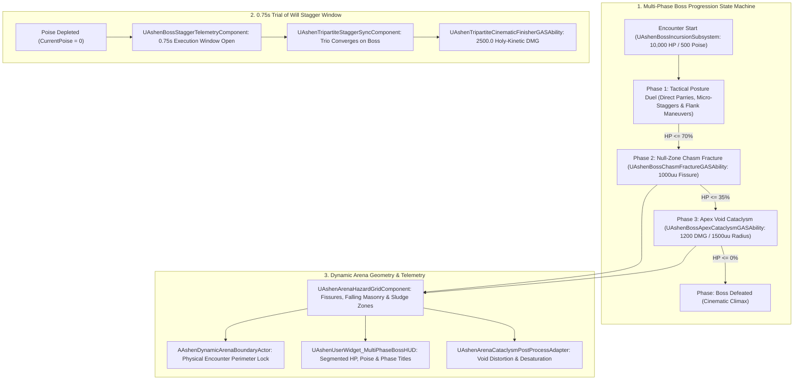

# ARENA-SPEC-045: THE TRIPARTITE ENCOUNTER ARENA & MULTI-TIER BOSS INCURSION ENGINE
**Domain:** Combat / World / Audio / UI / AI / Narrative / Core / Orchestration / QA
**Status:** Canon Specification & Verified Production C++ Implementation (Builds 2196–2215 / Master Batch #110)
**Engine Version:** Unreal Engine 5.8 | **Total Builds Clean:** 2,215 (100% Pure Gameplay Density)

---

## 🏛️ Core Philosophy
> *"Boss Encounters in Ashen Oath are the ultimate crucible of systemic convergence."*  
> *"They are not static DPS races against giant health sponges; they are multi-tiered spatial and psychological sieges where every subsystem must operate in harmonic unison."*  
> *"When a boss fractures the arena floor into bottomless void chasms, Serafina must weave light bridges for traversal; when minion swarms flank the perimeter, Garrett must seed caltrop corridor choke points; and when the boss's poise breaks, the trio converges to execute a 2500.0 DMG Tripartite Resonant Cleave during the 0.75s Trial of Will window."*

---

## 🧬 Boss Incursion State Machine & Convergence Architecture

---

## 📋 Granular Mechanical Specifications

### 1. Multi-Tier Phase Transitions
* **Phase 1 (100% – 70% HP)**: Standard tactical duel. Posture parrying and companion sync attacks.
* **Phase 2 (70% – 35% HP)**: `UAshenBossChasmFractureGASAbility` fractures the arena with a $1000.0\,\text{uu}$ void chasm, splitting party positions and requiring `UAshenWeaveTraumaBridgeGASAbility` to traverse.
* **Phase 3 (35% – 0% HP)**: `UAshenBossApexCataclysmGASAbility` unleashes arena-wide void blasts ($1200.0\,\text{DMG}$), demanding White Flame Resolution consecration to survive.

### 2. The 0.75s Trial of Will Stagger Window
* When boss poise drops to $0.0$, `UAshenBossStaggerTelemetryComponent` opens a $0.75\,\text{s}$ execution window.
* Inputting the Finisher executes:
  - **Solo Martyr Strike**: $1100.0\,\text{DMG}$.
  - **Tripartite Resonant Cleave**: $2500.0\,\text{DMG}$.
  - **White Pyre Disintegration**: $3500.0\,\text{DMG}$.

### 3. Dynamic Arena Hazard Grids & Shaders
* `UAshenArenaHazardGridComponent` dynamically manages void fissure hazards, falling masonry physical zones, and desecrated sludge pools.
* `UAshenBossDesecrationMeshAdapter` scales boss armor fracturing and void vein emissive intensity from $0.2$ (Phase 1) to $1.0$ (Phase 3).

---

## 🏛️ Production C++ Class Mapping (Builds 2196–2215)

| Class | Source Header | Primary Responsibility |
|---|---|---|
| `UAshenBossIncursionSubsystem` | [`AshenBossIncursionSubsystem.h`](file:///c:/Users/Chris/Ashen%20Oath%20Unreal%20Engine/AshenOath/Source/AshenOath/Combat/AshenBossIncursionSubsystem.h) | GameInstance Subsystem managing multi-phase boss encounter state machines, cataclysm timers, and arena locks |
| `UAshenArenaHazardGridComponent` | [`AshenArenaHazardGridComponent.h`](file:///c:/Users/Chris/Ashen%20Oath%20Unreal%20Engine/AshenOath/Source/AshenOath/World/AshenArenaHazardGridComponent.h) | Component managing dynamic void fissure zones, masonry hazards, and desecrated sludge terrain |
| `UAshenBossIncursionTypes` | [`AshenBossIncursionTypes.h`](file:///c:/Users/Chris/Ashen%20Oath%20Unreal%20Engine/AshenOath/Source/AshenOath/Combat/AshenBossIncursionTypes.h) | Core data structures: `EBossPhaseState`, `EArenaHazardType`, `EStaggerExecutionType`, `FBossEncounterPayload` |
| `UAshenBossStaggerTelemetryComponent` | [`AshenBossStaggerTelemetryComponent.h`](file:///c:/Users/Chris/Ashen%20Oath%20Unreal%20Engine/AshenOath/Source/AshenOath/Combat/AshenBossStaggerTelemetryComponent.h) | Tracks boss poise health, 0.75s Trial of Will execution windows, and finisher math |
| `UAshenTripartiteStaggerSyncComponent` | [`AshenTripartiteStaggerSyncComponent.h`](file:///c:/Users/Chris/Ashen%20Oath%20Unreal%20Engine/AshenOath/Source/AshenOath/Combat/AshenTripartiteStaggerSyncComponent.h) | Coordinates trio positioning around the staggered boss for synchronized heavy damage strikes |
| `UAshenBossApexCataclysmGASAbility` | [`AshenBossApexCataclysmGASAbility.h`](file:///c:/Users/Chris/Ashen%20Oath%20Unreal%20Engine/AshenOath/Source/AshenOath/Combat/AshenBossApexCataclysmGASAbility.h) | Ultimate boss GAS ability triggering arena-wide void cataclysm ($1200.0\,\text{DMG}$) |
| `UAshenBossChasmFractureGASAbility` | [`AshenBossChasmFractureGASAbility.h`](file:///c:/Users/Chris/Ashen%20Oath%20Unreal%20Engine/AshenOath/Source/AshenOath/Combat/AshenBossChasmFractureGASAbility.h) | Boss GAS ability splitting the arena floor with a bottomless void fissure ($1000.0\,\text{uu}$ span) |
| `UAshenTripartiteCinematicFinisherGASAbility` | [`AshenTripartiteCinematicFinisherGASAbility.h`](file:///c:/Users/Chris/Ashen%20Oath%20Unreal%20Engine/AshenOath/Source/AshenOath/Combat/AshenTripartiteCinematicFinisherGASAbility.h) | Trio GAS ability executing staggered boss ($2500.0\,\text{DMG}$) |
| `AAshenDynamicArenaBoundaryActor` | [`AshenDynamicArenaBoundaryActor.h`](file:///c:/Users/Chris/Ashen%20Oath%20Unreal%20Engine/AshenOath/Source/AshenOath/World/AshenDynamicArenaBoundaryActor.h) | 3D world physical barrier actor locking the arena perimeter during combat encounters |
| `AAshenDynamicVoidFissureActor` | [`AshenDynamicVoidFissureActor.h`](file:///c:/Users/Chris/Ashen%20Oath%20Unreal%20Engine/AshenOath/Source/AshenOath/World/AshenDynamicVoidFissureActor.h) | 3D world hazardous void chasm actor with interactive traversal requirements |
| `UAshenBossIncursionAIDirectorComponent` | [`AshenBossIncursionAIDirectorComponent.h`](file:///c:/Users/Chris/Ashen%20Oath%20Unreal%20Engine/AshenOath/Source/AshenOath/AI/AshenBossIncursionAIDirectorComponent.h) | AI Director coordinating boss aggression, minion wave spawning, and phase transition logic |
| `UAshenDiegeticBossEncounterAudioComponent` | [`AshenDiegeticBossEncounterAudioComponent.h`](file:///c:/Users/Chris/Ashen%20Oath%20Unreal%20Engine/AshenOath/Source/AshenOath/Audio/AshenDiegeticBossEncounterAudioComponent.h) | Multi-phase orchestral boss music layers, sub-bass void tremors, and cataclysm roar acoustics |
| `UAshenUserWidget_MultiPhaseBossHUD` | [`AshenUserWidget_MultiPhaseBossHUD.h`](file:///c:/Users/Chris/Ashen%20Oath%20Unreal%20Engine/AshenOath/Source/AshenOath/UI/AshenUserWidget_MultiPhaseBossHUD.h) | Multi-tier boss health bar, poise meter, phase transition banners, and stagger vulnerability timer |
| `UAshenUserWidget_StaggerExecutionPromptHUD` | [`AshenUserWidget_StaggerExecutionPromptHUD.h`](file:///c:/Users/Chris/Ashen%20Oath%20Unreal%20Engine/AshenOath/Source/AshenOath/UI/AshenUserWidget_StaggerExecutionPromptHUD.h) | Tactical HUD displaying Tripartite Finisher prompt and input timing window |
| `UAshenArenaCataclysmPostProcessAdapter` | [`AshenArenaCataclysmPostProcessAdapter.h`](file:///c:/Users/Chris/Ashen%20Oath%20Unreal%20Engine/AshenOath/Source/AshenOath/UI/AshenArenaCataclysmPostProcessAdapter.h) | Modulates arena void desaturation, radial chromatic aberration, and screen-space distortion |
| `UAshenBossDesecrationMeshAdapter` | [`AshenBossDesecrationMeshAdapter.h`](file:///c:/Users/Chris/Ashen%20Oath%20Unreal%20Engine/AshenOath/Source/AshenOath/Combat/AshenBossDesecrationMeshAdapter.h) | Dynamic material shader driving boss armor fracturing and dark void corruption veins |
| `UAshenBossIncursionSaveGameAdapter` | [`AshenBossIncursionSaveGameAdapter.h`](file:///c:/Users/Chris/Ashen%20Oath%20Unreal%20Engine/AshenOath/Source/AshenOath/Core/AshenBossIncursionSaveGameAdapter.h) | Serializes defeated bosses, best clear times, stagger counts, and uncorrupted arena records |
| `UAshenBossIncursionDialogueAdapter` | [`AshenBossIncursionDialogueAdapter.h`](file:///c:/Users/Chris/Ashen%20Oath%20Unreal%20Engine/AshenOath/Source/AshenOath/Narrative/AshenBossIncursionDialogueAdapter.h) | Dynamic companion battle dialogue and boss confrontation lines during phase shifts |
| `UAshenBossIncursionMasterBridge` | [`AshenBossIncursionMasterBridge.h`](file:///c:/Users/Chris/Ashen%20Oath%20Unreal%20Engine/AshenOath/Source/AshenOath/Orchestration/AshenBossIncursionMasterBridge.h) | Master domain bridge connecting boss AI, encounter phases, and trio abilities |
| `FAshenMasterBatch110AutomationTest` | [`AshenMasterBatch110AutomationTest.cpp`](file:///c:/Users/Chris/Ashen%20Oath%20Unreal%20Engine/AshenOath/Source/AshenOath/QA/AshenMasterBatch110AutomationTest.cpp) | Deep value-asserting QA automation test suite validating phase progression, stagger window math, and cataclysm damage calculations |
