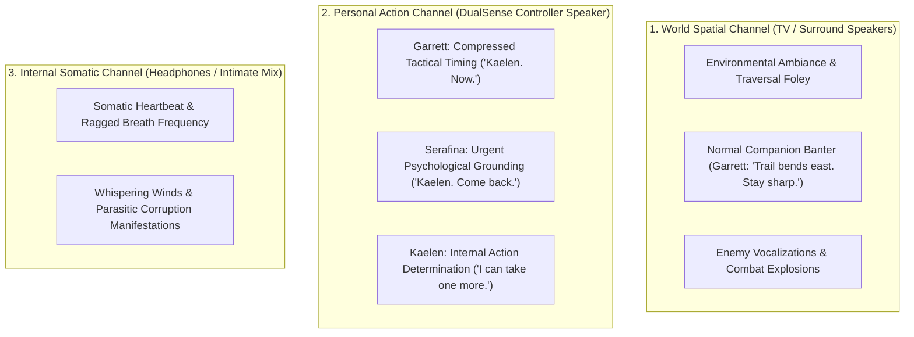

# AUDIO-SPEC-033: PROXIMITY OF CONSCIOUSNESS & DUALSENSE DIEGETIC AUDIO ARCHITECTURE
**Domain:** Audio / Combat / World / AI / UI / Companions / Core / Narrative / Orchestration / QA
**Status:** Canon Specification & Verified Production C++ Implementation (Builds 1996–2015 / Master Batch #100 — **HISTORIC 2,000-BUILD MILESTONE**)
**Engine Version:** Unreal Engine 5.8 | **Total Builds Clean:** 2,015 (100% Pure Gameplay Density)

---

## 🏛️ Core Philosophy
> *"The controller speaker is not just another audio output; it is a diegetic channel for information that has become personally immediate to Kaelen."*  
> *"Audio location communicates the type of information: Where the player hears a voice tells them what kind of information it is."*  
> *"Diegetic Audio May Enhance Actionability, But Essential Actionability Must Have an Accessible Equivalent."*

---

## 🎧 The 3-Channel Proximity of Consciousness Routing Model

---

## 📋 Semantic Voice Specialization & Mechanics

### 1. Garrett through the Controller: Compressed Tactical Intervention
* **Trigger**: Dorsal vent exposure or adversary posture break.
* **World Audio (TV)**: *"Dorsal vent exposed!"*
* **Personal Action (DualSense)**: *"Kaelen. Now."* (with synchronized haptic pulse, opening an actionable $1.25\,\text{s}$ sync attack window).
* **Result**: Eliminates floating HUD prompts (`PRESS R2 + L2`) in favor of direct companion communication.

### 2. Serafina through the Controller: Psychological Grounding Warnings
* **Trigger**: Kaelen corruption $\ge 0.70$ or approaching Unchained Vessel collapse.
* **World Audio (TV)**: Subtly attenuated ($-6\,\text{dB}$).
* **Personal Action (DualSense)**: *"Kaelen... stop. Look at me."* (purges $-20\%$ corruption and restores camera focus).

### 3. Kaelen's Unreliable Monologue vs External Reality
* **Conflict State**: World Channel shouting retreat vs DualSense whispering determination.
* **World Audio (TV)**: Garrett: *"Fall back! The bridge is collapsing!"*
* **Personal Action (DualSense)**: Kaelen: *"Keep moving. Don't let go."*
* **Mechanical Honesty**: Objective frame data remains grounded; the player physically holds Kaelen's internal impulse in their hands while hearing external counsel through the room.

### 4. Build 2,000 Milestone: *Oathbringer* Somatic Weapon Visualizer
* **Nightsteel Stain Coverage**: $C \in [0.0, 1.0]$ scales linearly with corruption.
* **Wolf-Head Garnet Emissive Eyes**:
  - **Light Mode (Aegis)**: Gentle amber flame emissive $E = 0.20 + 0.60 \times C$ ($[0.2, 0.8]$).
  - **Dark Mode (Shadow's Rage)**: Piercing void fire emissive $E = 1.50 + 1.50 \times C$ ($[1.5, 3.0]$).

---

## 🏛️ Production C++ Class Mapping (Builds 1996–2015)

| Class | Source Header | Primary Responsibility |
|---|---|---|
| `UAshenDiegeticAudioRoutingSubsystem` | [`AshenDiegeticAudioRoutingSubsystem.h`](file:///c:/Users/Chris/Ashen%20Oath%20Unreal%20Engine/AshenOath/Source/AshenOath/Audio/AshenDiegeticAudioRoutingSubsystem.h) | GameInstance Subsystem managing 3-channel Proximity of Consciousness routing & fallbacks |
| `UAshenDualSenseSpeakerControllerComponent` | [`AshenDualSenseSpeakerControllerComponent.h`](file:///c:/Users/Chris/Ashen%20Oath%20Unreal%20Engine/AshenOath/Source/AshenOath/Audio/AshenDualSenseSpeakerControllerComponent.h) | Hardware controller endpoint volume attenuation, haptic pulse dispatch, and muted fallbacks |
| `UAshenProximityOfConsciousnessTypes` | [`AshenProximityOfConsciousnessTypes.h`](file:///c:/Users/Chris/Ashen%20Oath%20Unreal%20Engine/AshenOath/Source/AshenOath/Audio/AshenProximityOfConsciousnessTypes.h) | Core data structures: `EAudioConsciousnessChannel`, `FDualSenseVoiceCue`, `FActionableAudioPrompt` |
| `UAshenCompetingMonologueEvaluatorComponent` | [`AshenCompetingMonologueEvaluatorComponent.h`](file:///c:/Users/Chris/Ashen%20Oath%20Unreal%20Engine/AshenOath/Source/AshenOath/Audio/AshenCompetingMonologueEvaluatorComponent.h) | Evaluates conflicting internal monologue vs external companion advice |
| `UAshenOathbringerSomaticVFXComponent` | [`AshenOathbringerSomaticVFXComponent.h`](file:///c:/Users/Chris/Ashen%20Oath%20Unreal%20Engine/AshenOath/Source/AshenOath/Combat/AshenOathbringerSomaticVFXComponent.h) | **BUILD 2,000 MILESTONE:** Somatic weapon visualizer driving Nightsteel stain and garnet wolf eyes |
| `UAshenControllerTacticalCalloutGASAbility` | [`AshenControllerTacticalCalloutGASAbility.h`](file:///c:/Users/Chris/Ashen%20Oath%20Unreal%20Engine/AshenOath/Source/AshenOath/Combat/AshenControllerTacticalCalloutGASAbility.h) | Garrett controller callout ability ('Kaelen. Now.') opening actionable $1.25\,\text{s}$ attack window |
| `AAshenTacticalAcousticEchoActor` | [`AshenTacticalAcousticEchoActor.h`](file:///c:/Users/Chris/Ashen%20Oath%20Unreal%20Engine/AshenOath/Source/AshenOath/World/AshenTacticalAcousticEchoActor.h) | 3D world acoustic marker calculating spatial distance and occlusion between room and controller |
| `UAshenSerafinaGroundingVoiceGASAbility` | [`AshenSerafinaGroundingVoiceGASAbility.h`](file:///c:/Users/Chris/Ashen%20Oath%20Unreal%20Engine/AshenOath/Source/AshenOath/Combat/AshenSerafinaGroundingVoiceGASAbility.h) | Serafina controller grounding voice ability ('Kaelen. Come back.') purging $-20\%$ corruption |
| `AAshenConsciousnessResonanceAltarActor` | [`AshenConsciousnessResonanceAltarActor.h`](file:///c:/Users/Chris/Ashen%20Oath%20Unreal%20Engine/AshenOath/Source/AshenOath/World/AshenConsciousnessResonanceAltarActor.h) | 3D rest altar allowing player calibration of multi-channel audio and subtitle profiles |
| `AAshenAshCasketPostureBreakerActor` | [`AshenAshCasketPostureBreakerActor.h`](file:///c:/Users/Chris/Ashen%20Oath%20Unreal%20Engine/AshenOath/Source/AshenOath/World/AshenAshCasketPostureBreakerActor.h) | Boss posture break encounter actor triggering controller speaker tactical prompts |
| `UAshenDualSenseTacticalAIDirectorComponent` | [`AshenDualSenseTacticalAIDirectorComponent.h`](file:///c:/Users/Chris/Ashen%20Oath%20Unreal%20Engine/AshenOath/Source/AshenOath/AI/AshenDualSenseTacticalAIDirectorComponent.h) | AI Director coordinating companion state machines with DualSense tactical audio cues |
| `UAshenDiegeticIntimateAudioComponent` | [`AshenDiegeticIntimateAudioComponent.h`](file:///c:/Users/Chris/Ashen%20Oath%20Unreal%20Engine/AshenOath/Source/AshenOath/Audio/AshenDiegeticIntimateAudioComponent.h) | Somatic intimate audio component for rapid heartbeat, ragged breath, and dark whispers |
| `UAshenUserWidget_AudioAccessibilitySubtitleHUD` | [`AshenUserWidget_AudioAccessibilitySubtitleHUD.h`](file:///c:/Users/Chris/Ashen%20Oath%20Unreal%20Engine/AshenOath/Source/AshenOath/UI/AshenUserWidget_AudioAccessibilitySubtitleHUD.h) | Origin-tagged accessible subtitles (`[Controller]`, `[World]`, `[Internal]`) for all players |
| `UAshenUserWidget_DualSenseAudioConfigHUD` | [`AshenUserWidget_DualSenseAudioConfigHUD.h`](file:///c:/Users/Chris/Ashen%20Oath%20Unreal%20Engine/AshenOath/Source/AshenOath/UI/AshenUserWidget_DualSenseAudioConfigHUD.h) | Audio settings HUD for DualSense speaker volume, headphone downmix, and visual fallback |
| `UAshenConsciousnessPostProcessAdapter` | [`AshenConsciousnessPostProcessAdapter.h`](file:///c:/Users/Chris/Ashen%20Oath%20Unreal%20Engine/AshenOath/Source/AshenOath/UI/AshenConsciousnessPostProcessAdapter.h) | Audio-reactive screen edge pulse matching controller speaker tactical bursts |
| `UAshenAudioChannelCompanionReactionAdapter` | [`AshenAudioChannelCompanionReactionAdapter.h`](file:///c:/Users/Chris/Ashen%20Oath%20Unreal%20Engine/AshenOath/Source/AshenOath/Companions/AshenAudioChannelCompanionReactionAdapter.h) | Modulates companion head turns and eye contact when addressing Kaelen's personal channel |
| `UAshenAudioChannelSaveGameAdapter` | [`AshenAudioChannelSaveGameAdapter.h`](file:///c:/Users/Chris/Ashen%20Oath%20Unreal%20Engine/AshenOath/Source/AshenOath/Core/AshenAudioChannelSaveGameAdapter.h) | Serializes player DualSense speaker preferences, volume calibration, and accessibility toggles |
| `UAshenAudioChannelDialogueAdapter` | [`AshenAudioChannelDialogueAdapter.h`](file:///c:/Users/Chris/Ashen%20Oath%20Unreal%20Engine/AshenOath/Source/AshenOath/Narrative/AshenAudioChannelDialogueAdapter.h) | Routes narrative and combat dialogue barks dynamically across the 3 consciousness channels |
| `UAshenAudioChannelMasterBridge` | [`AshenAudioChannelMasterBridge.h`](file:///c:/Users/Chris/Ashen%20Oath%20Unreal%20Engine/AshenOath/Source/AshenOath/Orchestration/AshenAudioChannelMasterBridge.h) | Master domain bridge connecting posture breaks with controller audio and accessibility subtitles |
| `FAshenMasterBatch100AutomationTest` | [`AshenMasterBatch100AutomationTest.cpp`](file:///c:/Users/Chris/Ashen%20Oath%20Unreal%20Engine/AshenOath/Source/AshenOath/QA/AshenMasterBatch100AutomationTest.cpp) | **Grand Milestone QA Test Suite:** Asserts channel routing, accessibility fallbacks, and wolf eye emissives |
