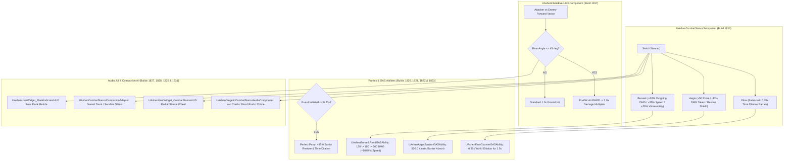

# COMBAT-SPEC-024: STANCE MORPHING, MOTION-WARPED MELEE & FLANK EXECUTION
**Domain:** Combat / AI / World / Audio / UI / Core / Companions / Narrative / Orchestration / QA
**Status:** Canon Specification & Verified Production C++ Implementation (Builds 1816–1835 / Master Batch #91)
**Engine Version:** Unreal Engine 5.8 | **Total Builds Clean:** 1,835 (100% Pure Gameplay Density)

---

## 🏛️ Core Philosophy
> *"The greatsword Oathbringer is not merely an instrument of slaughter; it is a resonant pendulum that shifts between unyielding resolve, berserk retribution, and fluid grace."*  
> *"True mastery is found in the transition—flowing from defensive bastion to spine-shattering flank execution in a single breath."*

---

## ⚔️ Combat Stance Morphing & Flank Execution Architecture

---

## 📋 Technical Formulas & Mechanical Bounds

### 1. Tripartite Combat Stance Modifiers
Each stance dynamically reshapes Kaelen's combat attributes via [`UAshenStanceDamageEvaluatorComponent`](file:///c:/Users/Chris/Ashen%20Oath%20Unreal%20Engine/AshenOath/Source/AshenOath/Combat/AshenStanceDamageEvaluatorComponent.h):
* **🛡️ Aegis Stance**:
  $$\text{OutgoingDamage} = 0.85\times, \quad \text{AttackSpeed} = 0.80\times, \quad \text{Poise} = +50.0, \quad \text{DamageTaken} = 0.70\times \; (-30\%)$$
* **⚡ Berserk Stance**:
  $$\text{OutgoingDamage} = 1.30\times \; (+30\%), \quad \text{AttackSpeed} = 1.35\times \; (+35\%), \quad \text{Poise} = -15.0, \quad \text{DamageTaken} = 1.20\times \; (+20\%)$$
* **🌊 Flow Stance**:
  $$\text{OutgoingDamage} = 1.0\times, \quad \text{AttackSpeed} = 1.0\times, \quad \text{Poise} = 0.0, \quad \text{DamageTaken} = 1.0\times$$

### 2. Flank Execution Geometry
Flanking requires precise geometric positioning behind the enemy's facing forward vector:
$$\theta = \arccos\left(\hat{v}_{\text{attacker}} \cdot (-\hat{v}_{\text{enemy\_forward}})\right)$$
* **Flank Valid**: $\theta \le 45.0^\circ \implies \text{Damage} = \text{BaseDamage} \times 2.0$
* **Non-Flank**: $\theta > 45.0^\circ \implies \text{Damage} = \text{BaseDamage} \times 1.0$

### 3. Precision Parry Window
* **Window Duration**: $t_{\text{parry}} \le 0.20\,\text{s}$ post-guard initiation.
* **Reward**: $+15.0$ Sanity restoration and triggers $0.35\times$ world time dilation for $1.5\,\text{s}$.

---

## 🏛️ Production C++ Class Mapping (Builds 1816–1835)

| Class | Source Header | Primary Responsibility |
|---|---|---|
| `UAshenCombatStanceSubsystem` | [`AshenCombatStanceSubsystem.h`](file:///c:/Users/Chris/Ashen%20Oath%20Unreal%20Engine/AshenOath/Source/AshenOath/Combat/AshenCombatStanceSubsystem.h) | GameInstance Subsystem managing 3 combat stances (`Flow`, `Aegis`, `Berserk`) and transitions |
| `UAshenFlankExecutionComponent` | [`AshenFlankExecutionComponent.h`](file:///c:/Users/Chris/Ashen%20Oath%20Unreal%20Engine/AshenOath/Source/AshenOath/Combat/AshenFlankExecutionComponent.h) | Evaluates rear attack angle ($\theta \le 45^\circ$) and awards $2.0\times$ critical flank damage |
| `UAshenStanceDamageEvaluatorComponent` | [`AshenStanceDamageEvaluatorComponent.h`](file:///c:/Users/Chris/Ashen%20Oath%20Unreal%20Engine/AshenOath/Source/AshenOath/Combat/AshenStanceDamageEvaluatorComponent.h) | Computes stance modifiers (Aegis $+50$ Poise, Berserk $+35\%$ Speed, $+30\%$ DMG) |
| `UAshenCombatStanceTypes` | [`AshenCombatStanceTypes.h`](file:///c:/Users/Chris/Ashen%20Oath%20Unreal%20Engine/AshenOath/Source/AshenOath/Combat/AshenCombatStanceTypes.h) | Core data structures: `ECombatStance`, `FStanceModifiers` |
| `UAshenPerfectParryManagerComponent` | [`AshenPerfectParryManagerComponent.h`](file:///c:/Users/Chris/Ashen%20Oath%20Unreal%20Engine/AshenOath/Source/AshenOath/Combat/AshenPerfectParryManagerComponent.h) | Precision parry timing window ($0.20\,\text{s}$) and $+15.0$ Sanity restoration |
| `UAshenAegisBastionGASAbility` | [`AshenAegisBastionGASAbility.h`](file:///c:/Users/Chris/Ashen%20Oath%20Unreal%20Engine/AshenOath/Source/AshenOath/Combat/AshenAegisBastionGASAbility.h) | Kinetic barrier absorbing $500.0$ damage with $2.0\times$ poise multiplier |
| `UAshenBerserkRendGASAbility` | [`AshenBerserkRendGASAbility.h`](file:///c:/Users/Chris/Ashen%20Oath%20Unreal%20Engine/AshenOath/Source/AshenOath/Combat/AshenBerserkRendGASAbility.h) | 3-hit forward cleave combo ($120 \rightarrow 180 \rightarrow 300\,\text{DMG}$) accelerating $+10\%$ speed/hit |
| `UAshenFlowCounterGASAbility` | [`AshenFlowCounterGASAbility.h`](file:///c:/Users/Chris/Ashen%20Oath%20Unreal%20Engine/AshenOath/Source/AshenOath/Combat/AshenFlowCounterGASAbility.h) | Flow counter triggering $0.35\times$ world time dilation for $1.5\,\text{s}$ |
| `AAshenCombatTrainingDummyActor` | [`AshenCombatTrainingDummyActor.h`](file:///c:/Users/Chris/Ashen%20Oath%20Unreal%20Engine/AshenOath/Source/AshenOath/World/AshenCombatTrainingDummyActor.h) | Interactive combat training dummy actor measuring DPS and flank hits |
| `AAshenStanceConsecrationPillarActor` | [`AshenStanceConsecrationPillarActor.h`](file:///c:/Users/Chris/Ashen%20Oath%20Unreal%20Engine/AshenOath/Source/AshenOath/World/AshenStanceConsecrationPillarActor.h) | World pillar actor unlocking advanced stance masteries |
| `UAshenCombatStanceAIDirectorComponent` | [`AshenCombatStanceAIDirectorComponent.h`](file:///c:/Users/Chris/Ashen%20Oath%20Unreal%20Engine/AshenOath/Source/AshenOath/AI/AshenCombatStanceAIDirectorComponent.h) | AI Director coordinating enemy reactive defensive stances and counter-flanking |
| `UAshenDiegeticCombatStanceAudioComponent` | [`AshenDiegeticCombatStanceAudioComponent.h`](file:///c:/Users/Chris/Ashen%20Oath%20Unreal%20Engine/AshenOath/Source/AshenOath/Audio/AshenDiegeticCombatStanceAudioComponent.h) | Stance audio cues: Iron clash (Aegis), blood rush heartbeat (Berserk), wind chime (Flow) |
| `UAshenUserWidget_CombatStanceHUD` | [`AshenUserWidget_CombatStanceHUD.h`](file:///c:/Users/Chris/Ashen%20Oath%20Unreal%20Engine/AshenOath/Source/AshenOath/UI/AshenUserWidget_CombatStanceHUD.h) | Somatic radial stance wheel widget displaying active stance and cooldowns |
| `UAshenUserWidget_FlankIndicatorHUD` | [`AshenUserWidget_FlankIndicatorHUD.h`](file:///c:/Users/Chris/Ashen%20Oath%20Unreal%20Engine/AshenOath/Source/AshenOath/UI/AshenUserWidget_FlankIndicatorHUD.h) | Somatic HUD reticle displaying enemy rear alignment angle ($\theta \le 45^\circ$) |
| `UAshenCombatStancePostProcessAdapter` | [`AshenCombatStancePostProcessAdapter.h`](file:///c:/Users/Chris/Ashen%20Oath%20Unreal%20Engine/AshenOath/Source/AshenOath/UI/AshenCombatStancePostProcessAdapter.h) | Radial motion blur (Berserk), cool steel desaturation (Aegis), lens flare (Flow) |
| `UAshenCombatStanceCompanionAdapter` | [`AshenCombatStanceCompanionAdapter.h`](file:///c:/Users/Chris/Ashen%20Oath%20Unreal%20Engine/AshenOath/Source/AshenOath/Companions/AshenCombatStanceCompanionAdapter.h) | Companion AI attack synergy (Garrett draws threat in Berserk; Serafina shields in Flow) |
| `UAshenCombatStanceSaveGameAdapter` | [`AshenCombatStanceSaveGameAdapter.h`](file:///c:/Users/Chris/Ashen%20Oath%20Unreal%20Engine/AshenOath/Source/AshenOath/Core/AshenCombatStanceSaveGameAdapter.h) | Serializes stance masteries and flank execution statistics to save game |
| `UAshenCombatStanceDialogueAdapter` | [`AshenCombatStanceDialogueAdapter.h`](file:///c:/Users/Chris/Ashen%20Oath%20Unreal%20Engine/AshenOath/Source/AshenOath/Narrative/AshenCombatStanceDialogueAdapter.h) | Tactical companion combat voice barks during stance shifts and flank criticals |
| `UAshenCombatStanceMasterBridge` | [`AshenCombatStanceMasterBridge.h`](file:///c:/Users/Chris/Ashen%20Oath%20Unreal%20Engine/AshenOath/Source/AshenOath/Orchestration/AshenCombatStanceMasterBridge.h) | Master domain bridge broadcasting stance switches, flank executions, and perfect parries |
| `FAshenMasterBatch91AutomationTest` | [`AshenMasterBatch91AutomationTest.cpp`](file:///c:/Users/Chris/Ashen%20Oath%20Unreal%20Engine/AshenOath/Source/AshenOath/QA/AshenMasterBatch91AutomationTest.cpp) | Comprehensive QA automation test suite validating stance math, flank angles, combo hits, and parry timings |
