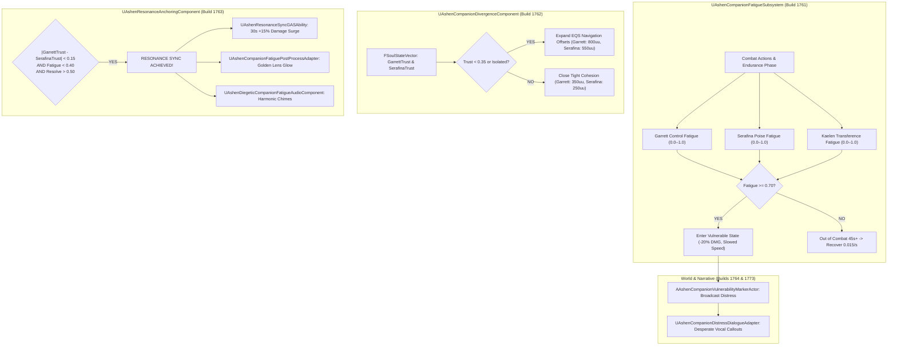

# COMPANION-SPEC-021: COMPANION TRUST DIVERGENCE, TRIPARTITE FATIGUE & RESONANCE ANCHORING
**Domain:** Companions / Soul / Combat / World / Audio / UI / Core / Narrative / Orchestration / QA
**Status:** Canon Specification & Verified Production C++ Implementation (Builds 1756–1775 / Master Batch #88)
**Engine Version:** Unreal Engine 5.8 | **Total Builds Clean:** 1,775

---

## 🏛️ Core Philosophy
> *"Companions in Ashen Oath are not immortal cheerleaders or mindless drones. They are sundered souls carrying their own emotional burdens."*  
> *"When the trio drifts apart, physical space expands, and combat falters. When the trio breathes as one, their resonance fractures reality itself."*

---

## 🤝 Companion Trust Divergence & Tripartite Fatigue Architecture

---

## 📋 Technical Formulas & Mechanical Bounds

### 1. Tripartite Fatigue Accumulation & Recovery
* Accumulates dynamically during high-intensity combat actions:
  $$\text{Fatigue}_{t} = \text{Clamp}\left(\text{Fatigue}_{t-1} + \Delta\text{Intensity},\, 0.0,\, 1.0\right)$$
* Recovers passively during the `WITNESS` phase when out of combat for $45+\,\text{seconds}$:
  $$\Delta\text{Recovery} = 0.015 \times \Delta t$$
* At $\text{Fatigue} \ge 0.70$, companions enter the `Vulnerable` state (reduced outgoing damage by $-20\%$, support spell casting locked if $\text{Fatigue} \ge 0.50$).

### 2. Companion Divergence & EQS Navigation Offsets
* Navigation follow offsets scale dynamically with trust and isolation:
  $$\text{Offset}_{\text{Garrett}} = \begin{cases} 800\,\text{uu} & \text{if } \text{Trust} < 0.35 \lor \text{Isolated} \\ 350\,\text{uu} & \text{if } \text{Trust} \ge 0.35 \end{cases}$$
  $$\text{Offset}_{\text{Serafina}} = \begin{cases} 550\,\text{uu} & \text{if } \text{Trust} < 0.35 \lor \text{Isolated} \\ 250\,\text{uu} & \text{if } \text{Trust} \ge 0.35 \end{cases}$$

### 3. Resonance Anchoring & Sync Trigger
* Resonance Sync activates when all three conditions evaluate true:
  $$\text{ResonanceSync} = \left(|\text{SerafinaTrust} - \text{GarrettTrust}| < 0.15\right) \land \left(\text{Fatigue}_{\text{Garrett}} < 0.40 \land \text{Fatigue}_{\text{Serafina}} < 0.40\right) \land \left(\text{Resolve} > 0.50\right)$$
* When active, triggers [`UAshenResonanceSyncGASAbility`](file:///c:/Users/Chris/Ashen%20Oath%20Unreal%20Engine/AshenOath/Source/AshenOath/Combat/AshenResonanceSyncGASAbility.h) granting a **$+15\%$ damage surge for $30\,\text{seconds}$**.

---

## 🏛️ Production C++ Class Mapping (Builds 1756–1775)

| Class | Source Header | Primary Responsibility |
|---|---|---|
| `UAshenCompanionFatigueAuditor` | [`AshenCompanionFatigueAuditor.h`](file:///c:/Users/Chris/Ashen%20Oath%20Unreal%20Engine/AshenOath/Source/AshenOathEditor/Tooling/AshenCompanionFatigueAuditor.h) | Audits tripartite fatigue rates, recovery timers, and vulnerability thresholds |
| `UAshenDivergencePathingValidator` | [`AshenDivergencePathingValidator.h`](file:///c:/Users/Chris/Ashen%20Oath%20Unreal%20Engine/AshenOath/Source/AshenOathEditor/Tooling/AshenDivergencePathingValidator.h) | Validates EQS spatial navigation offsets (800uu/550uu) |
| `UAshenResonanceSyncStressTester` | [`AshenResonanceSyncStressTester.h`](file:///c:/Users/Chris/Ashen%20Oath%20Unreal%20Engine/AshenOath/Source/AshenOathEditor/Tooling/AshenResonanceSyncStressTester.h) | Stress tests 400 rapid resonance sync evaluations |
| `UAshenProductFilterCompanionGatekeeper` | [`AshenProductFilterCompanionGatekeeper.h`](file:///c:/Users/Chris/Ashen%20Oath%20Unreal%20Engine/AshenOath/Source/AshenOathEditor/Tooling/AshenProductFilterCompanionGatekeeper.h) | Enforces safety gates on near-death (<15% HP) distress imprints |
| `UAshenCompanionFatigueSubsystem` | [`AshenCompanionFatigueSubsystem.h`](file:///c:/Users/Chris/Ashen%20Oath%20Unreal%20Engine/AshenOath/Source/AshenOath/Companions/AshenCompanionFatigueSubsystem.h) | GameInstance Subsystem managing Tripartite Fatigue & recovery |
| `UAshenCompanionDivergenceComponent` | [`AshenCompanionDivergenceComponent.h`](file:///c:/Users/Chris/Ashen%20Oath%20Unreal%20Engine/AshenOath/Source/AshenOath/Companions/AshenCompanionDivergenceComponent.h) | Modulates follow distance and flanking offsets based on trust |
| `UAshenResonanceAnchoringComponent` | [`AshenResonanceAnchoringComponent.h`](file:///c:/Users/Chris/Ashen%20Oath%20Unreal%20Engine/AshenOath/Source/AshenOath/Companions/AshenResonanceAnchoringComponent.h) | Evaluates emotional sync and grants +15% Resonance damage |
| `AAshenCompanionVulnerabilityMarkerActor` | [`AshenCompanionVulnerabilityMarkerActor.h`](file:///c:/Users/Chris/Ashen%20Oath%20Unreal%20Engine/AshenOath/Source/AshenOath/World/AshenCompanionVulnerabilityMarkerActor.h) | World marker broadcasting tactical companion distress |
| `UAshenResonanceSyncGASAbility` | [`AshenResonanceSyncGASAbility.h`](file:///c:/Users/Chris/Ashen%20Oath%20Unreal%20Engine/AshenOath/Source/AshenOath/Combat/AshenResonanceSyncGASAbility.h) | GAS ability applying 30s +15% damage surge and blade flourish |
| `UAshenDiegeticCompanionFatigueAudioComponent` | [`AshenDiegeticCompanionFatigueAudioComponent.h`](file:///c:/Users/Chris/Ashen%20Oath%20Unreal%20Engine/AshenOath/Source/AshenOath/Audio/AshenDiegeticCompanionFatigueAudioComponent.h) | Heavy breathing audio, fatigue grunts, and resonance chimes |
| `UAshenUserWidget_CompanionFatigueHUD` | [`AshenUserWidget_CompanionFatigueHUD.h`](file:///c:/Users/Chris/Ashen%20Oath%20Unreal%20Engine/AshenOath/Source/AshenOath/UI/AshenUserWidget_CompanionFatigueHUD.h) | Displays tripartite companion fatigue meters on HUD |
| `UAshenUserWidget_ResonanceSyncHUD` | [`AshenUserWidget_ResonanceSyncHUD.h`](file:///c:/Users/Chris/Ashen%20Oath%20Unreal%20Engine/AshenOath/Source/AshenOath/UI/AshenUserWidget_ResonanceSyncHUD.h) | Displays active Resonance Sync window and remaining time |
| `UAshenCompanionFatiguePostProcessAdapter` | [`AshenCompanionFatiguePostProcessAdapter.h`](file:///c:/Users/Chris/Ashen%20Oath%20Unreal%20Engine/AshenOath/Source/AshenOath/UI/AshenCompanionFatiguePostProcessAdapter.h) | Heartbeat pulse for fatigue and golden bloom for resonance |
| `UAshenCompanionTrustEventAdapter` | [`AshenCompanionTrustEventAdapter.h`](file:///c:/Users/Chris/Ashen%20Oath%20Unreal%20Engine/AshenOath/Source/AshenOath/Companions/AshenCompanionTrustEventAdapter.h) | Dispatches granular trust deltas (+0.05, -0.08, +0.03) |
| `UAshenCompanionFatigueSaveGameAdapter` | [`AshenCompanionFatigueSaveGameAdapter.h`](file:///c:/Users/Chris/Ashen%20Oath%20Unreal%20Engine/AshenOath/Source/AshenOath/Core/AshenCompanionFatigueSaveGameAdapter.h) | Serializes companion fatigue levels and resonance history |
| `UAshenCompanionDistressDialogueAdapter` | [`AshenCompanionDistressDialogueAdapter.h`](file:///c:/Users/Chris/Ashen%20Oath%20Unreal%20Engine/AshenOath/Source/AshenOath/Narrative/AshenCompanionDistressDialogueAdapter.h) | Dynamic vocal callouts on companion vulnerability or low HP |
| `UAshenCompanionFatigueMasterBridge` | [`AshenCompanionFatigueMasterBridge.h`](file:///c:/Users/Chris/Ashen%20Oath%20Unreal%20Engine/AshenOath/Source/AshenOath/Orchestration/AshenCompanionFatigueMasterBridge.h) | Master bridge broadcasting fatigue and resonance events |
| `UAshenMilestone1775MasterSynthesisOrchestrator`| [`AshenMilestone1775MasterSynthesisOrchestrator.h`](file:///c:/Users/Chris/Ashen%20Oath%20Unreal%20Engine/AshenOath/Source/AshenOath/Orchestration/AshenMilestone1775MasterSynthesisOrchestrator.h) | Master Milestone 1775 World Subsystem & QA Suite |
