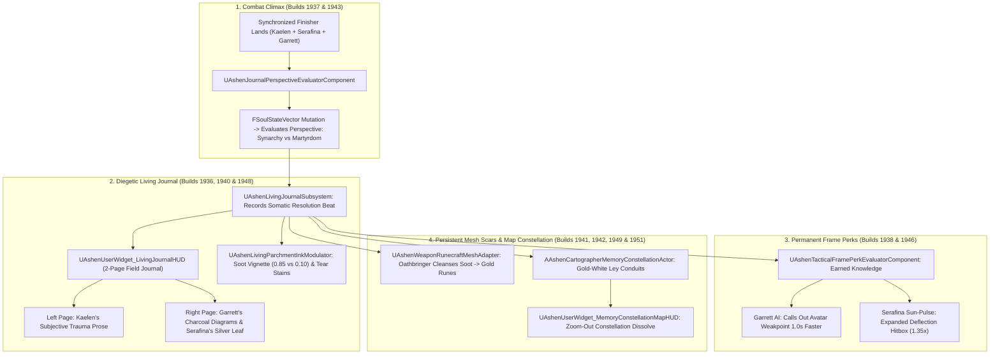

# CONSEQUENCE-SPEC-030: THE LIVING JOURNAL & PERSISTENT SOMATIC CONSEQUENCE
**Domain:** Narrative / Combat / World / AI / Audio / UI / Core / Orchestration / QA
**Status:** Canon Specification & Verified Production C++ Implementation (Builds 1936–1955 / Master Batch #97)
**Engine Version:** Unreal Engine 5.8 | **Total Builds Clean:** 1,955 (100% Pure Gameplay Density)

---

## 🏛️ Core Philosophy
> *"Combat finishers must not evaporate the moment victory is achieved. The 3.0-second execution must bridge into the 40-hour persistent narrative loop."*  
> *"Through multi-author subjective journal entries, earned tactical frame perks, physical weapon rune cleansing, and the Cartographer's Memory Constellation, every fight permanently alters the world."*

---

## 📜 The Closed-Loop Engine of Consequence Architecture

---

## 📋 Technical Formulas & Mechanical Bounds

### 1. Resolution Perspective Evaluation
* **Tripartite Synarchy**:
  $$\text{Perspective} = \text{TripartiteSynarchy} \iff (\text{bUsedSyncFinisher} = \text{true}) \land (\text{MutualTrust} \ge 0.60)$$
* **Solitary Martyrdom**:
  $$\text{Perspective} = \text{SolitaryMartyrdom} \iff (\text{bUsedSyncFinisher} = \text{false}) \lor (\text{MutualTrust} < 0.60)$$

### 2. Tactical Frame Advantage Perks
* **Garrett Weakpoint Callout**: $\Delta t = 1.0\,\text{s}$ earlier anticipation callout.
* **Serafina Sun-Pulse Deflection Hitbox**:
  $$\text{AdjustedRadius} = \text{BaseRadius} \times 1.35 \quad (+35\% \text{ expanded hitbox})$$
* **Passive Combat Stagger Advantage**: $+20\%$ stance stagger multiplier ($1.20\times$) and $-15\%$ damage taken ($0.85\times$) against studied archetypes.

### 3. Parchment Ink & Material Modulation
* **Soot Vignette Opacity**:
  - Solitary Martyrdom: $0.85$ (Heavy burnt border scorch)
  - Tripartite Synarchy: $0.10$ (Clean, warm parchment)
* **Serafina Tear / Water Stain Opacity**:
  - Solitary Martyrdom: $0.75$ (Smeared water stain where ink bled)
  - Tripartite Synarchy: $0.00$ (Replaced by pressed alpine botanical leaf)

### 4. *Oathbringer* Ancestral Weapon Runecraft
* **Soot Clearance & Gold Rune Emissive Progression**:
  $$\text{CleanProgress} = \text{Clamp}\left(\frac{\text{SynarchyKills}}{10},\, 0.0,\, 1.0\right)$$
  $$\text{SootLayerOpacity} = 1.0 - \text{CleanProgress}$$
  $$\text{GoldRuneEmissive} = \text{CleanProgress} \times 2.50$$

---

## 🏛️ Production C++ Class Mapping (Builds 1936–1955)

| Class | Source Header | Primary Responsibility |
|---|---|---|
| `UAshenLivingJournalSubsystem` | [`AshenLivingJournalSubsystem.h`](file:///c:/Users/Chris/Ashen%20Oath%20Unreal%20Engine/AshenOath/Source/AshenOath/Narrative/AshenLivingJournalSubsystem.h) | GameInstance Subsystem managing multi-author journal registry, somatic resolution beats, and frame perks |
| `UAshenJournalPerspectiveEvaluatorComponent` | [`AshenJournalPerspectiveEvaluatorComponent.h`](file:///c:/Users/Chris/Ashen%20Oath%20Unreal%20Engine/AshenOath/Source/AshenOath/Narrative/AshenJournalPerspectiveEvaluatorComponent.h) | Evaluates Solitary Martyrdom vs Tripartite Synarchy perspective based on finisher and trust |
| `UAshenTacticalFramePerkEvaluatorComponent` | [`AshenTacticalFramePerkEvaluatorComponent.h`](file:///c:/Users/Chris/Ashen%20Oath%20Unreal%20Engine/AshenOath/Source/AshenOath/Combat/AshenTacticalFramePerkEvaluatorComponent.h) | Calculates AI callout time advance ($1.0\,\text{s}$) and Sun-Pulse hitbox expansion ($1.35\times$) |
| `UAshenLivingJournalConsequenceTypes` | [`AshenLivingJournalConsequenceTypes.h`](file:///c:/Users/Chris/Ashen%20Oath%20Unreal%20Engine/AshenOath/Source/AshenOath/Narrative/AshenLivingJournalConsequenceTypes.h) | Core data structures: `EJournalPerspectiveType`, `FTacticalFramePerkData`, `FJournalResolutionEntry` |
| `UAshenLivingParchmentInkModulator` | [`AshenLivingParchmentInkModulator.h`](file:///c:/Users/Chris/Ashen%20Oath%20Unreal%20Engine/AshenOath/Source/AshenOath/UI/AshenLivingParchmentInkModulator.h) | Modulates parchment shader soot vignettes ($0.85$ vs $0.10$) and tear water stain opacities |
| `AAshenCartographerMemoryConstellationActor` | [`AshenCartographerMemoryConstellationActor.h`](file:///c:/Users/Chris/Ashen%20Oath%20Unreal%20Engine/AshenOath/Source/AshenOath/World/AshenCartographerMemoryConstellationActor.h) | 3D map actor rendering glowing Gold-White Ley Conduits vs jagged Obsidian Fractures |
| `AAshenSomaticWeaponAltarActor` | [`AshenSomaticWeaponAltarActor.h`](file:///c:/Users/Chris/Ashen%20Oath%20Unreal%20Engine/AshenOath/Source/AshenOath/World/AshenSomaticWeaponAltarActor.h) | Campfire inspection altar displaying *Oathbringer's* rune cleansing progression |
| `UAshenEarnedKnowledgeGASAbility` | [`AshenEarnedKnowledgeGASAbility.h`](file:///c:/Users/Chris/Ashen%20Oath%20Unreal%20Engine/AshenOath/Source/AshenOath/Combat/AshenEarnedKnowledgeGASAbility.h) | Passive combat ability applying $+20\%$ stagger advantage against studied monsters |
| `UAshenParchmentInspectionGASAbility` | [`AshenParchmentInspectionGASAbility.h`](file:///c:/Users/Chris/Ashen%20Oath%20Unreal%20Engine/AshenOath/Source/AshenOath/Combat/AshenParchmentInspectionGASAbility.h) | Rest phase ability allowing Kaelen to inspect journal notes and share tactical diagrams |
| `AAshenConstellationWaypointActor` | [`AshenConstellationWaypointActor.h`](file:///c:/Users/Chris/Ashen%20Oath%20Unreal%20Engine/AshenOath/Source/AshenOath/World/AshenConstellationWaypointActor.h) | Regional map conduit anchoring leyline connections between the trio |
| `UAshenTacticalPerkCompanionAIDirectorComponent` | [`AshenTacticalPerkCompanionAIDirectorComponent.h`](file:///c:/Users/Chris/Ashen%20Oath%20Unreal%20Engine/AshenOath/Source/AshenOath/AI/AshenTacticalPerkCompanionAIDirectorComponent.h) | AI Director managing earned frame calls and companion positioning |
| `UAshenDiegeticJournalParchmentAudioComponent` | [`AshenDiegeticJournalParchmentAudioComponent.h`](file:///c:/Users/Chris/Ashen%20Oath%20Unreal%20Engine/AshenOath/Source/AshenOath/Audio/AshenDiegeticJournalParchmentAudioComponent.h) | Spatial quill scratching, charcoal friction sketching, and dried page turning audio |
| `UAshenUserWidget_LivingJournalHUD` | [`AshenUserWidget_LivingJournalHUD.h`](file:///c:/Users/Chris/Ashen%20Oath%20Unreal%20Engine/AshenOath/Source/AshenOath/UI/AshenUserWidget_LivingJournalHUD.h) | 2-page field journal UI displaying prose on the left and charcoal diagrams/leaves on the right |
| `UAshenUserWidget_MemoryConstellationMapHUD` | [`AshenUserWidget_MemoryConstellationMapHUD.h`](file:///c:/Users/Chris/Ashen%20Oath%20Unreal%20Engine/AshenOath/Source/AshenOath/UI/AshenUserWidget_MemoryConstellationMapHUD.h) | 3D map widget dissolving from geographical terrain into the glowing Constellation graph |
| `UAshenLivingJournalPostProcessAdapter` | [`AshenLivingJournalPostProcessAdapter.h`](file:///c:/Users/Chris/Ashen%20Oath%20Unreal%20Engine/AshenOath/Source/AshenOath/UI/AshenLivingJournalPostProcessAdapter.h) | Focal depth-of-field journal inspection blur and warm ink specular reflections |
| `UAshenWeaponRunecraftMeshAdapter` | [`AshenWeaponRunecraftMeshAdapter.h`](file:///c:/Users/Chris/Ashen%20Oath%20Unreal%20Engine/AshenOath/Source/AshenOath/Combat/AshenWeaponRunecraftMeshAdapter.h) | Dynamically clears soot layers and enables Eldorian gold rune emissive glow along *Oathbringer* |
| `UAshenLivingJournalSaveGameAdapter` | [`AshenLivingJournalSaveGameAdapter.h`](file:///c:/Users/Chris/Ashen%20Oath%20Unreal%20Engine/AshenOath/Source/AshenOath/Core/AshenLivingJournalSaveGameAdapter.h) | Serializes multi-author pages, unlocked tactical frame perks, and map constellation node states |
| `UAshenLivingJournalDialogueAdapter` | [`AshenLivingJournalDialogueAdapter.h`](file:///c:/Users/Chris/Ashen%20Oath%20Unreal%20Engine/AshenOath/Source/AshenOath/Narrative/AshenLivingJournalDialogueAdapter.h) | Triggers Kaelen's ambient monologues when traveling through ley-conduit vs fracture zones |
| `UAshenLivingJournalMasterBridge` | [`AshenLivingJournalMasterBridge.h`](file:///c:/Users/Chris/Ashen%20Oath%20Unreal%20Engine/AshenOath/Source/AshenOath/Orchestration/AshenLivingJournalMasterBridge.h) | Master domain bridge connecting finisher executions with journal perks and map updates |
| `FAshenMasterBatch97AutomationTest` | [`AshenMasterBatch97AutomationTest.cpp`](file:///c:/Users/Chris/Ashen%20Oath%20Unreal%20Engine/AshenOath/Source/AshenOath/QA/AshenMasterBatch97AutomationTest.cpp) | Comprehensive QA automation test suite validating perspective evaluation, frame perks, and weapon runecraft |
