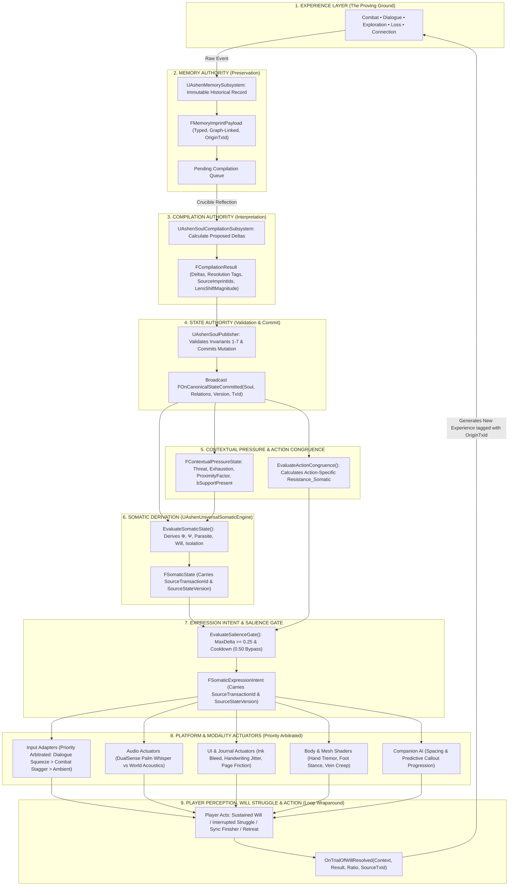

# CONTRACT-SPEC-051: CANONICAL VARIABLE REGISTRY & MACRO-SYSTEMIC EVENT CONTRACTS
**Domain:** Core Architecture / Soul / Memory / Companions / Combat / Audio / UI / Orchestration / QA
**Status:** Supreme Canon Unified Systemic Contract Specification (Iteration VII - Sealed & Implementation-Ready)
**Engine Version:** Unreal Engine 5.8 | **Master Milestone:** 2215+

---

## 🏛️ The Complete Nine-Stage Closed-Loop Organism



---

## 🔒 The Five Constitutional Laws (Governs All Subsystems)

1. **No subsystem may invent canonical psychological or relational state.** Only `UAshenSoulPublisher` may mutate `FSoulStateVector` and `FRelationalMatrix`. Downstream systems (Somatic Engine, Actuators) read committed state and derived context only—they never originate persistent values.
2. **Strict Transactional Write Path**: Experience $\to$ Memory Authority $\to$ Compilation Proposal $\to$ **State Authority Commit** $\to$ Somatic Derivation. No stage may skip forward.
3. **Causal Auditability**: Every `FSomaticState`, `FSomaticExpressionIntent`, and `FActionCongruenceResult` carries `SourceTransactionId` and `SourceStateVersion`, traceable to the `FOnCanonicalStateCommitted` broadcast that produced it, traceable to `FCompilationResult.SourceImprintIds`, traceable to `FMemoryImprintPayload.OriginTransactionId`. A `FGuid()` zero-value in `OriginTransactionId` is the explicit, valid representation of "first-cycle imprint, no prior transaction".
4. **Resolution Deltas preserve history.** Debt may only decrease under a valid `Resolution.*`-namespaced tag (Invariant 2). Healing never erases `RelatedImprintIds`.
5. **The Salience Gate** enforces signal-to-noise filtering—but never at the cost of suppressing a critical state change (bypasses cooldown when $\text{MaxDelta} \ge 0.50$).

---

## 📜 All Canonical Enumerations

```cpp
UENUM(BlueprintType)
enum class EOntologicalLens : uint8
{
    Uncompiled  UMETA(DisplayName = "Uncompiled / Raw Memory"),
    Defiance    UMETA(DisplayName = "Defiance ('I will endure this myself')"),
    Grace       UMETA(DisplayName = "Grace ('I will let someone share this burden')"),
    Wrath       UMETA(DisplayName = "Wrath ('I will make someone else pay for this')") // Utility permanently deprecated
};

// Binary Distance Table: No assumed linear ordering exists between parallel strategies.
// Either a choice matches Kaelen's compiled worldview (0.0) or demands a cognitive shift (1.0).
static float GetLensDistance(EOntologicalLens A, EOntologicalLens B)
{
    if (A == B) return 0.0f;
    if (A == EOntologicalLens::Uncompiled || B == EOntologicalLens::Uncompiled) return 0.0f;
    return 1.0f;
}

UENUM(BlueprintType)
enum class ETriggerResistanceSource : uint8
{
    DialogueWillStruggle = 0 UMETA(DisplayName = "Dialogue Will Struggle (Priority 1 — Modal 2.0s squeeze, absolute precedence)"),
    CombatStagger        = 1 UMETA(DisplayName = "Combat Stagger (Priority 2 — 50% baseline -> instant 0% on poise-break)"),
    AmbientSomatic       = 2 UMETA(DisplayName = "Ambient Somatic (Priority 3 — Continuous background, derived from Φ_internal)")
};

UENUM(BlueprintType)
enum class EMemoryImprintType : uint8
{
    CombatLoss,
    CompanionConflict,
    CompanionRescue,
    SyncFinisherExecuted,
    Betrayal,
    Sacrifice,
    Retreat,
    WillTrialFailure,
    WillTrialBreakthrough
};

UENUM(BlueprintType)
enum class EExperienceContext : uint8
{
    Exploration,
    Combat,
    Dialogue,
    CampfireRest,
    HeartstoneCrucible
};

UENUM(BlueprintType)
enum class EWillContext : uint8
{
    DialogueGraceSqueeze,
    StaggerPostureDuel,
    TransferenceSomaticHold,
    CataclysmSanctification
};

UENUM(BlueprintType)
enum class EWillTrialResult : uint8
{
    Success,
    ReleasedEarly,
    TimedOut,
    Cancelled,
    AccessibilityAlternateInput
};

UENUM(BlueprintType)
enum class ESyncFinisherType : uint8
{
    SoloMartyrStrike,
    TripartiteResonantCleave,
    WhitePyreDisintegration
};

UENUM(BlueprintType)
enum class EResonanceBand : uint8
{
    Discordant   UMETA(DisplayName = "Discordant (TrioResonance < 0.35)"),
    Attuned      UMETA(DisplayName = "Attuned (0.35 <= TrioResonance < 0.75)"),
    Synchronized UMETA(DisplayName = "Synchronized (TrioResonance >= 0.75)")
};
```

---

## 📋 The Canonical Data Payloads

### Layer A: Canonical Persistent State

#### 1. `FSoulStateVector` (Authoritative Soul Identity)
```cpp
USTRUCT(BlueprintType)
struct FSoulStateVector
{
    GENERATED_BODY()

    UPROPERTY(EditAnywhere, BlueprintReadWrite)
    float IntegrationDebt = 0.0f; // D in [0.0, 1.0]

    UPROPERTY(EditAnywhere, BlueprintReadWrite)
    float AccumulatedDysregulation = 0.0f; // N in [0.0, 1.0], CONTINUOUS. Stage bands are UI classification only.

    UPROPERTY(EditAnywhere, BlueprintReadWrite)
    float Resolve = 0.5f; // R in [0.0, 1.0]

    UPROPERTY(EditAnywhere, BlueprintReadWrite)
    float Corruption = 0.0f; // C in [0.0, 1.0]

    UPROPERTY(EditAnywhere, BlueprintReadWrite)
    EOntologicalLens DominantLens = EOntologicalLens::Defiance;

    UPROPERTY(EditAnywhere, BlueprintReadWrite)
    EOntologicalLens PreviousDominantLens = EOntologicalLens::Uncompiled; // Input for LensShiftMagnitude

    UPROPERTY(VisibleAnywhere, BlueprintReadOnly)
    uint64 StateVersion = 1;
};

FORCEINLINE int32 GetDysregulationStage(float N)
{
    if (N >= 1.0f)  return 4;
    if (N >= 0.75f) return 3;
    if (N >= 0.50f) return 2;
    return 1;
}
```

#### 2. `FRelationalMatrix` (Authoritative Relational Dynamics)
```cpp
USTRUCT(BlueprintType)
struct FRelationalMatrix
{
    GENERATED_BODY()

    UPROPERTY(EditAnywhere, BlueprintReadWrite)
    float Trust_Serafina = 0.5f; // Tr_S in [0.0, 1.0]

    UPROPERTY(EditAnywhere, BlueprintReadWrite)
    float Burnout_Serafina = 0.0f; // B_S in [0.0, 1.0]

    UPROPERTY(EditAnywhere, BlueprintReadWrite)
    float Trust_Garrett = 0.5f; // Tr_G in [0.0, 1.0]

    UPROPERTY(EditAnywhere, BlueprintReadWrite)
    float Fatigue_Garrett = 0.0f; // F_G in [0.0, 1.0]

    UPROPERTY(EditAnywhere, BlueprintReadWrite)
    float TrioResonance = 0.5f; // Persistent authoritative baseline in [0.0, 1.0]; group cohesion of Kaelen + Garrett + Serafina

    FORCEINLINE EResonanceBand GetResonanceBand() const
    {
        if (TrioResonance >= 0.75f) return EResonanceBand::Synchronized;
        if (TrioResonance >= 0.35f) return EResonanceBand::Attuned;
        return EResonanceBand::Discordant;
    }
};
```

#### 3. `FMemoryImprintPayload` (The Archaeological Memory Graph)
```cpp
USTRUCT(BlueprintType)
struct FMemoryImprintPayload
{
    GENERATED_BODY()

    UPROPERTY(EditAnywhere, BlueprintReadWrite)
    FGuid ImprintId;

    UPROPERTY(EditAnywhere, BlueprintReadWrite)
    FGuid OriginTransactionId; // Causal provenance link back to triggering transaction (or FGuid() if first cycle)

    UPROPERTY(EditAnywhere, BlueprintReadWrite)
    FName MemorySiteId;

    UPROPERTY(EditAnywhere, BlueprintReadWrite)
    FName EncounterId;

    UPROPERTY(EditAnywhere, BlueprintReadWrite)
    EMemoryImprintType ImprintType = EMemoryImprintType::CombatLoss;

    UPROPERTY(EditAnywhere, BlueprintReadWrite)
    float EmotionalMagnitude = 0.0f; // Total psychological weight

    UPROPERTY(EditAnywhere, BlueprintReadWrite)
    float ThreatMagnitude = 0.0f;

    UPROPERTY(EditAnywhere, BlueprintReadWrite)
    float RelationalSignificance = 0.0f;

    UPROPERTY(EditAnywhere, BlueprintReadWrite)
    float IdentitySignificance = 0.0f;

    UPROPERTY(EditAnywhere, BlueprintReadWrite)
    FGameplayTagContainer ContextTags;

    UPROPERTY(EditAnywhere, BlueprintReadWrite)
    double GameTimeSeconds = 0.0;

    UPROPERTY(EditAnywhere, BlueprintReadWrite)
    TArray<FGuid> RelatedImprintIds; // Constellation Graph Edges

    UPROPERTY(EditAnywhere, BlueprintReadWrite)
    bool bHasBeenCompiledAtHeartstone = false;

    UPROPERTY(EditAnywhere, BlueprintReadWrite)
    EOntologicalLens InterpretedLens = EOntologicalLens::Uncompiled;
};
```

---

### Layer B: Runtime Context

#### 4. `FContextualPressureState` (Non-Persistent Runtime Environment)
```cpp
USTRUCT(BlueprintType)
struct FContextualPressureState
{
    GENERATED_BODY()

    UPROPERTY(BlueprintReadWrite)
    EExperienceContext ExperienceContext = EExperienceContext::Exploration;

    UPROPERTY(BlueprintReadWrite)
    float ImmediateThreatIntensity = 0.0f; // [0.0, 1.0]

    UPROPERTY(BlueprintReadWrite)
    float PhysicalExhaustion = 0.0f; // [0.0, 1.0]

    UPROPERTY(BlueprintReadWrite)
    float CompanionProximityFactor = 1.0f; // 1.0 at <= 200uu, linearly decaying to 0.0 at >= 1000uu

    // Canonical derivation: ProximityFactor >= 0.75f corresponds to distance <= 400.0uu (HAPTIC-SPEC-048)
    UPROPERTY(BlueprintReadWrite)
    bool bCompanionSupportPresent = false; // Derived: (CompanionProximityFactor >= 0.75f) && bLineOfSightToAnyCompanion

    UPROPERTY(BlueprintReadWrite)
    bool bInSanctuarySafeZone = false;
};
```

---

### Layer C: Derived Somatic State & Action Congruence (Lineage-Tracked)

#### 5. `FSomaticState` (Pure Internal Experience)
```cpp
USTRUCT(BlueprintType)
struct FSomaticState
{
    GENERATED_BODY()

    UPROPERTY(BlueprintReadOnly)
    FGuid SourceTransactionId; // Causal lineage anchor to committed state

    UPROPERTY(BlueprintReadOnly)
    uint64 SourceStateVersion = 0;

    UPROPERTY(BlueprintReadOnly)
    float InternalFriction = 0.0f; // Φ in [0.0, 1.0]

    UPROPERTY(BlueprintReadOnly)
    float RelationalFlow = 0.5f; // Ψ in [0.0, 1.0]

    UPROPERTY(BlueprintReadOnly)
    float ParasitePressure = 0.0f; // [0.0, 1.0]

    UPROPERTY(BlueprintReadOnly)
    float WillCapacity = 0.5f; // [0.0, 1.0]

    UPROPERTY(BlueprintReadOnly)
    float IsolationPressure = 0.0f; // [0.0, 1.0]
};
```

#### 6. `FActionCongruenceResult` (Per-Action Somatic Will Resistance)
```cpp
USTRUCT(BlueprintType)
struct FActionCongruenceResult
{
    GENERATED_BODY()

    UPROPERTY(BlueprintReadOnly)
    FGuid SourceTransactionId;

    UPROPERTY(BlueprintReadOnly)
    uint64 SourceStateVersion = 0;

    UPROPERTY(BlueprintReadOnly)
    FGameplayTag IntendedActionTag; // e.g. "Dialogue.GraceSqueeze.SilentSpire"

    UPROPERTY(BlueprintReadOnly)
    float MemorySeverity = 0.0f; // Pulled from referenced FMemoryImprintPayload::EmotionalMagnitude

    // Explicit Canonical Default: Defaults to TrioResonance if no single companion is addressed
    UPROPERTY(BlueprintReadOnly)
    float ActiveCompanionTrust = 0.5f;

    UPROPERTY(BlueprintReadOnly)
    float ResistanceSomatic = 0.0f; // [0.0, 1.0] - Mathematical resistance driving Trial of Will
};
```

---

### Layer D: Expression Intent (Lineage-Tracked & Arbitrated)

#### 7. `FSomaticExpressionIntent` (Universal Semantic Intent)
```cpp
USTRUCT(BlueprintType)
struct FSomaticExpressionIntent
{
    GENERATED_BODY()

    UPROPERTY(BlueprintReadOnly)
    FGuid SourceTransactionId; // Causal lineage anchor

    UPROPERTY(BlueprintReadOnly)
    uint64 SourceStateVersion = 0;

    UPROPERTY(BlueprintReadOnly)
    ETriggerResistanceSource ActiveResistanceSource = ETriggerResistanceSource::AmbientSomatic;

    UPROPERTY(BlueprintReadOnly)
    float InputResistanceIntent = 0.0f; // [0.0, 1.0] - Arbitrated resistance intensity

    UPROPERTY(BlueprintReadOnly)
    float AudioIntrusionIntent = 0.0f; // [0.0, 1.0]

    UPROPERTY(BlueprintReadOnly)
    float HapticTremorIntent = 0.0f; // [0.0, 1.0]

    UPROPERTY(BlueprintReadOnly)
    float VisualInstabilityIntent = 0.0f; // [0.0, 1.0]

    UPROPERTY(BlueprintReadOnly)
    float JournalDegradationIntent = 0.0f; // [0.0, 1.0]

    UPROPERTY(BlueprintReadOnly)
    float CompanionSupportExpression = 0.0f; // [0.0, 1.0]
};
```

---

### Layer E: Compilation Payload

#### 8. `FCompilationResult` (Soul Compilation Delta Payload)
```cpp
USTRUCT(BlueprintType)
struct FCompilationResult
{
    GENERATED_BODY()

    UPROPERTY(BlueprintReadOnly)
    FGuid CompilationId;

    UPROPERTY(BlueprintReadOnly)
    TArray<FGuid> SourceImprintIds;

    UPROPERTY(BlueprintReadOnly)
    float IntegrationDebtBefore = 0.0f;

    UPROPERTY(BlueprintReadOnly)
    float IntegrationDebtAfter = 0.0f;

    UPROPERTY(BlueprintReadOnly)
    float ResolveDelta = 0.0f;

    UPROPERTY(BlueprintReadOnly)
    float CorruptionDelta = 0.0f;

    UPROPERTY(BlueprintReadOnly)
    float TrustGarrettDelta = 0.0f;

    UPROPERTY(BlueprintReadOnly)
    float TrustSerafinaDelta = 0.0f;

    UPROPERTY(BlueprintReadOnly)
    float TrioResonanceDelta = 0.0f;

    UPROPERTY(BlueprintReadOnly)
    float LensShiftMagnitude = 0.0f; // GetLensDistance(DominantLens, PreviousDominantLens)

    UPROPERTY(BlueprintReadOnly)
    EOntologicalLens SelectedLens = EOntologicalLens::Grace;

    UPROPERTY(BlueprintReadOnly)
    FGameplayTagContainer ResolutionTags; // e.g. "Resolution.FearPersists", "Resolution.SharedBurden"

    UPROPERTY(BlueprintReadOnly)
    uint64 SourceStateVersion = 0;

    UPROPERTY(BlueprintReadOnly)
    uint64 ResultStateVersion = 0;
};
```

---

## 📐 Mathematical Derivation Contracts (All 5 Ratified)

### 1. Relational Flow ($\Psi_{\text{relational}}$)
$$\Psi_{\text{relational}} = \text{Clamp}\Big( \text{TrioResonance} \cdot 0.60 + (1.0 - \text{ImmediateThreat} \cdot 0.20) \cdot \text{ProximityFactor} \cdot 0.30 + (\text{bCompanionSupportPresent} ? 0.10 : 0.0), \,\, 0.0, \,\, 1.0 \Big)$$

### 2. Internal Friction ($\Phi_{\text{internal}}$)
$$\Phi_{\text{internal}} = \text{Clamp}\Big( 0.40 \cdot D + 0.30 \cdot N_{\text{dysreg}} + 0.30 \cdot \text{LensShiftMagnitude} + 0.20 \cdot \text{Threat} - 0.20 \cdot R, \,\, 0.0, \,\, 1.0 \Big)$$

### 3. Action Congruence Somatic Resistance ($\text{Resistance}_{\text{Somatic}}$)
$$\text{Resistance}_{\text{Somatic}} = \text{Clamp}\Big( 0.30 \cdot D + 0.25 \cdot \text{GetLensDistance}(\text{IntendedLens}, \text{DominantLens}) + 0.20 \cdot (1.0 - \text{ActiveCompanionTrust}) + 0.15 \cdot M_{\text{severity}} - 0.20 \cdot R, \,\, 0.0, \,\, 1.0 \Big)$$
*(Note: If no specific companion is the addressee of the action, $\text{ActiveCompanionTrust} = \text{TrioResonance}$.)*

### 4. Auxiliary Somatic Vectors
* $\text{ParasitePressure} = \text{Clamp}\big(0.50 \cdot C + 0.30 \cdot \Phi_{\text{internal}} + 0.20 \cdot (1.0 - R), \,\, 0.0, \,\, 1.0\big)$
* $\text{WillCapacity} = \text{Clamp}\big(0.60 \cdot R + 0.20 \cdot (1.0 - \Phi_{\text{internal}}) + 0.20 \cdot \Psi_{\text{relational}}, \,\, 0.0, \,\, 1.0\big)$
* $\text{IsolationPressure} = \text{Clamp}\big(0.60 \cdot (1.0 - \Psi_{\text{relational}}) + 0.40 \cdot (1.0 - \text{ProximityFactor}), \,\, 0.0, \,\, 1.0\big)$

---

## 🔒 The Seven Invariants of `UAshenSoulPublisher` (State Authority)

1. **Range Invariant**: All scalar floats ($D, N, R, C, Tr_S, B_S, Tr_G, F_G, \text{TrioResonance}$) must satisfy $[0.0 \le x \le 1.0]$.
2. **Debt Resolution Tag Invariant**: $\text{IntegrationDebtAfter} < \text{IntegrationDebtBefore}$ is **ILLEGAL** unless `ResolutionTags` contains at least one valid tag under the `Resolution.*` namespace.
3. **Version Monotonicity Invariant**: $\text{ResultStateVersion} == \text{SourceStateVersion} + 1$.
4. **Bifurcation Mutex Invariant**: $\Delta C > 0$ and $\Delta R > 0$ in the same transaction is rejected unless explicitly permitted by `Resolution.BifurcatedWill`.
5. **Bipartite Resonance Bounding Invariant**: $\text{TrioResonance}$ must satisfy:
   $$\min(Tr_S, Tr_G) - 0.20 \le \text{TrioResonance} \le \max(Tr_S, Tr_G) + 0.20$$
6. **Transaction Authenticity Invariant**: `CompilationId` must match an active uncommitted session in `UAshenSoulCompilationSubsystem`.
7. **No-Invention Enforcement**: Any subsystem other than `UAshenSoulPublisher` attempting direct mutation of `FSoulStateVector` or `FRelationalMatrix` triggers an immediate assertion failure.

---

## 🎚️ The Salience Gate Algorithm & Expression Budget

```cpp
USTRUCT(BlueprintType)
struct FSalienceBudget
{
    GENERATED_BODY()

    float SalienceThreshold = 0.25f;
    float CriticalBypassThreshold = 0.50f; // Bypasses cooldown entirely on dramatic shocks
    float MinCooldownSeconds = 3.0f;
    double LastExpressionTimestamp = 0.0;
    float LastDispatchedFriction = 0.0f;
    float LastDispatchedFlow = 0.0f;
    float LastDispatchedParasite = 0.0f;
    float LastDispatchedWill = 0.0f;
    float LastDispatchedIsolation = 0.0f;
};

bool EvaluateSalienceGate(const FSomaticState& S, FSalienceBudget& B, double Now)
{
    const float DFriction  = FMath::Abs(S.InternalFriction  - B.LastDispatchedFriction);
    const float DFlow      = FMath::Abs(S.RelationalFlow    - B.LastDispatchedFlow);
    const float DParasite  = FMath::Abs(S.ParasitePressure  - B.LastDispatchedParasite);
    const float DWill      = FMath::Abs(S.WillCapacity      - B.LastDispatchedWill);
    const float DIsolation = FMath::Abs(S.IsolationPressure - B.LastDispatchedIsolation);

    // Max delta evaluation prevents dilution
    const float MaxDelta = FMath::Max3(DFriction, DFlow, FMath::Max3(DParasite, DWill, DIsolation));

    const bool bCooldownElapsed = (Now - B.LastExpressionTimestamp) >= B.MinCooldownSeconds;
    const bool bCriticalBypass  = (MaxDelta >= B.CriticalBypassThreshold);
    const bool bThresholdExceeded = (MaxDelta >= B.SalienceThreshold);

    if (bCriticalBypass || (bThresholdExceeded && bCooldownElapsed))
    {
        B.LastDispatchedFriction  = S.InternalFriction;
        B.LastDispatchedFlow      = S.RelationalFlow;
        B.LastDispatchedParasite  = S.ParasitePressure;
        B.LastDispatchedWill      = S.WillCapacity;
        B.LastDispatchedIsolation = S.IsolationPressure;
        B.LastExpressionTimestamp = Now;
        return true; // Dispatch Expression Intent
    }
    return false; // Silent pass-through
}
```

---

## ⚡ Motor Profile & Trigger Resistance Arbitration

```cpp
// UAshenDualSenseWeavingTensionComponent resolves final trigger output as:
// 1. Determine active source via ETriggerResistanceSource priority (DialogueWillStruggle > CombatStagger > AmbientSomatic)
// 2. If source == DialogueWillStruggle:
//      - ResistanceSomatic >= 0.85 -> 100% Mechanical Hard-Stop Lockout (releases only after 2.0s sustained squeeze)
//      - ResistanceSomatic <  0.85 -> continuous modulated spring tension = ResistanceSomatic
// 3. If source == CombatStagger: flat 0.50 baseline; instant 0.00 on poise-break event
// 4. If source == AmbientSomatic: continuous = InputResistanceIntent (0.0 to 0.35)
```

---

## ⚡ The Master Lifecycle Event Contracts

```cpp
DECLARE_DYNAMIC_MULTICAST_DELEGATE_OneParam(FOnTraumaImprintCreated, const FMemoryImprintPayload&, Payload);

DECLARE_DYNAMIC_MULTICAST_DELEGATE_OneParam(FOnSoulCompiled, const FCompilationResult&, Result);

DECLARE_DYNAMIC_MULTICAST_DELEGATE_FourParams(FOnCanonicalStateCommitted, const FSoulStateVector&, SoulState, const FRelationalMatrix&, RelationalState, uint64, StateVersion, FGuid, TransactionId);

DECLARE_DYNAMIC_MULTICAST_DELEGATE_OneParam(FOnSomaticStateUpdated, const FSomaticState&, SomaticState);

DECLARE_DYNAMIC_MULTICAST_DELEGATE_OneParam(FOnActionCongruenceEvaluated, const FActionCongruenceResult&, Result);

DECLARE_DYNAMIC_MULTICAST_DELEGATE_OneParam(FOnExpressionIntentDispatched, const FSomaticExpressionIntent&, Intent);

DECLARE_DYNAMIC_MULTICAST_DELEGATE_TwoParams(FOnTrialOfWillTriggered, EWillContext, Context, float, WindowDuration);

DECLARE_DYNAMIC_MULTICAST_DELEGATE_FourParams(FOnTrialOfWillResolved, EWillContext, Context, EWillTrialResult, Result, float, CompletionRatio, FGuid, SourceTransactionId);

DECLARE_DYNAMIC_MULTICAST_DELEGATE_OneParam(FOnTripartiteSyncExecuted, ESyncFinisherType, FinisherType);
```

---

## 🏛️ Enshrined Architecture References
- **Master Atlas**: [`Docs/MASTER_ARCHITECTURE_ATLAS.md`](file:///c:/Users/Chris/Ashen%20Oath%20Unreal%20Engine/Docs/MASTER_ARCHITECTURE_ATLAS.md)
- **Universal Somatic Law**: [`Docs/SOMATIC-SPEC-050.md`](file:///c:/Users/Chris/Ashen%20Oath%20Unreal%20Engine/Docs/SOMATIC-SPEC-050%20%28THE%20UNIVERSAL%20SOMATIC%20EXPRESSION%20LAYER%20&%20CONFLICT%20EQUILIBRIUM%29.md)
- **Three Survival Strategies**: [`Docs/SUFFERING-SPEC-046.md`](file:///c:/Users/Chris/Ashen%20Oath%20Unreal%20Engine/Docs/SUFFERING-SPEC-046%20%28THE%20THREE%20SURVIVAL%20STRATEGIES%20&%20SOMATIC%20INTEGRATION%20OF%20SUFFERING%29.md)
- **Dual Safe-Zone Law**: [`Docs/SANCTUARY-SPEC-047.md`](file:///c:/Users/Chris/Ashen%20Oath%20Unreal%20Engine/Docs/SANCTUARY-SPEC-047%20%28CAMPFIRE%20REASSEMBLY%20VS%20HEARTSTONE%20SOUL%20COMPILATION%29.md)
- **Hardware Integration**: [`Docs/HAPTIC-SPEC-048.md`](file:///c:/Users/Chris/Ashen%20Oath%20Unreal%20Engine/Docs/HAPTIC-SPEC-048%20%28THE%20HAPTIC%20RESONANCE%20CHORD%20&%20DUALSENSE%20SOMATIC%20SYNERGY%29.md)
- **Kinetic Dialogue**: [`Docs/DIALOGUE-SPEC-049.md`](file:///c:/Users/Chris/Ashen%20Oath%20Unreal%20Engine/Docs/DIALOGUE-SPEC-049%20%28DISSONANT%20DIALOGUE%20HIJACKING%20&%20SOMATIC%20WILL%20STRUGGLE%29.md)
- **Architecture Map**: [`Docs/ARCHITECTURE_MAP.md`](file:///c:/Users/Chris/Ashen%20Oath%20Unreal%20Engine/Docs/ARCHITECTURE_MAP.md)
