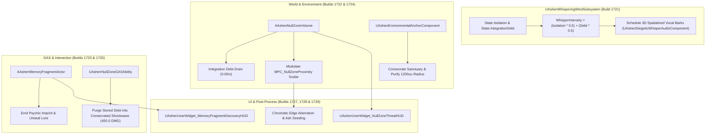

# CORRUPTION-SPEC-019: THE NULL ZONE, WHISPERING WINDS & ENVIRONMENTAL ANCHORING PIPELINE
**Domain:** World / Combat / Companions / Audio / UI / Core / Narrative / Orchestration / QA
**Status:** Canon Specification & Verified Production C++ Implementation (Builds 1716–1735 / Master Batch #86)
**Engine Version:** Unreal Engine 5.8 | **Total Builds Clean:** 1,735

---

## 🏛️ Core Philosophy
> *"The world does not merely witness your trauma; the land itself decays where the sundered souls fell."*  
> *"In the Null Zones, silence is impossible. The wind remembers what you try to forget."*

---

## 🌪️ Atmospheric Corruption & Null Zone Architecture

---

## 📋 Technical Formulas & Mechanical Bounds

1. **Whispering Wind Intensity**:
   $$\text{WhisperIntensity} = \text{Clamp}\left((\text{Isolation} \times 0.5) + (\text{IntegrationDebt} \times 0.5),\, 0.0,\, 1.0\right)$$

2. **Null Zone Proximity Ratio**:
   $$\text{ProximityRatio} = \text{Clamp}\left(1.0 - \frac{\text{DistanceToCenter}}{\text{NullZoneRadius}},\, 0.0,\, 1.0\right)$$

3. **Null Zone Purge Burst Damage**:
   $$\text{ShockwaveDamage} = 450.0 \times (1.0 + \text{IntegrationDebt})$$

---

## 🏛️ Production C++ Class Mapping (Builds 1716–1735)

| Class | Source Header | Primary Responsibility |
|---|---|---|
| `UAshenNullZoneAuditor` | [`AshenNullZoneAuditor.h`](file:///c:/Users/Chris/Ashen%20Oath%20Unreal%20Engine/AshenOath/Source/AshenOathEditor/Tooling/AshenNullZoneAuditor.h) | Audits volume bindings, drain rates, and MPC parameters |
| `UAshenWhisperingWindValidator` | [`AshenWhisperingWindValidator.h`](file:///c:/Users/Chris/Ashen%20Oath%20Unreal%20Engine/AshenOath/Source/AshenOathEditor/Tooling/AshenWhisperingWindValidator.h) | Validates spatial audio attenuation curves and bark bounds |
| `UAshenEnvironmentalCorruptionStressTester` | [`AshenEnvironmentalCorruptionStressTester.h`](file:///c:/Users/Chris/Ashen%20Oath%20Unreal%20Engine/AshenOath/Source/AshenOathEditor/Tooling/AshenEnvironmentalCorruptionStressTester.h) | Stress tests 50 concurrent Null Zone overlap evaluations |
| `UAshenProductFilterCorruptionGatekeeper` | [`AshenProductFilterCorruptionGatekeeper.h`](file:///c:/Users/Chris/Ashen%20Oath%20Unreal%20Engine/AshenOath/Source/AshenOathEditor/Tooling/AshenProductFilterCorruptionGatekeeper.h) | Enforces timer cleanup and fragment one-time consumption |
| `UAshenWhisperingWindSubsystem` | [`AshenWhisperingWindSubsystem.h`](file:///c:/Users/Chris/Ashen%20Oath%20Unreal%20Engine/AshenOath/Source/AshenOath/World/AshenWhisperingWindSubsystem.h) | GameInstance Subsystem managing 3D spatialized whispers |
| `AAshenNullZoneVolume` | [`AshenNullZoneVolume.h`](file:///c:/Users/Chris/Ashen%20Oath%20Unreal%20Engine/AshenOath/Source/AshenOath/World/AshenNullZoneVolume.h) | World volume driving debt accumulation and proximity |
| `AAshenMemoryFragmentActor` | [`AshenMemoryFragmentActor.h`](file:///c:/Users/Chris/Ashen%20Oath%20Unreal%20Engine/AshenOath/Source/AshenOath/World/AshenMemoryFragmentActor.h) | World-placed psychic memory fragment actor |
| `UAshenEnvironmentalAnchorComponent` | [`AshenEnvironmentalAnchorComponent.h`](file:///c:/Users/Chris/Ashen%20Oath%20Unreal%20Engine/AshenOath/Source/AshenOath/World/AshenEnvironmentalAnchorComponent.h) | Consecrates sanctuaries and cleanses localized fields |
| `UAshenNullZoneGASAbility` | [`AshenNullZoneGASAbility.h`](file:///c:/Users/Chris/Ashen%20Oath%20Unreal%20Engine/AshenOath/Source/AshenOath/Combat/AshenNullZoneGASAbility.h) | Purges Null Zone corruption into a radial wave |
| `UAshenDiegeticWhisperAudioComponent` | [`AshenDiegeticWhisperAudioComponent.h`](file:///c:/Users/Chris/Ashen%20Oath%20Unreal%20Engine/AshenOath/Source/AshenOath/Audio/AshenDiegeticWhisperAudioComponent.h) | Binaural whisper drone & discovery chimes |
| `UAshenUserWidget_NullZoneThreatHUD` | [`AshenUserWidget_NullZoneThreatHUD.h`](file:///c:/Users/Chris/Ashen%20Oath%20Unreal%20Engine/AshenOath/Source/AshenOath/UI/AshenUserWidget_NullZoneThreatHUD.h) | Null Zone proximity & radiation threat meter |
| `UAshenUserWidget_MemoryFragmentDiscoveryHUD`| [`AshenUserWidget_MemoryFragmentDiscoveryHUD.h`](file:///c:/Users/Chris/Ashen%20Oath%20Unreal%20Engine/AshenOath/Source/AshenOath/UI/AshenUserWidget_MemoryFragmentDiscoveryHUD.h) | Discovered memory fragment prompt HUD |
| `UAshenNullZonePostProcessAdapter` | [`AshenNullZonePostProcessAdapter.h`](file:///c:/Users/Chris/Ashen%20Oath%20Unreal%20Engine/AshenOath/Source/AshenOath/UI/AshenNullZonePostProcessAdapter.h) | Chromatic aberration and localized desaturation |
| `UAshenNullZoneCompanionReactivityAdapter`| [`AshenNullZoneCompanionReactivityAdapter.h`](file:///c:/Users/Chris/Ashen%20Oath%20Unreal%20Engine/AshenOath/Source/AshenOath/Companions/AshenNullZoneCompanionReactivityAdapter.h) | Companion caution and uneasiness animations |
| `UAshenNullZoneSaveGameAdapter` | [`AshenNullZoneSaveGameAdapter.h`](file:///c:/Users/Chris/Ashen%20Oath%20Unreal%20Engine/AshenOath/Source/AshenOath/Core/AshenNullZoneSaveGameAdapter.h) | Serializes fragments & anchor states to save game |
| `UAshenNullZoneDialogueAdapter` | [`AshenNullZoneDialogueAdapter.h`](file:///c:/Users/Chris/Ashen%20Oath%20Unreal%20Engine/AshenOath/Source/AshenOath/Narrative/AshenNullZoneDialogueAdapter.h) | Dynamic narrative warning barks |
| `UAshenNullZoneMasterBridge` | [`AshenNullZoneMasterBridge.h`](file:///c:/Users/Chris/Ashen%20Oath%20Unreal%20Engine/AshenOath/Source/AshenOath/Orchestration/AshenNullZoneMasterBridge.h) | Master bridge broadcasting Null Zone events |
| `UAshenMilestone1735MasterSynthesisOrchestrator`| [`AshenMilestone1735MasterSynthesisOrchestrator.h`](file:///c:/Users/Chris/Ashen%20Oath%20Unreal%20Engine/AshenOath/Source/AshenOath/Orchestration/AshenMilestone1735MasterSynthesisOrchestrator.h) | Master Milestone 1735 World Subsystem & QA Suite |
