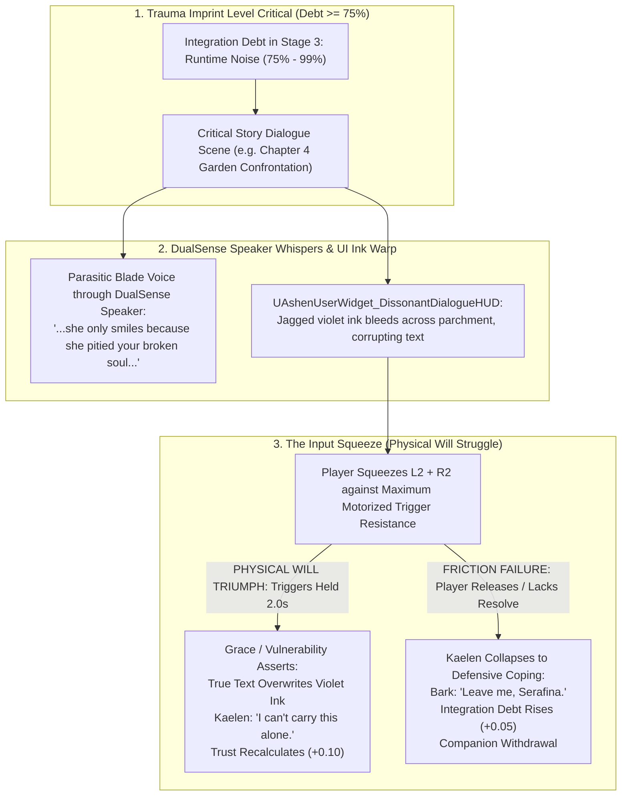

# DIALOGUE-SPEC-049: DISSONANT DIALOGUE HIJACKING & SOMATIC WILL STRUGGLE
**Domain:** Narrative / UI / Hardware Integration / Soul / Companions / Audio / QA
**Status:** Supreme Canon Ludonarrative & Somatic Specification
**Engine Version:** Unreal Engine 5.8 | **Master Milestone:** 2215+

---

## 🏛️ The Somatic Conversation Thesis

> **"In traditional RPGs, admitting vulnerability in dialogue is as effortless as clicking a mouse button."**  
> **"In reality, when trauma is screaming in your ear, speaking a vulnerable truth is an exhausting physical act of will. In Ashen Oath, choosing Grace over cynical detachment requires the player to physically overpower the trembling, motorized resistance of the controller in their hands."**

---

## 🎭 The Dissonant Dialogue Hijacking Flowchart

---

## 🕹️ Granular Mechanical & Sensory Specifications

### 1. DualSense Speaker Parasite Audio
* When selecting dialogue during **Stage 3 Runtime Noise**, the television ambient dialogue audio dips by $-6\,\text{dB}$.
* The cynical parasitic inner voice whispers directly from the **DualSense controller speaker in the player's hands**:
  - *"...Garrett will sell your ashes the moment the fire goes cold..."*
  - *"...she doesn't see a leader; she sees a dying martyr..."*

### 2. The Motorized "Input Squeeze" Mechanic
* **Trigger Resistance**: When hovering over a high-trust / vulnerability option (Grace), the DualSense adaptive triggers lock into **$100\%$ trembling resistance**.
* **Somatic Channeling**: The player must firmly squeeze both L2 and R2 simultaneously for $2.0\,\text{seconds}$.
* As the player squeezes, the violet shadow ink across the parchment UI burns away, revealing Kaelen’s genuine response.

### 3. Friction Failure & Involuntary Coping Bark
* If the player releases the triggers before the $2.0\,\text{s}$ channel completes, the parasite hijacks Kaelen's voice.
* Kaelen delivers a cold, defensive coping line (*"I didn't ask for your pity"*), increasing Integration Debt by $+0.05$ and triggering relational estrangement.

---

## ⚖️ Ludonarrative Impact: Why This Matters

1. **Dialogue is no longer a passive menu choice**: Vulnerability becomes a tangible, physical effort of will.
2. **The player experiences Kaelen's internal civil war**: The controller actively fights the player's fingers, embodying the mental fatigue of fighting off trauma.
3. **No artificial moral punishment**: Detachment is easy (requires zero trigger squeeze); true connection is hard (requires physical strength and emotional commitment).

---

## 🏛️ Enshrined Architecture References
- **Domain Subsystem**: `UAshenDialogueSubsystem` (`Source/AshenOath/Narrative/`)
- **HUD Backing Class**: `UAshenUserWidget_DissonantDialogueHUD` (`Source/AshenOath/UI/`)
- **Hardware Integration**: `UAshenDualSenseWeavingTensionComponent` (`Source/AshenOath/Audio/`)
- **Soul Vector**: `FSoulStateVector` (`Source/AshenOath/Soul/`)
