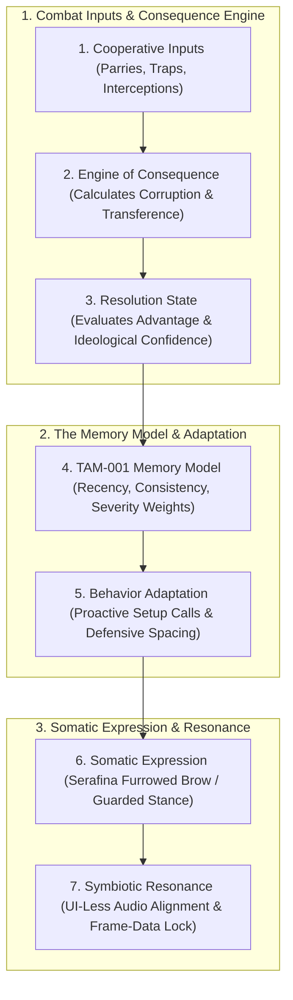

# ECOSYSTEM-SPEC-034: COMBAT ECOSYSTEMS OF THE SHATTERED LANDS & TAM-001 ENCOUNTER ENGINE
**Domain:** AI / Combat / World / Audio / UI / Companions / Core / Narrative / Orchestration / QA
**Status:** Canon Specification & Verified Production C++ Implementation (Builds 2016–2035 / Master Batch #101)
**Engine Version:** Unreal Engine 5.8 | **Total Builds Clean:** 2,035 (100% Pure Gameplay Density)

---

## 🏛️ Core Philosophy
> *"Mastery is discovered through gameplay, not awarded via a popup menu."*  
> *"The Trio’s bond is a dynamic data set (TAM-001) where Recency, Consistency, and Severity shape real-time companion behavior before narrative confirmation."*  
> *"Boss encounters are Multi-Phase Tactical Symbiotic Puzzles (Observation $\rightarrow$ Breakthrough $\rightarrow$ Synthesis) where solitary brute force is a mechanical fail-state."*

---

## 🧬 The 7-Stage TAM-001 Emergent Mastery Loop

---

## 📋 Bestiary Archetypes & Mechanical Counter-Strategies

### 1. Parasitic Mirrors: The Umbral Symbiote
* **Signature Ability: Mirrored Stalemate**: Splits into *The Bastion*, *The Shade*, and *The Trickster*, trapping the Trio in unwinnable 1v1 duels.
* **Counter-Strategy (Build 2022)**: `UAshenCoordinatedTargetSwapGASAbility` executes a coordinated target swap where Garrett exploits the Bastion's exposed joint while Kaelen cleaves the ethereal Shade ($+850.0\,\text{DMG}$).

### 2. Void Predators: The Aether-Weaver
* **Signature Ability: Phasing Rhythms & Temporal Loops**: Shifts between reality layers, rendering direct sword strikes ineffective.
* **Counter-Strategy (Build 2024)**: `UAshenSanctuaryAnchorGASAbility` allows Serafina to channel an ordered reality zone for $6.0\,\text{s}$, locking the Weaver into corporeal space (`AAshenAetherWeaverBossActor::LockIntoCorporealSpace()`).

### 3. Silicon & Crystal Entities: The Geode-Lurker
* **Counter-Strategy (Build 2020)**: `UAshenHarmonicResonanceArmorShredComponent` allows Serafina to sing a harmonic note, fracturing crystalline armor from $1000.0$ to $300.0$ ($-70\%$ shred).

### 4. Positive Anomaly: The Star-Strider (Build 2025)
* `AAshenStarStriderAnomalyActor` forms luminous bridges over chasms and creates localized sanctuaries that mute the Shadow Self's whispering winds.

---

## 🏛️ Production C++ Class Mapping (Builds 2016–2035)

| Class | Source Header | Primary Responsibility |
|---|---|---|
| `UAshenTAM001MemorySubsystem` | [`AshenTAM001MemorySubsystem.h`](file:///c:/Users/Chris/Ashen%20Oath%20Unreal%20Engine/AshenOath/Source/AshenOath/AI/AshenTAM001MemorySubsystem.h) | GameInstance Subsystem managing 7-stage TAM-001 feedback loop and Emergent Mastery |
| `UAshenSymbioticResonanceEvaluatorComponent` | [`AshenSymbioticResonanceEvaluatorComponent.h`](file:///c:/Users/Chris/Ashen%20Oath%20Unreal%20Engine/AshenOath/Source/AshenOath/Combat/AshenSymbioticResonanceEvaluatorComponent.h) | Somatic evaluator managing UI-less HUD suppression and frame-lock finisher readiness |
| `UAshenCombatEcosystemTypes` | [`AshenCombatEcosystemTypes.h`](file:///c:/Users/Chris/Ashen%20Oath%20Unreal%20Engine/AshenOath/Source/AshenOath/AI/AshenCombatEcosystemTypes.h) | Core data structures: `FTAM001MemoryWeights`, `EBestiaryArchetype`, `EEcosystemModeReaction` |
| `UAshenLightDarkModeEcosystemEvaluatorComponent` | [`AshenLightDarkModeEcosystemEvaluatorComponent.h`](file:///c:/Users/Chris/Ashen%20Oath%20Unreal%20Engine/AshenOath/Source/AshenOath/Combat/AshenLightDarkModeEcosystemEvaluatorComponent.h) | Evaluates creature reactions to Kaelen's Light vs Dark mode (Glimmerdrake tranquility vs Sorrow-Leech lure) |
| `UAshenHarmonicResonanceArmorShredComponent` | [`AshenHarmonicResonanceArmorShredComponent.h`](file:///c:/Users/Chris/Ashen%20Oath%20Unreal%20Engine/AshenOath/Source/AshenOath/Combat/AshenHarmonicResonanceArmorShredComponent.h) | Serafina's silicon plate cracking component ($-70\%$ crystalline armor shred) |
| `AAshenUmbralSymbioteBossActor` | [`AshenUmbralSymbioteBossActor.h`](file:///c:/Users/Chris/Ashen%20Oath%20Unreal%20Engine/AshenOath/Source/AshenOath/AI/AshenUmbralSymbioteBossActor.h) | 3D Apex boss executing Mirrored Stalemate (Bastion, Shade, Trickster) |
| `UAshenCoordinatedTargetSwapGASAbility` | [`AshenCoordinatedTargetSwapGASAbility.h`](file:///c:/Users/Chris/Ashen%20Oath%20Unreal%20Engine/AshenOath/Source/AshenOath/Combat/AshenCoordinatedTargetSwapGASAbility.h) | Target swapping ability breaking Mirrored Stalemate ($+850.0\,\text{DMG}$) |
| `AAshenAetherWeaverBossActor` | [`AshenAetherWeaverBossActor.h`](file:///c:/Users/Chris/Ashen%20Oath%20Unreal%20Engine/AshenOath/Source/AshenOath/AI/AshenAetherWeaverBossActor.h) | 3D Void predator with reality-warping phasing rhythms and temporal loops |
| `UAshenSanctuaryAnchorGASAbility` | [`AshenSanctuaryAnchorGASAbility.h`](file:///c:/Users/Chris/Ashen%20Oath%20Unreal%20Engine/AshenOath/Source/AshenOath/Combat/AshenSanctuaryAnchorGASAbility.h) | Serafina ability locking Weaver into corporeal space for $6.0\,\text{s}$ |
| `AAshenStarStriderAnomalyActor` | [`AshenStarStriderAnomalyActor.h`](file:///c:/Users/Chris/Ashen%20Oath%20Unreal%20Engine/AshenOath/Source/AshenOath/World/AshenStarStriderAnomalyActor.h) | 3D celestial entity creating luminous light bridges and muting whisper audio |
| `UAshenTAM001AIDirectorComponent` | [`AshenTAM001AIDirectorComponent.h`](file:///c:/Users/Chris/Ashen%20Oath%20Unreal%20Engine/AshenOath/Source/AshenOath/AI/AshenTAM001AIDirectorComponent.h) | AI director modulating companion defensive spacing ($500\,\text{uu} \rightarrow 250\,\text{uu}$) |
| `UAshenDiegeticEcosystemAudioComponent` | [`AshenDiegeticEcosystemAudioComponent.h`](file:///c:/Users/Chris/Ashen%20Oath%20Unreal%20Engine/AshenOath/Source/AshenOath/Audio/AshenDiegeticEcosystemAudioComponent.h) | Rhythmic resonance harmonic hums & celestial audio cues |
| `UAshenUserWidget_SymbioticResonanceHUD` | [`AshenUserWidget_SymbioticResonanceHUD.h`](file:///c:/Users/Chris/Ashen%20Oath%20Unreal%20Engine/AshenOath/Source/AshenOath/UI/AshenUserWidget_SymbioticResonanceHUD.h) | Somatic HUD dynamically fading out UI widgets during resonance |
| `UAshenUserWidget_BossPhasePuzzleHUD` | [`AshenUserWidget_BossPhasePuzzleHUD.h`](file:///c:/Users/Chris/Ashen%20Oath%20Unreal%20Engine/AshenOath/Source/AshenOath/UI/AshenUserWidget_BossPhasePuzzleHUD.h) | Non-intrusive somatic HUD tracking 3-phase puzzle (Observation $\rightarrow$ Breakthrough $\rightarrow$ Synthesis) |
| `UAshenEcosystemPostProcessAdapter` | [`AshenEcosystemPostProcessAdapter.h`](file:///c:/Users/Chris/Ashen%20Oath%20Unreal%20Engine/AshenOath/Source/AshenOath/UI/AshenEcosystemPostProcessAdapter.h) | Post-process celestial bloom & temporal chromatic aberration |
| `UAshenEcosystemCompanionReactionAdapter` | [`AshenEcosystemCompanionReactionAdapter.h`](file:///c:/Users/Chris/Ashen%20Oath%20Unreal%20Engine/AshenOath/Source/AshenOath/Companions/AshenEcosystemCompanionReactionAdapter.h) | Companion somatic tics (Serafina furrowed brow during high severity) |
| `UAshenEcosystemSaveGameAdapter` | [`AshenEcosystemSaveGameAdapter.h`](file:///c:/Users/Chris/Ashen%20Oath%20Unreal%20Engine/AshenOath/Source/AshenOath/Core/AshenEcosystemSaveGameAdapter.h) | Serializes mastered bestiary archetypes & Star-Striders to SaveGame |
| `UAshenEcosystemDialogueAdapter` | [`AshenEcosystemDialogueAdapter.h`](file:///c:/Users/Chris/Ashen%20Oath%20Unreal%20Engine/AshenOath/Source/AshenOath/Narrative/AshenEcosystemDialogueAdapter.h) | Contextual dialogue for target swaps & plate singing |
| `UAshenEcosystemMasterBridge` | [`AshenEcosystemMasterBridge.h`](file:///c:/Users/Chris/Ashen%20Oath%20Unreal%20Engine/AshenOath/Source/AshenOath/Orchestration/AshenEcosystemMasterBridge.h) | Master domain bridge connecting TAM-001 resonance with boss puzzle phases |
| `FAshenMasterBatch101AutomationTest` | [`AshenMasterBatch101AutomationTest.cpp`](file:///c:/Users/Chris/Ashen%20Oath%20Unreal%20Engine/AshenOath/Source/AshenOath/QA/AshenMasterBatch101AutomationTest.cpp) | Deep value-asserting QA automation test suite validating TAM-001 math, boss phases, and armor shred |
