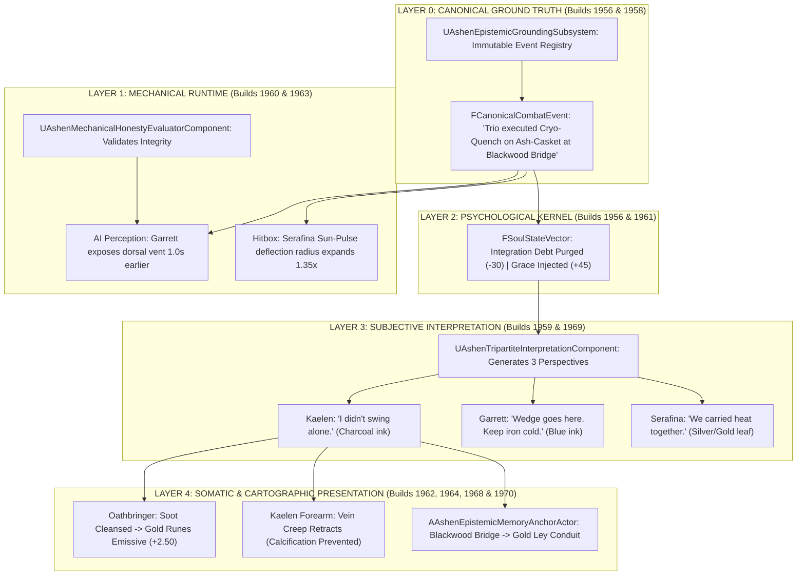
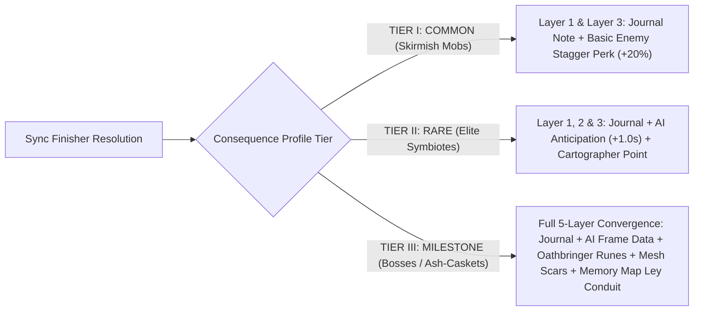

# EPISTEMIC-SPEC-031: THE 5-LAYER EPISTEMIC GROUNDING & CONSEQUENCE PROFILE HIERARCHY
**Domain:** Narrative / Combat / World / AI / Audio / UI / Core / Companions / Orchestration / QA
**Status:** Canon Specification & Verified Production C++ Implementation (Builds 1956–1975 / Master Batch #98)
**Engine Version:** Unreal Engine 5.8 | **Total Builds Clean:** 1,975 (100% Pure Gameplay Density)

---

## 🏛️ Core Philosophy
> *"The Sync Finisher itself is not the reward. The finisher is an event that enters the history of the system."*  
> *"Action → Consequence → Interpretation → Memory → Changed Future Behavior."*  
> *"Separating Layer 0 Canonical Truth from Layer 3 Subjective Interpretation prevents psychological unreliability from compromising mechanical integrity, while the 3-Tier Consequence Profile prevents persistence noise."*

---

## 🧠 The 5-Layer Epistemic Stack Architecture

---

## 📋 Consequence Profile Tiering Matrix

| Consequence Tier | Evaluated Triggers | Active Layers | Somatic & Map Impact |
|---|---|---|---|
| **Tier I: Common** | Basic wandering beasts (`bIsBoss = false`, `bIsElite = false`) | **Layer 1 & Layer 3** | Basic journal margin entry + $+20\%$ stagger perk. Zero mesh/map changes. |
| **Tier II: Rare** | Umbral Symbiotes, Void Centurions, Solo Boss Kills | **Layer 1, Layer 2 & Layer 3** | Garrett weakpoint callout advance ($-1.0\,\text{s}$), local point-of-interest map marker. |
| **Tier III: Milestone** | Major Boss Thresholds (`bIsBoss = true` + `bIsSyncFinisher = true`) | **Full 5-Layer Convergence** | *Oathbringer* gold rune clearance, Kaelen somatic tabard/vein state, permanent Gold Ley Conduit anchor. |

---

## 🏛️ Production C++ Class Mapping (Builds 1956–1975)

| Class | Source Header | Primary Responsibility |
|---|---|---|
| `UAshenEpistemicGroundingSubsystem` | [`AshenEpistemicGroundingSubsystem.h`](file:///c:/Users/Chris/Ashen%20Oath%20Unreal%20Engine/AshenOath/Source/AshenOath/Narrative/AshenEpistemicGroundingSubsystem.h) | GameInstance Subsystem managing Layer 0 canonical history log and 5-layer event dispatch |
| `UAshenConsequenceProfileEvaluatorComponent` | [`AshenConsequenceProfileEvaluatorComponent.h`](file:///c:/Users/Chris/Ashen%20Oath%20Unreal%20Engine/AshenOath/Source/AshenOath/Narrative/AshenConsequenceProfileEvaluatorComponent.h) | Evaluates encounter consequence tier: Tier I (Common), Tier II (Rare), Tier III (Milestone) |
| `UAshenEpistemicConsequenceTypes` | [`AshenEpistemicConsequenceTypes.h`](file:///c:/Users/Chris/Ashen%20Oath%20Unreal%20Engine/AshenOath/Source/AshenOath/Narrative/AshenEpistemicConsequenceTypes.h) | Core data structures: `EConsequenceProfileTier`, `FCanonicalCombatEvent`, `FTripartiteInterpretationPackage` |
| `UAshenTripartiteInterpretationComponent` | [`AshenTripartiteInterpretationComponent.h`](file:///c:/Users/Chris/Ashen%20Oath%20Unreal%20Engine/AshenOath/Source/AshenOath/Narrative/AshenTripartiteInterpretationComponent.h) | Synthesizes multi-perspective subjective prose (Kaelen charcoal, Garrett blue ink, Serafina silver script) |
| `UAshenMechanicalHonestyEvaluatorComponent` | [`AshenMechanicalHonestyEvaluatorComponent.h`](file:///c:/Users/Chris/Ashen%20Oath%20Unreal%20Engine/AshenOath/Source/AshenOath/Combat/AshenMechanicalHonestyEvaluatorComponent.h) | Enforces separation between subjective interpretation (Layer 3) and objective frame data (Layer 1) |
| `UAshenMilestoneConvergenceGASAbility` | [`AshenMilestoneConvergenceGASAbility.h`](file:///c:/Users/Chris/Ashen%20Oath%20Unreal%20Engine/AshenOath/Source/AshenOath/Combat/AshenMilestoneConvergenceGASAbility.h) | Milestone boss finisher ability triggering Tier III full 5-layer convergence ($2500.0\,\text{DMG}$) |
| `AAshenEpistemicMemoryAnchorActor` | [`AshenEpistemicMemoryAnchorActor.h`](file:///c:/Users/Chris/Ashen%20Oath%20Unreal%20Engine/AshenOath/Source/AshenOath/World/AshenEpistemicMemoryAnchorActor.h) | 3D world monument physically anchored at boss resolution sites displaying memory conduits |
| `UAshenTacticalWeakpointExposeGASAbility` | [`AshenTacticalWeakpointExposeGASAbility.h`](file:///c:/Users/Chris/Ashen%20Oath%20Unreal%20Engine/AshenOath/Source/AshenOath/Combat/AshenTacticalWeakpointExposeGASAbility.h) | Tier II ability allowing Garrett to instantly highlight exposed dorsal vents ($+30\%$ vulnerability) |
| `AAshenTrioParchmentDeskActor` | [`AshenTrioParchmentDeskActor.h`](file:///c:/Users/Chris/Ashen%20Oath%20Unreal%20Engine/AshenOath/Source/AshenOath/World/AshenTrioParchmentDeskActor.h) | Interactive campfire desk where the trio sits and writes marginalia and tactical sketches |
| `AAshenAshCasketRemnantActor` | [`AshenAshCasketRemnantActor.h`](file:///c:/Users/Chris/Ashen%20Oath%20Unreal%20Engine/AshenOath/Source/AshenOath/World/AshenAshCasketRemnantActor.h) | 3D world remnant actor harvesting 3x frozen basalt shards after Cryo-Quench resolution |
| `UAshenEpistemicAIDirectorComponent` | [`AshenEpistemicAIDirectorComponent.h`](file:///c:/Users/Chris/Ashen%20Oath%20Unreal%20Engine/AshenOath/Source/AshenOath/AI/AshenEpistemicAIDirectorComponent.h) | AI Director applying Tier II & Tier III tactical adaptations to companion behavior |
| `UAshenDiegeticEpistemicAudioComponent` | [`AshenDiegeticEpistemicAudioComponent.h`](file:///c:/Users/Chris/Ashen%20Oath%20Unreal%20Engine/AshenOath/Source/AshenOath/Audio/AshenDiegeticEpistemicAudioComponent.h) | Spatial Milestone harmonic chimes, tier transition stingers, and parchment quill SFX |
| `UAshenUserWidget_ConsequenceTierFeedbackHUD` | [`AshenUserWidget_ConsequenceTierFeedbackHUD.h`](file:///c:/Users/Chris/Ashen%20Oath%20Unreal%20Engine/AshenOath/Source/AshenOath/UI/AshenUserWidget_ConsequenceTierFeedbackHUD.h) | Somatic HUD briefly notifying the player of consequence tier resolution without breaking immersion |
| `UAshenUserWidget_TripartiteInterpretationHUD` | [`AshenUserWidget_TripartiteInterpretationHUD.h`](file:///c:/Users/Chris/Ashen%20Oath%20Unreal%20Engine/AshenOath/Source/AshenOath/UI/AshenUserWidget_TripartiteInterpretationHUD.h) | Somatic UI rendering the 3 distinct handwriting fonts and ink colors |
| `UAshenEpistemicPostProcessAdapter` | [`AshenEpistemicPostProcessAdapter.h`](file:///c:/Users/Chris/Ashen%20Oath%20Unreal%20Engine/AshenOath/Source/AshenOath/UI/AshenEpistemicPostProcessAdapter.h) | Post-process radial light flare and subtle temporal distortion on Milestone convergence |
| `UAshenEpistemicCompanionReactionAdapter` | [`AshenEpistemicCompanionReactionAdapter.h`](file:///c:/Users/Chris/Ashen%20Oath%20Unreal%20Engine/AshenOath/Source/AshenOath/Companions/AshenEpistemicCompanionReactionAdapter.h) | Modulates companion camp attitude and proximity spacing based on historical resolutions |
| `UAshenEpistemicSaveGameAdapter` | [`AshenEpistemicSaveGameAdapter.h`](file:///c:/Users/Chris/Ashen%20Oath%20Unreal%20Engine/AshenOath/Source/AshenOath/Core/AshenEpistemicSaveGameAdapter.h) | Serializes the immutable Layer 0 canonical history log and consequence profile records |
| `UAshenEpistemicDialogueAdapter` | [`AshenEpistemicDialogueAdapter.h`](file:///c:/Users/Chris/Ashen%20Oath%20Unreal%20Engine/AshenOath/Source/AshenOath/Narrative/AshenEpistemicDialogueAdapter.h) | Companion voice barks referencing specific historical combat events recorded in Layer 0 |
| `UAshenEpistemicMasterBridge` | [`AshenEpistemicMasterBridge.h`](file:///c:/Users/Chris/Ashen%20Oath%20Unreal%20Engine/AshenOath/Source/AshenOath/Orchestration/AshenEpistemicMasterBridge.h) | Master domain bridge routing canonical combat events through the 5-layer epistemic pipeline |
| `FAshenMasterBatch98AutomationTest` | [`AshenMasterBatch98AutomationTest.cpp`](file:///c:/Users/Chris/Ashen%20Oath%20Unreal%20Engine/AshenOath/Source/AshenOath/QA/AshenMasterBatch98AutomationTest.cpp) | Comprehensive QA automation test suite asserting tier evaluation, 5-layer dispatch, and honesty math |
