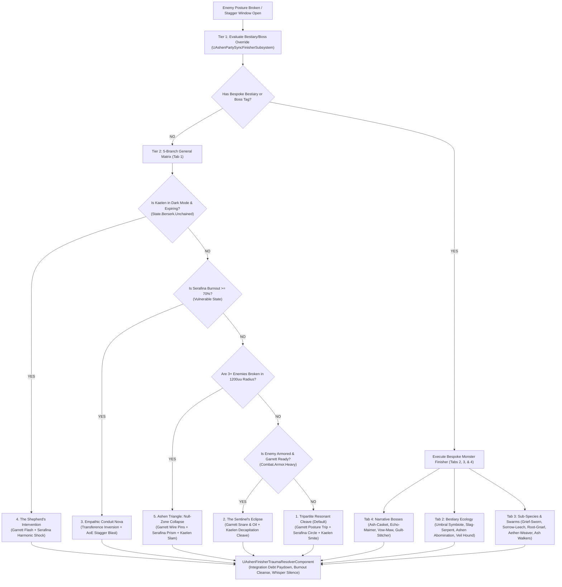

# FINISHER-SPEC-014: THE SYNERGISTIC FINISHER & TRAUMA RESOLUTION MATRIX
**Domain:** Combat / Companions / Soul / Narrative / UI / Audio / World / Core
**Status:** Canon Master Specification & Verified Production C++ Implementation (Builds 1616–1655 / Master Batches #81 & #82)
**Engine Version:** Unreal Engine 5.8 | **Total Builds Clean:** 1,655

---

## 🏛️ Core Philosophy
> *"Your emotional wounds are your combat mechanics."*  
> *"Interdependence over isolation."*

Party sync finishers in **Ashen Oath** are not merely flashy group attacks. They are **tactical resolutions to character trauma, mechanical resets for psychological debt, and narrative proofs of fellowship**.

---

## ⚔️ Master Finisher Selection Architecture & Evaluation Pipeline

The finisher system operates on a two-tier evaluation hierarchy inside [`UAshenPartySyncFinisherSubsystem`](file:///c:/Users/Chris/Ashen%20Oath%20Unreal%20Engine/AshenOath/Source/AshenOath/Combat/AshenPartySyncFinisherSubsystem.h):
1. **Tier 1: Bespoke Bestiary & Boss Tag Overrides (Tabs 2, 3, & 4)** — If the staggered target has a specific enemy class tag (`Enemy.Boss.*` or `Enemy.Bestiary.*`), execute its bespoke choreographed finisher.
2. **Tier 2: The 5-Branch General Finisher Matrix (Tab 1)** — If no bespoke monster override exists, dynamically route based on Kaelen's Dark Mode, Serafina's Burnout, cluster count, armor tags, and baseline trust.

---

## 📋 Comprehensive 18-Finisher Taxonomy (Tabs 1–4)

---

### 🔹 TAB 1: Canonical Base Finishers (Dynamic State Routing)

#### 1. *Tripartite Resonant Cleave* (The Baseline: Cleansing Dawn)
* **Thematic Core:** Mutual sacrifice replaced by synchronized grace. Kaelen allows himself to be anchored instead of drowning in solo martyrdom.
* **Execution Flow:**
  1. **Garrett (Posture Trip):** Slides low behind the staggered target to sever posture anchors with a twin-blade hamstring cross.
  2. **Serafina (Lock & Purge):** Slams stave down, casting a tight *Consecrated Circle* that suspends the target in hard light.
  3. **Kaelen (Resonant Smite):** Executes a downward two-handed smite with *Aegis of the White Flame*, shattering the cage and sending a gold-white shockwave outwards.
* **Mechanical & Psychological Payoff:**
  - Silences *Oathbringer's* parasitic whispers completely for 8.0s.
  - Clears 25% of Kaelen's current *Integration Debt* and reduces Serafina's active *Burnout*.
  - Refills party stamina.

#### 2. *The Sentinel's Eclipse* (Garrett + Kaelen: Subterfuge & Execution)
* **Thematic Core:** Garrett's pragmatic opportunism directly compensating for Kaelen's heavy, rigid Order swordcraft.
* **Execution Flow:**
  1. **Garrett (Calculated Expose):** Fires an alchemical line hook across enemy shoulders, vaulting over them while coating armor in *Burning Steel Oil*.
  2. **Garrett (Drop & Bait):** Pulls cord taut, forcing enemy to one knee and exposing their unarmored neck.
  3. **Kaelen (Horizontal Cleave):** Steps into low guard, swinging *Oathbringer* in a brutal horizontal arc that ignites the oil upon impact into a thermal implosion.
* **Mechanical & Psychological Payoff:**
  - Massive localized armor-shredding damage (critical against heavily armored Inquisitors & Behemoths).
  - Replenishes +3 *Tactical Supply* charges for Garrett ([`UAshenGarrettLineSnareComponent`](file:///c:/Users/Chris/Ashen%20Oath%20Unreal%20Engine/AshenOath/Source/AshenOath/Companions/AshenGarrettLineSnareComponent.h)).
  - Spikes Garrett's pairwise trust score (+0.12).

#### 3. *Empathic Conduit Nova* (Serafina + Kaelen: Transference Inversion)
* **Thematic Core:** Serafina weaponizes the corruption she absorbed from Kaelen, turning accumulated trauma into pure radiant energy.
* **Execution Flow:**
  1. **Serafina (Channel & Touch):** Rushes broken target, placing bare hand on center mass to channel accumulated *Empathic Burnout* into their spiritual core.
  2. **Kaelen (Grounding Thrust):** Lunges forward, driving tip of *Oathbringer* through enemy spine and locking his hand over Serafina's wrist.
  3. **Dual Burst:** Light and shadow converge in blade conduit, detonating target from the inside out.
* **Mechanical & Psychological Payoff:**
  - Resets Serafina's *Empathic Burnout* meter from $\ge 70\%$ down to $0\%$.
  - Converts purged burnout into an explosive area-of-effect stagger knocking down surrounding minions.

#### 4. *The Shepherd's Intervention* (Crisis Control Finisher)
* **Thematic Core:** The party stepping in to save Kaelen from losing himself to the entity in *Dark Mode* (*The Devil's Bargain*).
* **Execution Flow:**
  1. **Kaelen (Berserk Pin):** Transformed by *Shadow Self*, pins elite with *Nyx's Grasp*, pummeling them with reckless necrotic fury.
  2. **Garrett (Flash Intervention):** Tosses blinding flash-bomb into Kaelen's peripheral vision to break the violent trance before friendly fire occurs.
  3. **Serafina (Harmonic Shock):** Drives staff into Kaelen's chest plate, channeling a golden flare that severs the shadow tether, vaporizing the enemy with the discharged unchained force.
* **Mechanical & Psychological Payoff:**
  - Instantly terminates Kaelen's *Unchained / Dark Mode* without triggering a catastrophic Sanity collapse.
  - Clears 50% Integration Debt; silences whispers for 12.0s.
  - Writes a *"Humbled Wielder"* imprint into the field journal.

#### 5. *Ashen Triangle: Null-Zone Collapse* (Full-Trio Spatial Trap)
* **Thematic Core:** Total tactical geometry and environmental mastery.
* **Execution Flow:**
  1. **Garrett (Anchor Pins):** Plants three perimeter wire-stakes in a rapid circular dash around a cluster of broken enemies.
  2. **Serafina (Ley Line Weave):** Casts *Warden's Bulwark*, causing hard-light energy to race along the wires, forming a triangular containment prism.
  3. **Kaelen (Leaping Void-Slam):** Ascends via *Shadow Step*, plummeting down with *Oathbringer* at the triangle's centroid to implode the field.
* **Mechanical & Psychological Payoff:**
  - Massive crowd-clearing AoE execution wiping dense minion packs via [`AAshenTriangleContainmentPrismActor`](file:///c:/Users/Chris/Ashen%20Oath%20Unreal%20Engine/AshenOath/Source/AshenOath/World/AshenTriangleContainmentPrismActor.h).
  - Grants +30% party move-speed and posture defense buff for 12.0s.

---

### 🔹 TAB 2: Bestiary Ecology & Weakspot Exploitation

#### 6. *Umbral Symbiote: The Mirror-Shatter Breaker*
* **Bestiary Context:** The Symbiote splits into three mirrored forms (**The Bastion** vs. Kaelen, **The Shade** vs. Serafina, **The Trickster** vs. Garrett) designed to lock each Paladin into an unwinnable 1v1 duel.
* **Execution Flow:**
  1. **Garrett (Target Swap):** Abandons the Trickster, sliding behind *The Bastion* to sever its heel cords with *Burning Steel Oil*, breaking its impervious guard.
  2. **Kaelen (Catch & Hold):** Pivots, using flat of *Oathbringer* to intercept and deflect *The Shade's* despair bolt meant for Serafina.
  3. **Serafina (Harmonic Refraction):** Drives stave into center ground, unleashing a concentrated *Sun-Pulse* that refracts off the flat of Kaelen's sword, shattering all three avatars simultaneously into ash.
* **Psychological & Mechanical Payoff:** Directly refutes the Symbiote's attempt to divide and isolate; proves fellowship defeats "Corrupted Unity".

#### 7. *Slag-Serpent: Basalt Vent Cauterization*
* **Bestiary Context:** Subterranean elemental monstrosity encased in superheated basalt rock plates that radiate ash smoke, suppressing holy light and supercharging blade whispers.
* **Execution Flow:**
  1. **Serafina (Flash Cryo-Quench):** Channels cooling White Flame directly into glowing molten dorsal spine, cracking basalt into brittle slag ([`UAshenSlagSerpentThermalVentComponent`](file:///c:/Users/Chris/Ashen%20Oath%20Unreal%20Engine/AshenOath/Source/AshenOath/Combat/AshenSlagSerpentThermalVentComponent.h)).
  2. **Garrett (Structural Lever):** Grapples hornless snout, jamming a cold-iron wedge into cooling plate seams to lever throat vents open.
  3. **Kaelen (Nightsteel Core Driver):** Downward thrust driving *Oathbringer* through fractured vent into heart-chamber, extinguishing elemental furnace.
* **Psychological & Mechanical Payoff:** Purges localized heat aura, restoring holy regeneration and silencing sword's environmental whisper amplification.

#### 8. *Ashen Abomination: Canopy Decapitation*
* **Bestiary Context:** Towering, multi-limbed living siege engine with corrupted bark-like hide leading Blight Ghouls (seen at *The Choke at Blackwood Bridge*).
* **Execution Flow:**
  1. **Serafina (Ocular Blind):** Localized light burst into primary eye seams, exposing raw split where corrupted bark meets flesh.
  2. **Kaelen (Blade Lock):** Cross-guards colossal swinging limbs, anchoring the brute in place through pure poise.
  3. **Garrett (Shoulder Vault Thrust):** Uses Kaelen's armored shoulder as a springboard, driving short-sword through illuminated neck seam.
* **Psychological & Mechanical Payoff:** Canonical Blackwood Bridge synergy—Kaelen serves as physical shield so Garrett delivers lethal surgical strike without hesitation.

#### 9. *The Veil Hound: Negative-Space Pin & Smite*
* **Bestiary Context:** Shifting, translucent obsidian canine materializing out of negative space between trees, slipping around standard physical traps.
* **Execution Flow:**
  1. **Garrett (Alchemical Tether):** Shatters frost vial onto terrain, tracking phase shift and hooking rear tendon with tether wire.
  2. **Serafina (Anchor Ground):** Slams *Consecrated Circle*, locking ground to prevent hound from dissolving back into mist.
  3. **Kaelen (Aegis Horizon Cleave):** Steps through ring, sweeping low-arc cleave that shatters obsidian hound into inert crystalline shards.
* **Psychological & Mechanical Payoff:** Counteracts Garrett's fear of lost control and prevents Kaelen from overextending recklessly into fog.

---

### 🔹 TAB 3: Sub-Species, Parasites & Swarms

#### 10. *The Grief-Sworn: The Severed Penance*
* **Creature Concept:** Former knights of the Order of the White Flame encased in rusted, weeping silver plate, trapped in terminal grief loops.
* **Execution Flow:**
  1. **Garrett (Blade Interlock & Disarm):** Ducks beneath heavy broadsword, driving parrying dagger into hilt joint to pin weapon arm.
  2. **Serafina (Empathic Absolution):** Channels White Flame through cracked visor, siphoning weeping despair into her chest to purge the psychic knot.
  3. **Kaelen (Mercy Thrust):** Downward vertical thrust through starburst chestplate insignia, dissolving armor into silver ash.
* **Psychological & Mechanical Payoff:** Resolves Order trauma; converts dying grief into **+20% Poise Defense buff** for Kaelen rather than generating *Integration Debt*.

#### 11. *The Sorrow-Leech: Thermal Extraction & Smite*
* **Creature Concept:** Spindly, bulbous arachnid-like parasites that burrow into companion flesh to force violent flashbacks and wipe Sanity.
* **Execution Flow:**
  1. **Kaelen (Physical Rip & Pin):** Grabs parasite by mandibles, tearing it free and pinning it under flat of *Oathbringer*.
  2. **Garrett (Ghostbloom Flash Ignition):** Shatters *Burning Steel Oil* over swollen abdominal sac, igniting it with flint striker.
  3. **Serafina (Concussive Purge):** Strikes burning sac with iron butt of stave, unleashing radiant percussion wave that cleanses neurotoxins in 5m radius.
* **Psychological & Mechanical Payoff:** Eliminates death-burst sanity wipe; refunds expended alchemical reagents.

#### 12. *The Root-Gnarl: Subterranean Severance & Core Combustion*
* **Creature Concept:** Ancient ironwood root constructs corrupted by leaking Ley Lines and toxic Heartstone sap, rapidly regenerating and caging allies in thorn lattices.
* **Execution Flow:**
  1. **Serafina (Root Consecration):** Drives stave deep into earth, casting *Consecrated Circle* that severs subterranean ley line connection.
  2. **Garrett (Tendon Cross):** Dashes across wooden shoulders, severing upper canopy tendons with twin heated blades.
  3. **Kaelen (Split Trunk Cleave):** Cleaves *Oathbringer* straight down center heart-grain, incinerating corrupted sap from within.
* **Psychological & Mechanical Payoff:** Prevents sprouting secondary thorny brush hazards; clears traversal blockades via [`AAshenRootGnarlTerrainClearanceActor`](file:///c:/Users/Chris/Ashen%20Oath%20Unreal%20Engine/AshenOath/Source/AshenOath/World/AshenRootGnarlTerrainClearanceActor.h).

#### 13. *The Aether-Weaver: Dimensional Anchor Collapse*
* **Creature Concept:** Ethereal, multi-eyed horrors native to thin dimensional veils (Northern Marches) weaving spacetime webs and dragging companions into pocket voids.
* **Execution Flow:**
  1. **Garrett (Calculated Tether):** Fires cold frost resin line hook right as spider phase-shifts, anchoring it to physical geometry.
  2. **Serafina (Phase-Lock Flash):** Casts radiant *Sun-Pulse*, freezing spider halfway between reality and Aether.
  3. **Kaelen (Void-Pierce Horizon):** Pierces anchored skull; Nightsteel implodes creature into a localized gravity singularity clustering nearby enemies.
* **Psychological & Mechanical Payoff:** Groups and staggers surrounding ranged units; fully clears all active spacetime web snares in arena.

#### 14. *Ash Walker Swarms: The Re-Kindled Choke*
* **Creature Concept:** Tragic human husks whose Inner Flames have been fully extinguished, moving in shambling mobs that passively drain hope, light, and stamina.
* **Execution Flow:**
  1. **Serafina (Warden's Funnel):** Summons twin vertical walls of hard light (*Warden's Bulwark*), funneling clustered mob into narrow corridor.
  2. **Garrett (Low Sweep Tripline):** Slides through funnel, deploying chain-barbed tripwire at knee level to collapse front wave into dense heap.
  3. **Kaelen (Radiant Greatsword Sweeper):** Sweeps full 360-degree horizontal low cleave with White Flame, igniting entire swarm to clean ash.
* **Psychological & Mechanical Payoff:** Instantly refills Kaelen's *Emotional Poise* pool and prevents stamina attrition during large mob encounters.

---

### 🔹 TAB 4: Narrative Boss / Labyrinth Unique Finishers

#### 15. *The Ash-Casket: Cryo-Quench & Fracture Drive* (Chamber of Calcified Grief)
* **Mechanical Gimmick:** Volcanic, soot-armored juggernaut that **actively feeds on Holy Light**. Every radiant spell reinforces its basalt plating.
* **Execution Flow:**
  1. **Serafina (Inverted Thermal Ward):** Channels zero-emissive cold-light aura directly into superheated spine vents, inducing thermal shock to crack basalt crust.
  2. **Garrett (Chisel Wedge):** Slides beneath creature, jamming cold-iron spike into neck fissure to lock it open.
  3. **Kaelen (Kinetic Sledge Cleave):** Brings *Oathbringer* down onto spike, shattering calcified shell and imploding interior furnace into grey dust.
* **Psychological & Mechanical Payoff:** Completely bypasses light-absorption mechanic; purges suffocating ash cloud to restore stamina regen.

#### 16. *The Echo-Maimer: Chronos-Shatter Anchor* (Hall of Shattered Echoes)
* **Mechanical Gimmick:** Spawns `BP_PhantomHitbox` actors 3.0s after every hit—a literal **"Somatic Re-enactment / Ghost Damage"** system.
* **Execution Flow:**
  1. **Garrett (Spatial Callout & Line Sweep):** Fires barbed wire net passing through physical space where Echo-Maimer will materialize.
  2. **Serafina (Reality Anchor):** Slams staff into active phantom hitboxes, applying `TAG_State_Cleansed` and collapsing all lagging timeline ghosts into a single frame ([`UAshenEchoMaimerPhantomAnchorComponent`](file:///c:/Users/Chris/Ashen%20Oath%20Unreal%20Engine/AshenOath/Source/AshenOath/Combat/AshenEchoMaimerPhantomAnchorComponent.h)).
  3. **Kaelen (Phase-Locked Horizon Cleave):** Triggers $2.0\times$ break-damage strike across locked target, shattering mirror-glass carapace and collapsing loop.
* **Psychological & Mechanical Payoff:** Eliminates all active ghost hitboxes across arena and grants Garrett a temporary evasion frame window.

#### 17. *The Vow-Maw: Desecration Severance* (Hall of Shattered Oaths)
* **Mechanical Gimmick:** Four-armed corrupted former Order Commander (Gug mythos) with unclasped **Vertical Torso Maw** and rear armor gap (`TAG_Weakspot_RearPlateGap`). Frontal assaults trigger parry-counters.
* **Execution Flow:**
  1. **Kaelen (Frontal Poise Lock):** Cross-guards four-armed onslaught, intentionally taking poise pressure to force chest plates to unlatch.
  2. **Serafina (Core Light Stagger):** Fires focused beam of pure White Flame directly into vertical maw, locking jaws open.
  3. **Garrett (Tendon Sever & Spinal Chute):** Vaults off Kaelen's back, hooks around rear, and drives twin daggers through rear plate gap, severing spinal sinews.
* **Psychological & Mechanical Payoff:** Silences boss's demoralizing Order groans; grants Kaelen +20% Poise Defense against humanoid enemies.

#### 18. *The Guilt-Stitcher: The Severed Tether Collapse* (The Thread of Mirroring)
* **Mechanical Gimmick:** Uses **"Sympathetic Viscera"**—an ethereal suture tethering Kaelen to Serafina. If Kaelen attacks, 50% of kinetic damage reflects onto Serafina ([`UAshenGuiltStitcherSutureComponent`](file:///c:/Users/Chris/Ashen%20Oath%20Unreal%20Engine/AshenOath/Source/AshenOath/Combat/AshenGuiltStitcherSutureComponent.h)).
* **Execution Flow:**
  1. **Garrett (Suture Snip):** Low double-slash through physical cord binding Kaelen and Serafina, cutting damage reflection channel.
  2. **Serafina (Soul-Knot Dissolution):** Channels pure light up remaining tether to scorch Guilt-Stitcher's core, forcing 1.5s vulnerability stagger.
  3. **Kaelen (Restrained Sunder):** Clean, disciplined overhead execution into specter's mask, vaporizing suture nexus.
* **Psychological & Mechanical Payoff:** Cleanses damage-reflection debuff; prevents Serafina from taking *Psychic Scarring*.

---

## 📊 Master Taxonomy Summary Comparison Table

| # | Finisher Name | Category | Primary Mechanical Trigger | Tactical Payoff | Psychological / Relational Outcome |
|---|---|---|---|---|---|
| **1** | **Tripartite Resonant Cleave** | Tab 1 (Base) | Posture Break + Default | High single-target DMG, stamina refill, silences whispers (8s) | Clears 25% *Integration Debt* & 35% *Burnout* |
| **2** | **The Sentinel's Eclipse** | Tab 1 (Base) | Armored Target + Garrett Ready | Armor shred + replenishes +3 *Tactical Supplies* | Boosts Garrett trust (+0.12); unlocks flank AI |
| **3** | **Empathic Conduit Nova** | Tab 1 (Base) | Serafina Burnout $\ge 70\%$ | Massive AoE blast staggering surrounding enemies | Flushes Serafina *Burnout* to 0% |
| **4** | **The Shepherd's Intervention** | Tab 1 (Base) | Kaelen Dark Mode Expiration | Saves party from friendly fire, executes pinned target | Clears 50% *Integration Debt*; silences whispers (12s) |
| **5** | **Ashen Triangle Collapse** | Tab 1 (Base) | 3+ Broken Enemies in 1200uu | Wipes dense enemy swarms, grants +30% movement speed (12s) | Spatial mastery; advances symbiotic resonance |
| **6** | **Umbral Symbiote Breaker** | Tab 2 (Ecology) | Umbral Symbiote Mirrored Split | Refracts light across all 3 avatars, collapsing clones | Refutes forced isolation; proves fellowship |
| **7** | **Slag-Serpent Cauterization** | Tab 2 (Ecology) | Slag-Serpent Basalt Plates | Quenches dorsal plate; extinguishes furnace core | Purges heat aura; silences amplified whispers |
| **8** | **Ashen Abomination Decapitation**| Tab 2 (Ecology) | Ashen Abomination Siege Brute | Ocular blind + poise lock + shoulder vault neck plunge | Canonical Blackwood Bridge fellowship proof |
| **9** | **Veil Hound Pin & Smite** | Tab 2 (Ecology) | Veil Hound Phase Shifting | Frost tether + ground consecrated anchor + arc cleave | Shatters obsidian beast; anchors chaotic fog |
| **10** | **Grief-Sworn Severed Penance** | Tab 3 (Sub-Species)| Grief-Sworn Knight Sorrow Loop | Disarm + visor absolution + starburst mercy thrust | Converts grief to +20% Poise Defense buff |
| **11** | **Sorrow-Leech Extraction** | Tab 3 (Sub-Species)| Sorrow-Leech Burrowing Latch | Tear mandibles + flash ignition + concussive stave blast | Prevents death-burst sanity wipe; refunds reagents |
| **12** | **Root-Gnarl Subterranean Severance**| Tab 3 (Sub-Species)| Root-Gnarl Ley Line Regrowth | Sever ley lines + cut canopy tendons + heartwood cleave | Clears traversal root blockades permanently |
| **13** | **Aether-Weaver Anchor Collapse**| Tab 3 (Sub-Species)| Aether-Weaver Pocket Void Warp| Frost line snag + Sun-Pulse freeze + gravity void implosion | Clusters and staggers surrounding ranged units |
| **14** | **Ash Walkers Re-Kindled Choke** | Tab 3 (Sub-Species)| Ash Walker Swarm Density | Warden's Funnel walls + tripwire sweep + 360° Greatsword | Cleanses mob instantly; refills Emotional Poise |
| **15** | **Ash-Casket Cryo-Quench** | Tab 4 (Boss) | Ash-Casket Light Absorption | Inverted cold ward thermal shock + wedge + sledge cleave | Bypasses light absorption; purges ash cloud |
| **16** | **Echo-Maimer Chronos-Shatter** | Tab 4 (Boss) | Echo-Maimer Phantom Hitboxes | Barbed net + reality anchor staff slam + $2.0\times$ break | Collapses ghost hitboxes; grants evasion window |
| **17** | **Vow-Maw Desecration Severance** | Tab 4 (Boss) | Vow-Maw Vertical Torso Maw | Poise lock maw + White Flame beam + rear spinal plunge | Silences Order groans; grants +20% humanoid poise |
| **18** | **Guilt-Stitcher Tether Collapse**| Tab 4 (Boss) | Sympathetic Viscera Suture | Snip physical cord + dissolve soul knot + mask sunder | Cleanses damage reflection; prevents psychic scars |

---

## 🏛️ Verified C++ Implementation Map (Builds 1616–1655)

- **Subsystem Evaluator (18 Archetypes)**: [`UAshenPartySyncFinisherSubsystem`](file:///c:/Users/Chris/Ashen%20Oath%20Unreal%20Engine/AshenOath/Source/AshenOath/Combat/AshenPartySyncFinisherSubsystem.h)
- **GAS Execution Ability**: [`UAshenPartySyncFinisherGASAbility`](file:///c:/Users/Chris/Ashen%20Oath%20Unreal%20Engine/AshenOath/Source/AshenOath/Combat/AshenPartySyncFinisherGASAbility.h)
- **Trauma & Debt Resolver**: [`UAshenFinisherTraumaResolverComponent`](file:///c:/Users/Chris/Ashen%20Oath%20Unreal%20Engine/AshenOath/Source/AshenOath/Combat/AshenFinisherTraumaResolverComponent.h)
- **Echo-Maimer Phantom Anchor**: [`UAshenEchoMaimerPhantomAnchorComponent`](file:///c:/Users/Chris/Ashen%20Oath%20Unreal%20Engine/AshenOath/Source/AshenOath/Combat/AshenEchoMaimerPhantomAnchorComponent.h)
- **Guilt-Stitcher Suture Snip**: [`UAshenGuiltStitcherSutureComponent`](file:///c:/Users/Chris/Ashen%20Oath%20Unreal%20Engine/AshenOath/Source/AshenOath/Combat/AshenGuiltStitcherSutureComponent.h)
- **Root-Gnarl Terrain Clearance**: [`AAshenRootGnarlTerrainClearanceActor`](file:///c:/Users/Chris/Ashen%20Oath%20Unreal%20Engine/AshenOath/Source/AshenOath/World/AshenRootGnarlTerrainClearanceActor.h)
- **Slag-Serpent Thermal Vent**: [`UAshenSlagSerpentThermalVentComponent`](file:///c:/Users/Chris/Ashen%20Oath%20Unreal%20Engine/AshenOath/Source/AshenOath/Combat/AshenSlagSerpentThermalVentComponent.h)
- **Garrett Line Snare**: [`UAshenGarrettLineSnareComponent`](file:///c:/Users/Chris/Ashen%20Oath%20Unreal%20Engine/AshenOath/Source/AshenOath/Companions/AshenGarrettLineSnareComponent.h)
- **Containment Prism Actor**: [`AAshenTriangleContainmentPrismActor`](file:///c:/Users/Chris/Ashen%20Oath%20Unreal%20Engine/AshenOath/Source/AshenOath/World/AshenTriangleContainmentPrismActor.h)
- **Diegetic Finisher Audio**: [`UAshenDiegeticFinisherAudioComponent`](file:///c:/Users/Chris/Ashen%20Oath%20Unreal%20Engine/AshenOath/Source/AshenOath/Audio/AshenDiegeticFinisherAudioComponent.h) & [`UAshenDiegeticBestiaryFinisherAudioComponent`](file:///c:/Users/Chris/Ashen%20Oath%20Unreal%20Engine/AshenOath/Source/AshenOath/Audio/AshenDiegeticBestiaryFinisherAudioComponent.h)
- **Tactical & Tether HUDs**: [`UAshenUserWidget_BestiaryFinisherTacticalHUD`](file:///c:/Users/Chris/Ashen%20Oath%20Unreal%20Engine/AshenOath/Source/AshenOath/UI/AshenUserWidget_BestiaryFinisherTacticalHUD.h), [`UAshenUserWidget_SympatheticTetherHUD`](file:///c:/Users/Chris/Ashen%20Oath%20Unreal%20Engine/AshenOath/Source/AshenOath/UI/AshenUserWidget_SympatheticTetherHUD.h), [`UAshenUserWidget_PartyFinisherPromptHUD`](file:///c:/Users/Chris/Ashen%20Oath%20Unreal%20Engine/AshenOath/Source/AshenOath/UI/AshenUserWidget_PartyFinisherPromptHUD.h), [`UAshenUserWidget_TraumaPaydownFeedbackHUD`](file:///c:/Users/Chris/Ashen%20Oath%20Unreal%20Engine/AshenOath/Source/AshenOath/UI/AshenUserWidget_TraumaPaydownFeedbackHUD.h)
- **Post-Process Visual Adapters**: [`UAshenFinisherCinematicPostProcessAdapter`](file:///c:/Users/Chris/Ashen%20Oath%20Unreal%20Engine/AshenOath/Source/AshenOath/UI/AshenFinisherCinematicPostProcessAdapter.h) & [`UAshenBestiaryFinisherPostProcessAdapter`](file:///c:/Users/Chris/Ashen%20Oath%20Unreal%20Engine/AshenOath/Source/AshenOath/UI/AshenBestiaryFinisherPostProcessAdapter.h)
- **Trust & Narrative Adapters**: [`UAshenFinisherCompanionTrustAdapter`](file:///c:/Users/Chris/Ashen%20Oath%20Unreal%20Engine/AshenOath/Source/AshenOath/Companions/AshenFinisherCompanionTrustAdapter.h), [`UAshenBestiaryEcologyTrustAdapter`](file:///c:/Users/Chris/Ashen%20Oath%20Unreal%20Engine/AshenOath/Source/AshenOath/Companions/AshenBestiaryEcologyTrustAdapter.h), [`UAshenFinisherDialogueReactivityAdapter`](file:///c:/Users/Chris/Ashen%20Oath%20Unreal%20Engine/AshenOath/Source/AshenOath/Narrative/AshenFinisherDialogueReactivityAdapter.h), [`UAshenBestiaryFinisherDialogueAdapter`](file:///c:/Users/Chris/Ashen%20Oath%20Unreal%20Engine/AshenOath/Source/AshenOath/Narrative/AshenBestiaryFinisherDialogueAdapter.h)
- **SaveGame Persistence**: [`UAshenFinisherSaveGameAdapter`](file:///c:/Users/Chris/Ashen%20Oath%20Unreal%20Engine/AshenOath/Source/AshenOath/Core/AshenFinisherSaveGameAdapter.h) & [`UAshenBestiaryFinisherSaveGameAdapter`](file:///c:/Users/Chris/Ashen%20Oath%20Unreal%20Engine/AshenOath/Source/AshenOath/Core/AshenBestiaryFinisherSaveGameAdapter.h)
- **Master Orchestrators & QA**: [`UAshenMilestone1635MasterSynthesisOrchestrator`](file:///c:/Users/Chris/Ashen%20Oath%20Unreal%20Engine/AshenOath/Source/AshenOath/Orchestration/AshenMilestone1635MasterSynthesisOrchestrator.h), [`UAshenMilestone1655MasterSynthesisOrchestrator`](file:///c:/Users/Chris/Ashen%20Oath%20Unreal%20Engine/AshenOath/Source/AshenOath/Orchestration/AshenMilestone1655MasterSynthesisOrchestrator.h), [`AshenMasterBatch81AutomationTest.cpp`](file:///c:/Users/Chris/Ashen%20Oath%20Unreal%20Engine/AshenOath/Source/AshenOath/QA/AshenMasterBatch81AutomationTest.cpp), [`AshenMasterBatch82AutomationTest.cpp`](file:///c:/Users/Chris/Ashen%20Oath%20Unreal%20Engine/AshenOath/Source/AshenOath/QA/AshenMasterBatch82AutomationTest.cpp)
