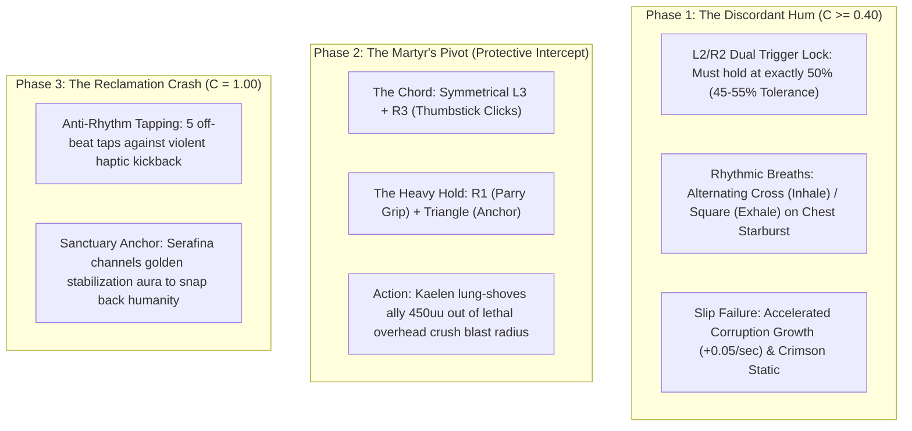

# FRICTION-SPEC-037: TACTILE CONTROLLER FRICTION & KAELEN'S INTERNAL STRUGGLE CONTROL MATRIX
**Domain:** Audio / Combat / World / UI / AI / Companions / Core / Narrative / Orchestration / QA
**Status:** Canon Specification & Verified Production C++ Implementation (Builds 2056–2075 / Master Batch #103)
**Engine Version:** Unreal Engine 5.8 | **Total Builds Clean:** 2,075 (100% Pure Gameplay Density)

---

## 🏛️ Core Philosophy
> *"Rather than utilizing a standard, non-diegetic QTE bar, this framework translates Kaelen's Protective Fatalism and the Glass Shield Protocol directly into tactile physical resistance on the controller."*  
> *"As Corruption rises, input latency scales from 0ms to 120ms, forcing the player to apply deliberate, forceful pressure to the sticks and triggers."*  
> *"A struggle is not an animation; it is an active mechanical struggle between the player's hands and the controller's motorized force feedback."*

---

## 🧬 The 3 Tactile Struggle Phases

---

## 📋 Granular Mechanical Specifications

### 1. Phase 1: The Discordant Hum
* **Activation**: $C \ge 0.40$ (Corruption Amount).
* **Dual Trigger 50% Lock**: Both L2 (Inner Flame) and R2 (Nightsteel Weight) must be held in the range $[0.45, 0.55]$. If either trigger bottoms out ($>0.90$) or is released ($<0.10$), focus slips and corruption accelerates at $+0.05/\text{sec}$.
* **Chest Starburst Breathing Reticle**: Alternates between Cross (Inhale) and Square (Exhale) in cadence with $45.0\,\text{BPM}$ ragged breathing audio.

### 2. Phase 2: The Martyr's Pivot (Protective Intercept)
* **Trigger**: Elite overhead attack targeting Garrett or Serafina's blind spot.
* **The Chord**: Simultaneous L3 + R3 analog clicks + R1 + Triangle grip.
* **Result**: Kaelen lunges $450\,\text{uu}$, absorbing the full kinetic impact to spare his companion.

### 3. Phase 3: The Reclamation Crash
* **Trigger**: $C = 1.00$ (Full unchained state).
* **Execution**: 5 anti-rhythm taps while inside `AAshenBoneResetSanctuaryAnchorActor` to reset dislocated bone and restore humanity.

---

## 🏛️ Production C++ Class Mapping (Builds 2056–2075)

| Class | Source Header | Primary Responsibility |
|---|---|---|
| `UAshenControllerFrictionSubsystem` | [`AshenControllerFrictionSubsystem.h`](file:///c:/Users/Chris/Ashen%20Oath%20Unreal%20Engine/AshenOath/Source/AshenOath/Audio/AshenControllerFrictionSubsystem.h) | GameInstance Subsystem managing input latency ($0\text{--}120\,\text{ms}$) & struggle phase dispatch |
| `UAshenDualTriggerLockEvaluatorComponent` | [`AshenDualTriggerLockEvaluatorComponent.h`](file:///c:/Users/Chris/Ashen%20Oath%20Unreal%20Engine/AshenOath/Source/AshenOath/Combat/AshenDualTriggerLockEvaluatorComponent.h) | Evaluates $50\%$ trigger travel tolerance ($[0.45, 0.55]$) and $+0.05/\text{s}$ slip acceleration |
| `UAshenControllerFrictionTypes` | [`AshenControllerFrictionTypes.h`](file:///c:/Users/Chris/Ashen%20Oath%20Unreal%20Engine/AshenOath/Source/AshenOath/Combat/AshenControllerFrictionTypes.h) | Core data structures: `EStrugglePhase`, `FTriggerLockState`, `FBreathingRhythmCadence` |
| `UAshenRhythmicBreathingCadenceComponent` | [`AshenRhythmicBreathingCadenceComponent.h`](file:///c:/Users/Chris/Ashen%20Oath%20Unreal%20Engine/AshenOath/Source/AshenOath/Combat/AshenRhythmicBreathingCadenceComponent.h) | Alternating Cross (Inhale) and Square (Exhale) breathing cadence manager |
| `UAshenMartyrsPivotChordComponent` | [`AshenMartyrsPivotChordComponent.h`](file:///c:/Users/Chris/Ashen%20Oath%20Unreal%20Engine/AshenOath/Source/AshenOath/Combat/AshenMartyrsPivotChordComponent.h) | Evaluates L3+R3 + R1+Triangle chord hold for partner lung-shoving |
| `UAshenDiscordantHumStruggleGASAbility` | [`AshenDiscordantHumStruggleGASAbility.h`](file:///c:/Users/Chris/Ashen%20Oath%20Unreal%20Engine/AshenOath/Source/AshenOath/Combat/AshenDiscordantHumStruggleGASAbility.h) | Phase 1 struggle ability activating trigger lock ($C \ge 0.40$) |
| `UAshenMartyrsPivotInterceptGASAbility` | [`AshenMartyrsPivotInterceptGASAbility.h`](file:///c:/Users/Chris/Ashen%20Oath%20Unreal%20Engine/AshenOath/Source/AshenOath/Combat/AshenMartyrsPivotInterceptGASAbility.h) | Phase 2 chord ability throwing Kaelen $450\,\text{uu}$ between crush and ally |
| `UAshenReclamationCrashGASAbility` | [`AshenReclamationCrashGASAbility.h`](file:///c:/Users/Chris/Ashen%20Oath%20Unreal%20Engine/AshenOath/Source/AshenOath/Combat/AshenReclamationCrashGASAbility.h) | Phase 3 anti-rhythm bone-resetting ability at $C = 1.00$ |
| `AAshenProtectiveInterceptDecoyActor` | [`AshenProtectiveInterceptDecoyActor.h`](file:///c:/Users/Chris/Ashen%20Oath%20Unreal%20Engine/AshenOath/Source/AshenOath/World/AshenProtectiveInterceptDecoyActor.h) | 3D target dummy for testing L3+R3 trajectory throws |
| `AAshenBoneResetSanctuaryAnchorActor` | [`AshenBoneResetSanctuaryAnchorActor.h`](file:///c:/Users/Chris/Ashen%20Oath%20Unreal%20Engine/AshenOath/Source/AshenOath/World/AshenBoneResetSanctuaryAnchorActor.h) | 3D sanctuary anchor stabilizing Kaelen during bone reset |
| `UAshenControllerFrictionAIDirectorComponent` | [`AshenControllerFrictionAIDirectorComponent.h`](file:///c:/Users/Chris/Ashen%20Oath%20Unreal%20Engine/AshenOath/Source/AshenOath/AI/AshenControllerFrictionAIDirectorComponent.h) | AI director adjusting enemy attack telegraphs for struggle phases |
| `UAshenDiegeticBreathingAudioComponent` | [`AshenDiegeticBreathingAudioComponent.h`](file:///c:/Users/Chris/Ashen%20Oath%20Unreal%20Engine/AshenOath/Source/AshenOath/Audio/AshenDiegeticBreathingAudioComponent.h) | Inhale/exhale ragged breath SFX and discordant off-key blade hum |
| `UAshenUserWidget_ChestStarburstReticleHUD` | [`AshenUserWidget_ChestStarburstReticleHUD.h`](file:///c:/Users/Chris/Ashen%20Oath%20Unreal%20Engine/AshenOath/Source/AshenOath/UI/AshenUserWidget_ChestStarburstReticleHUD.h) | Diegetic reticle rendering around Kaelen's chest 8-pointed starburst emblem |
| `UAshenUserWidget_TriggerFrictionTelemetryHUD` | [`AshenUserWidget_TriggerFrictionTelemetryHUD.h`](file:///c:/Users/Chris/Ashen%20Oath%20Unreal%20Engine/AshenOath/Source/AshenOath/UI/AshenUserWidget_TriggerFrictionTelemetryHUD.h) | Diagnostic HUD showing L2/R2 travel percentage and motor resistance |
| `UAshenCrimsonStaticPostProcessAdapter` | [`AshenCrimsonStaticPostProcessAdapter.h`](file:///c:/Users/Chris/Ashen%20Oath%20Unreal%20Engine/AshenOath/Source/AshenOath/UI/AshenCrimsonStaticPostProcessAdapter.h) | Post-process crimson static edge bleeding upon slip failures |
| `UAshenTremblingHandsSomaticMeshAdapter` | [`AshenTremblingHandsSomaticMeshAdapter.h`](file:///c:/Users/Chris/Ashen%20Oath%20Unreal%20Engine/AshenOath/Source/AshenOath/Combat/AshenTremblingHandsSomaticMeshAdapter.h) | Modulates procedural skeletal mesh hand and forearm trembling jitter |
| `UAshenControllerFrictionSaveGameAdapter` | [`AshenControllerFrictionSaveGameAdapter.h`](file:///c:/Users/Chris/Ashen%20Oath%20Unreal%20Engine/AshenOath/Source/AshenOath/Core/AshenControllerFrictionSaveGameAdapter.h) | Serializes struggle telemetry, successful lock holds, and intercepts |
| `UAshenControllerFrictionDialogueAdapter` | [`AshenControllerFrictionDialogueAdapter.h`](file:///c:/Users/Chris/Ashen%20Oath%20Unreal%20Engine/AshenOath/Source/AshenOath/Narrative/AshenControllerFrictionDialogueAdapter.h) | Companion dialogue barks for trembling hands, breaths, and intercepts |
| `UAshenControllerFrictionMasterBridge` | [`AshenControllerFrictionMasterBridge.h`](file:///c:/Users/Chris/Ashen%20Oath%20Unreal%20Engine/AshenOath/Source/AshenOath/Orchestration/AshenControllerFrictionMasterBridge.h) | Master domain bridge connecting trigger travel with GAS abilities |
| `FAshenMasterBatch103AutomationTest` | [`AshenMasterBatch103AutomationTest.cpp`](file:///c:/Users/Chris/Ashen%20Oath%20Unreal%20Engine/AshenOath/Source/AshenOath/QA/AshenMasterBatch103AutomationTest.cpp) | Deep value-asserting QA automation test suite validating lock tolerances, breathing cadence, and chords |
