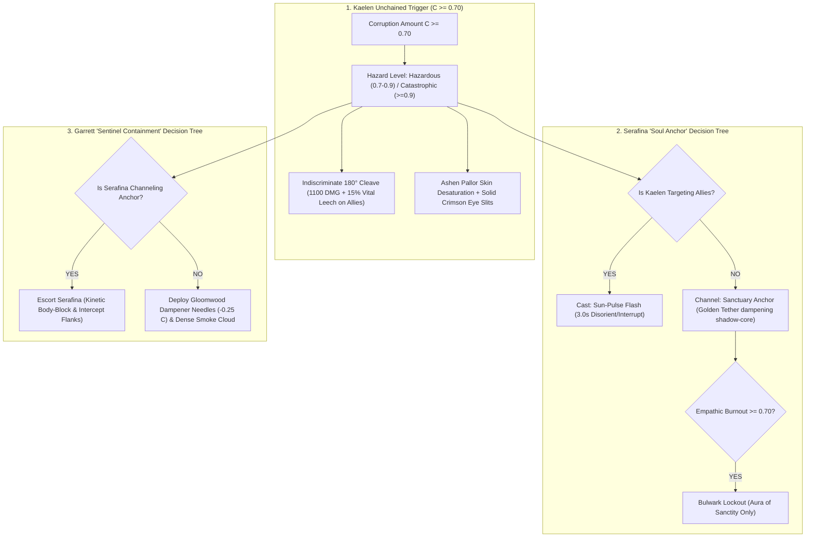

# GAMBIT-SPEC-038: THE SHEPHERD'S GAMBIT & UNCHAINED PARTY COLLAPSE AI
**Domain:** AI / Combat / World / Audio / UI / Companions / Core / Narrative / Orchestration / QA
**Status:** Canon Specification & Verified Production C++ Implementation (Builds 2076–2095 / Master Batch #104)
**Engine Version:** Unreal Engine 5.8 | **Total Builds Clean:** 2,095 (100% Pure Gameplay Density)

---

## 🏛️ Core Philosophy
> *"When Kaelen's corruption crosses Stage 2 ($C \ge 0.70$), the Three-Legged Stool dissolves."*  
> *"Companions stop fighting monsters and begin fighting to contain Kaelen and survive his blind, kinetic greatsword cleaves."*  
> *"Target discrimination is completely lost; greatsword sweeps carry full kinetic friendly-fire and siphon 15% vital reserves from companions caught in the arc."*

---

## 🧬 The Shepherd's Gambit AI State Machine

---

## 📋 Granular Mechanical Specifications

### 1. The Symmetrical Party Collapse ($C \ge 0.70$)
* **Subsystem**: `UAshenShepherdsGambitSubsystem` tracks party hazard level:
  - $C < 0.70$: `Safe` (Standard Three-Legged Stool cooperation).
  - $0.70 \le C < 0.90$: `Hazardous` (The Shepherd's Gambit active).
  - $C \ge 0.90$: `Catastrophic` (Target-blind rampage, Garrett kinetic wall).

### 2. Serafina's Soul Anchor Decision Tree
* **Targeting Allies**: Casts `UAshenSerafinaSunPulseGASAbility` to emit an intense white flash, disorienting and interrupting Kaelen for $3.0\,\text{s}$.
* **Wild / Attacking Monsters**: Channels `AAshenSerafinaGoldenLeashSanctuaryActor` ($600\,\text{uu}$ radius) to dampen his shadow core.
* **Burnout Threshold**: If $B \ge 0.70$, enters `Bulwark Lockout`, disabling active casts and triggering `UAshenUserWidget_BulwarkLockoutHUD`.

### 3. Garrett's Sentinel Containment
* **Escort Mode**: Forms a physical barrier between Kaelen's wide sweeps and Serafina's casting.
* **Chemical Suppression**: Deploys `UAshenGarrettGloomwoodNeedleGASAbility` ($-0.25$ corruption) and spawns `AAshenSulfurousSmokeBalmCloudActor` ($800\,\text{uu}$ radius) to blind and restrict Kaelen's target acquisition.

### 4. Vital Leech & Friendly-Fire Sweeps
* `UAshenUnchainedVitalLeechComponent` inflicts $1100.0\,\text{DMG}$ in a $180^\circ$ arc and drains $15\%$ vital reserves from companions caught in the hitbox.

---

## 🏛️ Production C++ Class Mapping (Builds 2076–2095)

| Class | Source Header | Primary Responsibility |
|---|---|---|
| `UAshenShepherdsGambitSubsystem` | [`AshenShepherdsGambitSubsystem.h`](file:///c:/Users/Chris/Ashen%20Oath%20Unreal%20Engine/AshenOath/Source/AshenOath/AI/AshenShepherdsGambitSubsystem.h) | GameInstance Subsystem managing party collapse state & crisis containment ($C \ge 0.70$) |
| `UAshenSerafinaSoulAnchorAIComponent` | [`AshenSerafinaSoulAnchorAIComponent.h`](file:///c:/Users/Chris/Ashen%20Oath%20Unreal%20Engine/AshenOath/Source/AshenOath/AI/AshenSerafinaSoulAnchorAIComponent.h) | Serafina's AI decision tree (Sun-Pulse, Anchor, Bulwark Lockout) |
| `UAshenShepherdsGambitTypes` | [`AshenShepherdsGambitTypes.h`](file:///c:/Users/Chris/Ashen%20Oath%20Unreal%20Engine/AshenOath/Source/AshenOath/AI/AshenShepherdsGambitTypes.h) | Core data structures: `EContainmentState`, `EUnchainedHazardLevel`, `FCompanionContainmentBehavior` |
| `UAshenGarrettSentinelContainmentAIComponent` | [`AshenGarrettSentinelContainmentAIComponent.h`](file:///c:/Users/Chris/Ashen%20Oath%20Unreal%20Engine/AshenOath/Source/AshenOath/AI/AshenGarrettSentinelContainmentAIComponent.h) | Garrett's AI decision tree (Gloomwood needles, smoke deployment, Serafina escort) |
| `UAshenUnchainedVitalLeechComponent` | [`AshenUnchainedVitalLeechComponent.h`](file:///c:/Users/Chris/Ashen%20Oath%20Unreal%20Engine/AshenOath/Source/AshenOath/Combat/AshenUnchainedVitalLeechComponent.h) | 180° friendly-fire greatsword sweep & 15% vital reserve siphon |
| `UAshenSerafinaSunPulseGASAbility` | [`AshenSerafinaSunPulseGASAbility.h`](file:///c:/Users/Chris/Ashen%20Oath%20Unreal%20Engine/AshenOath/Source/AshenOath/Combat/AshenSerafinaSunPulseGASAbility.h) | Serafina's blinding flash ability disorienting Kaelen for 3.0s |
| `UAshenGarrettGloomwoodNeedleGASAbility` | [`AshenGarrettGloomwoodNeedleGASAbility.h`](file:///c:/Users/Chris/Ashen%20Oath%20Unreal%20Engine/AshenOath/Source/AshenOath/Combat/AshenGarrettGloomwoodNeedleGASAbility.h) | Garrett's chemical dampener needle reducing corruption by -0.25 |
| `UAshenUnchainedKineticSweepGASAbility` | [`AshenUnchainedKineticSweepGASAbility.h`](file:///c:/Users/Chris/Ashen%20Oath%20Unreal%20Engine/AshenOath/Source/AshenOath/Combat/AshenUnchainedKineticSweepGASAbility.h) | Kaelen's indiscriminate 180° heavy cleave ($1100.0\,\text{DMG}$) |
| `AAshenSulfurousSmokeBalmCloudActor` | [`AshenSulfurousSmokeBalmCloudActor.h`](file:///c:/Users/Chris/Ashen%20Oath%20Unreal%20Engine/AshenOath/Source/AshenOath/World/AshenSulfurousSmokeBalmCloudActor.h) | 3D volumetric smoke cloud blinding and containing Kaelen |
| `AAshenSerafinaGoldenLeashSanctuaryActor` | [`AshenSerafinaGoldenLeashSanctuaryActor.h`](file:///c:/Users/Chris/Ashen%20Oath%20Unreal%20Engine/AshenOath/Source/AshenOath/World/AshenSerafinaGoldenLeashSanctuaryActor.h) | 3D metaphysical tether anchor preventing dissolution into an Ash Walker |
| `UAshenShepherdsGambitAIDirectorComponent` | [`AshenShepherdsGambitAIDirectorComponent.h`](file:///c:/Users/Chris/Ashen%20Oath%20Unreal%20Engine/AshenOath/Source/AshenOath/AI/AshenShepherdsGambitAIDirectorComponent.h) | AI director coordinating Garrett body-blocks and Serafina casting |
| `UAshenDiegeticUnchainedAudioComponent` | [`AshenDiegeticUnchainedAudioComponent.h`](file:///c:/Users/Chris/Ashen%20Oath%20Unreal%20Engine/AshenOath/Source/AshenOath/Audio/AshenDiegeticUnchainedAudioComponent.h) | Monstrous void roars and frantic companion callouts |
| `UAshenUserWidget_UnchainedContainmentHUD` | [`AshenUserWidget_UnchainedContainmentHUD.h`](file:///c:/Users/Chris/Ashen%20Oath%20Unreal%20Engine/AshenOath/Source/AshenOath/UI/AshenUserWidget_UnchainedContainmentHUD.h) | Somatic HUD displaying containment status & soul tether |
| `UAshenUserWidget_BulwarkLockoutHUD` | [`AshenUserWidget_BulwarkLockoutHUD.h`](file:///c:/Users/Chris/Ashen%20Oath%20Unreal%20Engine/AshenOath/Source/AshenOath/UI/AshenUserWidget_BulwarkLockoutHUD.h) | Emergency HUD flashing when Serafina burnout $B \ge 0.70$ |
| `UAshenUnchainedVisionPostProcessAdapter` | [`AshenUnchainedVisionPostProcessAdapter.h`](file:///c:/Users/Chris/Ashen%20Oath%20Unreal%20Engine/AshenOath/Source/AshenOath/UI/AshenUnchainedVisionPostProcessAdapter.h) | Monochromatic tunnel-vision & pulsing crimson rim |
| `UAshenAshenPallorMeshAdapter` | [`AshenAshenPallorMeshAdapter.h`](file:///c:/Users/Chris/Ashen%20Oath%20Unreal%20Engine/AshenOath/Source/AshenOath/Combat/AshenAshenPallorMeshAdapter.h) | Face skin pallor desaturation & solid crimson eye slits |
| `UAshenShepherdsGambitSaveGameAdapter` | [`AshenShepherdsGambitSaveGameAdapter.h`](file:///c:/Users/Chris/Ashen%20Oath%20Unreal%20Engine/AshenOath/Source/AshenOath/Core/AshenShepherdsGambitSaveGameAdapter.h) | Serializes containment events and party burnout logs |
| `UAshenShepherdsGambitDialogueAdapter` | [`AshenShepherdsGambitDialogueAdapter.h`](file:///c:/Users/Chris/Ashen%20Oath%20Unreal%20Engine/AshenOath/Source/AshenOath/Narrative/AshenShepherdsGambitDialogueAdapter.h) | Companion dialogue barks for unchained rampage |
| `UAshenShepherdsGambitMasterBridge` | [`AshenShepherdsGambitMasterBridge.h`](file:///c:/Users/Chris/Ashen%20Oath%20Unreal%20Engine/AshenOath/Source/AshenOath/Orchestration/AshenShepherdsGambitMasterBridge.h) | Master bridge linking unchained state with AI decision trees |
| `FAshenMasterBatch104AutomationTest` | [`AshenMasterBatch104AutomationTest.cpp`](file:///c:/Users/Chris/Ashen%20Oath%20Unreal%20Engine/AshenOath/Source/AshenOath/QA/AshenMasterBatch104AutomationTest.cpp) | Deep value-asserting QA automation test suite validating $C \ge 0.70$ party collapse, Serafina Sun-Pulse priority, and Garrett suppressant math |
