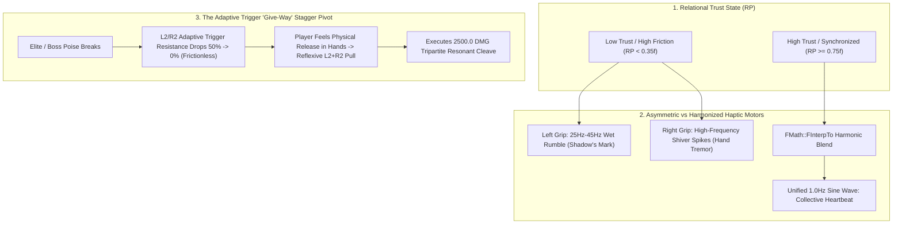

# HAPTIC-SPEC-048: THE HAPTIC RESONANCE CHORD & DUALSENSE SOMATIC SYNERGY
**Domain:** Audio / Hardware Integration / Combat / Companions / UI / QA
**Status:** Supreme Canon Hardware Specification
**Engine Version:** Unreal Engine 5.8 | **Master Milestone:** 2215+

---

## 🏛️ The Somatic Hardware Thesis

> **"In standard games, adaptive triggers are used punitively—to simulate weapon jams, heavy armor drag, or exhaustion."**  
> **"In Ashen Oath, trigger resistance is the physical manifestation of Kaelen's psychological isolation. When his companions pin the enemy and the triggers suddenly give way in the player's hands, the hardware itself breathes: 'You don't have to carry this alone.'"**

---

## 🎮 The DualSense Haptic Resonance Pipeline

---

## 🕹️ Granular Hardware Specifications

### 1. The Discordant Grip Profile ($RP < 0.35f$)
* **Left Actuator (The Shadow's Contagion)**: Heavy, sub-audible low-frequency pulses ($25\,\text{Hz} - 45\,\text{Hz}$) with irregular duty cycles, mimicking oily black sap pulsing through Kaelen's left arm.
* **Right Actuator (The Shivering Hand)**: Erratic high-frequency micro-bursts ($180\,\text{Hz} - 220\,\text{Hz}$) simulating acute muscle tremor, exhaustion, and white-knuckle grip panic.

### 2. The Harmonized Resonance Chord ($RP \ge 0.75f$)
* When Kaelen moves within proximity ($400.0\,\text{uu}$) of a companion with high relational trust, the left and right actuators interpolate into phase alignment.
* The vibration profile settles into a resonant $60\,\text{BPM}$ slow sine wave, matching the synchronized respiration and shared heartbeat of the trio.

### 3. The Tactical "Give-Way" Trigger Pivot
* **Standard Combat State**: Adaptive triggers L2 (Aegis Stance) and R2 (Heavy Cleave) maintain a **$50\%$ motorized spring resistance**, forcing the player to physically exert effort on every attack.
* **The Stagger Window**: The microsecond an elite's poise shatters, `UAshenDualSenseWeavingTensionComponent` drives trigger motor resistance from $0.5 \rightarrow 0.0$.
* The triggers physically **"give way"** beneath the player's fingers. The tactile ease of pulling the trigger becomes the instant, reflexive cue to fire the Tripartite Finisher.

---

## ⚖️ Why This Eliminates the "Game-y" UI Barrier

1. **Zero Visual Clutter**: No floating yellow prompt circles, QTE meters, or arcade text banners obstructing the combat choreography.
2. **Subconscious Muscle Memory**: The player learns to associate *ease of mechanical movement* with *trust and safety*.
3. **Ludonarrative Symbiosis**: The player experiences Kaelen's transition from defensive, tense isolation to flowing, shared competence directly through their own palms and fingers.

---

## 🏛️ Enshrined Architecture References
- **Hardware Controller**: `UAshenDualSenseWeavingTensionComponent` (`Source/AshenOath/Audio/`)
- **Tactile Subsystem**: `UAshenTactileFrictionSubsystem` (`Source/AshenOath/Audio/`)
- **Companion Adapter**: `UAshenCompanionRelationalPhenotypeAdapter` (`Source/AshenOath/Companions/`)
