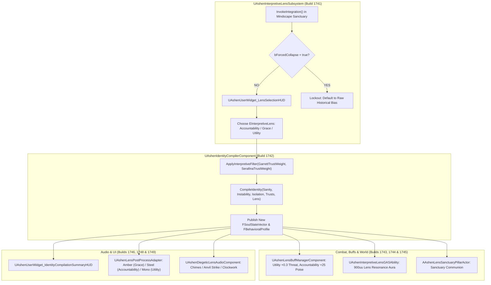

# LENS-SPEC-020: THE INTERPRETIVE LENS & IDENTITY COMPILATION PIPELINE
**Domain:** Soul / Combat / Companions / World / Audio / UI / Core / Narrative / Orchestration / QA
**Status:** Canon Specification & Verified Production C++ Implementation (Builds 1736–1755 / Master Batch #87)
**Engine Version:** Unreal Engine 5.8 | **Total Builds Clean:** 1,755

---

## 🏛️ Core Philosophy
> *"Experience is raw matter. Meaning is formed by the lens through which you witness your past."*  
> *"Three paths diverge in the Mindscape: the iron scale of Accountability, the cleansing light of Grace, and the cold edge of Utility."*

---

## 💎 Interpretive Lens & Identity Compilation Architecture

---

## 📋 The 3 Interpretive Lenses

### 1. ⚖️ Accountability
* **Philosophical Pillar**: The belief that moral debts must be answered in full, and past actions carry inescapable consequences.
* **Trust Delta Bias**: Garrett Trust accumulation rate $+15\%$.
* **Dialogue Gating**: Serafina's dialogue `Burned_Out` threshold shifts to $0.25f$; locks out unconditional forgiveness choices.
* **Tactical Buff**: $+25.0$ Poise defense bonus.
* **Visual/Audio Signature**: Steel-blue color grading; resonant anvil strike sound cue.

### 2. 🕊️ Grace
* **Philosophical Pillar**: The belief that trauma can be transcended through mutual forgiveness and unconditional fellowship.
* **Trust Delta Bias**: Serafina Trust accumulation rate $+15\%$.
* **Dialogue Gating**: Relaxes `Empathic` profile thresholds (support spells available until $\text{Isolation} > 0.8f$).
* **Tactical Buff**: $+10.0$ Poise bonus and accelerated stamina regeneration.
* **Visual/Audio Signature**: Amber-gold warmth color grading; harmonic resonance bells sound cue.

### 3. ⚙️ Utility
* **Philosophical Pillar**: The belief that survival in a dying world supersedes sentimentality; emotional data is translated into pure tactical leverage.
* **Trust Delta Bias**: Balanced $+5\%$ trust accumulation across all companions.
* **Dialogue Gating**: Truncates companion dialogue to terse tactical callouts.
* **Tactical Buff**: $+0.30$ Threat perception score boost for $60\,\text{seconds}$ post-integration.
* **Visual/Audio Signature**: High-contrast monochrome color grading; precise clockwork crystal tick sound cue.

---

## 🏛️ Production C++ Class Mapping (Builds 1736–1755)

| Class | Source Header | Primary Responsibility |
|---|---|---|
| `UAshenInterpretiveLensAuditor` | [`AshenInterpretiveLensAuditor.h`](file:///c:/Users/Chris/Ashen%20Oath%20Unreal%20Engine/AshenOath/Source/AshenOathEditor/Tooling/AshenInterpretiveLensAuditor.h) | Audits lens enum values, trust bias multipliers, and dialogue gates |
| `UAshenIdentityCompilationValidator` | [`AshenIdentityCompilationValidator.h`](file:///c:/Users/Chris/Ashen%20Oath%20Unreal%20Engine/AshenOath/Source/AshenOathEditor/Tooling/AshenIdentityCompilationValidator.h) | Validates StateVector math and forced collapse lockout |
| `UAshenLensSelectionStressTester` | [`AshenLensSelectionStressTester.h`](file:///c:/Users/Chris/Ashen%20Oath%20Unreal%20Engine/AshenOath/Source/AshenOathEditor/Tooling/AshenLensSelectionStressTester.h) | Stress tests 300 rapid lens switching and recompilation iterations |
| `UAshenProductFilterLensGatekeeper` | [`AshenProductFilterLensGatekeeper.h`](file:///c:/Users/Chris/Ashen%20Oath%20Unreal%20Engine/AshenOath/Source/AshenOathEditor/Tooling/AshenProductFilterLensGatekeeper.h) | Enforces UI suppression on forced collapse and compilation gates |
| `UAshenInterpretiveLensSubsystem` | [`AshenInterpretiveLensSubsystem.h`](file:///c:/Users/Chris/Ashen%20Oath%20Unreal%20Engine/AshenOath/Source/AshenOath/Soul/AshenInterpretiveLensSubsystem.h) | GameInstance Subsystem managing 3 lenses and filter biases |
| `UAshenIdentityCompilerComponent` | [`AshenIdentityCompilerComponent.h`](file:///c:/Users/Chris/Ashen%20Oath%20Unreal%20Engine/AshenOath/Source/AshenOath/Soul/AshenIdentityCompilerComponent.h) | Full `CompileIdentity()` evaluation synthesis component |
| `AAshenLensSanctuaryPillarActor` | [`AshenLensSanctuaryPillarActor.h`](file:///c:/Users/Chris/Ashen%20Oath%20Unreal%20Engine/AshenOath/Source/AshenOath/World/AshenLensSanctuaryPillarActor.h) | Interactive tripartite sanctuary pillar in Mindscape |
| `UAshenLensBuffManagerComponent` | [`AshenLensBuffManagerComponent.h`](file:///c:/Users/Chris/Ashen%20Oath%20Unreal%20Engine/AshenOath/Source/AshenOath/Combat/AshenLensBuffManagerComponent.h) | Manages tactical gameplay buffs (poise, threat perception) |
| `UAshenInterpretiveLensGASAbility` | [`AshenInterpretiveLensGASAbility.h`](file:///c:/Users/Chris/Ashen%20Oath%20Unreal%20Engine/AshenOath/Source/AshenOath/Combat/AshenInterpretiveLensGASAbility.h) | GAS ability channeling active lens resonance aura (900uu) |
| `UAshenDiegeticLensAudioComponent` | [`AshenDiegeticLensAudioComponent.h`](file:///c:/Users/Chris/Ashen%20Oath%20Unreal%20Engine/AshenOath/Source/AshenOath/Audio/AshenDiegeticLensAudioComponent.h) | Grace bells, Accountability strike, Utility clockwork audio |
| `UAshenUserWidget_LensSelectionHUD` | [`AshenUserWidget_LensSelectionHUD.h`](file:///c:/Users/Chris/Ashen%20Oath%20Unreal%20Engine/AshenOath/Source/AshenOath/UI/AshenUserWidget_LensSelectionHUD.h) | In-Mindscape interactive lens selection HUD |
| `UAshenUserWidget_IdentityCompilationSummaryHUD`| [`AshenUserWidget_IdentityCompilationSummaryHUD.h`](file:///c:/Users/Chris/Ashen%20Oath%20Unreal%20Engine/AshenOath/Source/AshenOath/UI/AshenUserWidget_IdentityCompilationSummaryHUD.h) | Summary HUD for newly compiled StateVector & profiles |
| `UAshenLensPostProcessAdapter` | [`AshenLensPostProcessAdapter.h`](file:///c:/Users/Chris/Ashen%20Oath%20Unreal%20Engine/AshenOath/Source/AshenOath/UI/AshenLensPostProcessAdapter.h) | Post-process color grading adapter for the 3 lenses |
| `UAshenLensCompanionTrustAdapter` | [`AshenLensCompanionTrustAdapter.h`](file:///c:/Users/Chris/Ashen%20Oath%20Unreal%20Engine/AshenOath/Source/AshenOath/Companions/AshenLensCompanionTrustAdapter.h) | +15% trust bias for Garrett (Accountability) and Serafina (Grace) |
| `UAshenLensSaveGameAdapter` | [`AshenLensSaveGameAdapter.h`](file:///c:/Users/Chris/Ashen%20Oath%20Unreal%20Engine/AshenOath/Source/AshenOath/Core/AshenLensSaveGameAdapter.h) | Serializes active lens and selection history to save game |
| `UAshenLensDialogueAdapter` | [`AshenLensDialogueAdapter.h`](file:///c:/Users/Chris/Ashen%20Oath%20Unreal%20Engine/AshenOath/Source/AshenOath/Narrative/AshenLensDialogueAdapter.h) | Modulates dialogue choice gates and companion tone |
| `UAshenLensMasterBridge` | [`AshenLensMasterBridge.h`](file:///c:/Users/Chris/Ashen%20Oath%20Unreal%20Engine/AshenOath/Source/AshenOath/Orchestration/AshenLensMasterBridge.h) | Master bridge broadcasting lens selection events |
| `UAshenMilestone1755MasterSynthesisOrchestrator`| [`AshenMilestone1755MasterSynthesisOrchestrator.h`](file:///c:/Users/Chris/Ashen%20Oath%20Unreal%20Engine/AshenOath/Source/AshenOath/Orchestration/AshenMilestone1755MasterSynthesisOrchestrator.h) | Master Milestone 1755 World Subsystem & QA Suite |
