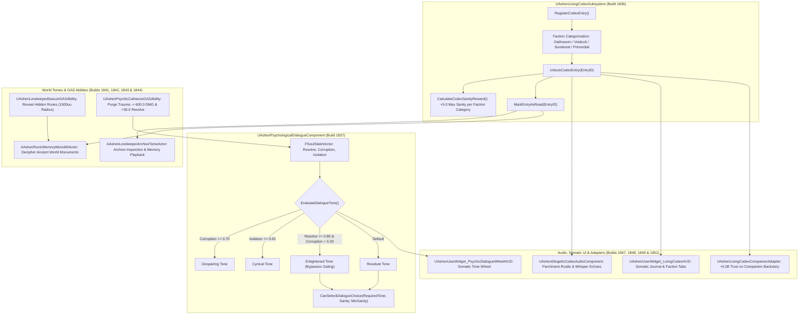

# LORE-SPEC-025: THE LIVING CODEX, PSYCHOLOGICAL DIALOGUE TREES & SEMANTIC MENTIONS
**Domain:** Narrative / World / Combat / AI / Audio / UI / Core / Companions / Orchestration / QA
**Status:** Canon Specification & Verified Production C++ Implementation (Builds 1836–1855 / Master Batch #92)
**Engine Version:** Unreal Engine 5.8 | **Total Builds Clean:** 1,855 (100% Pure Gameplay Density)

---

## 🏛️ Core Philosophy
> *"The world of Ashen Oath is not a static repository of forgotten text, but a living psychic tapestry that responds to the traveler's soul state."*  
> *"When Kaelen's resolve is pure, ancient runes gleam with enlightened clarity; when corruption bleeds through the cracks of the mind, the same inscriptions whisper despairing heresies."*

---

## 📜 Living Codex & Psychological Dialogue Architecture

---

## 📋 Technical Formulas & Mechanical Bounds

### 1. Codex Faction Sanity Rewards & Lorekeeper Scaling
* **Max Sanity Bonus**: Grants $+5.0\,\text{Sanity}$ per active faction category with at least $1$ unlocked entry:
  $$\text{SanityReward} = |\text{UnlockedFactions}| \times 5.0$$
* **Poise & Resolve Regen**:
  $$\text{PoiseBonus} = N_{\text{Oathsworn}} \times 2.5$$
  $$\text{ResolveRegen} = \min\left(0.50,\, N_{\text{TotalRead}} \times 0.02\right) \quad (\text{per second})$$

### 2. Psychological Tone Evaluation Logic
* Evaluates dynamic narrative tone based on psychic balance:
  $$\text{Tone} = \begin{cases} \text{Despairing} & \text{if } \text{Corruption} \ge 0.70 \\ \text{Cynical} & \text{if } \text{Isolation} \ge 0.65 \\ \text{Enlightened} & \text{if } \text{Resolve} \ge 0.80 \text{ and } \text{Corruption} < 0.20 \\ \text{Resolute} & \text{otherwise} \end{cases}$$
* **Enlightened Bypass**: When `Enlightened`, Kaelen can select *any* tone-gated dialogue choice provided minimum Sanity requirements are met.

### 3. Semantic Mention Proximity Falloff
* World topics trigger contextual companion barks when within range:
  $$\text{ProximityRatio} = \begin{cases} 1.0 - \frac{\text{Distance}}{800.0} & \text{if } \text{Distance} \le 800.0\,\text{uu} \\ 0.0 & \text{if } \text{Distance} > 800.0\,\text{uu} \end{cases}$$

### 4. Companion Lore Trust Gains
* **Generic World Lore**: $+0.02\,\text{Trust}$
* **Personal Backstory Entry** (e.g. `Lore.Garrett.Childhood`): $+0.08\,\text{Trust}$

---

## 🏛️ Production C++ Class Mapping (Builds 1836–1855)

| Class | Source Header | Primary Responsibility |
|---|---|---|
| `UAshenLivingCodexSubsystem` | [`AshenLivingCodexSubsystem.h`](file:///c:/Users/Chris/Ashen%20Oath%20Unreal%20Engine/AshenOath/Source/AshenOath/Narrative/AshenLivingCodexSubsystem.h) | GameInstance Subsystem managing unlocked codex entries, faction categories, and $+5.0$ Sanity rewards |
| `UAshenPsychologicalDialogueComponent` | [`AshenPsychologicalDialogueComponent.h`](file:///c:/Users/Chris/Ashen%20Oath%20Unreal%20Engine/AshenOath/Source/AshenOath/Narrative/AshenPsychologicalDialogueComponent.h) | Evaluates soul state vectors to determine dialogue tone (`Resolute`, `Cynical`, `Despairing`, `Enlightened`) |
| `UAshenSemanticMentionEvaluatorComponent` | [`AshenSemanticMentionEvaluatorComponent.h`](file:///c:/Users/Chris/Ashen%20Oath%20Unreal%20Engine/AshenOath/Source/AshenOath/Narrative/AshenSemanticMentionEvaluatorComponent.h) | Evaluates semantic context, proximity falloff ($800\,\text{uu}$), and triggers ambient lore whispers |
| `UAshenLivingCodexTypes` | [`AshenLivingCodexTypes.h`](file:///c:/Users/Chris/Ashen%20Oath%20Unreal%20Engine/AshenOath/Source/AshenOath/Narrative/AshenLivingCodexTypes.h) | Core data structures: `ECodexFaction`, `EPsychologicalTone`, `FCodexEntryData` |
| `UAshenLorekeeperRewardEvaluatorComponent` | [`AshenLorekeeperRewardEvaluatorComponent.h`](file:///c:/Users/Chris/Ashen%20Oath%20Unreal%20Engine/AshenOath/Source/AshenOath/Narrative/AshenLorekeeperRewardEvaluatorComponent.h) | Computes cumulative faction stat bonuses (Poise $+2.5$/record, Resolve regen $+0.02$/s) |
| `AAshenLorekeeperArchiveTomeActor` | [`AshenLorekeeperArchiveTomeActor.h`](file:///c:/Users/Chris/Ashen%20Oath%20Unreal%20Engine/AshenOath/Source/AshenOath/World/AshenLorekeeperArchiveTomeActor.h) | 3D interactive floating arcane tome in Sanctuaries enabling codex lore inspection |
| `AAshenRunicMemoryMonolithActor` | [`AshenRunicMemoryMonolithActor.h`](file:///c:/Users/Chris/Ashen%20Oath%20Unreal%20Engine/AshenOath/Source/AshenOath/World/AshenRunicMemoryMonolithActor.h) | Ancient runic stone monument unsealing encrypted lorekeeper entries upon communion |
| `UAshenLorekeeperBeaconGASAbility` | [`AshenLorekeeperBeaconGASAbility.h`](file:///c:/Users/Chris/Ashen%20Oath%20Unreal%20Engine/AshenOath/Source/AshenOath/Combat/AshenLorekeeperBeaconGASAbility.h) | GAS ability revealing hidden codex runes and lorekeeper trails ($1500\,\text{uu}$ radius) |
| `UAshenPsychicCatharsisGASAbility` | [`AshenPsychicCatharsisGASAbility.h`](file:///c:/Users/Chris/Ashen%20Oath%20Unreal%20Engine/AshenOath/Source/AshenOath/Combat/AshenPsychicCatharsisGASAbility.h) | GAS ability purging stored trauma into $600.0$ radial damage while restoring $+30.0$ Resolve |
| `AAshenLorekeeperSanctuaryPedestalActor` | [`AshenLorekeeperSanctuaryPedestalActor.h`](file:///c:/Users/Chris/Ashen%20Oath%20Unreal%20Engine/AshenOath/Source/AshenOath/World/AshenLorekeeperSanctuaryPedestalActor.h) | Sanctuary pedestal securing historical relics and unlocking deep world lore |
| `UAshenNarrativeAmbientDirectorComponent` | [`AshenNarrativeAmbientDirectorComponent.h`](file:///c:/Users/Chris/Ashen%20Oath%20Unreal%20Engine/AshenOath/Source/AshenOath/AI/AshenNarrativeAmbientDirectorComponent.h) | AI Director managing ambient conversation pacing, companion idle chatter cooldowns, and landmarks |
| `UAshenDiegeticCodexAudioComponent` | [`AshenDiegeticCodexAudioComponent.h`](file:///c:/Users/Chris/Ashen%20Oath%20Unreal%20Engine/AshenOath/Source/AshenOath/Audio/AshenDiegeticCodexAudioComponent.h) | Parchment rustling, arcane rune hums, and whispered lore exposition audio cues |
| `UAshenUserWidget_LivingCodexHUD` | [`AshenUserWidget_LivingCodexHUD.h`](file:///c:/Users/Chris/Ashen%20Oath%20Unreal%20Engine/AshenOath/Source/AshenOath/UI/AshenUserWidget_LivingCodexHUD.h) | Somatic UI journal widget displaying categorized faction lore, unsealed records, and rewards |
| `UAshenUserWidget_PsychicDialogueWheelHUD` | [`AshenUserWidget_PsychicDialogueWheelHUD.h`](file:///c:/Users/Chris/Ashen%20Oath%20Unreal%20Engine/AshenOath/Source/AshenOath/UI/AshenUserWidget_PsychicDialogueWheelHUD.h) | Somatic dialogue selection wheel displaying active tone icons and gated choices |
| `UAshenLivingCodexPostProcessAdapter` | [`AshenLivingCodexPostProcessAdapter.h`](file:///c:/Users/Chris/Ashen%20Oath%20Unreal%20Engine/AshenOath/Source/AshenOath/UI/AshenLivingCodexPostProcessAdapter.h) | Illuminated manuscript golden bloom, depth-of-field background defocus, and runic shimmer |
| `UAshenLivingCodexCompanionAdapter` | [`AshenLivingCodexCompanionAdapter.h`](file:///c:/Users/Chris/Ashen%20Oath%20Unreal%20Engine/AshenOath/Source/AshenOath/Companions/AshenLivingCodexCompanionAdapter.h) | Companion trust gains ($+0.08$ backstory) and narrative commentary on unsealing lore |
| `UAshenLivingCodexSaveGameAdapter` | [`AshenLivingCodexSaveGameAdapter.h`](file:///c:/Users/Chris/Ashen%20Oath%20Unreal%20Engine/AshenOath/Source/AshenOath/Core/AshenLivingCodexSaveGameAdapter.h) | Serializes unlocked codex IDs, faction completion stats, and read status arrays |
| `UAshenLivingCodexDialogueBridge` | [`AshenLivingCodexDialogueBridge.h`](file:///c:/Users/Chris/Ashen%20Oath%20Unreal%20Engine/AshenOath/Source/AshenOath/Narrative/AshenLivingCodexDialogueBridge.h) | Unlocks deep dialogue response branches from read codex records |
| `UAshenLivingCodexMasterBridge` | [`AshenLivingCodexMasterBridge.h`](file:///c:/Users/Chris/Ashen%20Oath%20Unreal%20Engine/AshenOath/Source/AshenOath/Orchestration/AshenLivingCodexMasterBridge.h) | Master domain bridge broadcasting codex unlock events, semantic mentions, and tone shifts |
| `FAshenMasterBatch92AutomationTest` | [`AshenMasterBatch92AutomationTest.cpp`](file:///c:/Users/Chris/Ashen%20Oath%20Unreal%20Engine/AshenOath/Source/AshenOath/QA/AshenMasterBatch92AutomationTest.cpp) | Comprehensive QA automation test suite validating codex unlock math, dialogue tones, and semantic falloffs |
