# MAP-SPEC-044: THE LIVING JOURNAL & CARTOGRAPHIC RESONANCE ENGINE
**Domain:** Narrative / World / Combat / Audio / UI / AI / Core / Orchestration / QA
**Status:** Canon Specification & Verified Production C++ Implementation (Builds 2176–2195 / Master Batch #109)
**Engine Version:** Unreal Engine 5.8 | **Total Builds Clean:** 2,195 (100% Pure Gameplay Density)

---

## 🏛️ Core Philosophy
> *"The Map in Ashen Oath is not an omniscient GPS radar with floating digital waypoints."*  
> *"It is a physical, leather-bound, parchment-leaved artifact—The Living Journal—carried in Kaelen's hands."*  
> *"As the party treks across the Shattered Lands, terrain features are sketched in ink in real time. Discovered sanctuaries are linked with golden embroidered thread lines, trauma memory echoes leave dark soot stains, and companion annotations express the psychological state of the trio."*

---

## 🧬 Cartographic Resonance Architecture

```mermaid
graph TD
    subgraph ExplorationInput ["1. World Exploration & Vantage Survey"]
        EXPLORE["Player Traversal (UAshenLivingParchmentMapComponent: Min 300uu Breadcrumbs)"]
        SURVEY["UAshenSurveySanctuaryLandmarkGASAbility (1.5s Channel -> 2000uu Sector Reveal)"]
        PINS["UAshenScribeMemoryPinGASAbility (Sanctuary / Memory Echo / Harvest)"]
    end

    subgraph ResonanceSubsystem ["2. Cartographic Resonance Subsystem"]
        EXPLORE & SURVEY & PINS --> SUBSYSTEM["UAshenCartographicResonanceSubsystem: Inking Progress & Pin Registry"]
        SUBSYSTEM --> COMPASS["UAshenCompassCelestialResonanceComponent: 0-360 deg Bearing to Active Campfire"]
        SUBSYSTEM --> MARGINALIA["UAshenParchmentMarginaliaEvaluatorComponent: Companion Margin Annotations"]
    end

    subgraph SomaticAndUI ["3. Tangible Multi-Domain Manifestations"]
        SUBSYSTEM --> HUD_MAP["UAshenUserWidget_LivingParchmentMapHUD: Diegetic 2D/3D Map with Ink Washes"]
        SUBSYSTEM --> HUD_COMPASS["UAshenUserWidget_CompassAstrolabeHUD: Brass Needle & Shimmer"]
        SUBSYSTEM --> POSTPROC["UAshenParchmentFogOfWarPostProcessAdapter: Ink Dissolution Fog"]
        SUBSYSTEM --> MESH["UAshen3DJournalMeshAdapter: Leather Wear & Gold Foil Leafing (2.5x Glow)"]
        SUBSYSTEM --> AUDIO["UAshenDiegeticJournalAudioComponent: Page Turns, Quill Scratches & Chimes"]
        SUBSYSTEM --> PEDESTAL["AAshenPhysicalJournalPedestalActor: 3D World Lectern Inspection"]
    end
```

---

## 📋 Granular Mechanical Specifications

### 1. Dynamic Breadcrumbs & Sector Inking
* **Breadcrumb Distance**: Records spatial trail nodes spaced at a minimum threshold of $300.0\,\text{uu}$.
* **Vantage Survey**: `UAshenSurveySanctuaryLandmarkGASAbility` reveals and permanently inks the surrounding $2000.0\,\text{uu}$ sector in $1.5\,\text{s}$.
* **Inking Progress**: $E_{\text{progress}} \in [0.0, 1.0]$. When $E = 1.0$, `bIsFullyInked` unlocks gold foil edge leafing.

### 2. Celestial Astrolabe Compass Navigation
* `UAshenCompassCelestialResonanceComponent` calculates needle bearing $\theta = \text{atan2}(D_y, D_x) \pmod{360^\circ}$ targeting the nearest active Heartstone Sanctuary.
* In Null-Zone rifts, magnetic flux disrupts the needle, transitioning to `ECompassResonanceState::Disrupted` with erratic random oscillation.

### 3. Psychological Marginalia Bleed
* **High Corruption ($C \ge 0.70$)**: Kaelen's shaky handwriting with dark soot smudges.
* **High Trust ($Tr \ge 0.80$)**: Serafina's neat script and pressed alpine leaves with golden thread stitching.
* **Pragmatic / Harvest**: Garrett's precise alchemical reagent notes and caltrop supply counts.

---

## 🏛️ Production C++ Class Mapping (Builds 2176–2195)

| Class | Source Header | Primary Responsibility |
|---|---|---|
| `UAshenCartographicResonanceSubsystem` | [`AshenCartographicResonanceSubsystem.h`](file:///c:/Users/Chris/Ashen%20Oath%20Unreal%20Engine/AshenOath/Source/AshenOath/Narrative/AshenCartographicResonanceSubsystem.h) | GameInstance Subsystem managing discovered regions, map pins, and sector inking progress |
| `UAshenLivingParchmentMapComponent` | [`AshenLivingParchmentMapComponent.h`](file:///c:/Users/Chris/Ashen%20Oath%20Unreal%20Engine/AshenOath/Source/AshenOath/Narrative/AshenLivingParchmentMapComponent.h) | Tracks real-time player breadcrumb trails with a 300uu minimum separation threshold |
| `UAshenCartographicTypes` | [`AshenCartographicTypes.h`](file:///c:/Users/Chris/Ashen%20Oath%20Unreal%20Engine/AshenOath/Source/AshenOath/Narrative/AshenCartographicTypes.h) | Core structs & enums: `ECartographicPinType`, `EParchmentPencilStyle`, `FJournalMapPin`, `FCartographicRegionData` |
| `UAshenCompassCelestialResonanceComponent` | [`AshenCompassCelestialResonanceComponent.h`](file:///c:/Users/Chris/Ashen%20Oath%20Unreal%20Engine/AshenOath/Source/AshenOath/World/AshenCompassCelestialResonanceComponent.h) | Calculates needle deflection angle (0 to 360 deg) and Null-Zone magnetic disruption |
| `UAshenParchmentMarginaliaEvaluatorComponent` | [`AshenParchmentMarginaliaEvaluatorComponent.h`](file:///c:/Users/Chris/Ashen%20Oath%20Unreal%20Engine/AshenOath/Source/AshenOath/Narrative/AshenParchmentMarginaliaEvaluatorComponent.h) | Generates companion margin annotations based on trust and corruption vectors |
| `UAshenSurveySanctuaryLandmarkGASAbility` | [`AshenSurveySanctuaryLandmarkGASAbility.h`](file:///c:/Users/Chris/Ashen%20Oath%20Unreal%20Engine/AshenOath/Source/AshenOath/Combat/AshenSurveySanctuaryLandmarkGASAbility.h) | GAS ability surveying high ground (1.5s channel, 2000uu sector revelation) |
| `UAshenScribeMemoryPinGASAbility` | [`AshenScribeMemoryPinGASAbility.h`](file:///c:/Users/Chris/Ashen%20Oath%20Unreal%20Engine/AshenOath/Source/AshenOath/Combat/AshenScribeMemoryPinGASAbility.h) | GAS ability placing resonant psychic pins at trauma memory echo sites |
| `UAshenResonantBeaconEchoGASAbility` | [`AshenResonantBeaconEchoGASAbility.h`](file:///c:/Users/Chris/Ashen%20Oath%20Unreal%20Engine/AshenOath/Source/AshenOath/Combat/AshenResonantBeaconEchoGASAbility.h) | GAS ability releasing a pulse aligning compass needle to beacon |
| `AAshenPhysicalJournalPedestalActor` | [`AshenPhysicalJournalPedestalActor.h`](file:///c:/Users/Chris/Ashen%20Oath%20Unreal%20Engine/AshenOath/Source/AshenOath/World/AshenPhysicalJournalPedestalActor.h) | 3D world interactive lectern for high-resolution map inspection |
| `AAshenCartographicSurveyBeaconActor` | [`AshenCartographicSurveyBeaconActor.h`](file:///c:/Users/Chris/Ashen%20Oath%20Unreal%20Engine/AshenOath/Source/AshenOath/World/AshenCartographicSurveyBeaconActor.h) | 3D world vantage point beacon providing panoramic sector revelation |
| `UAshenCartographerAIDirectorComponent` | [`AshenCartographerAIDirectorComponent.h`](file:///c:/Users/Chris/Ashen%20Oath%20Unreal%20Engine/AshenOath/Source/AshenOath/AI/AshenCartographerAIDirectorComponent.h) | AI Director commanding companion callouts for unmapped landmarks |
| `UAshenDiegeticJournalAudioComponent` | [`AshenDiegeticJournalAudioComponent.h`](file:///c:/Users/Chris/Ashen%20Oath%20Unreal%20Engine/AshenOath/Source/AshenOath/Audio/AshenDiegeticJournalAudioComponent.h) | Page flips, scratchy charcoal quill scribbles & brass astrolabe chimes |
| `UAshenUserWidget_LivingParchmentMapHUD` | [`AshenUserWidget_LivingParchmentMapHUD.h`](file:///c:/Users/Chris/Ashen%20Oath%20Unreal%20Engine/AshenOath/UI/AshenUserWidget_LivingParchmentMapHUD.h) | Full diegetic parchment map widget with ink washes and pin navigation |
| `UAshenUserWidget_CompassAstrolabeHUD` | [`AshenUserWidget_CompassAstrolabeHUD.h`](file:///c:/Users/Chris/Ashen%20Oath%20Unreal%20Engine/AshenOath/UI/AshenUserWidget_CompassAstrolabeHUD.h) | Minimalist brass compass astrolabe widget rendering bearings |
| `UAshenParchmentFogOfWarPostProcessAdapter` | [`AshenParchmentFogOfWarPostProcessAdapter.h`](file:///c:/Users/Chris/Ashen%20Oath%20Unreal%20Engine/AshenOath/UI/AshenParchmentFogOfWarPostProcessAdapter.h) | Modulates ink wash parchment vignette filters across unmapped sectors |
| `UAshen3DJournalMeshAdapter` | [`Ashen3DJournalMeshAdapter.h`](file:///c:/Users/Chris/Ashen%20Oath%20Unreal%20Engine/AshenOath/Source/AshenOath/Combat/Ashen3DJournalMeshAdapter.h) | Dynamic shader driving held 3D journal mesh (leather wear, gold foil leafing) |
| `UAshenCartographicSaveGameAdapter` | [`AshenCartographicSaveGameAdapter.h`](file:///c:/Users/Chris/Ashen%20Oath%20Unreal%20Engine/AshenOath/Source/AshenOath/Core/AshenCartographicSaveGameAdapter.h) | Serializes discovered regions, pin coordinates, and marginalia notes |
| `UAshenCartographicDialogueAdapter` | [`AshenCartographicDialogueAdapter.h`](file:///c:/Users/Chris/Ashen%20Oath%20Unreal%20Engine/AshenOath/Source/AshenOath/Narrative/AshenCartographicDialogueAdapter.h) | Narrative dialogue barks for landmark discoveries and map updates |
| `UAshenCartographicMasterBridge` | [`AshenCartographicMasterBridge.h`](file:///c:/Users/Chris/Ashen%20Oath%20Unreal%20Engine/AshenOath/Source/AshenOath/Orchestration/AshenCartographicMasterBridge.h) | Master domain bridge connecting landmarks with Soul & Living Journal HUD |
| `FAshenMasterBatch109AutomationTest` | [`AshenMasterBatch109AutomationTest.cpp`](file:///c:/Users/Chris/Ashen%20Oath%20Unreal%20Engine/AshenOath/Source/AshenOath/QA/AshenMasterBatch109AutomationTest.cpp) | Deep value-asserting QA automation test suite validating ink wash dispersion, compass bearing trigonometry, and survey radius math |
