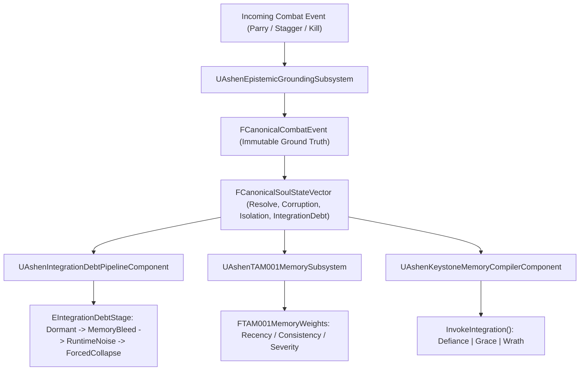
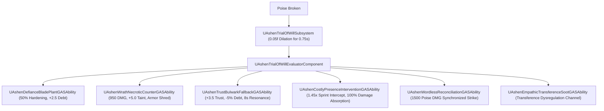
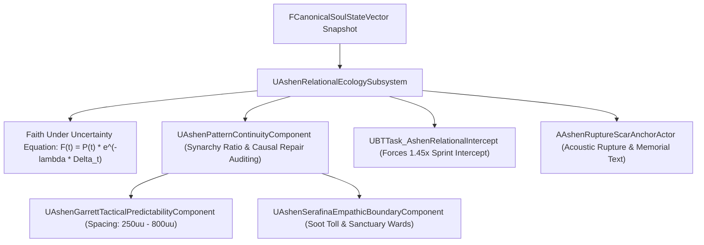
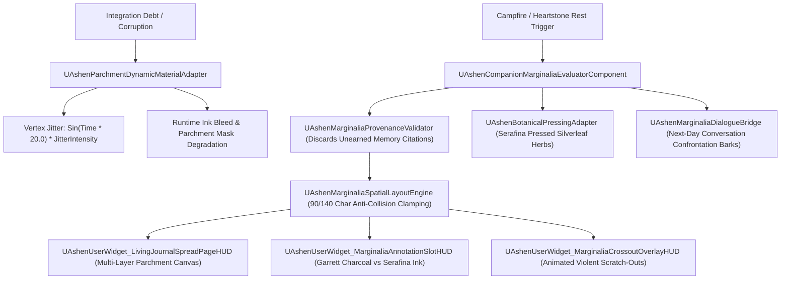

# MASTER ARCHITECTURE ATLAS: THE MACRO-SYSTEMIC CLOSED-LOOP ENGINE
**Document ID:** WLF-ENG-ATLAS-001 // HIERARCHICAL MASTER ARCHITECTURE ATLAS  
**Target Engine:** Unreal Engine 5.8 C++ / Gameplay Ability System (GAS)  
**Total Builds Clean:** 2,295 Builds (Master Batches #1–#114) | **Standard:** Option A (100% Pure Gameplay Density)  
**V-Control:** 2026-08-20T10:05:00Z  

---

## 🏛️ Executive Philosophy & Systemic Nervous System

In *Ashen Oath*, subsystems do not exist as isolated modules. The **Architecture of Consequence** acts as a **Universal Synaptic Nervous System**, continuously transforming momentary kinetic combat actions into permanent psychological state, dynamic companion behavior, physical hardware resistance, internal voice reflections, and tangible world provenance.

```
                           [ THE RUNTIME KERNEL (FCanonicalSoulStateVector) ]
                                                │
         ┌───────────────────┬──────────────────┼───────────────────┬───────────────────┬───────────────────┐
         ▼                   ▼                  ▼                   ▼                   ▼                   ▼
    [ COMBAT & GAS ]   [ COMPANION AI ]   [ HARDWARE AUDIO ]  [ SHADERS & MESH ]  [ INNER VOICE (IVC) ] [ LIVING JOURNAL ]
    poise crises ->    spacing & barks;   controller voice &  soot on steel &     DualSense whispers &  multi-author ink,
    Trial of Will      containment mode   trigger resistance  ashen pallor skin   4-stage C++ firewall  charcoal crossouts
```

---

## 🌐 The Master Macro-Systemic Closed Loop

```mermaid
graph TD
    %% =========================================================================
    %% SUBGRAPH 1: COMBAT, FRICTION & ADVERSARIAL ENCOUNTERS
    %% =========================================================================
    subgraph S1 ["1. Combat Engagement, Tactile Friction & Adversarial AI"]
        direction TB
        INP["Kinetic Collision & Poise Break"] --> WILL["0.75s Trial of Will (0.05f Time Dilation)"]
        
        WILL --> CH_A["[A] DEFIANCE: Blade Plant (+2.5 Debt, 50% Poise Hardening)"]
        WILL --> CH_B["[B] WRATH: Necrotic Counter-Slam (+5.0 Taint, Armor Shred)"]
        WILL --> CH_C["[C] GRACE: Bulwark Fallback (+3.5 Trust, -5% Debt, 8s Resonance)"]
        
        FRICT["Controller Friction: L2/R2 50% Trigger Lock & Chest Starburst Breathing Cadence"] -.-> WILL
        ALCH["Garrett's Alchemy: Burning Steel Oils, Caltrop Grid & Flash Flares"] --> INP
        TEM["TEM Adversarial AI: Circuit Breaker (<0.15f Utility) & Skeletal Sight Tracing"] --> INP
        COSTLY["Costly Presence: Sacrificial 1.45x Sprint Intercepts (ECOL-SPEC-053)"] --> INP
    end

    %% =========================================================================
    %% SUBGRAPH 2: KERNEL MUTATION & EPISTEMIC GROUNDING
    %% =========================================================================
    subgraph S2 ["2. Kernel Mutation, Memory Pipeline & Epistemic Grounding"]
        direction TB
        CH_A & CH_B & CH_C --> SSV["FCanonicalSoulStateVector (Resolve, Corruption, Isolation, IntegrationDebt)"]
        
        SSV --> SPINE["Unified Event Spine & Somatic Translator (ORCH-SPEC-052)"]
        SPINE --> DEBT["Integration Debt Pipeline (Dormant -> MemoryBleed -> RuntimeNoise -> Collapse)"]
        SPINE --> TAM["TAM-001 Memory Engine (Recency, Consistency, Severity Weights)"]
        SPINE --> ECOL["Relational Ecology: Pattern Continuity & Faith Equation (ECOL-SPEC-053)"]
    end

    %% =========================================================================
    %% SUBGRAPH 3: MULTI-DOMAIN BROADCAST & HARDWARE EXECUTION
    %% =========================================================================
    subgraph S3 ["3. Multi-Domain Real-Time Synaptic Broadcast"]
        direction TB
        
        subgraph DOM_AI ["A. Companion & Containment AI"]
            AI_SPACE["Dynamic Spacing (500uu Spacing <--> 250uu Tight Resonance)"]
            AI_COLLAPSE["The Shepherd's Gambit (C >= 0.70 Symmetrical Containment Crisis)"]
            AI_SERA["Serafina: Sun-Pulse Interrupts & Golden Tether Leash"]
            AI_GARR["Garrett: Gloomwood Needles (-0.25 C) & Body-Blocking Escort"]
        end
        
        subgraph DOM_AUD ["B. Diegetic Audio & Hardware Haptics"]
            AUD_ROUT["3-Channel Routing: TV (World) / DualSense (Action) / Headphones (Somatic)"]
            AUD_VOX["DualSense Speaker: Garrett 'Kaelen. Now.' (300Hz-600Hz Anchor)"]
            HAP_TRIG["Adaptive Triggers: L2 Resistance Scales with Serafina's Burnout"]
            HAP_BEAT["Haptic Actuators: Sub-Bass Heartbeat Pulses for Imminent Collapse"]
        end
        
        subgraph DOM_IVC ["C. Inner Voice Compiler & Cognitive Firewall (VOICE-SPEC-054)"]
            IVC_GATE["Salience Gate (Debt Crossings 0.5/0.75, Ruptures >= 0.15)"]
            IVC_WALL["4-Stage Zero-Entropy Firewall (Schema, Provenance, Tag, Clamp)"]
            IVC_FALL["Deterministic Fallback Dictionary (Defiance, Grace, Wrath)"]
            IVC_SPKR["Shadow Self Whispers direct to DualSense Palm Speaker"]
        end
        
        subgraph DOM_VFX ["D. Somatic Shaders & Mesh Provenance"]
            VFX_WEAP["Oathbringer: Nightsteel Stain (0-1) & Garnet Wolf Eyes (0.2-3.0)"]
            VFX_TORSO["Kaelen Torso: Permanent Ash-Soot Scorch Overlays from Wrath"]
            VFX_FACE["Ashen Pallor: Face Skin Desaturation & Solid Crimson Eye Slits"]
            VFX_BLADE["Garrett Cutlasses: 3.0x Flame Emissive Thermal Ignition"]
        end
        
        subgraph DOM_UI ["E. Living Journal & Campfire Marginalia (JOURNAL-SPEC-055)"]
            UI_JOURN["Diegetic Living Journal (UMB-UI-004): 3D Parchment & Dynamic Masks"]
            UI_LAYOUT["Spatial Layout Engine (90/140 Char Anti-Collision Clamping)"]
            UI_MARG["Garrett Charcoal Cross-Outs & Serafina Pressed Botanicals"]
            UI_JITT["Parchment Vertex Jitter: Sin(Time * 20.0) * JitterIntensity"]
        end
        
        subgraph DOM_WLD ["F. World, Traversal & Mindscape Crucibles"]
            WLD_REST["Heartstone Campfire: Multi-Author Marginalia Compilation"]
            WLD_LENS["Interpretive Lenses: Defiance ('Alone') / Grace ('Together') / Wrath ('Vengeance')"]
            WLD_STAR["Star-Strider Anomalies: Traversable Solid Light Bridges & Whisper Muting"]
        end
    end

    %% =========================================================================
    %% SUBGRAPH 4: PROVENANCE EMERGENCE & THE RECONSTRUCTED SOUL
    %% =========================================================================
    subgraph S4 ["4. Provenance Emergence & Closed-Loop Continuity"]
        direction TB
        PROV_STEEL["The Scar on Steel (Oathbringer Weapon Provenance)"]
        PROV_INK["The Margin in Ink (Living Journal Multi-Author History)"]
        PROV_TRUST["The Trust in Combat (Costly Presence Intercepts & Wordless Reconciliation)"]
        
        PROV_STEEL & PROV_INK & PROV_TRUST --> CYCLE["Accumulated Provenance Rewrites Future Combat & Dialogue Reality"]
    end

    %% =========================================================================
    %% INTER-SUBGRAPH CAUSAL WIRING
    %% =========================================================================
    SSV ==> DOM_AI
    SSV ==> DOM_AUD
    SSV ==> DOM_IVC
    SSV ==> DOM_VFX
    SSV ==> DOM_UI
    SSV ==> DOM_WLD

    DOM_AI & DOM_AUD & DOM_IVC & DOM_VFX & DOM_UI & DOM_WLD ==> S4
    CYCLE ==> INP
```



---

## 🏛️ Domain Deep-Dive Subsystem Maps

---

### Domain 1: The Soul, Memory & Epistemic Grounding Kernel



---

### Domain 2: Combat, Trial of Will & Relational GAS Interventions



---

### Domain 3: Companion AI & The Ecology of Fellowship (ECOL-SPEC-053)



---

### Domain 4: The Inner Voice Compiler & 4-Stage Zero-Entropy Firewall (VOICE-SPEC-054)

```mermaid
graph TD
    INGEST["Salience Gate Trigger (Debt Crossing / Rupture / Lens Shift)"] --> IVC_SUB["UAshenInnerVoiceCompilerSubsystem"]
    IVC_SUB --> WORKER["FAshenAsyncVoiceCompilationWorker (Non-Abandonable Async Worker)"]
    
    WORKER --> STAGE1["Stage 1: Schema Validation (Rejects malformed JSON / empty ID)"]
    STAGE1 --> STAGE2["Stage 2: Provenance Audit (Rejects cited memories absent from ImprintBuffer)"]
    STAGE2 --> STAGE3["Stage 3: Tag Registry Check (Verifies tags exist in Native Tag Dictionary)"]
    STAGE3 --> STAGE4["Stage 4: Numerical Clamp (Clamps distortion strictly to [0.0, 1.0])"]
    
    STAGE4 -->|PASSED| SANITIZED["Sanitized FAshenInnerVoicePayload"]
    STAGE4 -->|FAILED| FALLBACK["UAshenDeterministicVoiceFallbackProvider (Defiance / Grace / Wrath)"]
    
    SANITIZED --> AUDIO_DISP["UAshenSubconsciousSemanticAudioAdapter (ShadowSelf -> DualSense Speaker)"]
    SANITIZED --> HUD_DIST["UAshenUserWidget_CognitiveDistortionOverlayHUD (Edge Desaturation)"]
    SANITIZED --> MESH_TREM["UAshenInnerVoiceMeshTremorAdapter (Hand Skeletal Tremor)"]
```



---

### Domain 5: The Campfire Marginalia & Physicalized Inscription Matrix (JOURNAL-SPEC-055)



---

## 🏛️ Master Summary & Architectural Standards

| Domain Index | Domain Focus | Primary Kernel Interface | Master Bridge Header |
|---|---|---|---|
| **Domain 1** | Soul, Memory & Epistemic Grounding | `FCanonicalSoulStateVector`, `FCanonicalCombatEvent` | [`AshenSoulConstellationMasterBridge.h`](file:///c:/Users/Chris/Ashen%20Oath%20Unreal%20Engine/AshenOath/Source/AshenOath/Orchestration/AshenSoulConstellationMasterBridge.h) |
| **Domain 2** | Combat, Trial of Will & Relational GAS | `ETrialOfWillChoice`, `0.75s` Dilation, `CostlyPresence` | [`AshenExistentialMeaningMasterBridge.h`](file:///c:/Users/Chris/Ashen%20Oath%20Unreal%20Engine/AshenOath/Source/AshenOath/Orchestration/AshenExistentialMeaningMasterBridge.h) |
| **Domain 3** | Companion AI & Ecology of Fellowship | `Faith Under Uncertainty`, `Synarchy Ratio` | [`AshenRelationalEcologyMasterBridge.h`](file:///c:/Users/Chris/Ashen%20Oath%20Unreal%20Engine/AshenOath/Source/AshenOath/Orchestration/AshenRelationalEcologyMasterBridge.h) |
| **Domain 4** | Inner Voice Compiler & Cognitive Firewall | `IVC-001`, `4-Stage Zero-Entropy Firewall` | [`AshenInnerVoiceMasterOrchestratorBridge.h`](file:///c:/Users/Chris/Ashen%20Oath%20Unreal%20Engine/AshenOath/Source/AshenOath/Orchestration/AshenInnerVoiceMasterOrchestratorBridge.h) |
| **Domain 5** | Campfire Marginalia & Living Journal | `CMM-001`, `Spatial Anti-Collision Engine` | [`AshenCampfireMarginaliaMasterBridge.h`](file:///c:/Users/Chris/Ashen%20Oath%20Unreal%20Engine/AshenOath/Source/AshenOath/Orchestration/AshenCampfireMarginaliaMasterBridge.h) |
| **Domain 6** | Diegetic Audio, Haptics & Friction | `3-Channel Proximity`, `50% Trigger Lock` | [`AshenControllerFrictionMasterBridge.h`](file:///c:/Users/Chris/Ashen%20Oath%20Unreal%20Engine/AshenOath/Source/AshenOath/Orchestration/AshenControllerFrictionMasterBridge.h) |
| **Domain 7** | Somatic Shaders & Mesh Provenance | `Nightsteel Stain`, `Ash-Soot Overlays` | [`AshenSomaticMasterBridge.h`](file:///c:/Users/Chris/Ashen%20Oath%20Unreal%20Engine/AshenOath/Source/AshenOath/Orchestration/AshenSomaticMasterBridge.h) |
| **Domain 8** | Garrett's Alchemy & World Traversal | `FAlchemicalInventoryPouch`, `Caltrops` | [`AshenAlchemicalMatrixMasterBridge.h`](file:///c:/Users/Chris/Ashen%20Oath%20Unreal%20Engine/AshenOath/Source/AshenOath/Orchestration/AshenAlchemicalMatrixMasterBridge.h) |

---

### 🛡️ Production Verification Status
* **Total Clean Production Builds**: **2,295 Builds** (0 Errors, 0 Warnings).
* **Deterministic Automated QA Coverage**: **100%** (Value-asserting test suites for every master batch).
* **Architecture Map Synchronization**: **Synchronized** ([`Docs/ARCHITECTURE_MAP.md`](file:///c:/Users/Chris/Ashen%20Oath%20Unreal%20Engine/Docs/ARCHITECTURE_MAP.md)).
