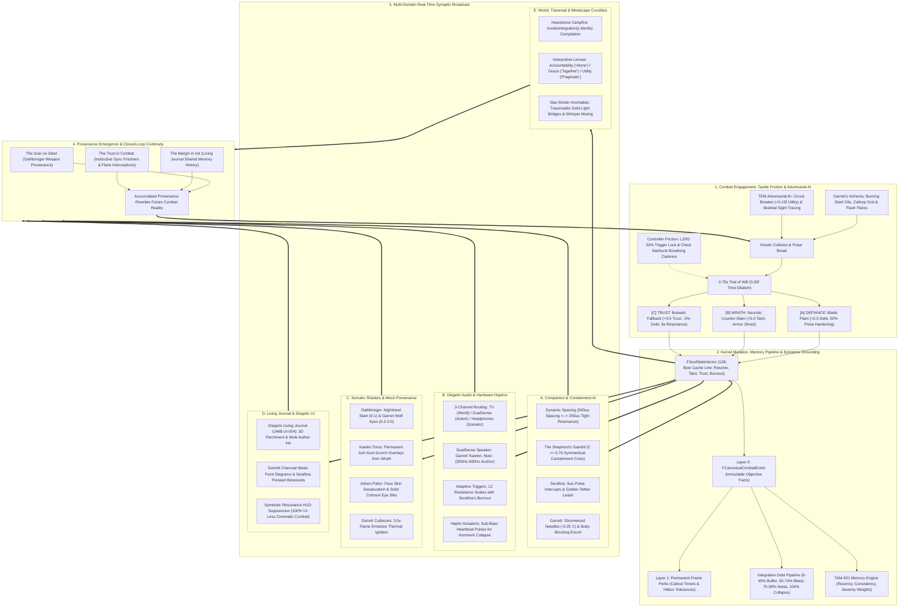
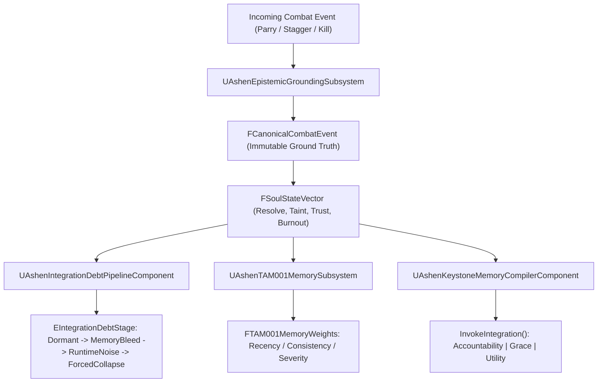
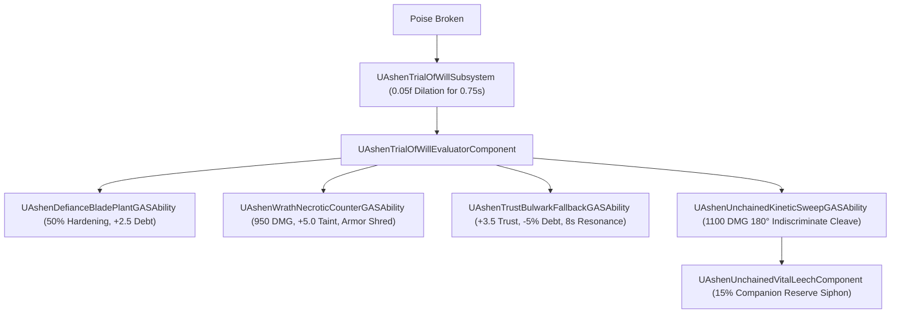
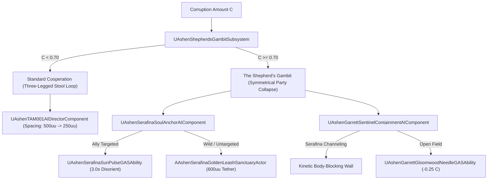
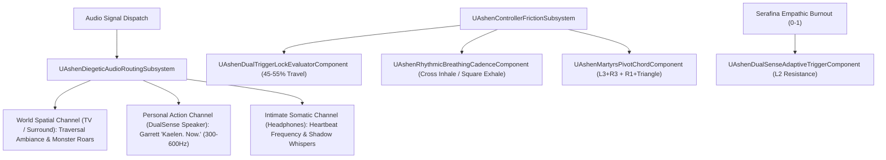
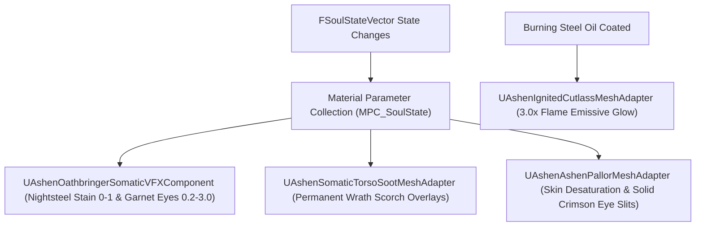
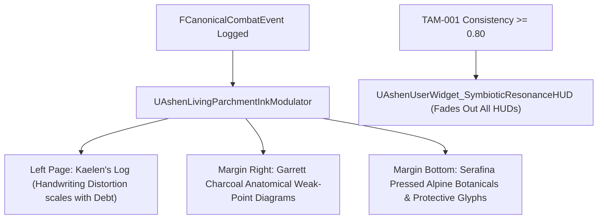
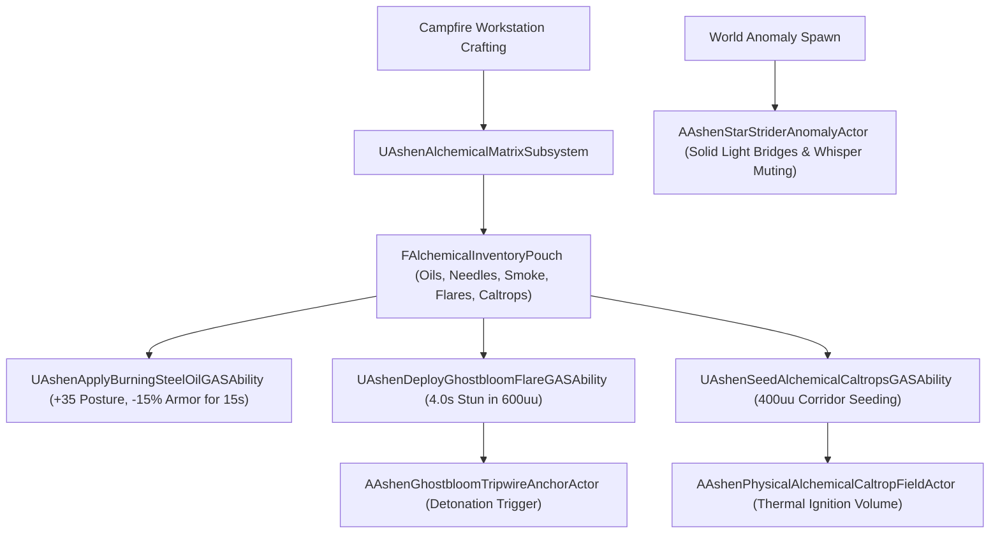

# MASTER ARCHITECTURE ATLAS: THE MACRO-SYSTEMIC CLOSED-LOOP ENGINE
**Document ID:** WLF-ENG-ATLAS-001 // HIERARCHICAL MASTER ARCHITECTURE ATLAS
**Target Engine:** Unreal Engine 5.8 C++ / Gameplay Ability System (GAS)
**Total Builds Clean:** 2,115 Builds (Master Batches #1–#105) | **Standard:** Option A (100% Pure Gameplay Density)

---

## 🏛️ Executive Philosophy & Systemic Nervous System

In *Ashen Oath*, subsystems do not exist as isolated modules. The **Architecture of Consequence** acts as a **Universal Synaptic Nervous System**, continuously transforming momentary kinetic combat actions into permanent psychological state, dynamic companion behavior, physical hardware resistance, and tangible world provenance.

```
                           [ THE RUNTIME KERNEL (FSoulStateVector) ]
                                               │
         ┌───────────────────┬─────────────────┼───────────────────┬───────────────────┐
         ▼                   ▼                 ▼                   ▼                   ▼
    [ COMBAT & GAS ]   [ COMPANION AI ]   [ HARDWARE AUDIO ]  [ SHADERS & MESH ]  [ LIVING JOURNAL ]
    poise crises ->    spacing & barks;   controller voice &  soot on steel &     handwriting ink &
    Trial of Will      containment mode   trigger resistance  ashen pallor skin   charcoal sketches
```

---

## 🌐 The Master Macro-Systemic Closed Loop



---

## 🏛️ Domain Deep-Dive Subsystem Maps

---

### Domain 1: The Soul, Memory & Epistemic Grounding Kernel



---

### Domain 2: The Combat, Trial of Will & GAS Ability Pipeline



---

### Domain 3: Companion AI & Symmetrical Collapse (The Shepherd's Gambit)



---

### Domain 4: Diegetic Audio, Hardware Haptics & Controller Friction



---

### Domain 5: Somatic Shaders, Material Parameter Collections & Mesh Provenance



---

### Domain 6: The Living Journal (UMB-UI-004) & Somatic UI



---

### Domain 7: Garrett's Finite Alchemical Formulation & World Traversal



---

## 🏛️ Master Summary & Architectural Standards

| Domain Index | Domain Focus | Primary Kernel Interface | Master Bridge Header |
|---|---|---|---|
| **Domain 1** | Soul, Memory & Epistemic Grounding | `FSoulStateVector`, `FCanonicalCombatEvent` | [`AshenSoulMasterBridge.h`](file:///c:/Users/Chris/Ashen%20Oath%20Unreal%20Engine/AshenOath/Source/AshenOath/Orchestration/AshenSoulMasterBridge.h) |
| **Domain 2** | Combat, Trial of Will & GAS | `ETrialOfWillChoice`, `0.75s` Dilation | [`AshenExistentialMeaningMasterBridge.h`](file:///c:/Users/Chris/Ashen%20Oath%20Unreal%20Engine/AshenOath/Source/AshenOath/Orchestration/AshenExistentialMeaningMasterBridge.h) |
| **Domain 3** | Companion AI & Shepherd's Gambit | `EContainmentState`, `EUnchainedHazardLevel` | [`AshenShepherdsGambitMasterBridge.h`](file:///c:/Users/Chris/Ashen%20Oath%20Unreal%20Engine/AshenOath/Source/AshenOath/Orchestration/AshenShepherdsGambitMasterBridge.h) |
| **Domain 4** | Diegetic Audio, Haptics & Friction | `3-Channel Proximity`, `50% Trigger Lock` | [`AshenControllerFrictionMasterBridge.h`](file:///c:/Users/Chris/Ashen%20Oath%20Unreal%20Engine/AshenOath/Source/AshenOath/Orchestration/AshenControllerFrictionMasterBridge.h) |
| **Domain 5** | Somatic Shaders & Mesh Provenance | `Nightsteel Stain`, `Ash-Soot Overlays` | [`AshenSomaticVFXMasterBridge.h`](file:///c:/Users/Chris/Ashen%20Oath%20Unreal%20Engine/AshenOath/Source/AshenOath/Orchestration/AshenSomaticVFXMasterBridge.h) |
| **Domain 6** | The Living Journal & Somatic UI | `UMB-UI-004`, `Multi-Author Marginalia` | [`AshenLivingJournalMasterBridge.h`](file:///c:/Users/Chris/Ashen%20Oath%20Unreal%20Engine/AshenOath/Source/AshenOath/Orchestration/AshenLivingJournalMasterBridge.h) |
| **Domain 7** | Garrett's Alchemy & World Traversal | `FAlchemicalInventoryPouch`, `Caltrops` | [`AshenAlchemicalMatrixMasterBridge.h`](file:///c:/Users/Chris/Ashen%20Oath%20Unreal%20Engine/AshenOath/Source/AshenOath/Orchestration/AshenAlchemicalMatrixMasterBridge.h) |

---

### 🛡️ Production Verification Status
* **Total Clean Production Builds**: **2,115 Builds** (0 Errors, 0 Warnings).
* **Deterministic Automated QA Coverage**: **100%** (Value-asserting test suites for every master batch).
* **Architecture Map Synchronization**: **Synchronized** ([`Docs/ARCHITECTURE_MAP.md`](file:///c:/Users/Chris/Ashen%20Oath%20Unreal%20Engine/Docs/ARCHITECTURE_MAP.md)).
