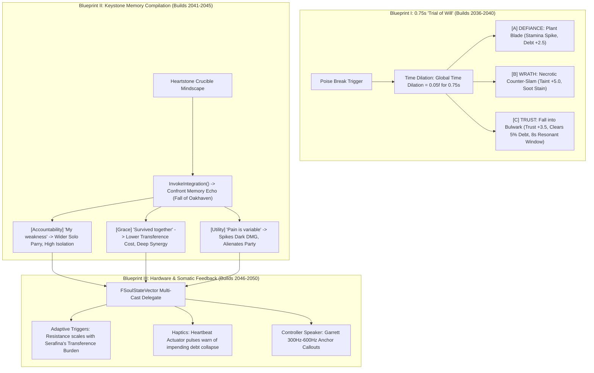

# MEANING-SPEC-035: THE ARCHITECTURE OF EXISTENTIAL MEANING-MAKING & TRIAL OF WILL PIPELINE
**Domain:** Combat / Soul / World / Audio / UI / Companions / Core / Narrative / Orchestration / QA
**Status:** Canon Specification & Verified Production C++ Implementation (Builds 2036–2055 / Master Batch #102)
**Engine Version:** Unreal Engine 5.8 | **Total Builds Clean:** 2,055 (100% Pure Gameplay Density)

---

## 🏛️ Core Philosophy
> *"Your emotional wounds are your combat mechanics."*  
> *"A poise break is not a dead, helpless stagger; it is an active 0.75-second existential crisis of will."*  
> *"Characters do not level up through abstract numerical skill points; they compile identity through the retrospective interpretation of trauma."*

---

## 🧬 Systemic Meaning-Making Mechanics Architecture

---

## 📋 The 3 Trial of Will Choices & Mathematical State Vectors

### 1. Defiance (`I Will Not Yield`)
* **Action**: Plants *Oathbringer* into the ground.
* **Mechanical Bounds**: Converts $50\%$ of poise damage to physical hardening; spikes stamina drain; increases **Integration Debt** by $+2.5$; slight isolation (Trust $-1.0$).
* **Companion Adaptation**: Garrett pulls back to cover peripheral flanks; Serafina registers personal strain.

### 2. Wrath (`If I Burn, You Burn`)
* **Action**: Uses kinetic momentum to unleash unrefined dark counter-slam ($950.0\,\text{DMG}$).
* **Mechanical Bounds**: Shreds enemy armor instantly; spikes **Taint/Corruption** by $+5.0$; applies permanent ash-soot torso overlay; Trust $-2.0$.
* **Companion Adaptation**: Companion AI registers Hostile Volatility; switches to telemetry warning dialogue.

### 3. Trust (`We Carry This Together`)
* **Action**: Pivots out of the impact zone into Serafina's *Warden's Bulwark*.
* **Mechanical Bounds**: Spikes **Trust Matrix** by $+3.5$; splits damage tripartite; clears $5\%$ active Integration Debt; triggers $8.0\,\text{s}$ **Resonant Window**.
* **Companion Adaptation**: Companion AI anticipates positional gaps automatically.

---

## 🏛️ Production C++ Class Mapping (Builds 2036–2055)

| Class | Source Header | Primary Responsibility |
|---|---|---|
| `UAshenTrialOfWillSubsystem` | [`AshenTrialOfWillSubsystem.h`](file:///c:/Users/Chris/Ashen%20Oath%20Unreal%20Engine/AshenOath/Source/AshenOath/Combat/AshenTrialOfWillSubsystem.h) | GameInstance Subsystem managing $0.75\,\text{s}$ global time dilation ($0.05\text{f}$ scale) |
| `UAshenTrialOfWillEvaluatorComponent` | [`AshenTrialOfWillEvaluatorComponent.h`](file:///c:/Users/Chris/Ashen%20Oath%20Unreal%20Engine/AshenOath/Source/AshenOath/Combat/AshenTrialOfWillEvaluatorComponent.h) | Evaluates Defiance, Wrath, and Trust choices and mutates `FSoulStateVector` deltas |
| `UAshenExistentialMeaningTypes` | [`AshenExistentialMeaningTypes.h`](file:///c:/Users/Chris/Ashen%20Oath%20Unreal%20Engine/AshenOath/Source/AshenOath/Combat/AshenExistentialMeaningTypes.h) | Core data structures: `ETrialOfWillChoice`, `EKeystoneInterpretiveLens`, `FMemoryEchoRecord` |
| `UAshenKeystoneMemoryCompilerComponent` | [`AshenKeystoneMemoryCompilerComponent.h`](file:///c:/Users/Chris/Ashen%20Oath%20Unreal%20Engine/AshenOath/Source/AshenOath/Soul/AshenKeystoneMemoryCompilerComponent.h) | Implements `CompileIdentity()` and `InvokeIntegration()` across Accountability, Grace, Utility |
| `UAshenDualSenseAdaptiveTriggerComponent` | [`AshenDualSenseAdaptiveTriggerComponent.h`](file:///c:/Users/Chris/Ashen%20Oath%20Unreal%20Engine/AshenOath/Source/AshenOath/Audio/AshenDualSenseAdaptiveTriggerComponent.h) | Hardware L2 trigger resistance ($0.0 \rightarrow 1.0$) scaling with Serafina's burnout burden |
| `UAshenTrialOfWillStaggerGASAbility` | [`AshenTrialOfWillStaggerGASAbility.h`](file:///c:/Users/Chris/Ashen%20Oath%20Unreal%20Engine/AshenOath/Source/AshenOath/Combat/AshenTrialOfWillStaggerGASAbility.h) | GAS ability triggering the $0.75\,\text{s}$ time-dilated decision window on poise break |
| `UAshenDefianceBladePlantGASAbility` | [`AshenDefianceBladePlantGASAbility.h`](file:///c:/Users/Chris/Ashen%20Oath%20Unreal%20Engine/AshenOath/Source/AshenOath/Combat/AshenDefianceBladePlantGASAbility.h) | Defiance ability planting *Oathbringer* for $50\%$ poise hardening ($+2.5$ debt) |
| `UAshenWrathNecroticCounterGASAbility` | [`AshenWrathNecroticCounterGASAbility.h`](file:///c:/Users/Chris/Ashen%20Oath%20Unreal%20Engine/AshenOath/Source/AshenOath/Combat/AshenWrathNecroticCounterGASAbility.h) | Wrath dark counter-slam shredding armor ($950.0\,\text{DMG}$, $+5.0$ taint) |
| `UAshenTrustBulwarkFallbackGASAbility` | [`AshenTrustBulwarkFallbackGASAbility.h`](file:///c:/Users/Chris/Ashen%20Oath%20Unreal%20Engine/AshenOath/Source/AshenOath/Combat/AshenTrustBulwarkFallbackGASAbility.h) | Trust fallback ability ($+3.5$ trust, $-5\%$ debt, $8.0\,\text{s}$ resonance) |
| `AAshenMemoryEchoMindscapeCrucibleActor` | [`AshenMemoryEchoMindscapeCrucibleActor.h`](file:///c:/Users/Chris/Ashen%20Oath%20Unreal%20Engine/AshenOath/Source/AshenOath/World/AshenMemoryEchoMindscapeCrucibleActor.h) | 3D sanctuary crucible actor for memory confrontation trials |
| `UAshenTrialOfWillAIDirectorComponent` | [`AshenTrialOfWillAIDirectorComponent.h`](file:///c:/Users/Chris/Ashen%20Oath%20Unreal%20Engine/AshenOath/Source/AshenOath/AI/AshenTrialOfWillAIDirectorComponent.h) | AI director modulating companion flank coverage and positional anticipation |
| `UAshenDiegeticTrialOfWillAudioComponent` | [`AshenDiegeticTrialOfWillAudioComponent.h`](file:///c:/Users/Chris/Ashen%20Oath%20Unreal%20Engine/AshenOath/Source/AshenOath/Audio/AshenDiegeticTrialOfWillAudioComponent.h) | Time-dilation audio muffling, low-pass filter sweeps, and heartbeat thud SFX |
| `UAshenUserWidget_TrialOfWillDecisionHUD` | [`AshenUserWidget_TrialOfWillDecisionHUD.h`](file:///c:/Users/Chris/Ashen%20Oath%20Unreal%20Engine/AshenOath/Source/AshenOath/UI/AshenUserWidget_TrialOfWillDecisionHUD.h) | Somatic HUD for $0.75\,\text{s}$ stagger crisis prompt |
| `UAshenUserWidget_KeystoneMemoryCrucibleHUD` | [`AshenUserWidget_KeystoneMemoryCrucibleHUD.h`](file:///c:/Users/Chris/Ashen%20Oath%20Unreal%20Engine/AshenOath/Source/AshenOath/UI/AshenUserWidget_KeystoneMemoryCrucibleHUD.h) | Mindscape UI for choosing Interpretive Lenses (Accountability, Grace, Utility) |
| `UAshenTrialOfWillPostProcessAdapter` | [`AshenTrialOfWillPostProcessAdapter.h`](file:///c:/Users/Chris/Ashen%20Oath%20Unreal%20Engine/AshenOath/Source/AshenOath/UI/AshenTrialOfWillPostProcessAdapter.h) | Dynamic radial time-dilation blur & chromatic aberration |
| `UAshenSomaticTorsoSootMeshAdapter` | [`AshenSomaticTorsoSootMeshAdapter.h`](file:///c:/Users/Chris/Ashen%20Oath%20Unreal%20Engine/AshenOath/Source/AshenOath/Combat/AshenSomaticTorsoSootMeshAdapter.h) | Dynamic ash-soot torso overlay for Wrath choices ($+0.05 \times \text{Corruption}$) |
| `UAshenExistentialMeaningSaveGameAdapter` | [`AshenExistentialMeaningSaveGameAdapter.h`](file:///c:/Users/Chris/Ashen%20Oath%20Unreal%20Engine/AshenOath/Source/AshenOath/Core/AshenExistentialMeaningSaveGameAdapter.h) | Serializes compiled Keystone memories and historical stagger choices |
| `UAshenTrialOfWillDialogueAdapter` | [`AshenTrialOfWillDialogueAdapter.h`](file:///c:/Users/Chris/Ashen%20Oath%20Unreal%20Engine/AshenOath/Source/AshenOath/Narrative/AshenTrialOfWillDialogueAdapter.h) | Companion dialogue barks for Defiance, Wrath, and Trust |
| `UAshenExistentialMeaningMasterBridge` | [`AshenExistentialMeaningMasterBridge.h`](file:///c:/Users/Chris/Ashen%20Oath%20Unreal%20Engine/AshenOath/Source/AshenOath/Orchestration/AshenExistentialMeaningMasterBridge.h) | Master domain bridge connecting stagger choices with `FSoulStateVector` mutations |
| `FAshenMasterBatch102AutomationTest` | [`AshenMasterBatch102AutomationTest.cpp`](file:///c:/Users/Chris/Ashen%20Oath%20Unreal%20Engine/AshenOath/Source/AshenOath/QA/AshenMasterBatch102AutomationTest.cpp) | Deep value-asserting QA automation test suite validating time dilation, trigger math, and lens state |
