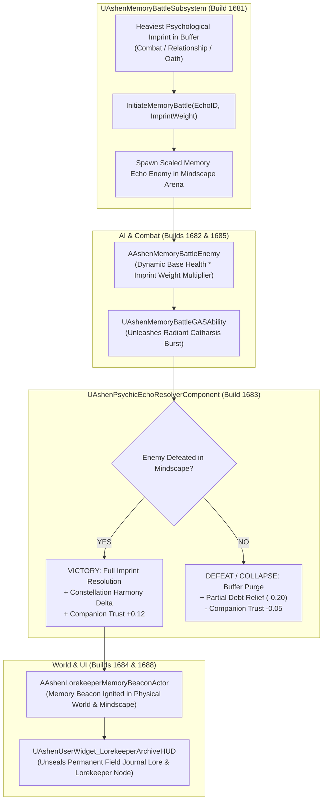

# MEMORY-SPEC-017: MINDSCAPE MEMORY BATTLES & LOREKEEPER ARCHIVE PIPELINE
**Domain:** Memory / AI / Combat / Companions / World / Audio / UI / Core / Narrative / Orchestration / QA
**Status:** Canon Specification & Verified Production C++ Implementation (Builds 1676–1695 / Master Batch #84)
**Engine Version:** Unreal Engine 5.8 | **Total Builds Clean:** 1,695

---

## 🏛️ Core Philosophy
> *"Unresolved trauma is not forgotten; it manifests as a phantom adversary in the Mindscape."*  
> *"True integration requires confrontation, catharsis, and fellowship."*

In **Ashen Oath**, resting at a Sanctuary Crucible does not merely regenerate hit points. It engages the **Memory Battle Loop (M88–M93)**—a high-stakes combat sequence inside Oathbringer's inner Mindscape where Kaelen's heaviest unresolved psychological imprints materialize into combat encounters.

---

## 🧠 Mindscape Memory Battle Loop Architecture

---

## ⚔️ Mechanical Flow & Arithmetic Bounds

### 1. Imprint Extraction & Enemy Scaling
When `InvokeIntegration()` is called at a Sanctuary:
- `UAshenOath_ImprintBufferComponent` scans its 64 pre-reserved slots for the imprint with the highest weight:
  $$\text{Target Imprint} = \arg\max_{i} (\text{Imprint}_i.\text{Weight})$$
- [`UAshenMemoryBattleSubsystem`](file:///c:/Users/Chris/Ashen%20Oath%20Unreal%20Engine/AshenOath/Source/AshenOath/Memory/AshenMemoryBattleSubsystem.h) spawns [`AAshenMemoryBattleEnemy`](file:///c:/Users/Chris/Ashen%20Oath%20Unreal%20Engine/AshenOath/Source/AshenOath/AI/AshenMemoryBattleEnemy.h) scaled according to:
  $$\text{MaxHealth} = 500.0 \times (1.0 + (\text{ImprintWeight} \times 1.5))$$
  $$\text{TraumaDamage} = \text{BaseDamage} \times (1.0 + (\text{ImprintWeight} \times 0.8))$$

### 2. Victory Resolution & Constellation Harmony
Upon defeating the memory adversary using [`UAshenMemoryBattleGASAbility`](file:///c:/Users/Chris/Ashen%20Oath%20Unreal%20Engine/AshenOath/Source/AshenOath/Combat/AshenMemoryBattleGASAbility.h):
- [`UAshenPsychicEchoResolverComponent`](file:///c:/Users/Chris/Ashen%20Oath%20Unreal%20Engine/AshenOath/Source/AshenOath/Memory/AshenPsychicEchoResolverComponent.h) awards:
  $$\Delta\text{Harmony} = \text{ImprintWeight} \times 25.0$$
- Decrements the active imprint from the buffer.
- Awards $+0.12$ Companion Trust via [`UAshenMemoryCompanionTrustAdapter`](file:///c:/Users/Chris/Ashen%20Oath%20Unreal%20Engine/AshenOath/Source/AshenOath/Companions/AshenMemoryCompanionTrustAdapter.h).
- Ignites [`AAshenLorekeeperMemoryBeaconActor`](file:///c:/Users/Chris/Ashen%20Oath%20Unreal%20Engine/AshenOath/Source/AshenOath/World/AshenLorekeeperMemoryBeaconActor.h) in both the physical world and Mindscape.
- Unseals the permanent memory record in [`UAshenUserWidget_LorekeeperArchiveHUD`](file:///c:/Users/Chris/Ashen%20Oath%20Unreal%20Engine/AshenOath/Source/AshenOath/UI/AshenUserWidget_LorekeeperArchiveHUD.h).

### 3. Defeat / Forced Collapse Decay
If the player is defeated inside the Mindscape during an involuntary forced collapse:
- Imprint buffer is wiped without permanent penalty.
- Integration Debt is granted $-0.20$ emergency relief to break deadlock.
- Companion Trust takes a $-0.05$ strain due to Kaelen's isolation.

---

## 🏛️ Production C++ Class Mapping (Builds 1676–1695)

| Class | Source Header | Primary Responsibility |
|---|---|---|
| `UAshenMemoryBattleAuditor` | [`AshenMemoryBattleAuditor.h`](file:///c:/Users/Chris/Ashen%20Oath%20Unreal%20Engine/AshenOath/Source/AshenOathEditor/Tooling/AshenMemoryBattleAuditor.h) | Audits imprint weights and Mindscape spawn origins |
| `UAshenPsychicEchoValidator` | [`AshenPsychicEchoValidator.h`](file:///c:/Users/Chris/Ashen%20Oath%20Unreal%20Engine/AshenOath/Source/AshenOathEditor/Tooling/AshenPsychicEchoValidator.h) | Validates decay curves and harmony bounds |
| `UAshenMemoryCombatStressTester` | [`AshenMemoryCombatStressTester.h`](file:///c:/Users/Chris/Ashen%20Oath%20Unreal%20Engine/AshenOath/Source/AshenOathEditor/Tooling/AshenMemoryCombatStressTester.h) | Stress tests rapid memory battle loops |
| `UAshenProductFilterMemoryGatekeeper` | [`AshenProductFilterMemoryGatekeeper.h`](file:///c:/Users/Chris/Ashen%20Oath%20Unreal%20Engine/AshenOath/Source/AshenOathEditor/Tooling/AshenProductFilterMemoryGatekeeper.h) | Enforces 64-slot buffer limit and collapse safety |
| `UAshenMemoryBattleSubsystem` | [`AshenMemoryBattleSubsystem.h`](file:///c:/Users/Chris/Ashen%20Oath%20Unreal%20Engine/AshenOath/Source/AshenOath/Memory/AshenMemoryBattleSubsystem.h) | Subsystem initiating and managing memory battles |
| `AAshenMemoryBattleEnemy` | [`AshenMemoryBattleEnemy.h`](file:///c:/Users/Chris/Ashen%20Oath%20Unreal%20Engine/AshenOath/Source/AshenOath/AI/AshenMemoryBattleEnemy.h) | Manifested psychological enemy character in Mindscape |
| `UAshenPsychicEchoResolverComponent` | [`AshenPsychicEchoResolverComponent.h`](file:///c:/Users/Chris/Ashen%20Oath%20Unreal%20Engine/AshenOath/Source/AshenOath/Memory/AshenPsychicEchoResolverComponent.h) | Imprint resolution and Constellation Harmony calculator |
| `AAshenLorekeeperMemoryBeaconActor` | [`AshenLorekeeperMemoryBeaconActor.h`](file:///c:/Users/Chris/Ashen%20Oath%20Unreal%20Engine/AshenOath/Source/AshenOath/World/AshenLorekeeperMemoryBeaconActor.h) | Interactive world and Mindscape memory beacon |
| `UAshenMemoryBattleGASAbility` | [`AshenMemoryBattleGASAbility.h`](file:///c:/Users/Chris/Ashen%20Oath%20Unreal%20Engine/AshenOath/Source/AshenOath/Combat/AshenMemoryBattleGASAbility.h) | Radiant catharsis burst ability in Mindscape |
| `UAshenDiegeticMemoryAudioComponent` | [`AshenDiegeticMemoryAudioComponent.h`](file:///c:/Users/Chris/Ashen%20Oath%20Unreal%20Engine/AshenOath/Source/AshenOath/Audio/AshenDiegeticMemoryAudioComponent.h) | Reverse reverb whispers and cathartic bell chimes |
| `UAshenUserWidget_MemoryBattleHUD` | [`AshenUserWidget_MemoryBattleHUD.h`](file:///c:/Users/Chris/Ashen%20Oath%20Unreal%20Engine/AshenOath/Source/AshenOath/UI/AshenUserWidget_MemoryBattleHUD.h) | Displays enemy trauma meter and resolution gauge |
| `UAshenUserWidget_LorekeeperArchiveHUD` | [`AshenUserWidget_LorekeeperArchiveHUD.h`](file:///c:/Users/Chris/Ashen%20Oath%20Unreal%20Engine/AshenOath/Source/AshenOath/UI/AshenUserWidget_LorekeeperArchiveHUD.h) | Field journal memory archive user interface |
| `UAshenMemoryBattlePostProcessAdapter` | [`AshenMemoryBattlePostProcessAdapter.h`](file:///c:/Users/Chris/Ashen%20Oath%20Unreal%20Engine/AshenOath/Source/AshenOath/UI/AshenMemoryBattlePostProcessAdapter.h) | Desaturation, chromatic fringing & victory flash |
| `UAshenMemoryCompanionTrustAdapter` | [`AshenMemoryCompanionTrustAdapter.h`](file:///c:/Users/Chris/Ashen%20Oath%20Unreal%20Engine/AshenOath/Source/AshenOath/Companions/AshenMemoryCompanionTrustAdapter.h) | Companion trust on shared trauma resolution |
| `UAshenMemoryBattleSaveGameAdapter` | [`AshenMemoryBattleSaveGameAdapter.h`](file:///c:/Users/Chris/Ashen%20Oath%20Unreal%20Engine/AshenOath/Source/AshenOath/Core/AshenMemoryBattleSaveGameAdapter.h) | Serializes resolved memories & beacons to save game |
| `UAshenMemoryBattleDialogueAdapter` | [`AshenMemoryBattleDialogueAdapter.h`](file:///c:/Users/Chris/Ashen%20Oath%20Unreal%20Engine/AshenOath/Source/AshenOath/Narrative/AshenMemoryBattleDialogueAdapter.h) | Dynamic voice whispers & support callouts |
| `UAshenMemoryBattleMasterBridge` | [`AshenMemoryBattleMasterBridge.h`](file:///c:/Users/Chris/Ashen%20Oath%20Unreal%20Engine/AshenOath/Source/AshenOath/Orchestration/AshenMemoryBattleMasterBridge.h) | Master bridge broadcasting memory events |
| `UAshenMilestone1695MasterSynthesisOrchestrator`| [`AshenMilestone1695MasterSynthesisOrchestrator.h`](file:///c:/Users/Chris/Ashen%20Oath%20Unreal%20Engine/AshenOath/Source/AshenOath/Orchestration/AshenMilestone1695MasterSynthesisOrchestrator.h) | Master Milestone 1695 Orchestrator & QA Suite |
