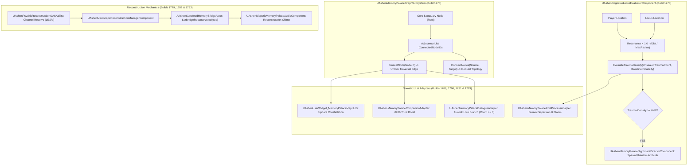

# MEMORY-SPEC-022: MEMORY PALACE GRAPH, COGNITIVE LOCI & MINDSCAPE RECONSTRUCTION
**Domain:** Memory / World / Combat / AI / Audio / UI / Core / Companions / Narrative / Orchestration / QA
**Status:** Canon Specification & Verified Production C++ Implementation (Builds 1776–1795 / Master Batch #89)
**Engine Version:** Unreal Engine 5.8 | **Total Builds Clean:** 1,795 (100% Pure Gameplay Density)

---

## 🏛️ Core Philosophy
> *"The mind of an Oathsworn is not a passive mirror; it is an architectural fortress shattered by the Sundering."*  
> *"Through the Memory Palace graph, Kaelen reconstructs sundered bridges of thought, heals the psychological trauma of his companions, and unseals the ancient records of the Lorekeeper."*

---

## 🧠 Memory Palace Graph & Reconstruction Architecture

---

## 📋 Technical Formulas & Mechanical Bounds

### 1. Proximity Resonance Falloff
The psychic resonance frequency ($432\,\text{Hz}$) scales inversely with spatial distance:
$$\text{ResonanceIntensity} = \text{Clamp}\left(1.0 - \frac{\text{Distance}}{\text{MaxResonanceRadius}},\, 0.0,\, 1.0\right)$$
* Where $\text{MaxResonanceRadius} = 1500.0\,\text{uu}$.

### 2. Trauma Density & Nightmare Ambush Gating
Local trauma density accumulates based on baseline psychic instability and unsealed trauma count:
$$\text{TraumaDensity} = \text{Clamp}\left(\text{BaselineInstability} + (\text{UnsealedTraumaCount} \times 0.15),\, 0.0,\, 1.0\right)$$
* If $\text{TraumaDensity} \ge 0.60$, [`UAshenMemoryPalaceNightmareDirectorComponent`](file:///c:/Users/Chris/Ashen%20Oath%20Unreal%20Engine/AshenOath/Source/AshenOath/AI/AshenMemoryPalaceNightmareDirectorComponent.h) spawns phantom shades.

### 3. Psychic Reconstruction Drain
Reconstruction of shattered Mindscape bridges channels Resolve over time:
$$\Delta\text{Resolve} = \text{ResolveDrainRate} \times \Delta t \quad (15.0/\text{s})$$
$$\text{Progress} = \text{Clamp}\left(\text{Progress} + 0.25 \times \Delta t,\, 0.0,\, 1.0\right)$$
* Requires active channel within $1200.0\,\text{uu}$ radius.

---

## 🏛️ Production C++ Class Mapping (Builds 1776–1795)

| Class | Source Header | Primary Responsibility |
|---|---|---|
| `UAshenMemoryPalaceGraphSubsystem` | [`AshenMemoryPalaceGraphSubsystem.h`](file:///c:/Users/Chris/Ashen%20Oath%20Unreal%20Engine/AshenOath/Source/AshenOath/Memory/AshenMemoryPalaceGraphSubsystem.h) | GameInstance Subsystem managing graph topology, adjacency, and traversal |
| `UAshenMemoryPalaceNodeComponent` | [`AshenMemoryPalaceNodeComponent.h`](file:///c:/Users/Chris/Ashen%20Oath%20Unreal%20Engine/AshenOath/Source/AshenOath/Memory/AshenMemoryPalaceNodeComponent.h) | Component storing node state, resonance frequency ($432\,\text{Hz}$), and psychic link triggers |
| `UAshenCognitiveLocusEvaluatorComponent` | [`AshenCognitiveLocusEvaluatorComponent.h`](file:///c:/Users/Chris/Ashen%20Oath%20Unreal%20Engine/AshenOath/Source/AshenOath/Memory/AshenCognitiveLocusEvaluatorComponent.h) | Evaluates proximity falloff ($1.0 - d/R$) and trauma density scores |
| `UAshenMindscapeReconstructionManagerComponent` | [`AshenMindscapeReconstructionManagerComponent.h`](file:///c:/Users/Chris/Ashen%20Oath%20Unreal%20Engine/AshenOath/Source/AshenOath/Memory/AshenMindscapeReconstructionManagerComponent.h) | Manages Resolve channel drain ($15.0/\text{s}$) and repair progress |
| `FAshenMemoryPalaceGraphTypes` | [`AshenMemoryPalaceGraphTypes.h`](file:///c:/Users/Chris/Ashen%20Oath%20Unreal%20Engine/AshenOath/Source/AshenOath/Memory/AshenMemoryPalaceGraphTypes.h) | Data structures (`FMemoryGraphNode`, `EMemoryNodeType`, `EMemoryTraumaLevel`) |
| `AAshenMemoryPalaceLocusActor` | [`AshenMemoryPalaceLocusActor.h`](file:///c:/Users/Chris/Ashen%20Oath%20Unreal%20Engine/AshenOath/Source/AshenOath/World/AshenMemoryPalaceLocusActor.h) | 3D interactive Mindscape locus actor projecting holographic memory echoes |
| `AAshenSunderedMemoryBridgeActor` | [`AshenSunderedMemoryBridgeActor.h`](file:///c:/Users/Chris/Ashen%20Oath%20Unreal%20Engine/AshenOath/Source/AshenOath/World/AshenSunderedMemoryBridgeActor.h) | Dynamically reconstituting psychic bridge actor |
| `UAshenPsychicReconstructionGASAbility` | [`AshenPsychicReconstructionGASAbility.h`](file:///c:/Users/Chris/Ashen%20Oath%20Unreal%20Engine/AshenOath/Source/AshenOath/Combat/AshenPsychicReconstructionGASAbility.h) | GAS ability channeling Resolve to rebuild architecture ($1200\,\text{uu}$) |
| `UAshenMemoryPalaceResonanceGASAbility` | [`AshenMemoryPalaceResonanceGASAbility.h`](file:///c:/Users/Chris/Ashen%20Oath%20Unreal%20Engine/AshenOath/Source/AshenOath/Combat/AshenMemoryPalaceResonanceGASAbility.h) | GAS ability unleashing $1800\,\text{uu}$ resonance pulse purging nightmare stealth |
| `AAshenMemoryPalaceSanctuaryAltarActor` | [`AshenMemoryPalaceSanctuaryAltarActor.h`](file:///c:/Users/Chris/Ashen%20Oath%20Unreal%20Engine/AshenOath/Source/AshenOath/World/AshenMemoryPalaceSanctuaryAltarActor.h) | Central sanctuary altar anchoring the core Mindscape constellation |
| `UAshenMemoryPalaceNightmareDirectorComponent` | [`AshenMemoryPalaceNightmareDirectorComponent.h`](file:///c:/Users/Chris/Ashen%20Oath%20Unreal%20Engine/AshenOath/Source/AshenOath/AI/AshenMemoryPalaceNightmareDirectorComponent.h) | AI director spawning phantom shades when trauma density $\ge 0.60$ |
| `UAshenDiegeticMemoryPalaceAudioComponent` | [`AshenDiegeticMemoryPalaceAudioComponent.h`](file:///c:/Users/Chris/Ashen%20Oath%20Unreal%20Engine/AshenOath/Source/AshenOath/Audio/AshenDiegeticMemoryPalaceAudioComponent.h) | Multi-channel psychic whispers, locus hums, and crystalline reconstruction chimes |
| `UAshenUserWidget_MemoryPalaceMapHUD` | [`AshenUserWidget_MemoryPalaceMapHUD.h`](file:///c:/Users/Chris/Ashen%20Oath%20Unreal%20Engine/AshenOath/Source/AshenOath/UI/AshenUserWidget_MemoryPalaceMapHUD.h) | Interactive node constellation map HUD displaying unsealed loci and bridges |
| `UAshenUserWidget_ReconstructionProgressHUD` | [`AshenUserWidget_ReconstructionProgressHUD.h`](file:///c:/Users/Chris/Ashen%20Oath%20Unreal%20Engine/AshenOath/Source/AshenOath/UI/AshenUserWidget_ReconstructionProgressHUD.h) | Somatic HUD displaying real-time reconstruction percentage |
| `UAshenMemoryPalacePostProcessAdapter` | [`AshenMemoryPalacePostProcessAdapter.h`](file:///c:/Users/Chris/Ashen%20Oath%20Unreal%20Engine/AshenOath/Source/AshenOath/UI/AshenMemoryPalacePostProcessAdapter.h) | Ethereal dream post-process adapter (chromatic dispersion, constellation lines) |
| `UAshenMemoryPalaceCompanionAdapter` | [`AshenMemoryPalaceCompanionAdapter.h`](file:///c:/Users/Chris/Ashen%20Oath%20Unreal%20Engine/AshenOath/Source/AshenOath/Companions/AshenMemoryPalaceCompanionAdapter.h) | Companion trust boosts ($+0.06$ Nexus, $+0.08$ Vault) upon exploring shared loci |
| `UAshenMemoryPalaceSaveGameAdapter` | [`AshenMemoryPalaceSaveGameAdapter.h`](file:///c:/Users/Chris/Ashen%20Oath%20Unreal%20Engine/AshenOath/Source/AshenOath/Core/AshenMemoryPalaceSaveGameAdapter.h) | Serializes graph node unlock states and reconstructed bridges |
| `UAshenMemoryPalaceDialogueAdapter` | [`AshenMemoryPalaceDialogueAdapter.h`](file:///c:/Users/Chris/Ashen%20Oath%20Unreal%20Engine/AshenOath/Source/AshenOath/Narrative/AshenMemoryPalaceDialogueAdapter.h) | Unlocks deep lore dialogue trees when locus threshold is met |
| `UAshenMemoryPalaceMasterBridge` | [`AshenMemoryPalaceMasterBridge.h`](file:///c:/Users/Chris/Ashen%20Oath%20Unreal%20Engine/AshenOath/Source/AshenOath/Orchestration/AshenMemoryPalaceMasterBridge.h) | Master domain bridge broadcasting locus unsealing and bridge reconstruction events |
| `FAshenMasterBatch89AutomationTest` | [`AshenMasterBatch89AutomationTest.cpp`](file:///c:/Users/Chris/Ashen%20Oath%20Unreal%20Engine/AshenOath/Source/AshenOath/QA/AshenMasterBatch89AutomationTest.cpp) | Deep value-asserting QA automation test suite validating graph math and gates |
