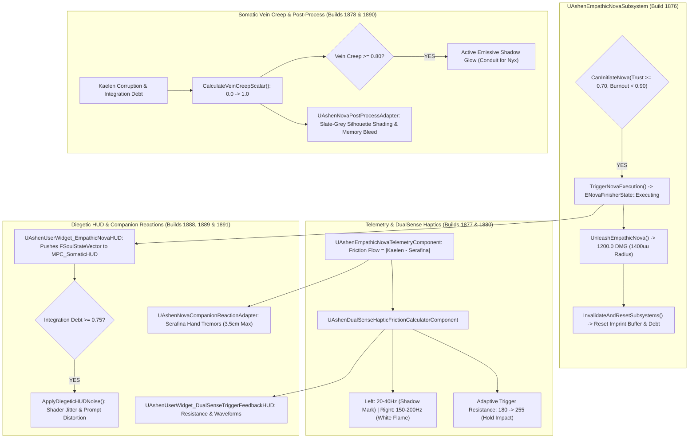

# NOVA-SPEC-027: EMPATHIC CONDUIT NOVA & DUALSENSE SOMATIC FINISHER
**Domain:** Combat / World / Player / AI / Audio / UI / Core / Companions / Narrative / Orchestration / QA
**Status:** Canon Specification & Verified Production C++ Implementation (Builds 1876–1895 / Master Batch #94)
**Engine Version:** Unreal Engine 5.8 | **Total Builds Clean:** 1,895 (100% Pure Gameplay Density)

---

## 🏛️ Core Philosophy
> *"The Empathic Conduit Nova is not a super move; it is a violent rejection of Kaelen's Martyr Complex through the forced mechanical synchronization of two distinct souls."*  
> *"Through asymmetric DualSense haptics and procedural somatic vein creep, the player physically endures the friction of holding back terminal engine entropy."*

---

## ⚡ Empathic Conduit Nova & Somatic Architecture

---

## 📋 Technical Formulas & Mechanical Bounds

### 1. Finisher Initiation Thresholds & Invalidation Lifecycle
* **Initiation Gating**:
  $$\text{CanInitiate} = (\text{MutualTrust} \ge 0.70) \land (\text{SerafinaBurnout} < 0.90)$$
* **Post-Finisher Reset**: Firing `InvalidateAndResetSubsystems()` purges accumulated Integration Debt and resets the psychological imprint buffer.

### 2. DualSense Adaptive Trigger Resistance & Asymmetric Frequencies
* **Adaptive Trigger Resistance Profile**:
  $$\text{Resistance} = 180 + \text{Round}\left(\text{Clamp}(\text{Progress},\, 0.0,\, 1.0) \times 75.0\right) \quad (\text{Range: } 180 \rightarrow 255)$$
* **Asymmetric Frequency Modulation**:
  $$\text{LeftFrequency} = 20.0 + (\text{Corruption} \times 20.0)\,\text{Hz} \quad (\text{Shadow Mark: } 20\text{--}40\,\text{Hz})$$
  $$\text{RightFrequency} = 150.0 + (\text{Burnout} \times 50.0)\,\text{Hz} \quad (\text{White Flame: } 150\text{--}200\,\text{Hz})$$

### 3. Somatic Vein Creep & Emissive Glow
* **Procedural Vein Creep Scalar**:
  $$\text{VeinScalar} = \text{Clamp}\left((\text{Corruption} \times 0.60) + (\text{IntegrationDebt} \times 0.40),\, 0.0,\, 1.0\right)$$
* **Emissive Shadow Glow Active**: $\text{VeinScalar} \ge 0.80$

### 4. Serafina Hand Tremor Amplitude
* **Procedural Skeletal Offset**:
  $$\text{TremorAmplitude} = \text{Clamp}(\text{Burnout},\, 0.0,\, 1.0) \times 3.5\,\text{cm}$$

---

## 🏛️ Production C++ Class Mapping (Builds 1876–1895)

| Class | Source Header | Primary Responsibility |
|---|---|---|
| `UAshenEmpathicNovaSubsystem` | [`AshenEmpathicNovaSubsystem.h`](file:///c:/Users/Chris/Ashen%20Oath%20Unreal%20Engine/AshenOath/Source/AshenOath/Combat/AshenEmpathicNovaSubsystem.h) | GameInstance Subsystem managing Nova finisher state machine and mutual trust gating ($\ge 0.70$) |
| `UAshenEmpathicNovaTelemetryComponent` | [`AshenEmpathicNovaTelemetryComponent.h`](file:///c:/Users/Chris/Ashen%20Oath%20Unreal%20Engine/AshenOath/Source/AshenOath/Combat/AshenEmpathicNovaTelemetryComponent.h) | Evaluates friction flow ($|\text{Kaelen} - \text{Serafina}|$) and critical burnout triggers ($>75\%$) |
| `UAshenSomaticVeinCreepShaderEvaluatorComponent` | [`AshenSomaticVeinCreepShaderEvaluatorComponent.h`](file:///c:/Users/Chris/Ashen%20Oath%20Unreal%20Engine/AshenOath/Source/AshenOath/World/AshenSomaticVeinCreepShaderEvaluatorComponent.h) | Computes vein creep scalar ($0.0 \rightarrow 1.0$) and emissive shadow glow threshold ($\ge 0.80$) |
| `UAshenEmpathicNovaTypes` | [`AshenEmpathicNovaTypes.h`](file:///c:/Users/Chris/Ashen%20Oath%20Unreal%20Engine/AshenOath/Source/AshenOath/Combat/AshenEmpathicNovaTypes.h) | Core data structures: `ENovaFinisherState`, `FEmpathicNovaMetrics`, `FHapticFrictionProfile` |
| `UAshenDualSenseHapticFrictionCalculatorComponent` | [`AshenDualSenseHapticFrictionCalculatorComponent.h`](file:///c:/Users/Chris/Ashen%20Oath%20Unreal%20Engine/AshenOath/Source/AshenOath/Player/AshenDualSenseHapticFrictionCalculatorComponent.h) | Calculates trigger resistance ($180 \rightarrow 255$) and asymmetric haptic frequencies ($20\text{--}40\,\text{Hz} / 150\text{--}200\,\text{Hz}$) |
| `UAshenEmpathicConduitNovaGASAbility` | [`AshenEmpathicConduitNovaGASAbility.h`](file:///c:/Users/Chris/Ashen%20Oath%20Unreal%20Engine/AshenOath/Source/AshenOath/Combat/AshenEmpathicConduitNovaGASAbility.h) | Synchronized finisher GAS ability delivering $1200.0$ damage across a $1400\,\text{uu}$ radius |
| `AAshenEmpathicResonanceAnchorActor` | [`AshenEmpathicResonanceAnchorActor.h`](file:///c:/Users/Chris/Ashen%20Oath%20Unreal%20Engine/AshenOath/Source/AshenOath/World/AshenEmpathicResonanceAnchorActor.h) | 3D interactive world anchor locking enemy mobility in stasis during Nova |
| `UAshenResonantExecutionGASAbility` | [`AshenResonantExecutionGASAbility.h`](file:///c:/Users/Chris/Ashen%20Oath%20Unreal%20Engine/AshenOath/Source/AshenOath/Combat/AshenResonantExecutionGASAbility.h) | Execution stance ability triggering cinematic $0.15\times$ time-dilation and impact hold |
| `AAshenSomaticIntrusionTotemActor` | [`AAshenSomaticIntrusionTotemActor.h`](file:///c:/Users/Chris/Ashen%20Oath%20Unreal%20Engine/AshenOath/Source/AshenOath/World/AshenSomaticIntrusionTotemActor.h) | World shrine amplifying companion resonance frequencies ($1500\,\text{uu}$ radius) |
| `AAshenNovaSanctuaryAltarActor` | [`AshenNovaSanctuaryAltarActor.h`](file:///c:/Users/Chris/Ashen%20Oath%20Unreal%20Engine/AshenOath/Source/AshenOath/World/AshenNovaSanctuaryAltarActor.h) | Sanctuary altar purifying accumulated Integration Debt post-finisher |
| `UAshenNovaExecutionAIDirectorComponent` | [`AshenNovaExecutionAIDirectorComponent.h`](file:///c:/Users/Chris/Ashen%20Oath%20Unreal%20Engine/AshenOath/Source/AshenOath/AI/AshenNovaExecutionAIDirectorComponent.h) | AI Director managing boss/elite stagger vulnerability states during execution |
| `UAshenDiegeticNovaAudioComponent` | [`AshenDiegeticNovaAudioComponent.h`](file:///c:/Users/Chris/Ashen%20Oath%20Unreal%20Engine/AshenOath/Source/AshenOath/Audio/AshenDiegeticNovaAudioComponent.h) | Guttural heartbeat modulation, parasite whispers, and white-flame detonation audio |
| `UAshenUserWidget_EmpathicNovaHUD` | [`AshenUserWidget_EmpathicNovaHUD.h`](file:///c:/Users/Chris/Ashen%20Oath%20Unreal%20Engine/AshenOath/Source/AshenOath/UI/AshenUserWidget_EmpathicNovaHUD.h) | Somatic HUD pushing `FSoulStateVector` to `MPC_SomaticHUD` and triggering noise ($\text{Debt} \ge 0.75$) |
| `UAshenUserWidget_DualSenseTriggerFeedbackHUD` | [`AshenUserWidget_DualSenseTriggerFeedbackHUD.h`](file:///c:/Users/Chris/Ashen%20Oath%20Unreal%20Engine/AshenOath/Source/AshenOath/UI/AshenUserWidget_DualSenseTriggerFeedbackHUD.h) | Somatic HUD displaying trigger resistance and haptic pulse frequency waveforms |
| `UAshenNovaPostProcessAdapter` | [`AshenNovaPostProcessAdapter.h`](file:///c:/Users/Chris/Ashen%20Oath%20Unreal%20Engine/AshenOath/Source/AshenOath/UI/AshenNovaPostProcessAdapter.h) | Slate-grey silhouette shading, heavy chromatic desaturation, and memory bleed |
| `UAshenNovaCompanionReactionAdapter` | [`AshenNovaCompanionReactionAdapter.h`](file:///c:/Users/Chris/Ashen%20Oath%20Unreal%20Engine/AshenOath/Source/AshenOath/Companions/AshenNovaCompanionReactionAdapter.h) | Serafina procedural hand-tremor skeletal offsets ($3.5\,\text{cm}$ max) and Garrett perimeter defense |
| `UAshenNovaSaveGameAdapter` | [`AshenNovaSaveGameAdapter.h`](file:///c:/Users/Chris/Ashen%20Oath%20Unreal%20Engine/AshenOath/Source/AshenOath/Core/AshenNovaSaveGameAdapter.h) | Serializes successful Nova executions, highest trust synchronized, and debt survival records |
| `UAshenNovaDialogueAdapter` | [`AshenNovaDialogueAdapter.h`](file:///c:/Users/Chris/Ashen%20Oath%20Unreal%20Engine/AshenOath/Source/AshenOath/Narrative/AshenNovaDialogueAdapter.h) | Synchronized climax voice lines between Kaelen and Serafina |
| `UAshenNovaMasterBridge` | [`AshenNovaMasterBridge.h`](file:///c:/Users/Chris/Ashen%20Oath%20Unreal%20Engine/AshenOath/Source/AshenOath/Orchestration/AshenNovaMasterBridge.h) | Master domain bridge broadcasting Nova triggers and global subsystem invalidations |
| `FAshenMasterBatch94AutomationTest` | [`AshenMasterBatch94AutomationTest.cpp`](file:///c:/Users/Chris/Ashen%20Oath%20Unreal%20Engine/AshenOath/Source/AshenOath/QA/AshenMasterBatch94AutomationTest.cpp) | Comprehensive QA automation test suite validating trust gating, trigger friction, and ability damage |
