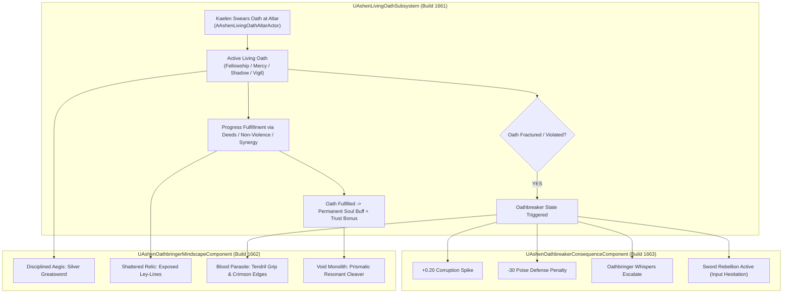

# OATH-SPEC-016: THE LIVING OATH SYSTEM & OATHBRINGER MINDSCAPE PIPELINE
**Domain:** Soul / Combat / Companions / World / Audio / UI / Core / Narrative / Orchestration / QA
**Status:** Canon Specification & Verified Production C++ Implementation (Builds 1656–1675 / Master Batch #83)
**Engine Version:** Unreal Engine 5.8 | **Total Builds Clean:** 1,675

---

## 🏛️ Core Philosophy
> *"An oath in Ashen Oath is not a passive quest log item. It is a live metaphysical tether binding Kaelen's soul to Oathbringer and his companions."*  
> *"Fulfill the vow, and the ancestral steel shines radiant. Fracture the vow, and the blade hungers for blood."*

---

## 🗡️ Living Oath & Sword Morphing Stages Architecture

---

## 📋 The 4 Living Oath Archetypes

1. **Oath of Unbroken Fellowship**: Prioritizes companion protection, synergy finishers, and shared stamina pool maintenance.
2. **Oath of Radiant Mercy**: Forbids dark mode executions on penitent foes; clears integration debt upon merciful disarms.
3. **Oath of the Shadow Sovereign**: Embraces the parasitic entity in Dark Mode, exchanging sanity decay for catastrophic break damage.
4. **Oath of Silent Vigil**: Solo defensive posture focused on perfect parries and poise stability during boss encounters.

---

## 🏛️ Production C++ Class Mapping (Builds 1656–1675)

| Class | Source Header | Primary Responsibility |
|---|---|---|
| `UAshenLivingOathAuditor` | [`AshenLivingOathAuditor.h`](file:///c:/Users/Chris/Ashen%20Oath%20Unreal%20Engine/AshenOath/Source/AshenOathEditor/Tooling/AshenLivingOathAuditor.h) | Audits oath tenet trees and state thresholds |
| `UAshenOathbreakerPenaltyValidator` | [`AshenOathbreakerPenaltyValidator.h`](file:///c:/Users/Chris/Ashen%20Oath%20Unreal%20Engine/AshenOath/Source/AshenOathEditor/Tooling/AshenOathbreakerPenaltyValidator.h) | Validates corruption spikes and poise debuffs |
| `UAshenMindscapeMorphStressTester` | [`AshenMindscapeMorphStressTester.h`](file:///c:/Users/Chris/Ashen%20Oath%20Unreal%20Engine/AshenOath/Source/AshenOathEditor/Tooling/AshenMindscapeMorphStressTester.h) | Stress tests real-time sword morphing transitions |
| `UAshenProductFilterOathGatekeeper` | [`AshenProductFilterOathGatekeeper.h`](file:///c:/Users/Chris/Ashen%20Oath%20Unreal%20Engine/AshenOath/Source/AshenOathEditor/Tooling/AshenProductFilterOathGatekeeper.h) | Enforces safety gates on oath fracture recovery |
| `UAshenLivingOathSubsystem` | [`AshenLivingOathSubsystem.h`](file:///c:/Users/Chris/Ashen%20Oath%20Unreal%20Engine/AshenOath/Source/AshenOath/Soul/AshenLivingOathSubsystem.h) | GameInstance Subsystem managing sworn oaths |
| `UAshenOathbringerMindscapeComponent` | [`AshenOathbringerMindscapeComponent.h`](file:///c:/Users/Chris/Ashen%20Oath%20Unreal%20Engine/AshenOath/Source/AshenOath/Combat/AshenOathbringerMindscapeComponent.h) | Greatsword morphing states (`DisciplinedAegis`, etc.) |
| `UAshenOathbreakerConsequenceComponent` | [`AshenOathbreakerConsequenceComponent.h`](file:///c:/Users/Chris/Ashen%20Oath%20Unreal%20Engine/AshenOath/Source/AshenOath/Soul/AshenOathbreakerConsequenceComponent.h) | Corruption penalties and sword rebellion logic |
| `AAshenLivingOathAltarActor` | [`AshenLivingOathAltarActor.h`](file:///c:/Users/Chris/Ashen%20Oath%20Unreal%20Engine/AshenOath/Source/AshenOath/World/AshenLivingOathAltarActor.h) | In-world consecrated oath altar |
| `UAshenLivingOathGASAbility` | [`AshenLivingOathGASAbility.h`](file:///c:/Users/Chris/Ashen%20Oath%20Unreal%20Engine/AshenOath/Source/AshenOath/Combat/AshenLivingOathGASAbility.h) | Empowered oath resonance strikes & buff auras |
| `UAshenDiegeticOathAudioComponent` | [`AshenDiegeticOathAudioComponent.h`](file:///c:/Users/Chris/Ashen%20Oath%20Unreal%20Engine/AshenOath/Source/AshenOath/Audio/AshenDiegeticOathAudioComponent.h) | Ethereal chimes, parasitic whispers, glass shatter audio |
| `UAshenUserWidget_LivingOathHUD` | [`AshenUserWidget_LivingOathHUD.h`](file:///c:/Users/Chris/Ashen%20Oath%20Unreal%20Engine/AshenOath/Source/AshenOath/UI/AshenUserWidget_LivingOathHUD.h) | Displays active oath tenet icons and fulfillment bars |
| `UAshenUserWidget_OathbreakerAlertHUD` | [`AshenUserWidget_OathbreakerAlertHUD.h`](file:///c:/Users/Chris/Ashen%20Oath%20Unreal%20Engine/AshenOath/Source/AshenOath/UI/AshenUserWidget_OathbreakerAlertHUD.h) | Diegetic HUD warning for oath fractures |
| `UAshenOathbringerMindscapePostProcessAdapter` | [`AshenOathbringerMindscapePostProcessAdapter.h`](file:///c:/Users/Chris/Ashen%20Oath%20Unreal%20Engine/AshenOath/Source/AshenOath/UI/AshenOathbringerMindscapePostProcessAdapter.h) | Inverted void bloom & blood-mist distortion |
| `UAshenOathCompanionTrustAdapter` | [`AshenOathCompanionTrustAdapter.h`](file:///c:/Users/Chris/Ashen%20Oath%20Unreal%20Engine/AshenOath/Source/AshenOath/Companions/AshenOathCompanionTrustAdapter.h) | Modulates companion trust on oath adherence/fracture |
| `UAshenLivingOathSaveGameAdapter` | [`AshenLivingOathSaveGameAdapter.h`](file:///c:/Users/Chris/Ashen%20Oath%20Unreal%20Engine/AshenOath/Source/AshenOath/Core/AshenLivingOathSaveGameAdapter.h) | Serializes active sworn oaths & history to save game |
| `UAshenLivingOathDialogueAdapter` | [`AshenLivingOathDialogueAdapter.h`](file:///c:/Users/Chris/Ashen%20Oath%20Unreal%20Engine/AshenOath/Source/AshenOath/Narrative/AshenLivingOathDialogueAdapter.h) | Dynamic companion commentary during oath events |
| `UAshenLivingOathMasterBridge` | [`AshenLivingOathMasterBridge.h`](file:///c:/Users/Chris/Ashen%20Oath%20Unreal%20Engine/AshenOath/Source/AshenOath/Orchestration/AshenLivingOathMasterBridge.h) | Master bridge broadcasting living oath events |
| `UAshenMilestone1675MasterSynthesisOrchestrator`| [`AshenMilestone1675MasterSynthesisOrchestrator.h`](file:///c:/Users/Chris/Ashen%20Oath%20Unreal%20Engine/AshenOath/Source/AshenOath/Orchestration/AshenMilestone1675MasterSynthesisOrchestrator.h) | Master Milestone 1675 World Subsystem & QA Suite |
