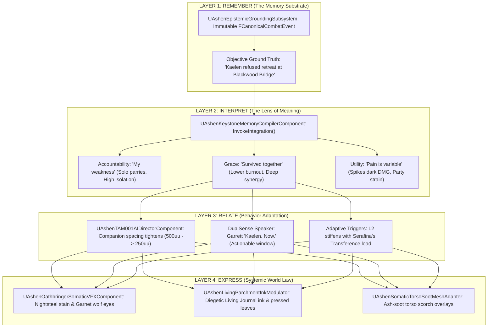

# PHILOSOPHY-SPEC-036: THE FOUR-STAGE CAUSAL CHAIN & EXISTENTIAL SYNTHESIS
**Document ID:** WLF-ARCH-SPEC-036 // AUDIENCE-FACING ARCHITECTURAL SYNTHESIS
**Governing Standard:** PHOENIX CODEX (v4.5+) — *"Your emotional wounds are your combat mechanics."*
**Engine Version:** Unreal Engine 5.8 | **Status:** Master Canon Specification (2,055 Builds Verified Clean)

---

## 🏛️ Executive Summary

In *Ashen Oath: Echoes of the Sundered*, a character's psychological state is not a decorative overlay—it is the core machinery that dictates what gameplay becomes.

A failed defense is not merely lost health:
* It becomes **Memory** (Layer 1).
* Memory becomes **Interpretation** (Layer 2).
* Interpretation alters **Relationships** (Layer 3).
* Relationships change **Companion Behavior & Physical Reality** (Layer 4).
* Accumulated consequences manifest on the skin, weapon, journal, and world itself.

---

## 🏛️ Landmark Industry Precedents

To achieve systemic ludonarrative coherence, *Ashen Oath* synthesizes four landmark design paradigms:

1. **Dwarf Fortress (Layer 1 Precedent)**: Persistent historical event tracking without narrative erasure.
2. **Disco Elysium (Layer 2 Precedent)**: Internal thought routing and subjective interpretive lenses.
3. **Façade (Layer 3 Precedent)**: Reactive social behavior, formation spacing, and sub-textual tactical positioning.
4. **Immersive Sims (Layer 4 Precedent)**: Physicalized world persistence, somatic weapon scars, and diegetic UI.

---

## 🧬 The Four-Stage Causal Chain

---

## 📋 The 4 Layers Defined

### Layer 1: Remember (The Memory Substrate)
> *"What actually happened to us?"*
* **The Soul Constellation**: Records historical facts as immutable structs (`FCanonicalCombatEvent`).
* **Mechanical Honesty**: Objective frame data, positions, and kinetic inputs are never distorted by memory.

### Layer 2: Interpret (The Lens of Meaning)
> *"What does this suffering mean?"*
* **Heartstone Sanctuaries (`InvokeIntegration()`)**: The player chooses how Kaelen interprets trauma:
  - **Accountability**: Focuses on solo parry frame generosity while sacrificing team synergy.
  - **Grace**: Lowers Serafina's transference burnout and unlocks expanded trio sync windows.
  - **Utility**: Unleashes explosive Dark Mode output at the cost of party alienation.

### Layer 3: Relate (Behavior Adaptation)
> *"How does our family treat us because of it?"*
* **Relationship as Behavior**: Companions adapt their tactical spacing ($500\,\text{uu} \rightarrow 250\,\text{uu}$), voice barks, and attack setups silently before any dialogue confirms it.
* **DualSense Diegesis**: Garrett speaks immediate tactical timing directly through the controller speaker in the player's hands.

### Layer 4: Express (Systemic World Law)
> *"How does the world permanently bear the mark?"*
* **Somatic Weapon (Oathbringer)**: Nightsteel stain coverage ($0.0 \rightarrow 1.0$) and garnet wolf-head emissive eyes ($0.2 \rightarrow 3.0$) act as the primary UI-less HUD.
* **The Living Journal (UMB-UI-004)**: Real-time 2-page field journal updating with multi-author marginalia, Garrett's charcoal diagrams, and Serafina's pressed alpine leaves.

---

## 🏛️ Conclusion

*Ashen Oath* does not ask the player to manage a psychological spreadsheet. It asks them to live through the physical, relational, and somatic consequences of an evolving soul.
