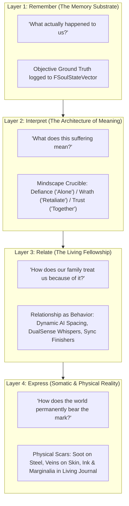

# PROVENANCE-SPEC-040: THE ARCHITECTURE OF CONSEQUENCE & PROVENANCE SYNTHESIS
**Document ID:** WLF-NARR-SPEC-040 // DEFINITIVE NARRATIVE & LUDONARRATIVE MANIFESTO
**Governing Standard:** PHOENIX CODEX (v4.5+) — *"Your emotional wounds are your combat mechanics."*
**Engine Version:** Unreal Engine 5.8 | **Status:** Master Canon Specification (2,115 Builds Verified Clean)

---

## 🏛️ The Central Axiom
> **"You cannot undo or avoid trauma. You can only choose the architecture of how you endure it."**

In most modern RPGs, combat is ephemeral. When an enemy falls, damage numbers fade, hitboxes disappear, and trauma is reduced to abstract experience points spent on a detached skill tree. The character remains an immortal, static vessel, untouched by the horrors they endure.

*Ashen Oath: Echoes of the Sundered* rejects this design. Every parry, broken posture, selfish sacrifice, or desperate reach for companionship is preserved and synthesized through four interlocking systemic layers that turn temporary combat actions into permanent, world-altering history.

---

## 🧬 The Four-Stage Causal Chain



---

## 🌟 The 4 Systemic Layers

### Layer 1: Remember (The Memory Substrate)
* **The Question:** *"What actually happened to us?"*
* **The Reality:** The engine acts as an objective, unvarnished witness. When Kaelen refuses to retreat at the bridge, when Garrett takes black frostbite to his forearm to hold the line, or when Serafina collapses under the weight of absorbed corruption, the runtime kernel (`FSoulStateVector`) records the historical fact. It does not judge or assign morality; it simply preserves the event so that no sacrifice is ever forgotten.

### Layer 2: Interpret (The Architecture of Meaning)
* **The Question:** *"What does this suffering mean?"*
* **The Reality:** At Heartstone Sanctuaries and within the psychic mindscape of *Oathbringer*, unexamined trauma must be confronted. The player does not pick traditional "Good" or "Evil" alignments. Instead, they choose an interpretive lens:
  - **Defiance** (*"I must bear this alone"*): Fosters solo parry precision and martyrdom, but increases personal debt and companion distance.
  - **Wrath** (*"Someone else will pay for this"*): Unleashes necrotic counter-slams and dark output, but stains the flesh and alarms the party.
  - **Trust** (*"We carry this together"*): Pivots into shared defense, clears debt, and unlocks seamless trio synchronization.

### Layer 3: Relate (The Living Fellowship)
* **The Question:** *"How does our family treat us because of it?"*
* **The Reality:** Companionship is never an arbitrary affinity meter. **The relationship is behavior.** If the player repeatedly leans into solitary martyrdom, Garrett and Serafina's AI spacing widens, combat barks become guarded and cold, and synchronization falters. When the player chooses vulnerability and shared burden:
  - Formations tighten into instinctive defense ($500\,\text{uu} \rightarrow 250\,\text{uu}$).
  - Garrett’s voice whispers tactical coordinates through the controller speaker (*"Now"*).
  - Devastating **Party Synchronized Finishers** unlock naturally without glowing on-screen prompts.

### Layer 4: Express (Somatic & Physical Reality)
* **The Question:** *"How does the world permanently bear the mark?"*
* **The Reality:** Nothing important remains invisible math. Every compiled psychological shift manifests in the physical simulation of the world:
  - The **Diegetic Living Journal** documents the journey through physical ink bleeds, shifting handwriting tension, Garrett’s charcoal weak-point sketches, and Serafina’s pressed botanical seals.
  - Material shaders permanently spread soot across Kaelen’s armor plates and trace weeping shadow veins across his skin.
  - Weapon swing weights, idle postures, and environmental acoustics warp to reflect the true weight of his soul.

---

## 🏛️ The Grand Convergence: Provenance

The culmination of this four-layer flow is **Provenance**—the state where mechanics, narrative, and hardware disappear, leaving only tangible truth:

```
                           [ PROVENANCE ]
                                 │
     ┌───────────────────────────┼───────────────────────────┐
     ▼                           ▼                           ▼
[ THE SCAR ON STEEL ]  [ THE MARGIN IN INK ]     [ THE TRUST IN COMBAT ]
Oathbringer retains     Garrett's charcoal        Companions intercept
the soot of Dark Mode   cross-section notes       lethal blows without
overuse.                the enemy's flaw.         needing a command.
```

When a player reaches the third act of *Ashen Oath*, they are holding the physical history of their own journey:
* The greatsword at Kaelen’s back is scarred because of a desperate bargain struck hours ago in the mud.
* Garrett watches the left flank because of a shared victory against an *Ash-Casket* that proved they could survive together.
* The journal page is worn and stained because every trauma left an authentic mark.

The player has not merely leveled up an avatar. **They have actively participated in teaching a broken man how to suffer—and watched a fractured family rebuild a soul from the ashes.**
