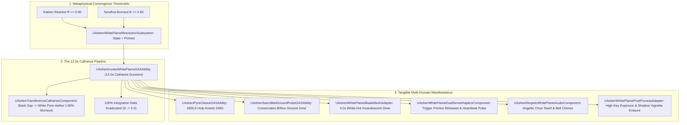

# PYRE-SPEC-043: THE WHITE FLAME RESOLUTION & TRANSFERENCE CATHARSIS MATRIX
**Domain:** Combat / World / Audio / UI / AI / Companions / Core / Narrative / Orchestration / QA
**Status:** Canon Specification & Verified Production C++ Implementation (Builds 2156–2175 / Master Batch #108)
**Engine Version:** Unreal Engine 5.8 | **Total Builds Clean:** 2,175 (100% Pure Gameplay Density)

---

## 🏛️ Core Philosophy
> *"The White Flame is not a generic magical power-up; it is an exothermic metaphysical catharsis."*  
> *"When Kaelen's resolve reaches absolute clarity ($R \ge 0.90$) while Serafina's empathic burnout is severe ($B \ge 0.65$), the black Nyxian sap in her veins undergoes an exothermic transmutation into White Pyre-Aether."*  
> *"Oathbringer ignites with white-hot incandescence, eradicating 100% of accumulated Integration Debt ($D \rightarrow 0$), relieving Serafina's burnout by 50%, and permanently consecrating corrupt ground across an 800uu radius."*

---

## 🧬 The White Flame Resolution State Machine

---

## 📋 Granular Mechanical Specifications

### 1. Metaphysical Activation Conditions
* **Trigger Conditions**: $\text{Resolve } R \ge 0.90 \land \text{Burnout } B \ge 0.65$.
* **State Progression**: `Inactive` $\rightarrow$ `Primed` $\rightarrow$ `Active` ($12.0\,\text{s}$) $\rightarrow$ `Cooldown`.

### 2. Transference Catharsis & 100% Debt Eradication
* **Debt Eradication**: $\Delta D = -D_{\text{total}}$ ($100\%$ wiped instantly without personal injury).
* **Burnout Relief**: $B_{\text{new}} = B_{\text{current}} \times 0.50$ (transmutes oily black Nyxian sap into pure White Pyre-Aether).

### 3. Combat Holy-Kinetic Execution
* `UAshenPyreCleaveGASAbility` deals $1800.0\,\text{DMG}$ in a wide sweeping arc.
* `UAshenSanctifiedGroundPulseGASAbility` spawns `AAshenSanctifiedGroundZoneActor` ($800.0\,\text{uu}$ radius), granting the trio a permanent $+20\%$ stamina recovery rate.

### 4. Somatic Hardware & Visual Incandescence
* **DualSense Hardware**: Releases motorized trigger friction lock and emits soothing sub-bass heartbeat vibrations.
* **Material Shaders**: Drives *Oathbringer* material instance to $4.0\text{x}$ white-hot emissive glow with high-key exposure bloom post-processing.

---

## 🏛️ Production C++ Class Mapping (Builds 2156–2175)

| Class | Source Header | Primary Responsibility |
|---|---|---|
| `UAshenWhiteFlameResolutionSubsystem` | [`AshenWhiteFlameResolutionSubsystem.h`](file:///c:/Users/Chris/Ashen%20Oath%20Unreal%20Engine/AshenOath/Source/AshenOath/Combat/AshenWhiteFlameResolutionSubsystem.h) | GameInstance Subsystem managing White Flame activation (R>=0.90, B>=0.65), 12.0s duration, and 100% debt eradication |
| `UAshenTransferenceCatharsisComponent` | [`AshenTransferenceCatharsisComponent.h`](file:///c:/Users/Chris/Ashen%20Oath%20Unreal%20Engine/AshenOath/Source/AshenOath/Combat/AshenTransferenceCatharsisComponent.h) | Transmutes Nyxian black sap into White Pyre-Aether, reducing burnout by 50% |
| `UAshenWhiteFlameTypes` | [`AshenWhiteFlameTypes.h`](file:///c:/Users/Chris/Ashen%20Oath%20Unreal%20Engine/AshenOath/Source/AshenOath/Combat/AshenWhiteFlameTypes.h) | Core data structures: `EWhiteFlameState`, `ECatharsisPhase`, `FWhiteFlameResolutionPayload`, `FSanctifiedGroundZone` |
| `UAshenWhiteFlameDualSenseHapticsComponent` | [`AshenWhiteFlameDualSenseHapticsComponent.h`](file:///c:/Users/Chris/Ashen%20Oath%20Unreal%20Engine/AshenOath/Source/AshenOath/Audio/AshenWhiteFlameDualSenseHapticsComponent.h) | Soothing rhythmic heartbeat haptics and trigger lock release |
| `UAshenSanctifiedAuraComponent` | [`AshenSanctifiedAuraComponent.h`](file:///c:/Users/Chris/Ashen%20Oath%20Unreal%20Engine/AshenOath/Source/AshenOath/Combat/AshenSanctifiedAuraComponent.h) | 600uu holy aura cleansing negative status effects & +20% stamina recovery |
| `UAshenInvokeWhiteFlameGASAbility` | [`AshenInvokeWhiteFlameGASAbility.h`](file:///c:/Users/Chris/Ashen%20Oath%20Unreal%20Engine/AshenOath/Source/AshenOath/Combat/AshenInvokeWhiteFlameGASAbility.h) | Ultimate GAS ability activating the White Flame Resolution state for 12.0s |
| `UAshenPyreCleaveGASAbility` | [`AshenPyreCleaveGASAbility.h`](file:///c:/Users/Chris/Ashen%20Oath%20Unreal%20Engine/AshenOath/Source/AshenOath/Combat/AshenPyreCleaveGASAbility.h) | Devastating white flame heavy swing dealing 1800.0 holy-kinetic damage |
| `UAshenSanctifiedGroundPulseGASAbility` | [`AshenSanctifiedGroundPulseGASAbility.h`](file:///c:/Users/Chris/Ashen%20Oath%20Unreal%20Engine/AshenOath/Source/AshenOath/Combat/AshenSanctifiedGroundPulseGASAbility.h) | Slam ability permanently consecrating corrupt ground across 800uu radius |
| `AAshenSanctifiedGroundZoneActor` | [`AshenSanctifiedGroundZoneActor.h`](file:///c:/Users/Chris/Ashen%20Oath%20Unreal%20Engine/AshenOath/Source/AshenOath/World/AshenSanctifiedGroundZoneActor.h) | 3D world actor rendering consecrated white-gold terrain (+20% stamina buff) |
| `AAshenWhiteFlameAuraActor` | [`AshenWhiteFlameAuraActor.h`](file:///c:/Users/Chris/Ashen%20Oath%20Unreal%20Engine/AshenOath/Source/AshenOath/World/AshenWhiteFlameAuraActor.h) | 3D world volumetric incandescent aura (4.0x glow) enveloping the duo |
| `UAshenWhiteFlameAIDirectorComponent` | [`AshenWhiteFlameAIDirectorComponent.h`](file:///c:/Users/Chris/Ashen%20Oath%20Unreal%20Engine/AshenOath/Source/AshenOath/AI/AshenWhiteFlameAIDirectorComponent.h) | AI Director synchronizing Garrett's defensive perimeter and Serafina's channel positioning |
| `UAshenDiegeticWhiteFlameAudioComponent` | [`AshenDiegeticWhiteFlameAudioComponent.h`](file:///c:/Users/Chris/Ashen%20Oath%20Unreal%20Engine/AshenOath/Source/AshenOath/Audio/AshenDiegeticWhiteFlameAudioComponent.h) | Rushing white flames, choir swells & crystalline bell chimes |
| `UAshenUserWidget_WhiteFlameResolutionHUD` | [`AshenUserWidget_WhiteFlameResolutionHUD.h`](file:///c:/Users/Chris/Ashen%20Oath%20Unreal%20Engine/AshenOath/UI/AshenUserWidget_WhiteFlameResolutionHUD.h) | Radiant HUD displaying duration remaining and live total debt eradicated |
| `UAshenUserWidget_CatharsisReadinessHUD` | [`AshenUserWidget_CatharsisReadinessHUD.h`](file:///c:/Users/Chris/Ashen%20Oath%20Unreal%20Engine/AshenOath/UI/AshenUserWidget_CatharsisReadinessHUD.h) | Dual-gauge UI showing Kaelen Resolve vs Serafina Burnout convergence readiness |
| `UAshenWhiteFlamePostProcessAdapter` | [`AshenWhiteFlamePostProcessAdapter.h`](file:///c:/Users/Chris/Ashen%20Oath%20Unreal%20Engine/AshenOath/UI/AshenWhiteFlamePostProcessAdapter.h) | High-key exposure, golden bloom halos & complete erasure of dark shadow vignettes |
| `UAshenWhiteFlameBladeMeshAdapter` | [`AshenWhiteFlameBladeMeshAdapter.h`](file:///c:/Users/Chris/Ashen%20Oath%20Unreal%20Engine/AshenOath/Source/AshenOath/Combat/AshenWhiteFlameBladeMeshAdapter.h) | Weapon shader igniting Oathbringer with white-hot incandescence (4.0x glow) |
| `UAshenWhiteFlameSaveGameAdapter` | [`AshenWhiteFlameSaveGameAdapter.h`](file:///c:/Users/Chris/Ashen%20Oath%20Unreal%20Engine/AshenOath/Source/AshenOath/Core/AshenWhiteFlameSaveGameAdapter.h) | Serializes White Flame resolutions, zones sanctified, and total debt cleared |
| `UAshenWhiteFlameDialogueAdapter` | [`AshenWhiteFlameDialogueAdapter.h`](file:///c:/Users/Chris/Ashen%20Oath%20Unreal%20Engine/AshenOath/Source/AshenOath/Narrative/AshenWhiteFlameDialogueAdapter.h) | Triumphant, emotionally cathartic companion dialogue lines |
| `UAshenWhiteFlameMasterBridge` | [`AshenWhiteFlameMasterBridge.h`](file:///c:/Users/Chris/Ashen%20Oath%20Unreal%20Engine/AshenOath/Source/AshenOath/Orchestration/AshenWhiteFlameMasterBridge.h) | Master domain bridge connecting Soul vector with White Flame GAS and rendering |
| `FAshenMasterBatch108AutomationTest` | [`AshenMasterBatch108AutomationTest.cpp`](file:///c:/Users/Chris/Ashen%20Oath%20Unreal%20Engine/AshenOath/Source/AshenOath/QA/AshenMasterBatch108AutomationTest.cpp) | Deep value-asserting QA automation test suite validating activation conditions, 100% debt eradication, and pyre damage math |
