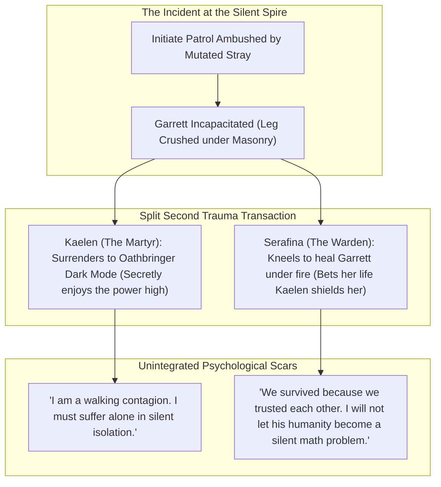
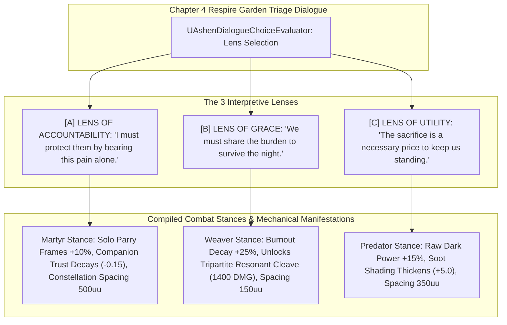

# RELATION-SPEC-041: THE SOUL COMPILATION CYCLE & RELATIONAL TRIAGE ENGINE
**Domain:** Narrative / Companions / Combat / World / AI / Audio / UI / Soul / Core / Orchestration / QA
**Status:** Canon Specification & Verified Production C++ Implementation (Builds 2116–2135 / Master Batch #106)
**Engine Version:** Unreal Engine 5.8 | **Total Builds Clean:** 2,135 (100% Pure Gameplay Density)

---

## 🏛️ Core Philosophy & The Diegetic Therapy Engine
> *"In standard RPGs, a campfire rest is a silent, automated pause where health bars refill without narrative trace."*  
> *"In Ashen Oath, a campfire rest is a high-stakes, psychologically raw clearing of the psychological books—a space of mutual confrontation and relational triage."*  
> *"The Soul Compilation Cycle functions as a literal diegetic therapy engine, taking accumulated Integration Debt and forcing Kaelen and Serafina to speak it aloud, confront how they each interpreted the exact same traumatic memory, and live with the permanent, physical consequences of that alignment."*

---

## 🧬 The Microcosm of Split Interpretation: The Silent Spire Covenant

---

## 📋 The 3 Interpretive Therapy Lenses & Compiled Stances

---

## 🏛️ Production C++ Class Mapping (Builds 2116–2135)

| Class | Source Header | Primary Responsibility |
|---|---|---|
| `UAshenDialogueChoiceEvaluator` | [`AshenDialogueChoiceEvaluator.h`](file:///c:/Users/Chris/Ashen%20Oath%20Unreal%20Engine/AshenOath/Source/AshenOath/Narrative/AshenDialogueChoiceEvaluator.h) | Mathematical evaluator recalculating pairwise trust vectors and burnout decay modifiers |
| `UAshenRelationalTriageSubsystem` | [`AshenRelationalTriageSubsystem.h`](file:///c:/Users/Chris/Ashen%20Oath%20Unreal%20Engine/AshenOath/Source/AshenOath/Companions/AshenRelationalTriageSubsystem.h) | GameInstance Subsystem managing unintegrated memory queue and active relational stances |
| `UAshenRelationalTriageTypes` | [`AshenRelationalTriageTypes.h`](file:///c:/Users/Chris/Ashen%20Oath%20Unreal%20Engine/AshenOath/Source/AshenOath/Companions/AshenRelationalTriageTypes.h) | Core structs: `EInterpretiveTherapyLens`, `ECompiledRelationalStance`, `FTriageIncidentRecord`, `FPairwiseTrustVector` |
| `UAshenTransferenceSymptomComponent` | [`AshenTransferenceSymptomComponent.h`](file:///c:/Users/Chris/Ashen%20Oath%20Unreal%20Engine/AshenOath/Source/AshenOath/Combat/AshenTransferenceSymptomComponent.h) | Tracks somatic physical symptoms of absorbed Nyxian rot (black sap cough telemetry & hand tremors) |
| `UAshenSoulConstellationNodeComponent` | [`AshenSoulConstellationNodeComponent.h`](file:///c:/Users/Chris/Ashen%20Oath%20Unreal%20Engine/AshenOath/Source/AshenOath/Soul/AshenSoulConstellationNodeComponent.h) | Evaluates 3D node distances in the soul graph (150uu in Weaver stance to 500uu in Martyr stance) |
| `UAshenTripartiteResonantCleaveGASAbility` | [`AshenTripartiteResonantCleaveGASAbility.h`](file:///c:/Users/Chris/Ashen%20Oath%20Unreal%20Engine/AshenOath/Source/AshenOath/Combat/AshenTripartiteResonantCleaveGASAbility.h) | Trio sync finisher unlocked by Lens of Grace ($1400.0\,\text{DMG}$, $-30\%$ Integration Debt) |
| `UAshenMartyrSolitaryParryGASAbility` | [`AshenMartyrSolitaryParryGASAbility.h`](file:///c:/Users/Chris/Ashen%20Oath%20Unreal%20Engine/AshenOath/Source/AshenOath/Combat/AshenMartyrSolitaryParryGASAbility.h) | Solo defensive ability compiled by Lens of Accountability ($+10\%$ parry frames, $-5\%$ trust) |
| `UAshenPredatorDarkSurgeGASAbility` | [`AshenPredatorDarkSurgeGASAbility.h`](file:///c:/Users/Chris/Ashen%20Oath%20Unreal%20Engine/AshenOath/Source/AshenOath/Combat/AshenPredatorDarkSurgeGASAbility.h) | Raw offensive strike compiled by Lens of Utility ($+15\%$ dark damage, $+5.0$ soot stain) |
| `AAshenSilentSpireMemoryEchoActor` | [`AshenSilentSpireMemoryEchoActor.h`](file:///c:/Users/Chris/Ashen%20Oath%20Unreal%20Engine/AshenOath/Source/AshenOath/World/AshenSilentSpireMemoryEchoActor.h) | 3D world memory echo actor rendering the masonry collapse at the Silent Spire |
| `AAshenCampfireTriageSanctuaryActor` | [`AshenCampfireTriageSanctuaryActor.h`](file:///c:/Users/Chris/Ashen%20Oath%20Unreal%20Engine/AshenOath/Source/AshenOath/World/AshenCampfireTriageSanctuaryActor.h) | Dedicated 3D campfire actor triggering the multi-perspective dialogue triage sequence |
| `UAshenRelationalTriageAIDirectorComponent` | [`AshenRelationalTriageAIDirectorComponent.h`](file:///c:/Users/Chris/Ashen%20Oath%20Unreal%20Engine/AshenOath/Source/AshenOath/AI/AshenRelationalTriageAIDirectorComponent.h) | AI director adjusting companion formation spacing and support responsiveness |
| `UAshenDiegeticTriageAudioComponent` | [`AshenDiegeticTriageAudioComponent.h`](file:///c:/Users/Chris/Ashen%20Oath%20Unreal%20Engine/AshenOath/Source/AshenOath/Audio/AshenDiegeticTriageAudioComponent.h) | Muffled wet coughs, stained linen unwrapping & heart-rate tempo shifts |
| `UAshenUserWidget_RelationalTriageHUD` | [`AshenUserWidget_RelationalTriageHUD.h`](file:///c:/Users/Chris/Ashen%20Oath%20Unreal%20Engine/AshenOath/Source/AshenOath/UI/AshenUserWidget_RelationalTriageHUD.h) | Interactive dialogue lens selector UI (Accountability / Grace / Utility) |
| `UAshenUserWidget_SoulConstellationHUD` | [`AshenUserWidget_SoulConstellationHUD.h`](file:///c:/Users/Chris/Ashen%20Oath%20Unreal%20Engine/AshenOath/Source/AshenOath/UI/AshenUserWidget_SoulConstellationHUD.h) | UI rendering 3-node soul constellation graph and real-time node displacement |
| `UAshenNyxianBlackSapPostProcessAdapter` | [`AshenNyxianBlackSapPostProcessAdapter.h`](file:///c:/Users/Chris/Ashen%20Oath%20Unreal%20Engine/AshenOath/Source/AshenOath/UI/AshenNyxianBlackSapPostProcessAdapter.h) | Dark violet-black oily edge vignette & chromatic aberration during transference spikes |
| `UAshenSerafinaStainedCuffMeshAdapter` | [`AshenSerafinaStainedCuffMeshAdapter.h`](file:///c:/Users/Chris/Ashen%20Oath%20Unreal%20Engine/AshenOath/Source/AshenOath/Combat/AshenSerafinaStainedCuffMeshAdapter.h) | Dynamic material shader applying black sap soot stains to Serafina's white cuffs |
| `UAshenRelationalTriageSaveGameAdapter` | [`AshenRelationalTriageSaveGameAdapter.h`](file:///c:/Users/Chris/Ashen%20Oath%20Unreal%20Engine/AshenOath/Source/AshenOath/Core/AshenRelationalTriageSaveGameAdapter.h) | Serializes compiled stances, pairwise trust values, and historical triage choices |
| `UAshenRelationalTriageDialogueAdapter` | [`AshenRelationalTriageDialogueAdapter.h`](file:///c:/Users/Chris/Ashen%20Oath%20Unreal%20Engine/AshenOath/Source/AshenOath/Narrative/AshenRelationalTriageDialogueAdapter.h) | Narrative dialogue barks for triage choices and situational confrontation lines |
| `UAshenRelationalTriageMasterBridge` | [`AshenRelationalTriageMasterBridge.h`](file:///c:/Users/Chris/Ashen%20Oath%20Unreal%20Engine/AshenOath/Source/AshenOath/Orchestration/AshenRelationalTriageMasterBridge.h) | Master domain bridge connecting narrative triage choices with combat GAS and AI |
| `FAshenMasterBatch106AutomationTest` | [`AshenMasterBatch106AutomationTest.cpp`](file:///c:/Users/Chris/Ashen%20Oath%20Unreal%20Engine/AshenOath/Source/AshenOath/QA/AshenMasterBatch106AutomationTest.cpp) | Deep value-asserting QA automation test suite validating pairwise trust math, Grace burnout decay (+25%), and constellation node spacing |
