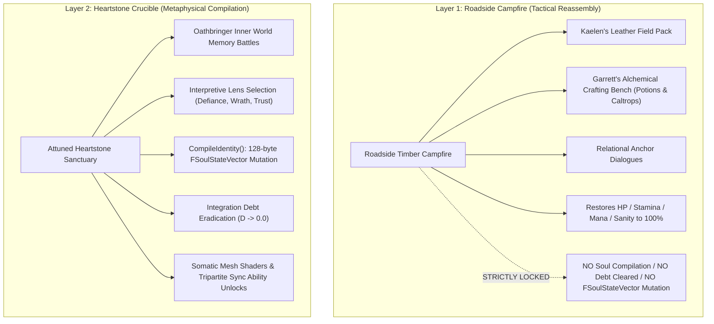
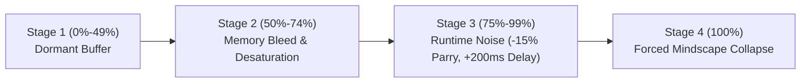

# SANCTUARY-SPEC-047: CAMPFIRE REASSEMBLY VS HEARTSTONE SOUL COMPILATION
**Domain:** World / Core Architecture / UI / Soul / Memory / Narrative / Combat / QA
**Status:** Supreme Canon Architectural & Metaphysical Specification
**Engine Version:** Unreal Engine 5.8 | **Master Milestone:** 2215+

---

## 🏛️ The Dual Safe-Zone Architecture

> **"The problem is not suffering; the problem is suffering without reflection."**  
> **"A roadside timber fire can bandage flesh and brew caltrops, but it cannot penetrate the nightsteel cage of Oathbringer. Only a planetary Heartstone Crucible possesses the celestial charge to compile a soul."**

*Ashen Oath* enforces an unyielding architectural and metaphysical distinction between **Roadside Campfires** (Layer 1 Safe-Zones) and **Heartstone Sanctuaries** (Layer 2 Crucibles). Integration Debt is **strictly and exclusively clearable at Heartstone Crucibles**.

---

## ⚖️ Comparative Matrix: Campfires vs. Heartstones

| Dimension | Roadside Campfire (Layer 1) | Heartstone Crucible (Layer 2) |
|---|---|---|
| **Location Type** | Wild roadside timber fires, temporary bivouacs | Ancient purified/stabilized planetary ley line nodes |
| **Gating Subsystem** | `UAshenInterfaceWorldAvailabilitySubsystem` (Campfire State) | `UAshenInterfaceWorldAvailabilitySubsystem` (Sanctuary State) |
| **Active Component** | `UAshenSanctuaryRestComponent` | `UAshenSanctuaryHeartstoneCrucibleComponent` |
| **Physical Restoration** | Refuels HP, Stamina, Mana, Sanity to 100%; clears active fatigue | Refuels physical bars AND cleanses somatic dark sap/soot creep |
| **Integration Debt ($D$)** | **0% Debt Cleared** (Debt remains untouched) | **100% Cleared** ($D \rightarrow 0.0$ via `CompileIdentity()`) |
| **`FSoulStateVector`** | **Locked (Read-Only)** | **Mutated (Read/Write 128-byte compilation)** |
| **Alchemical Crafting** | `UAshenAlchemicalCraftingBenchActor` fully accessible | Alchemical crafting accessible + Crucible transmutation |
| **Companion Systems** | Relational Anchor Dialogues (fatigue reset) | Permanent trust vector recalculation & somatic link unlock |
| **Inner World Traversal** | **Blocked** (Timber lacks ley line charge) | **Unlocks** *Oathbringer* Inner Mindscape Memory Battles |

---

## 🔒 Subsystem Gating & The C++ Interface Rules

1. **Strict Spatial Gating**:
   - `UAshenInterfaceWorldAvailabilitySubsystem` checks player spatial coordinates and proximity tags.
   - At a standard campfire, the master compiler UI—`UAshenUserWidget_HeartstoneReflection` and `UAshenMemoryWeavingSubsystem`—is **hard-disabled**.
2. **State Vector Mutex**:
   - `UAshenSanctuaryHeartstoneCrucibleComponent` acts as a physical hardware lock on `FSoulStateVector`.
   - Because compiling a memory requires executing heavy `CompileIdentity()` calculations, the soul data cannot be written or debt purged anywhere outside an attuned Heartstone node.

---

## 🌌 The Metaphysical Law of The Shattered Lands

* **Kaelen as the Mobile Vessel**: Kaelen is the latent biological descendant of the regional Heartstone Guardians. His nervous system is uniquely attuned to interface with Eldorian reality engines.
* **Ley Line Grounding**: Projecting Kaelen's consciousness into the inner mindscape of *Oathbringer* requires grounding his astral tether to the planet's tectonic ley line network. Mundane wood smoke lacks the electrical voltage and ancestral harmonic resonance required to pierce nightsteel.

---

## ⏳ Preserving the Unresolved Pressure Pipeline

Restricting Integration Debt clearing to rare Heartstones preserves the existential tension of the **4-Stage Escalation Pipeline**:

* If players could wipe their debt at any roadside campfire, they would simply rest the moment Stage 2 Memory Bleed began, neutralizing all systemic dread.
* Forcing the player to navigate **Stage 3 Runtime Noise** (narrowed parry windows, lagging companion AI barks) while desperately hunting for a Heartstone creates an unforgettable fugitive survival loop.

---

## 🏛️ Enshrined Architecture & Specification References
- **Domain Subsystem**: `UAshenInterfaceWorldAvailabilitySubsystem` (`Source/AshenOath/World/`)
- **Crucible Component**: `UAshenSanctuaryHeartstoneCrucibleComponent` (`Source/AshenOath/World/`)
- **Rest Component**: `UAshenSanctuaryRestComponent` (`Source/AshenOath/World/`)
- **Soul Vector**: `FSoulStateVector` (`Source/AshenOath/Soul/`)
- **Atlas Specification**: [`Docs/MASTER_ARCHITECTURE_ATLAS.md`](file:///c:/Users/Chris/Ashen%20Oath%20Unreal%20Engine/Docs/MASTER_ARCHITECTURE_ATLAS.md)
