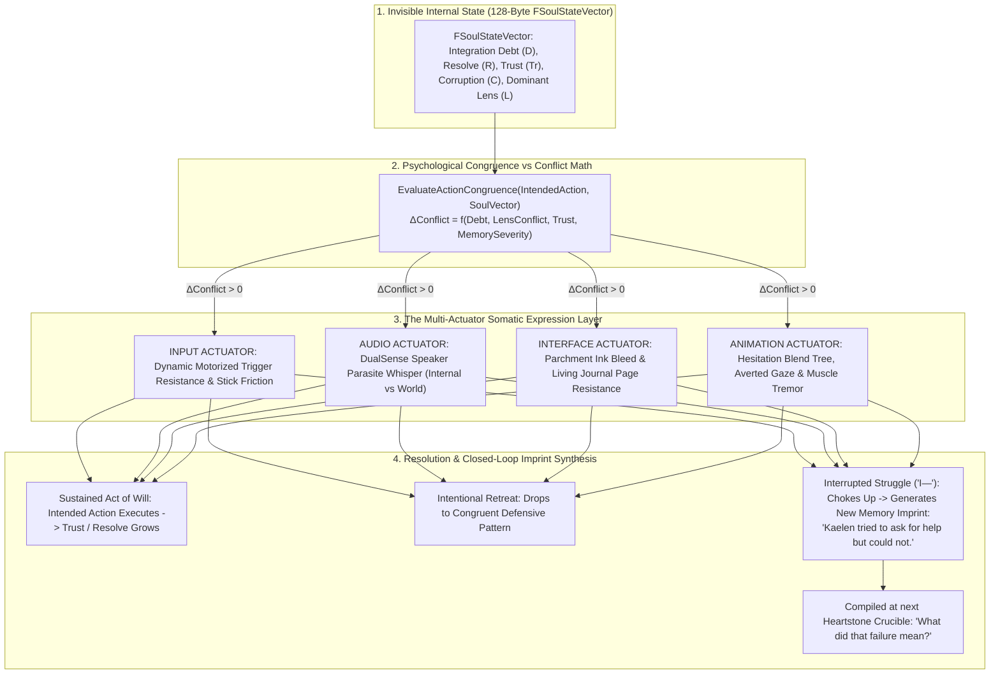

# SOMATIC-SPEC-050: THE UNIVERSAL SOMATIC EXPRESSION LAYER & CONFLICT EQUILIBRIUM
**Domain:** Core Architecture / Soul / Input / Audio / UI / Animation / Narrative / QA
**Status:** Supreme Canon Architectural & Sensory Specification
**Engine Version:** Unreal Engine 5.8 | **Master Milestone:** 2215+

---

## 🏛️ The Universal Somatic Law

> **"The player is never shown the invisible vector directly; they encounter the force it exerts."**  
> **"When Kaelen attempts an action psychologically inconsistent with his currently dominant interpretive state, the game externalizes that conflict through somatic resistance across input, audio, animation, and interface."**  
> **"The most terrifying moment in Ashen Oath is not when the controller fights you—it is when it stops fighting you."**

---

## 🧬 The Macro-Systemic Somatic Expression Pipeline

---

## ⚖️ The Dynamic Somatic Resistance Formula

Somatic resistance is not a static binary ("Good = Hard, Bad = Easy"). It is a **continuous mathematical evaluation of psychological congruence**:

$$\text{Resistance}_{\text{Somatic}} = \text{Clamp}\Big( w_1 \cdot D + w_2 \cdot \Delta L + w_3 \cdot (1.0 - Tr) + w_4 \cdot M_{\text{severity}} - w_5 \cdot R, \,\, 0.0, \,\, 1.0 \Big)$$

Where:
* $D$: Integration Debt ($0.0 \rightarrow 1.0$)
* $\Delta L$: Distance between intended choice and Kaelen's historically compiled Lens ($0.0 \rightarrow 1.0$)
* $Tr$: Relationship Trust with the active companion ($0.0 \rightarrow 1.0$)
* $M_{\text{severity}}$: Severity of the trauma being referenced ($0.0 \rightarrow 1.0$)
* $R$: Kaelen's current Resolve ($0.0 \rightarrow 1.0$)

---

## 🎭 The Spectrum of Somatic Resistance

### 1. Light Friction ($\text{Resistance} \approx 0.15$)
* **Dialogue**: *"I'm tired."* (Small admission of fatigue).
* **Somatic Expression**: Subtle trigger resistance pulse; slight breath hitch in animation.

### 2. Moderate Struggle ($\text{Resistance} \approx 0.50$)
* **Dialogue**: *"Garrett was right about the flank."* (Contradicting defensive ego).
* **Somatic Expression**: Stiffening triggers; violet ink edge around dialogue text; Garrett's skeptical glance.

### 3. Severe Will Battle ($\text{Resistance} \approx 0.85$)
* **Dialogue**: *"I was afraid."* (Confronting the Silent Spire massacre).
* **Somatic Expression**: DualSense triggers tremble violently; TV sound dips while parasite whispers in palms (*"...admit weakness and they will abandon you..."*); Kaelen's hand visibly trembles on sword hilt.

### 4. Zero Resistance: The Frightening Silence ($\text{Resistance} = 0.0$)
* **Dialogue**: *"Leave the wounded. They will slow us down."*
* **Context**: After 40 hours of compiling events under a cold **Utility Lens**.
* **Somatic Expression**: **Complete, effortless silence.** No trigger resistance. No parasite whisper. No ink distortion. Kaelen speaks the cruel line without hesitation.
* **The Revelation**: The player realizes with chilling clarity: *Kaelen didn't struggle because this is who he has trained himself to be.*

---

## 🛡️ The Two Failure Modes: Retreat vs. Interrupted Struggle

| Failure Type | Trigger Condition | Character Manifestation | Causal Consequence |
|---|---|---|---|
| **Intentional Retreat** | Player consciously lets go of triggers to select default response | Kaelen intentionally reverts to his established defensive coping mechanism (*"Never mind. It doesn't matter."*) | Integration Debt buffers silently ($+0.02$). Companions maintain status quo. |
| **Interrupted Struggle** | Player attempts to hold triggers but drops before resolution | Kaelen begins to speak, chokes on his own words (*"I—"*), looks away, and falls silent. | **Generates Unique Memory Imprint:** *"Kaelen tried to ask for help but could not."* Feeds into the next Heartstone Crucible reflection. |

---

## 🔊 The Semantic Rule of DualSense Audio

* **External Game Reality (TV / Headphones)**: World ambience, weather, sword clashes, Garrett and Serafina's physical voices.
* **Internal Psychic Intrusion (DualSense Speaker in Palms)**: Parasitic whisper of *Oathbringer*, Kaelen's repressed self-doubt, unintegrated memory bleed.
* **The Rule**: *If a sound originates from the controller in your hands, it is not physical reality—it is happening inside Kaelen's psyche.*

---

## 📜 Complete Sensory Vocabulary (HUDless Translation Table)

| Invisible State Vector | Sensory & Physical Translation |
|---|---|
| **Rising Runtime Noise ($75\% - 99\%$)** | Parasitic audio intrusions in palms, violet ink distortion on UI, micro-stutter in parry timing |
| **Integration Debt ($D$)** | Motorized trigger stiffness, Living Journal page friction, hand tremor idle animation |
| **Relational Trust ($Tr$)** | Harmonized 60 BPM haptic heartbeat, tightened flank proximity, trigger "give-way" on stagger |
| **Lens Conflict ($\Delta L$)** | Somatic trigger resistance when attempting out-of-character emotional responses |
| **Habituated Corruption** | Complete loss of resistance when selecting cold, instrumental, or cruel choices |
| **Emotional Breakthrough** | Previously impossible truths become effortless and silent to utter |

---

## 🏛️ Enshrined Architecture References
- **Master Atlas**: [`Docs/MASTER_ARCHITECTURE_ATLAS.md`](file:///c:/Users/Chris/Ashen%20Oath%20Unreal%20Engine/Docs/MASTER_ARCHITECTURE_ATLAS.md)
- **Ludonarrative Foundation**: [`Docs/SUFFERING-SPEC-046.md`](file:///c:/Users/Chris/Ashen%20Oath%20Unreal%20Engine/Docs/SUFFERING-SPEC-046%20%28THE%20THREE%20SURVIVAL%20STRATEGIES%20&%20SOMATIC%20INTEGRATION%20OF%20SUFFERING%29.md)
- **Dialogue Specifics**: [`Docs/DIALOGUE-SPEC-049.md`](file:///c:/Users/Chris/Ashen%20Oath%20Unreal%20Engine/Docs/DIALOGUE-SPEC-049%20%28DISSONANT%20DIALOGUE%20HIJACKING%20&%20SOMATIC%20WILL%20STRUGGLE%29.md)
- **Hardware Integration**: [`Docs/HAPTIC-SPEC-048.md`](file:///c:/Users/Chris/Ashen%20Oath%20Unreal%20Engine/Docs/HAPTIC-SPEC-048%20%28THE%20HAPTIC%20RESONANCE%20CHORD%20&%20DUALSENSE%20SOMATIC%20SYNERGY%29.md)
