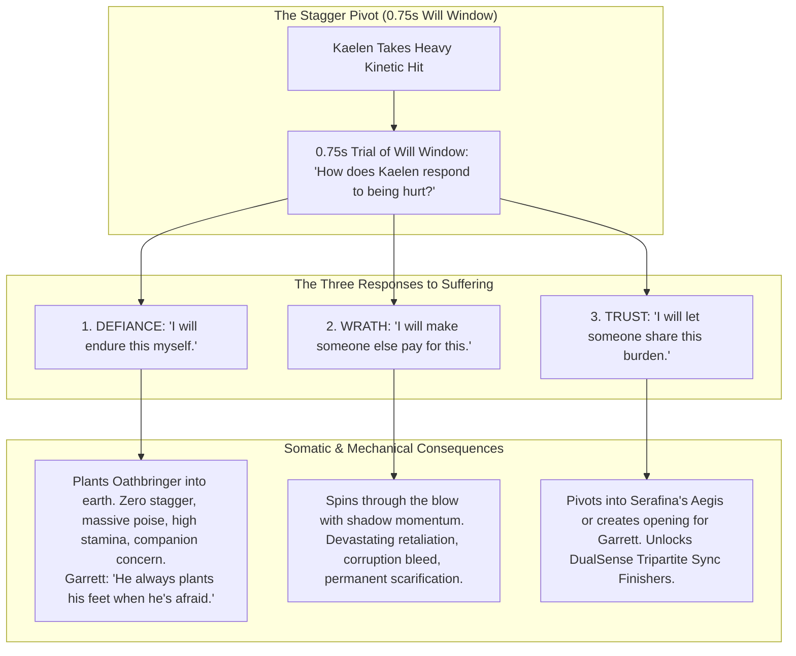
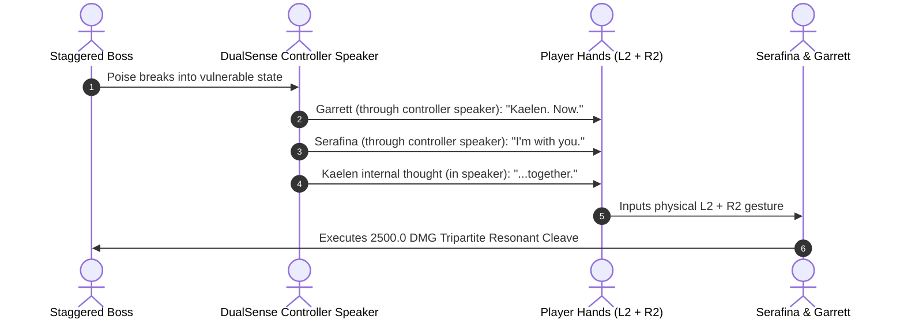

# SUFFERING-SPEC-046: THE THREE SURVIVAL STRATEGIES & SOMATIC INTEGRATION OF SUFFERING
**Domain:** Narrative / Core Philosophy / Combat / Audio / UI / Companions / Soul / QA
**Status:** Supreme Canon Ludonarrative Specification
**Engine Version:** Unreal Engine 5.8 | **Master Milestone:** 2215+

---

## 🏛️ The Supreme Systemic Axis of *Ashen Oath*

> **"You cannot undo or avoid trauma. You can only choose the architecture of how you endure it."**  
> **"Ash is not the absence of fire. Ash is what remains after fire."**  
> **"The world cannot be healed back into what it was. What will Kaelen build from what remains?"**

*Ashen Oath* does not possess a traditional "morality meter" or a binary Light/Dark alignment tree. The entire game operates along a singular, psychologically grounded systemic axis: **How Kaelen integrates suffering.**

---

## ⚔️ The Three Survival Strategies (Responses to Pain)



---

## 🎮 The DualSense Diegetic Speaker & Shared Competence Pipeline

Rather than displaying arcade-style button prompts on screen (`[HOLD L2 + R2 - SYNCHRONIZED FINISHER]`), *Ashen Oath* relies on **spatialized controller audio and haptic shared competence**:



### The Evolution of Companion Audio
* **Early Game**: *"Now!"* (Direct instructive command).
* **Mid Game**: *"Left."* (Tactical shorthand).
* **Late Game**: *"You see it."* (Complete shared competence—pure instinct without UI).

---

## 📜 The Living Journal as the Archaeological Record of Suffering

The Living Journal is not a quest log; it is the **historical record of who Kaelen has become**:

```text
[ CHAPTER IV — THE EMBERS AT THE ASH CASKET ]

Kaelen's Hand (Cramped charcoal):
"The Ash Casket opened. The armor gave way."

Garrett's Marginalia (Quick ink sketch of a parry angle):
"You finally watched the left foot."

Serafina's Marginalia (Pressed alpine snow-leaf bound with golden filament thread):
"And you trusted us to catch you."
```

When the player inspects the journal after 30 hours of gameplay, they do not see a stat build—they realize:  
> **"I have been teaching this man how to suffer."**

---

## ⚖️ The Non-Spreadsheet Equilibrium: No "Optimal" Ending

| Strategy | Combat Identity | Psychological Tradeoff | Companion Repercussion |
|---|---|---|---|
| **Defiance** | Extraordinary solo defensive resilience, hyper-poise, unbreakable footing | Extreme self-reliance, isolation, high stamina consumption | Companions struggle to reach him; fear for his martyrdom |
| **Wrath** | Brutally efficient execution, high dark burst damage, frame momentum | Heavy corruption exposure, somatic twitching, volatile vulnerability | Relationships become instrumental; companions fear his contagion |
| **Trust** | Unlocks Tripartite Sync Finishers, rapid burnout decay, resilient healing | Deep dependency on companion proximity; vulnerable when isolated | Companions share physical burden (Serafina black sap, Garrett wounds) |

---

## 🏛️ Permanent Somatic Scarification & World Provenance

1. **The World Remembers**: Oakhaven does not magically rebuild. Elara does not come back. The Shattering happened.
2. **The Body Remembers**: Repeated Wrath darkens the veins across Kaelen's neck; repeated Defiance deepens the furrow in his stance; repeated Trust stitches gold filament across his gauntlets.
3. **The Crucible of Ash**: Ash is not nothingness—**Ash is what endures after the fire.**
