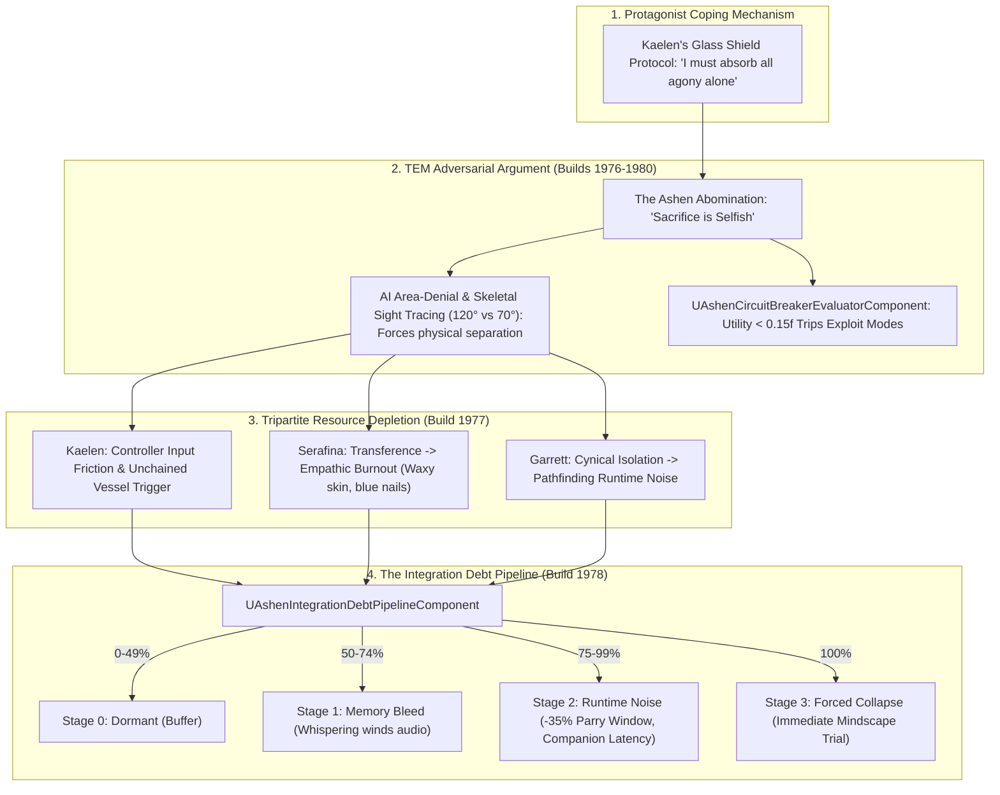

# TEM-SPEC-032: THE TRAUMA ENEMY MATRIX (TEM) & ADVERSARIAL AI KERNEL
**Domain:** AI / Combat / Soul / World / Audio / UI / Companions / Core / Narrative / Orchestration / QA
**Status:** Canon Specification & Verified Production C++ Implementation (Builds 1976–1995 / Master Batch #99)
**Engine Version:** Unreal Engine 5.8 | **Total Builds Clean:** 1,995 (100% Pure Gameplay Density)

---

## 🏛️ Core Philosophy
> *"Combat is not filler; it is an Engine of Consequence."*  
> *"Enemies are not HP sponges; they are Monstrous Mirrors—adversarial arguments physicalized to attack the structural integrity of the protagonists' souls."*  
> *"Through the Tripartite Resource Economy and the Integration Debt Pipeline, solo play triggers systemic decay while tripartite synergy preserves sanity and structural integrity."*

---

## 🧬 Systemic TEM Mechanics Architecture

---

## 📋 Technical Formulas & Mechanical Bounds

### 1. The Circuit Breaker Protocol (LAW-001)
$$\text{TripCircuitBreaker} = \text{true} \iff \text{CharacterUtilityScore} < 0.15\text{f}$$

### 2. Posture-Dependent Skeletal Sight Tracing (`GetActorEyesViewPoint`)
* **Standard Posture**: $120.0^\circ$ forward vision cone.
* **Hunched / Guarded / Traumatized Posture**: $70.0^\circ$ contracted cone (exposing flanks to Veil Hound stalkers).

### 3. Integration Debt Degradation & Parry Window Penalty
* **Buffer ($0\text{--}49\%$)**: $1.0\times$ baseline parry window ($0.30\,\text{s}$).
* **Memory Bleed ($50\text{--}74\%$)**: Traversal audio whispers, subtle vignette edge desaturation.
* **Runtime Noise ($75\text{--}99\%$)**: $-35\%$ parry window compression ($0.195\,\text{s}$).
* **Forced Collapse ($100\%$)**: Opens `AAshenIntegrationMindscapePortalActor` forcing immediate Mindscape entry.

### 4. Tripartite Resource Scaling Rates
* **Kaelen Glass Shield Absorption**: $+0.001 \times \text{DamageAbsorbed}$ corruption.
* **Serafina Transference Mending**: $+0.0015 \times \text{HealthMended}$ burnout ($+25\%$ per major heal).
* **Garrett Posture Degradation**: $-0.01 \times \text{PostureDamage}$ sanity posture.

---

## 🏛️ Production C++ Class Mapping (Builds 1976–1995)

| Class | Source Header | Primary Responsibility |
|---|---|---|
| `UAshenTraumaEnemyMatrixSubsystem` | [`AshenTraumaEnemyMatrixSubsystem.h`](file:///c:/Users/Chris/Ashen%20Oath%20Unreal%20Engine/AshenOath/Source/AshenOath/AI/AshenTraumaEnemyMatrixSubsystem.h) | GameInstance Subsystem managing adversarial argument registry and tier dispatch |
| `UAshenTripartiteResourceEconomyComponent` | [`AshenTripartiteResourceEconomyComponent.h`](file:///c:/Users/Chris/Ashen%20Oath%20Unreal%20Engine/AshenOath/Source/AshenOath/Combat/AshenTripartiteResourceEconomyComponent.h) | Manages real-time resource transactions: Corruption, Burnout, and Sanity Posture |
| `UAshenIntegrationDebtPipelineComponent` | [`AshenIntegrationDebtPipelineComponent.h`](file:///c:/Users/Chris/Ashen%20Oath%20Unreal%20Engine/AshenOath/Source/AshenOath/Soul/AshenIntegrationDebtPipelineComponent.h) | Manages 4-stage debt ladder ($0\text{--}100\%$) and $-35\%$ parry window degradation |
| `UAshenTraumaEnemyMatrixTypes` | [`AshenTraumaEnemyMatrixTypes.h`](file:///c:/Users/Chris/Ashen%20Oath%20Unreal%20Engine/AshenOath/Source/AshenOath/AI/AshenTraumaEnemyMatrixTypes.h) | Core data structures: `FAdversarialArgument`, `FTripartiteResourceState`, `ETEMEncounterTier` |
| `UAshenCircuitBreakerEvaluatorComponent` | [`AshenCircuitBreakerEvaluatorComponent.h`](file:///c:/Users/Chris/Ashen%20Oath%20Unreal%20Engine/AshenOath/Source/AshenOath/AI/AshenCircuitBreakerEvaluatorComponent.h) | Evaluates character utility score ($< 0.15\text{f}$ trips high-aggression exploit modes) |
| `AAshenAshenAbominationBossActor` | [`AshenAshenAbominationBossActor.h`](file:///c:/Users/Chris/Ashen%20Oath%20Unreal%20Engine/AshenOath/Source/AshenOath/AI/AshenAshenAbominationBossActor.h) | 3D Apex boss actor executing multi-ton overhead crush and arguing 'Sacrifice is Selfish' |
| `UAshenOverheadCrushGASAbility` | [`AshenOverheadCrushGASAbility.h`](file:///c:/Users/Chris/Ashen%20Oath%20Unreal%20Engine/AshenOath/Source/AshenOath/Combat/AshenOverheadCrushGASAbility.h) | High-impact boss attack forcing Kaelen to solo-absorb ($+35\%$ debt) or sync parry |
| `AAshenVeilHoundStalkerActor` | [`AshenVeilHoundStalkerActor.h`](file:///c:/Users/Chris/Ashen%20Oath%20Unreal%20Engine/AshenOath/Source/AshenOath/AI/AshenVeilHoundStalkerActor.h) | Tier II Trauma predator exploiting hunched blindspots for flank ambushes |
| `UAshenTransferenceMirrorGASAbility` | [`AshenTransferenceMirrorGASAbility.h`](file:///c:/Users/Chris/Ashen%20Oath%20Unreal%20Engine/AshenOath/Source/AshenOath/Combat/AshenTransferenceMirrorGASAbility.h) | Serafina emergency heal mending $450.0\,\text{HP}$ while incurring $+25\%$ burnout |
| `AAshenIntegrationMindscapePortalActor` | [`AshenIntegrationMindscapePortalActor.h`](file:///c:/Users/Chris/Ashen%20Oath%20Unreal%20Engine/AshenOath/Source/AshenOath/World/AshenIntegrationMindscapePortalActor.h) | 3D world portal spawned at $100\%$ debt forcing immediate Mindscape trial entry |
| `UAshenSkeletalSightTracingAIDirectorComponent` | [`AshenSkeletalSightTracingAIDirectorComponent.h`](file:///c:/Users/Chris/Ashen%20Oath%20Unreal%20Engine/AshenOath/Source/AshenOath/AI/AshenSkeletalSightTracingAIDirectorComponent.h) | Posture-dependent sight tracing using head sockets ($120.0^\circ$ normal vs $70.0^\circ$ hunched) |
| `UAshenDiegeticTraumaAudioComponent` | [`AshenDiegeticTraumaAudioComponent.h`](file:///c:/Users/Chris/Ashen%20Oath%20Unreal%20Engine/AshenOath/Source/AshenOath/Audio/AshenDiegeticTraumaAudioComponent.h) | Spatial Whispering Winds (Memory Bleed) and Heartbeat Friction audio cues |
| `UAshenUserWidget_TripartiteResourceHUD` | [`AshenUserWidget_TripartiteResourceHUD.h`](file:///c:/Users/Chris/Ashen%20Oath%20Unreal%20Engine/AshenOath/Source/AshenOath/UI/AshenUserWidget_TripartiteResourceHUD.h) | Somatic HUD displaying real-time Corruption, Burnout, and Sanity Posture |
| `UAshenUserWidget_IntegrationDebtHUD` | [`AshenUserWidget_IntegrationDebtHUD.h`](file:///c:/Users/Chris/Ashen%20Oath%20Unreal%20Engine/AshenOath/Source/AshenOath/UI/AshenUserWidget_IntegrationDebtHUD.h) | Diagnostic HUD tracking active Integration Debt percentage and degradation stage |
| `UAshenTraumaPostProcessAdapter` | [`AshenTraumaPostProcessAdapter.h`](file:///c:/Users/Chris/Ashen%20Oath%20Unreal%20Engine/AshenOath/Source/AshenOath/UI/AshenTraumaPostProcessAdapter.h) | Dynamic lens desaturation, edge darkening, and chromatic jitter scaling with debt |
| `UAshenEmpathicBurnoutMeshAdapter` | [`AshenEmpathicBurnoutMeshAdapter.h`](file:///c:/Users/Chris/Ashen%20Oath%20Unreal%20Engine/AshenOath/Source/AshenOath/Companions/AshenEmpathicBurnoutMeshAdapter.h) | Procedural skin waxy desaturation and cyanotic fingernail material modulation for Serafina |
| `UAshenTraumaSaveGameAdapter` | [`AshenTraumaSaveGameAdapter.h`](file:///c:/Users/Chris/Ashen%20Oath%20Unreal%20Engine/AshenOath/Source/AshenOath/Core/AshenTraumaSaveGameAdapter.h) | Serializes peak integration debt, unchained triggers, and forced mindscape counts |
| `UAshenTraumaDialogueAdapter` | [`AshenTraumaDialogueAdapter.h`](file:///c:/Users/Chris/Ashen%20Oath%20Unreal%20Engine/AshenOath/Source/AshenOath/Narrative/AshenTraumaDialogueAdapter.h) | Companion dialogue reacting to Kaelen's Glass Shield shoves and Serafina's blue fingernails |
| `UAshenTraumaMasterBridge` | [`AshenTraumaMasterBridge.h`](file:///c:/Users/Chris/Ashen%20Oath%20Unreal%20Engine/AshenOath/Source/AshenOath/Orchestration/AshenTraumaMasterBridge.h) | Master domain bridge connecting combat resource depletion with AI circuit breakers |
| `FAshenMasterBatch99AutomationTest` | [`AshenMasterBatch99AutomationTest.cpp`](file:///c:/Users/Chris/Ashen%20Oath%20Unreal%20Engine/AshenOath/Source/AshenOath/QA/AshenMasterBatch99AutomationTest.cpp) | Comprehensive QA automation test suite validating debt math, circuit breakers, and sight tracing |
