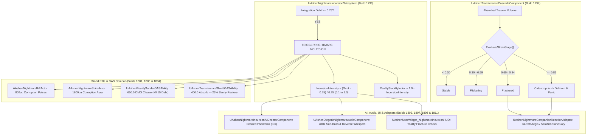

# TRAUMA-SPEC-023: THE NIGHTMARE INCURSION, TRANSFERENCE CASCADE & REALITY SUNDERING
**Domain:** World / Soul / Combat / AI / Audio / UI / Core / Companions / Narrative / Orchestration / QA
**Status:** Canon Specification & Verified Production C++ Implementation (Builds 1796–1815 / Master Batch #90)
**Engine Version:** Unreal Engine 5.8 | **Total Builds Clean:** 1,815 (100% Pure Gameplay Density)

---

## 🏛️ Core Philosophy
> *"When the burden of transferred trauma exceeds the capacity of the vessel, the boundary between inner psyche and external physical reality dissolves."*  
> *"Nightmare Incursions are not merely visual hallucinations; they are violent dimensional breaches where sundered guilt manifests as lethal obsidian geometry and phantom predators."*

---

## 🌌 Nightmare Incursion & Transference Cascade Architecture

---

## 📋 Technical Formulas & Mechanical Bounds

### 1. Incursion Intensity & Reality Stability Index
* Triggered dynamically when Integration Debt reaches or exceeds $0.75$:
  $$\text{IncursionIntensity} = \begin{cases} 0.0 & \text{if } \text{Debt} < 0.75 \\ \text{Clamp}\left(\frac{\text{Debt} - 0.75}{0.25},\, 0.1,\, 1.0\right) & \text{if } \text{Debt} \ge 0.75 \end{cases}$$
  $$\text{RealityStabilityIndex} = 1.0 - \text{IncursionIntensity}$$

### 2. 4-Stage Transference Strain Thresholds
* Evaluates psychological feedback loop from absorbed companion trauma:
  $$\text{StrainStage} = \begin{cases} \text{Stable} & \text{if } \text{Trauma} < 0.30 \\ \text{Flickering} & \text{if } 0.30 \le \text{Trauma} < 0.60 \\ \text{Fractured} & \text{if } 0.60 \le \text{Trauma} < 0.85 \\ \text{Catastrophic} & \text{if } \text{Trauma} \ge 0.85 \end{cases}$$

### 3. Reality Sundering Damage Scaling & Shield Conversion
* Dimensional cleave damage scales with active Integration Debt:
  $$\text{DamageMultiplier} = 1.0 + \left(\text{Clamp}(\text{Debt},\, 0.0,\, 1.0) \times 0.50\right)$$
  $$\text{FinalCleaveDamage} = 650.0 \times \text{DamageMultiplier} \quad (\text{Max } 975.0\,\text{DMG at } \text{Debt}=1.0)$$
* Transference Shield absorbs up to $400.0\,\text{DMG}$ and converts $25\%$ into Companion Sanity:
  $$\text{SanityRestored} = \text{AbsorbedDamage} \times 0.25$$

---

## 🏛️ Production C++ Class Mapping (Builds 1796–1815)

| Class | Source Header | Primary Responsibility |
|---|---|---|
| `UAshenNightmareIncursionSubsystem` | [`AshenNightmareIncursionSubsystem.h`](file:///c:/Users/Chris/Ashen%20Oath%20Unreal%20Engine/AshenOath/Source/AshenOath/World/AshenNightmareIncursionSubsystem.h) | GameInstance Subsystem managing incursion triggers ($\text{Debt} \ge 0.75$) and intensity |
| `UAshenTransferenceCascadeComponent` | [`AshenTransferenceCascadeComponent.h`](file:///c:/Users/Chris/Ashen%20Oath%20Unreal%20Engine/AshenOath/Source/AshenOath/Soul/AshenTransferenceCascadeComponent.h) | Manages 4-stage psychological strain (`Stable`, `Flickering`, `Fractured`, `Catastrophic`) |
| `UAshenRealitySunderingEvaluatorComponent` | [`AshenRealitySunderingEvaluatorComponent.h`](file:///c:/Users/Chris/Ashen%20Oath%20Unreal%20Engine/AshenOath/Source/AshenOath/World/AshenRealitySunderingEvaluatorComponent.h) | Evaluates reality stability index, geometry distortion, and sundering damage scaling ($1.0\times \rightarrow 1.5\times$) |
| `UAshenPsychicStrainTypes` | [`AshenPsychicStrainTypes.h`](file:///c:/Users/Chris/Ashen%20Oath%20Unreal%20Engine/AshenOath/Source/AshenOath/Soul/AshenPsychicStrainTypes.h) | Data types: `ETransferenceStrainStage`, `FNightmareIncursionState` |
| `UAshenNightmareCorruptionDrainComponent` | [`AshenNightmareCorruptionDrainComponent.h`](file:///c:/Users/Chris/Ashen%20Oath%20Unreal%20Engine/AshenOath/Source/AshenOath/World/AshenNightmareCorruptionDrainComponent.h) | Manages corruption siphoning ($0.08/\text{s}$) and sanctuary rift suppression |
| `AAshenNightmareRiftActor` | [`AshenNightmareRiftActor.h`](file:///c:/Users/Chris/Ashen%20Oath%20Unreal%20Engine/AshenOath/Source/AshenOath/World/AshenNightmareRiftActor.h) | 3D spatial tear emitting $800\,\text{uu}$ corruption pulses and requiring sealing |
| `AAshenRealityFractureAnchorActor` | [`AshenRealityFractureAnchorActor.h`](file:///c:/Users/Chris/Ashen%20Oath%20Unreal%20Engine/AshenOath/Source/AshenOath/World/AshenRealityFractureAnchorActor.h) | Spatial anchor stabilizing shattered geometry in a $1200\,\text{uu}$ radius |
| `UAshenRealitySunderGASAbility` | [`AshenRealitySunderGASAbility.h`](file:///c:/Users/Chris/Ashen%20Oath%20Unreal%20Engine/AshenOath/Source/AshenOath/Combat/AshenRealitySunderGASAbility.h) | Dimensional cleave ($650.0\,\text{DMG}$) channeling incursion energy at $+0.15$ Debt |
| `UAshenTransferenceShieldGASAbility` | [`AshenTransferenceShieldGASAbility.h`](file:///c:/Users/Chris/Ashen%20Oath%20Unreal%20Engine/AshenOath/Source/AshenOath/Combat/AshenTransferenceShieldGASAbility.h) | Transference barrier absorbing $400.0$ damage and restoring $25\%$ into Companion Sanity |
| `AAshenNightmareSpireActor` | [`AshenNightmareSpireActor.h`](file:///c:/Users/Chris/Ashen%20Oath%20Unreal%20Engine/AshenOath/Source/AshenOath/World/AshenNightmareSpireActor.h) | Corrupted obsidian spire anchoring deep incursions ($1600\,\text{uu}$ aura) |
| `UAshenNightmareIncursionAIDirectorComponent` | [`AshenNightmareIncursionAIDirectorComponent.h`](file:///c:/Users/Chris/Ashen%20Oath%20Unreal%20Engine/AshenOath/Source/AshenOath/AI/AshenNightmareIncursionAIDirectorComponent.h) | AI director managing phantom pack aggression and desired phantom count ($0 \rightarrow 6$) |
| `UAshenDiegeticNightmareAudioComponent` | [`AshenDiegeticNightmareAudioComponent.h`](file:///c:/Users/Chris/Ashen%20Oath%20Unreal%20Engine/AshenOath/Source/AshenOath/Audio/AshenDiegeticNightmareAudioComponent.h) | Reverse-reverb whispers, sub-bass $28\,\text{Hz}$ drones, and reality cracking audio |
| `UAshenUserWidget_NightmareIncursionHUD` | [`AshenUserWidget_NightmareIncursionHUD.h`](file:///c:/Users/Chris/Ashen%20Oath%20Unreal%20Engine/AshenOath/Source/AshenOath/UI/AshenUserWidget_NightmareIncursionHUD.h) | Somatic HUD displaying reality fracture cracks, incursion intensity, and stability |
| `UAshenUserWidget_TransferenceStrainHUD` | [`AshenUserWidget_TransferenceStrainHUD.h`](file:///c:/Users/Chris/Ashen%20Oath%20Unreal%20Engine/AshenOath/Source/AshenOath/UI/AshenUserWidget_TransferenceStrainHUD.h) | Somatic HUD displaying current strain stage (`Flickering`/`Fractured`/`Catastrophic`) |
| `UAshenNightmarePostProcessAdapter` | [`AshenNightmarePostProcessAdapter.h`](file:///c:/Users/Chris/Ashen%20Oath%20Unreal%20Engine/AshenOath/Source/AshenOath/UI/AshenNightmarePostProcessAdapter.h) | Dynamic red-shifted chromatic aberration, screen tearing, and desaturation pulses |
| `UAshenNightmareCompanionReactionAdapter` | [`AshenNightmareCompanionReactionAdapter.h`](file:///c:/Users/Chris/Ashen%20Oath%20Unreal%20Engine/AshenOath/Source/AshenOath/Companions/AshenNightmareCompanionReactionAdapter.h) | Companion defensive stance modulation (Garrett Aegis / Serafina Sanctuary) |
| `UAshenNightmareSaveGameAdapter` | [`AshenNightmareSaveGameAdapter.h`](file:///c:/Users/Chris/Ashen%20Oath%20Unreal%20Engine/AshenOath/Source/AshenOath/Core/AshenNightmareSaveGameAdapter.h) | Serializes sealed rifts count, incursion survival records, and max intensity |
| `UAshenNightmareDialogueAdapter` | [`AshenNightmareDialogueAdapter.h`](file:///c:/Users/Chris/Ashen%20Oath%20Unreal%20Engine/AshenOath/Source/AshenOath/Narrative/AshenNightmareDialogueAdapter.h) | Panic callouts and delirium dialogue lines during Catastrophic strain |
| `UAshenNightmareMasterBridge` | [`AshenNightmareMasterBridge.h`](file:///c:/Users/Chris/Ashen%20Oath%20Unreal%20Engine/AshenOath/Source/AshenOath/Orchestration/AshenNightmareMasterBridge.h) | Master domain bridge broadcasting incursion triggers, rift closures, and strain shifts |
| `FAshenMasterBatch90AutomationTest` | [`AshenMasterBatch90AutomationTest.cpp`](file:///c:/Users/Chris/Ashen%20Oath%20Unreal%20Engine/AshenOath/Source/AshenOath/QA/AshenMasterBatch90AutomationTest.cpp) | Comprehensive QA automation test suite validating strain state math, incursion triggers, and shield conversion |
