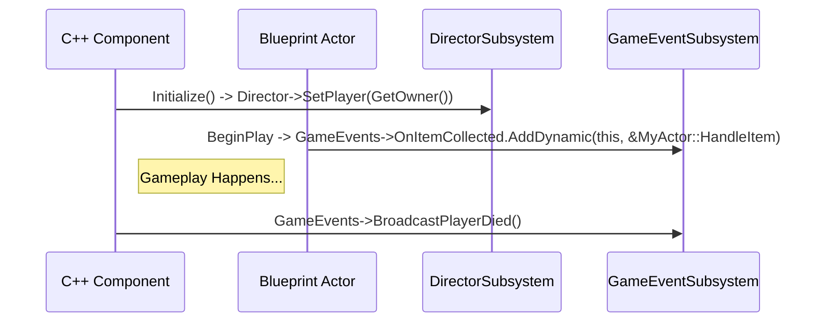
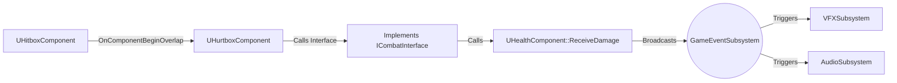

# Ashen Oath: The Unreal Engine PHOENIX CODEX

**Version**: 1.0
**Governed By**: Phoenix Protocol v4.5+

---

## 1. The Sovereign Subsystems (Globals)

To enforce decoupling and prevent circular dependencies, the project utilizes **Engine Subsystems** as the primary mechanism for global access. This replaces the Godot "Sovereign Wrapper" pattern.

### Core Subsystems

- **`UAshenOath_DirectorSubsystem` (`UGameInstanceSubsystem`)**: The central reference gateway. It holds persistent `TWeakObjectPtr` references to vital, active game systems and actors (e.g., Player Pawn, Quest System, VFX Manager). This completely replaces `GetAllActorsOfClass` lookups in performance-critical code.
- **`UAshenOath_GameEventSubsystem` (`UGameInstanceSubsystem`)**: The **Global Event Bus**. This subsystem contains multicast delegates (`FOnPlayerDied`, `FOnItemCollected`, etc.) for cross-domain communication. Components and systems bind to these delegates instead of holding direct references to each other.
- **Logging (`UE_LOG`)**: All diagnostic output must use the `UE_LOG` macro with custom `LogTemp` categories (e.g., `LogAshenOathCombat`, `LogAshenOathAI`). This provides filterable, context-rich logging.

### Dependency & Registration Flow



### Anti-Patterns (Wisdom Scars)

- **AVOID**: Calling `UGameplayStatics::GetAllActorsOfClass` during `Tick`. Cache references at `BeginPlay` or retrieve them from the `DirectorSubsystem`.
- **AVOID**: Hard-casting to specific gameplay classes within a generic component (e.g., casting `GetOwner()` to `AMyPlayerCharacter` inside `UHealthComponent`). Use Interfaces or query the `DirectorSubsystem`.

---

## 2. Entity-Component Architecture

Entities (`AActor`) are defined by their composition of Components (`UActorComponent`). This mirrors the Godot ECS approach.

### Core Modularity Rules

- **Component Sovereignty**: A `UHealthComponent` must not know if it's attached to a Player or a destructible barrel. It provides a public API (`ReceiveDamage()`) and broadcasts delegates (`OnHealthDepleted`).
- **Stat Separation**: A `UStatsComponent` manages attributes (e.g., Strength, Vitality). Other components, like `UHealthComponent`, can query it to calculate their `MaxHealth`, but they do not manage the stats themselves.
- **Physical Isolation**: All combat and interaction traces must use designated **Object Channels** and **Trace Channels** defined in `Config/DefaultEngine.ini`.
  - `ECC_PlayerHitbox`
  - `ECC_EnemyHitbox`
  - `ECC_Interactable`

### Primary C++ Components

- **`UHealthComponent`**: Manages `CurrentHealth`/`MaxHealth`, damage application, and broadcasts `OnDamaged`, `OnHealed`, and `OnDied` delegates. Implements **SKILL-UE-001 (Resilient Properties)**.
- **`UHurtboxComponent` (`USphereComponent` or `UCapsuleComponent`)**: The receiver for damage. Responds to overlaps from `Hitbox` components and calls `ReceiveDamage` on its owner's `UHealthComponent`.
- **`UHitboxComponent` (`USphereComponent` or `UCapsuleComponent`)**: The emitter of damage. Activated for a single frame or a short duration during attack animations.

### Combat Loop Visualization



---

## 3. State Management & Resource Optimization

Complex AI, Player, and world logic must be encapsulated in discrete states. Avoid monolithic `Tick()` functions with complex branches and constant per-frame resource waste.

### Recommended Patterns

1.  **Gameplay Ability System (GAS)**: For complex player and AI actions, GAS is the preferred "Phoenix-Pure" solution. Abilities encapsulate state, duration, cost, and effects.
2.  **Simple State Machine (C++ or Blueprint)**: For simpler entities, a basic state machine using a `TEnumAsByte<ECharacterState>` variable and a `Switch` on the enum in the `Tick` function is acceptable. State logic should be broken into separate functions (e.g., `TickIdleState()`, `TickChaseState()`).

### Input Buffering & Component Caching
To ensure responsive combat, player inputs must be buffered:
- **GAS**: Use `AbilityTask_WaitGameplayEvent` to buffer an action until a specific animation event (e.g., "Attack_CanCombo") is triggered.
- **Getters Over Registry Queries**: Avoid using `FindComponentByClass` inside tight input or execution loops. Expose a virtual component getter in the base character class (returning `nullptr` by default) and override it in child subclasses to return cached component pointers.

### Active Duty Cycling (Tick Sleep)
To maximize engine thread efficiency:
- **Default Disabled**: Ticking actors (like mechanical doors, chests, or platforms) must initialize with `PrimaryActorTick.bStartWithTickEnabled = false`.
- **Transient Activation**: Wake up tick execution (`SetActorTickEnabled(true)`) only when active transitions start.
- **Sleep Return**: Put the actor back to sleep (`SetActorTickEnabled(false)`) as soon as target positions or rotation thresholds settle.

---

## 4. C++ & Blueprint Standards

### C++ (The Bedrock)

- **`UPROPERTY()` and `UFUNCTION()`**: All exposed variables and functions must have appropriate specifiers (`BlueprintReadOnly`, `BlueprintCallable`, `Category`, etc.).
- **Pointers**: Use `TWeakObjectPtr` for references to Actors that might be destroyed. Use raw pointers (`*`) only for components on the same Actor where the lifecycle is guaranteed.
- **Interfaces**: Use C++ Gameplay Interfaces (`UInterface`) for communication between unrelated object types (e.g., a `UInteractionComponent` calling `Execute_Interact` on any actor that implements `IInteractable`).
- **Final**: Mark classes and methods as `final` where inheritance is not intended, to improve compiler optimization and code clarity.

### Blueprints (The Expression Layer)

- **Purpose**: Blueprints are for assembling components, tweaking data, and handling simple, self-contained visual logic. **Complex branching, state management, and core calculations must be in C++.**
- **Parent Classes**: All major gameplay Blueprints (e.g., `BP_PlayerCharacter`, `BP_Enemy_Grunt`) must derive from a shared C++ base class (e.g., `AAshenOathCharacter`).
- **Nattierization**: If a Blueprint's graph becomes overly complex, it is a candidate for "Nattierization"—refactoring its logic into a new C++ component or function library.
- **No `Tick`**: Avoid using the `Event Tick` node in Blueprints whenever possible. Use timers, delegates, or timeline components instead.

---

## 5. Key Technical Skills (Unreal Adaptation)

- **SKILL-UE-001: Resilient Properties**: The C++ equivalent of Godot's backing fields. Use `private` variables with `public` `UFUNCTION(BlueprintCallable)` getters and setters. Broadcast delegates inside the setter.

  ```cpp
  // In HealthComponent.h
  private:
      float CurrentHealth;
  public:
      UFUNCTION(BlueprintCallable)
      void SetCurrentHealth(float NewHealth);
  ```

- **SKILL-UE-002: Zero-Allocation Systems**: Use pre-allocated object pools for frequently spawned actors like projectiles and VFX. In Unreal, this is often managed by a Subsystem that maintains an array of disabled actors and cycles through them.

- **SKILL-UE-004: Decoupled Global Signaling**: Use multicast delegates in a `UGameInstanceSubsystem` to broadcast game-wide events. This is the direct equivalent of the Godot `GameEvents` singleton.

  ```cpp
  // In GameEventSubsystem.h
  DECLARE_DYNAMIC_MULTICAST_DELEGATE(FOnPlayerDiedSignature);
  UPROPERTY(BlueprintAssignable)
  FOnPlayerDiedSignature OnPlayerDied;
  ```

- **SKILL-UE-005: Method-Bound Connectivity**: When binding to delegates in C++, use the `AddUObject` or `AddDynamic` macros with member functions, not C++ lambdas, for persistent objects to prevent dangling references.

  ```cpp
  // In MyUI.cpp
  GameEvents->OnPlayerDied.AddUObject(this, &UMyUI::HandlePlayerDied);
  ```

- **SKILL-UE-012: The Sovereign Viewport (Camera)**: The `USpringArmComponent` is the Unreal equivalent of this pattern. It handles camera collision and smooth lag automatically. The `APlayerCameraManager` provides a global entry point for camera control and effects.

- **SKILL-UE-016: Flattened Camera-Relative Orientation**: Use `UKismetMathLibrary::GetForwardVector` and `GetRightVector` on the camera's rotation, set the Z component to 0, and re-normalize to get a flattened directional vector for character movement.

  ```cpp
  const FRotator& ControlRotation = Controller->GetControlRotation();
  const FRotator YawRotation(0, ControlRotation.Yaw, 0);

  const FVector ForwardDirection = FRotationMatrix(YawRotation).GetUnitAxis(EAxis::X);
  const FVector RightDirection = FRotationMatrix(YawRotation).GetUnitAxis(EAxis::Y);

  AddMovementInput(ForwardDirection, InputValue.Get<FVector2D>().Y);
  AddMovementInput(RightDirection, InputValue.Get<FVector2D>().X);
  ```

- **SKILL-UE-018: Pre-parsing JSON Bounds**: When parsing raw JSON payloads into USTRUCT arrays via `FJsonObjectConverter`, enforce pre-parsing checks: restrict string payload length (e.g., maximum `64 KB`) and structural bracket/brace nesting depth (e.g., maximum `32` depth) to defend against memory exhaustion and stack overflow vulnerabilities.

- **SKILL-UE-019: Sovereign Viewpoint Overrides**: For realistic AI visual tracking, override `GetActorEyesViewPoint` in `AAIController` to target the possessed skeletal mesh's `"head"` bone socket. This ensures trace lines-of-sight correctly follow mesh animations and head orientations instead of drawing from the static capsule center.

---

**Status**: This document is the North Star for all C++ and Blueprint development. Adherence is mandatory for maintaining Zero Entropy.
