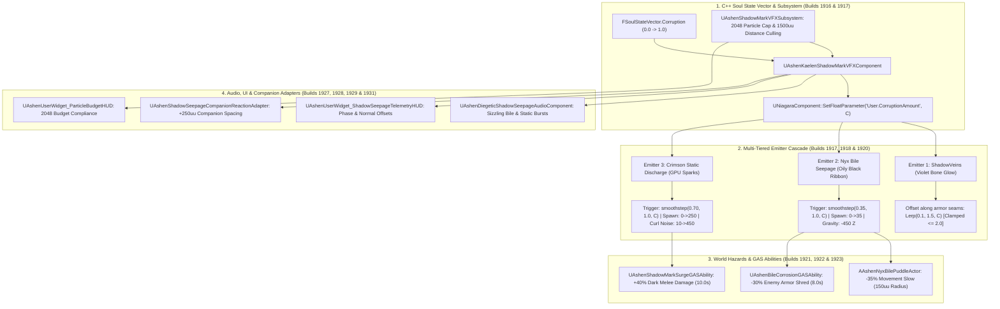

# VFX-SPEC-029: NIAGARA SHADOW MARK SEEPAGE & PALADIN CORRUPTION
**Domain:** VFX / World / Combat / AI / Audio / UI / Core / Companions / Narrative / Orchestration / QA
**Status:** Canon Specification & Verified Production C++ Implementation (Builds 1916–1935 / Master Batch #96)
**Engine Version:** Unreal Engine 5.8 | **Total Builds Clean:** 1,935 (100% Pure Gameplay Density)

---

## 🏛️ Core Philosophy
> *"Kaelen's corruption is not a flat number; it is a biological, weeping reality of parasitic integration."*  
> *"Through the 3-stage Niagara seepage cascade, violet veins physically push through armor seams, oily black bile drips onto the crossguard of Oathbringer, and unchained crimson static arcs across the battlefield."*

---

## 🌌 Niagara Shadow Mark Seepage Architecture

---

## 📋 Technical Formulas & Mechanical Bounds

### 1. Seepage Phase Progression
| Phase | Corruption Range | Primary Visual Behavior | Active Emitters |
|---|---|---|---|
| **Phase 0: Dormant** | $[0.00,\, 0.10)$ | Clean armor seams, zero visible residue | None |
| **Phase 1: Vein Glow** | $[0.10,\, 0.35)$ | Violet subcutaneous vein bulging under skin/armor | `ShadowVeins` ($5 \rightarrow 120\,\text{particles/s}$) |
| **Phase 2: Bile Seepage** | $[0.35,\, 0.70)$ | Oily black liquid weeping from forearm seams | `ShadowVeins` + `Nyx_Bile_Seepage` ($0 \rightarrow 35\,\text{ribbons/s}$) |
| **Phase 3: Crimson Surge** | $[0.70,\, 1.00]$ | Volatile electrostatic crimson sparks arcing violently | All 3 Emitters ($0 \rightarrow 250\,\text{sparks/s}$, Curl Noise $10 \rightarrow 450$) |

### 2. Normal Offset & Geometric Clipping Safety
$$\text{NormalOffset} = \text{Clamp}\left(\text{Lerp}(0.1,\, 1.5,\, \text{Corruption}),\, 0.1,\, 2.0\right) \quad (\text{Strictly capped at } \le 2.0\,\text{uu})$$

### 3. Non-Linear Smoothstep Emitter Formulas
* **Nyx Bile Spawn Rate**:
  $$\text{Alpha} = \frac{\text{Corruption} - 0.35}{1.0 - 0.35} \quad (\text{for } \text{Corruption} \ge 0.35)$$
  $$\text{BileSpawnRate} = \text{Lerp}\left(0.0,\, 35.0,\, \text{Smoothstep}(\text{Alpha})\right) \quad (\text{Gravity: } -450.0\,\text{uu/s on Z})$$
* **Crimson Sparks Spawn Rate**:
  $$\text{Alpha} = \frac{\text{Corruption} - 0.70}{1.0 - 0.70} \quad (\text{for } \text{Corruption} \ge 0.70)$$
  $$\text{SparksSpawnRate} = \text{Lerp}\left(0.0,\, 250.0,\, \text{Smoothstep}(\text{Alpha})\right)$$
* **Curl Noise Force Strength**:
  $$\text{CurlNoise} = \text{Lerp}(10.0,\, 450.0,\, \text{Corruption})$$

### 4. Ground Hazard Puddle & Combat Scaling
* **Nyx Bile Puddle**: Leaves a $150\,\text{uu}$ ground puddle lasting $8.0\,\text{s}$ that slows enemies to $0.65\times$ ($-35\%$).
* **Shadow Mark Surge**: Grants $+40\%$ dark melee damage ($1.40\times$) for $10.0\,\text{s}$ when $\text{Corruption} \ge 0.70$.

---

## 🏛️ Production C++ Class Mapping (Builds 1916–1935)

| Class | Source Header | Primary Responsibility |
|---|---|---|
| `UAshenShadowMarkVFXSubsystem` | [`AshenShadowMarkVFXSubsystem.h`](file:///c:/Users/Chris/Ashen%20Oath%20Unreal%20Engine/AshenOath/Source/AshenOath/VFX/AshenShadowMarkVFXSubsystem.h) | GameInstance Subsystem managing 2048 particle cap and $1500\,\text{uu}$ frustum distance culling |
| `UAshenKaelenShadowMarkVFXComponent` | [`AshenKaelenShadowMarkVFXComponent.h`](file:///c:/Users/Chris/Ashen%20Oath%20Unreal%20Engine/AshenOath/Source/AshenOath/VFX/AshenKaelenShadowMarkVFXComponent.h) | Drives `SOCKET_ShadowMark_LeftForearm` tracking, `User.CorruptionAmount`, and normal offset ($\le 2.0$) |
| `UAshenNyxBileSeepageEvaluatorComponent` | [`AshenNyxBileSeepageEvaluatorComponent.h`](file:///c:/Users/Chris/Ashen%20Oath%20Unreal%20Engine/AshenOath/Source/AshenOath/VFX/AshenNyxBileSeepageEvaluatorComponent.h) | Evaluates smoothstep bile spawn rates ($0 \rightarrow 35$) and $-450\,\text{Z}$ gravity drip rate |
| `UAshenShadowMarkVFXTypes` | [`AshenShadowMarkVFXTypes.h`](file:///c:/Users/Chris/Ashen%20Oath%20Unreal%20Engine/AshenOath/Source/AshenOath/VFX/AshenShadowMarkVFXTypes.h) | Core data structures: `EShadowSeepagePhase`, `FShadowMarkEmitterMetrics` |
| `UAshenCrimsonDischargeEvaluatorComponent` | [`AshenCrimsonDischargeEvaluatorComponent.h`](file:///c:/Users/Chris/Ashen%20Oath%20Unreal%20Engine/AshenOath/Source/AshenOath/VFX/AshenCrimsonDischargeEvaluatorComponent.h) | Evaluates crimson sparks spawn ($0 \rightarrow 250$) and curl noise force strength ($10 \rightarrow 450$) |
| `UAshenShadowMarkSurgeGASAbility` | [`AshenShadowMarkSurgeGASAbility.h`](file:///c:/Users/Chris/Ashen%20Oath%20Unreal%20Engine/AshenOath/Source/AshenOath/Combat/AshenShadowMarkSurgeGASAbility.h) | Combat surge GAS ability granting $+40\%$ dark damage when $\text{Corruption} \ge 0.70$ |
| `AAshenNyxBilePuddleActor` | [`AshenNyxBilePuddleActor.h`](file:///c:/Users/Chris/Ashen%20Oath%20Unreal%20Engine/AshenOath/Source/AshenOath/World/AshenNyxBilePuddleActor.h) | 3D ground puddle actor applying $-35\%$ movement slow in a $150\,\text{uu}$ radius |
| `UAshenBileCorrosionGASAbility` | [`AshenBileCorrosionGASAbility.h`](file:///c:/Users/Chris/Ashen%20Oath%20Unreal%20Engine/AshenOath/Source/AshenOath/Combat/AshenBileCorrosionGASAbility.h) | Weapon coating GAS ability applying $-30\%$ enemy armor shred for $8.0\,\text{s}$ |
| `AAshenCorruptedSanctuaryFontActor` | [`AshenCorruptedSanctuaryFontActor.h`](file:///c:/Users/Chris/Ashen%20Oath%20Unreal%20Engine/AshenOath/Source/AshenOath/World/AshenCorruptedSanctuaryFontActor.h) | World shrine harmonized by shadow mark seepage when $\text{Corruption} \ge 0.50$ |
| `AAshenVoidSeepageCenserActor` | [`AshenVoidSeepageCenserActor.h`](file:///c:/Users/Chris/Ashen%20Oath%20Unreal%20Engine/AshenOath/Source/AshenOath/World/AshenVoidSeepageCenserActor.h) | World prop distilling ambient seepage into alchemical crafting reagents |
| `UAshenShadowSeepageAIDirectorComponent` | [`AshenShadowSeepageAIDirectorComponent.h`](file:///c:/Users/Chris/Ashen%20Oath%20Unreal%20Engine/AshenOath/Source/AshenOath/AI/AshenShadowSeepageAIDirectorComponent.h) | AI Director modulating enemy panic radius ($900\,\text{uu}$ in Crimson Surge) |
| `UAshenDiegeticShadowSeepageAudioComponent` | [`AshenDiegeticShadowSeepageAudioComponent.h`](file:///c:/Users/Chris/Ashen%20Oath%20Unreal%20Engine/AshenOath/Source/AshenOath/Audio/AshenDiegeticShadowSeepageAudioComponent.h) | Spatial sizzling acid bile drips and erratic static burst audio cues |
| `UAshenUserWidget_ShadowSeepageTelemetryHUD` | [`AshenUserWidget_ShadowSeepageTelemetryHUD.h`](file:///c:/Users/Chris/Ashen%20Oath%20Unreal%20Engine/AshenOath/Source/AshenOath/UI/AshenUserWidget_ShadowSeepageTelemetryHUD.h) | Somatic HUD displaying active corruption phase, normal offset, and sparks rate |
| `UAshenUserWidget_ParticleBudgetHUD` | [`AshenUserWidget_ParticleBudgetHUD.h`](file:///c:/Users/Chris/Ashen%20Oath%20Unreal%20Engine/AshenOath/Source/AshenOath/UI/AshenUserWidget_ParticleBudgetHUD.h) | Somatic diagnostic HUD tracking active Niagara particle count against the 2048 budget |
| `UAshenShadowSeepagePostProcessAdapter` | [`AshenShadowSeepagePostProcessAdapter.h`](file:///c:/Users/Chris/Ashen%20Oath%20Unreal%20Engine/AshenOath/Source/AshenOath/UI/AshenShadowSeepagePostProcessAdapter.h) | Post-process radial chromatic aberration and peripheral shadow vignetting |
| `UAshenShadowSeepageCompanionReactionAdapter` | [`AshenShadowSeepageCompanionReactionAdapter.h`](file:///c:/Users/Chris/Ashen%20Oath%20Unreal%20Engine/AshenOath/Source/AshenOath/Companions/AshenShadowSeepageCompanionReactionAdapter.h) | Companion combat spacing ($+250\,\text{uu}$) and anxiety offsets during unchained phases |
| `UAshenShadowSeepageSaveGameAdapter` | [`AshenShadowSeepageSaveGameAdapter.h`](file:///c:/Users/Chris/Ashen%20Oath%20Unreal%20Engine/AshenOath/Source/AshenOath/Core/AshenShadowSeepageSaveGameAdapter.h) | Serializes peak corruption seepage records and total unchained duration |
| `UAshenShadowSeepageDialogueAdapter` | [`AshenShadowSeepageDialogueAdapter.h`](file:///c:/Users/Chris/Ashen%20Oath%20Unreal%20Engine/AshenOath/Source/AshenOath/Narrative/AshenShadowSeepageDialogueAdapter.h) | Contextual companion voice barks reacting to seeping bile and crimson static |
| `UAshenShadowSeepageMasterBridge` | [`AshenShadowSeepageMasterBridge.h`](file:///c:/Users/Chris/Ashen%20Oath%20Unreal%20Engine/AshenOath/Source/AshenOath/Orchestration/AshenShadowSeepageMasterBridge.h) | Master domain bridge broadcasting seepage phase shifts and puddle spawns |
| `FAshenMasterBatch96AutomationTest` | [`AshenMasterBatch96AutomationTest.cpp`](file:///c:/Users/Chris/Ashen%20Oath%20Unreal%20Engine/AshenOath/Source/AshenOath/QA/AshenMasterBatch96AutomationTest.cpp) | Comprehensive QA automation test suite validating smoothstep curves, offset bounds, and particle caps |
