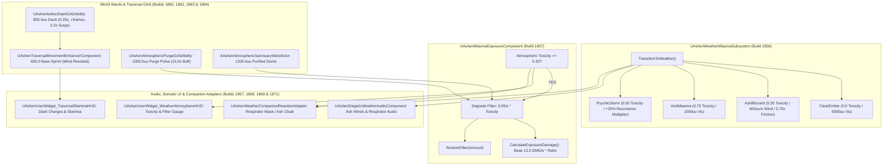

# WEATHER-SPEC-026: WORLD TRAVERSAL, DYNAMIC WEATHER & ENVIRONMENTAL HAZARDS
**Domain:** World / Hazard / Player / Combat / AI / Audio / UI / Core / Companions / Narrative / Orchestration / QA
**Status:** Canon Specification & Verified Production C++ Implementation (Builds 1856–1875 / Master Batch #93)
**Engine Version:** Unreal Engine 5.8 | **Total Builds Clean:** 1,875 (100% Pure Gameplay Density)

---

## 🏛️ Core Philosophy
> *"The sundered world does not merely provide terrain; it breathes with volatile ash blizzards and caustic void miasma."*  
> *"Survival demands more than martial prowess—it requires mastery of atmospheric conductivity, respirator filter conservation, and rapid traversal across hostile environmental geysers."*

---

## 🌪️ World Weather & Environmental Hazards Architecture

---

## 📋 Technical Formulas & Mechanical Bounds

### 1. Weather States & Environmental Toxicity Parameters
| Weather State | Atmospheric Toxicity | Wind Velocity | Visibility Range | Elemental Modifiers |
|---|---|---|---|---|
| **Clear Ember** | $0.00$ (Safe) | $100\,\text{uu/s}$ | $5000\,\text{uu}$ | Standard baseline |
| **Ash Blizzard** | $0.35$ (Moderate) | $600\,\text{uu/s}$ | $1200\,\text{uu}$ | Movement Friction $= 0.70\times$ |
| **Void Miasma** | $0.75$ (Hazardous) | $150\,\text{uu/s}$ | $1500\,\text{uu}$ | Decay Conduction $= 1.10\times$ |
| **Psychic Storm** | $0.50$ (Volatile) | $400\,\text{uu/s}$ | $2500\,\text{uu}$ | Resonance Multiplier $= 1.20\times$ ($+20\%$) |

### 2. Miasma Exposure & Filter Degradation Formulas
* If $\text{Toxicity} > 0.20$:
  $$\Delta\text{Filter} = 0.05 \times \Delta t \times \text{Toxicity}$$
  $$\text{FilterProtection} = \text{FilterIntegrity} \times 0.90 \quad (\text{Blocks up to } 90\%)$$
  $$\text{DamageRatio} = 1.0 - \text{FilterProtection}$$
  $$\text{ExposureTickDamage} = 12.0 \times \text{Toxicity} \times \text{DamageRatio} \times \Delta t$$

### 3. Traversal Sprint Velocity & Aether Dash
* **Wind-Resisted Sprint**:
  $$\text{SprintSpeed} = 600.0 \times \left(1.0 - \text{Clamp}(\text{WindResistance},\, 0.0,\, 0.50)\right)$$
* **Aether Dash**:
  $$\text{DashSpeed} = 600.0 \times 2.2 = 1320.0\,\text{uu/s} \quad (\text{Covers } 800.0\,\text{uu in } 0.25\,\text{s})$$

### 4. Atmospheric Purge & Sanctuary Wards
* **Atmospheric Purge Ability**: Clears hazard clouds in a $1000.0\,\text{uu}$ radius and grants $+50\%$ filter efficiency for $15.0\,\text{s}$.
* **Sanctuary Ward Actor**: Creates a permanent $1200.0\,\text{uu}$ purified dome suppressing external toxicity to $0.0$.

---

## 🏛️ Production C++ Class Mapping (Builds 1856–1875)

| Class | Source Header | Primary Responsibility |
|---|---|---|
| `UAshenWeatherMiasmaSubsystem` | [`AshenWeatherMiasmaSubsystem.h`](file:///c:/Users/Chris/Ashen%20Oath%20Unreal%20Engine/AshenOath/Source/AshenOath/World/AshenWeatherMiasmaSubsystem.h) | GameInstance Subsystem managing 4 weather states and global atmospheric toxicity ($0.0 \rightarrow 1.0$) |
| `UAshenMiasmaExposureComponent` | [`AshenMiasmaExposureComponent.h`](file:///c:/Users/Chris/Ashen%20Oath%20Unreal%20Engine/AshenOath/Source/AshenOath/World/AshenMiasmaExposureComponent.h) | Evaluates filter degradation ($0.05/\text{s}$) and hazard exposure tick damage ($12.0\,\text{DMG/s}$) |
| `UAshenAtmosphericConductivityEvaluatorComponent` | [`AshenAtmosphericConductivityEvaluatorComponent.h`](file:///c:/Users/Chris/Ashen%20Oath%20Unreal%20Engine/AshenOath/Source/AshenOath/World/AshenAtmosphericConductivityEvaluatorComponent.h) | Computes elemental resonance ($+20\%$) and surface friction multipliers ($0.70\times$) |
| `UAshenWeatherAtmosphereTypes` | [`AshenWeatherAtmosphereTypes.h`](file:///c:/Users/Chris/Ashen%20Oath%20Unreal%20Engine/AshenOath/Source/AshenOath/World/AshenWeatherAtmosphereTypes.h) | Core data structures: `EWeatherState`, `FWeatherAtmosphereData` |
| `UAshenTraversalMovementEnhancerComponent` | [`AshenTraversalMovementEnhancerComponent.h`](file:///c:/Users/Chris/Ashen%20Oath%20Unreal%20Engine/AshenOath/Source/AshenOath/Player/AshenTraversalMovementEnhancerComponent.h) | Modulates sprint velocity under wind resistance and aether dash acceleration ($2.2\times$) |
| `AAshenMiasmaVentActor` | [`AshenMiasmaVentActor.h`](file:///c:/Users/Chris/Ashen%20Oath%20Unreal%20Engine/AshenOath/Source/AshenOath/World/AshenMiasmaVentActor.h) | Environmental geyser vent emitting $600\,\text{uu}$ caustic void hazard plumes |
| `AAshenAtmosphericSanctuaryWardActor` | [`AshenAtmosphericSanctuaryWardActor.h`](file:///c:/Users/Chris/Ashen%20Oath%20Unreal%20Engine/AshenOath/Source/AshenOath/World/AshenAtmosphericSanctuaryWardActor.h) | Ancient protective ward creating a purified $1200\,\text{uu}$ safe dome |
| `UAshenAetherDashGASAbility` | [`AshenAetherDashGASAbility.h`](file:///c:/Users/Chris/Ashen%20Oath%20Unreal%20Engine/AshenOath/Source/AshenOath/Combat/AshenAetherDashGASAbility.h) | Omnidirectional traversal dash covering $800\,\text{uu}$ with i-frames |
| `UAshenAtmosphericPurgeGASAbility` | [`AshenAtmosphericPurgeGASAbility.h`](file:///c:/Users/Chris/Ashen%20Oath%20Unreal%20Engine/AshenOath/Source/AshenOath/Combat/AshenAtmosphericPurgeGASAbility.h) | Purification pulse clearing toxicity in a $1000\,\text{uu}$ radius for $15\,\text{s}$ |
| `AAshenStormBeaconSpireActor` | [`AshenStormBeaconSpireActor.h`](file:///c:/Users/Chris/Ashen%20Oath%20Unreal%20Engine/AshenOath/Source/AshenOath/World/AshenStormBeaconSpireActor.h) | World lightning attractor spire channeling storm harmonics ($1800\,\text{uu}$ radius) |
| `UAshenWeatherHazardAIDirectorComponent` | [`AshenWeatherHazardAIDirectorComponent.h`](file:///c:/Users/Chris/Ashen%20Oath%20Unreal%20Engine/AshenOath/Source/AshenOath/AI/AshenWeatherHazardAIDirectorComponent.h) | AI Director modulating enemy aggression ($1.45\times$ PsychicStorm, $0.85\times$ AshBlizzard) |
| `UAshenDiegeticWeatherAudioComponent` | [`AshenDiegeticWeatherAudioComponent.h`](file:///c:/Users/Chris/Ashen%20Oath%20Unreal%20Engine/AshenOath/Source/AshenOath/Audio/AshenDiegeticWeatherAudioComponent.h) | Howling blizzard winds, thunderclaps, and respirator breathing audio |
| `UAshenUserWidget_WeatherAtmosphereHUD` | [`AshenUserWidget_WeatherAtmosphereHUD.h`](file:///c:/Users/Chris/Ashen%20Oath%20Unreal%20Engine/AshenOath/Source/AshenOath/UI/AshenUserWidget_WeatherAtmosphereHUD.h) | Somatic HUD displaying active weather icon, miasma toxicity gauge, and filter health |
| `UAshenUserWidget_TraversalStaminaHUD` | [`AshenUserWidget_TraversalStaminaHUD.h`](file:///c:/Users/Chris/Ashen%20Oath%20Unreal%20Engine/AshenOath/Source/AshenOath/UI/AshenUserWidget_TraversalStaminaHUD.h) | Somatic HUD displaying dash charges and sprint stamina meters |
| `UAshenWeatherPostProcessAdapter` | [`AshenWeatherPostProcessAdapter.h`](file:///c:/Users/Chris/Ashen%20Oath%20Unreal%20Engine/AshenOath/Source/AshenOath/UI/AshenWeatherPostProcessAdapter.h) | Volumetric ash fog, rain streaks, miasma chromatic aberration, and frost vignetting |
| `UAshenWeatherCompanionReactionAdapter` | [`AshenWeatherCompanionReactionAdapter.h`](file:///c:/Users/Chris/Ashen%20Oath%20Unreal%20Engine/AshenOath/Source/AshenOath/Companions/AshenWeatherCompanionReactionAdapter.h) | Companion gear adaptation (`RespiratorMask` in Miasma, `HeavyAshCloak` in Blizzard) |
| `UAshenWeatherSaveGameAdapter` | [`AshenWeatherSaveGameAdapter.h`](file:///c:/Users/Chris/Ashen%20Oath%20Unreal%20Engine/AshenOath/Source/AshenOath/Core/AshenWeatherSaveGameAdapter.h) | Serializes active weather state, toxic zone exposure records, and discovered wards |
| `UAshenWeatherDialogueAdapter` | [`AshenWeatherDialogueAdapter.h`](file:///c:/Users/Chris/Ashen%20Oath%20Unreal%20Engine/AshenOath/Source/AshenOath/Narrative/AshenWeatherDialogueAdapter.h) | Contextual companion weather warnings and filter choking voice barks |
| `UAshenWeatherMasterBridge` | [`AshenWeatherMasterBridge.h`](file:///c:/Users/Chris/Ashen%20Oath%20Unreal%20Engine/AshenOath/Source/AshenOath/Orchestration/AshenWeatherMasterBridge.h) | Master domain bridge broadcasting weather state changes and ward triggers |
| `FAshenMasterBatch93AutomationTest` | [`AshenMasterBatch93AutomationTest.cpp`](file:///c:/Users/Chris/Ashen%20Oath%20Unreal%20Engine/AshenOath/Source/AshenOath/QA/AshenMasterBatch93AutomationTest.cpp) | Comprehensive QA automation test suite validating weather transitions, toxicity damage, and sprint math |
