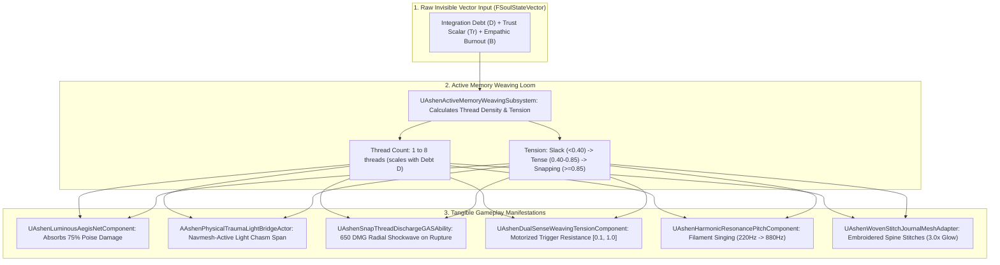

# WEAVE-SPEC-042: KAELEN & SERAFINA'S ACTIVE MEMORY WEAVING & SOMATIC TRANSMUTATION MATRIX
**Domain:** Combat / World / Audio / UI / AI / Companions / Core / Narrative / Orchestration / QA
**Status:** Canon Specification & Verified Production C++ Implementation (Builds 2136–2155 / Master Batch #107)
**Engine Version:** Unreal Engine 5.8 | **Total Builds Clean:** 2,155 (100% Pure Gameplay Density)

---

## 🏛️ Core Philosophy
> *"Serafina is an Empathic Loom. She does not cast generic magic; she directly reads Kaelen's invisible internal psychological vector values (Integration Debt, Transference Burden, Empathic Resonance) and weaves them into physical golden threads, luminous protective glyphs, tangible traversal filaments, and tactical warding barriers."*  
> *"Nothing important remains invisible math. In combat, Kaelen's trauma becomes a physical Aegis Net absorbing 75% poise damage; in traversal, unintegrated memory echoes solidify into light bridges across abyssal chasms; and at campfires, golden threads are physically sewn into the binding of the Living Journal."*

---

## 🧬 Active Memory Weaving Architecture

---

## 📋 Granular Mechanical Specifications

### 1. Active Thread Density & Tension Formula
* **Thread Count**: $N_{\text{threads}} = \text{Clamp}\left(\text{Round}\left(1.0 + \frac{D}{100.0} \times 7.0\right), 1, 8\right)$.
* **Tension Scalar**: $T_{\text{tension}} = \text{Clamp}\left(\left(\frac{D}{100.0}\right) \times (1.2 - Tr), 0.0, 1.0\right)$.
* **Tension States**:
  - $T_{\text{tension}} < 0.40$: `Slack` (Golden gentle hum).
  - $0.40 \le T_{\text{tension}} < 0.85$: `Tense` (Vibrating amber filament, heavy trigger resistance).
  - $T_{\text{tension}} \ge 0.85$: `Snapping` (Violent violet flash, imminent rupture).

### 2. Luminous Aegis Net & Kinetic Thread Ruptures
* `UAshenLuminousAegisNetComponent` absorbs $75\%$ of incoming poise damage across 2 break shields.
* When an over-tensioned thread snaps, `UAshenSnapThreadDischargeGASAbility` detonates a kinetic shockwave dealing $650.0\,\text{DMG}$ in a $400.0\,\text{uu}$ radius.

### 3. Physical Trauma Light Bridges
* `AAshenPhysicalTraumaLightBridgeActor` manifests traversable solid geometry across chasms up to $1200.0\,\text{uu}$, dynamically activating navmesh surfaces for the party.

### 4. DualSense & Harmonic Pitch Modulation
* Adaptive triggers physically resist the player's fingers proportional to $T_{\text{tension}}$.
* Filament audio frequencies modulate between $220.0\,\text{Hz}$ (A3) and $880.0\,\text{Hz}$ (A5) based on companion trust $Tr$.

---

## 🏛️ Production C++ Class Mapping (Builds 2136–2155)

| Class | Source Header | Primary Responsibility |
|---|---|---|
| `UAshenActiveMemoryWeavingSubsystem` | [`AshenActiveMemoryWeavingSubsystem.h`](file:///c:/Users/Chris/Ashen%20Oath%20Unreal%20Engine/AshenOath/Source/AshenOath/Combat/AshenActiveMemoryWeavingSubsystem.h) | GameInstance Subsystem managing active memory loom state, thread density & tension calculations |
| `UAshenLuminousAegisNetComponent` | [`AshenLuminousAegisNetComponent.h`](file:///c:/Users/Chris/Ashen%20Oath%20Unreal%20Engine/AshenOath/Source/AshenOath/Combat/AshenLuminousAegisNetComponent.h) | Component calculating reactive golden thread net deployment, absorbing 75% poise damage |
| `UAshenMemoryWeavingTypes` | [`AshenMemoryWeavingTypes.h`](file:///c:/Users/Chris/Ashen%20Oath%20Unreal%20Engine/AshenOath/Source/AshenOath/Combat/AshenMemoryWeavingTypes.h) | Core data structures: `EWeavingPatternType`, `EFilamentTensionState`, `FWeavingThreadPayload` |
| `UAshenDualSenseWeavingTensionComponent` | [`AshenDualSenseWeavingTensionComponent.h`](file:///c:/Users/Chris/Ashen%20Oath%20Unreal%20Engine/AshenOath/Source/AshenOath/Audio/AshenDualSenseWeavingTensionComponent.h) | Modulates DualSense adaptive trigger motorized pull-back force and tactile rupture snaps |
| `UAshenHarmonicResonancePitchComponent` | [`AshenHarmonicResonancePitchComponent.h`](file:///c:/Users/Chris/Ashen%20Oath%20Unreal%20Engine/AshenOath/Source/AshenOath/Audio/AshenHarmonicResonancePitchComponent.h) | Modulates audio frequency pitch (220Hz to 880Hz) for singing light filaments |
| `UAshenWeaveAegisNetGASAbility` | [`AshenWeaveAegisNetGASAbility.h`](file:///c:/Users/Chris/Ashen%20Oath%20Unreal%20Engine/AshenOath/Source/AshenOath/Combat/AshenWeaveAegisNetGASAbility.h) | GAS ability allowing Serafina to deploy a reactive golden net (6.0s duration, 2 shields) |
| `UAshenWeaveTraumaBridgeGASAbility` | [`AshenWeaveTraumaBridgeGASAbility.h`](file:///c:/Users/Chris/Ashen%20Oath%20Unreal%20Engine/AshenOath/Source/AshenOath/Combat/AshenWeaveTraumaBridgeGASAbility.h) | GAS ability projecting physical light bridges across null-zone chasms |
| `UAshenSnapThreadDischargeGASAbility` | [`AshenSnapThreadDischargeGASAbility.h`](file:///c:/Users/Chris/Ashen%20Oath%20Unreal%20Engine/AshenOath/Source/AshenOath/Combat/AshenSnapThreadDischargeGASAbility.h) | GAS ability releasing kinetic radial blast wave when a thread ruptures ($650.0\,\text{DMG}$) |
| `AAshenPhysicalTraumaLightBridgeActor` | [`AshenPhysicalTraumaLightBridgeActor.h`](file:///c:/Users/Chris/Ashen%20Oath%20Unreal%20Engine/AshenOath/Source/AshenOath/World/AshenPhysicalTraumaLightBridgeActor.h) | 3D world actor rendering solid glowing filament bridge geometry with active navmesh |
| `AAshenLuminousAegisNetActor` | [`AshenLuminousAegisNetActor.h`](file:///c:/Users/Chris/Ashen%20Oath%20Unreal%20Engine/AshenOath/Source/AshenOath/World/AshenLuminousAegisNetActor.h) | 3D world actor rendering a volumetric lattice of vibrating golden threads |
| `UAshenSerafinaWeavingAIDirectorComponent` | [`AshenSerafinaWeavingAIDirectorComponent.h`](file:///c:/Users/Chris/Ashen%20Oath%20Unreal%20Engine/AshenOath/Source/AshenOath/AI/AshenSerafinaWeavingAIDirectorComponent.h) | AI Director commanding Serafina to deploy Aegis Nets when Kaelen's poise $< 25\%$ |
| `UAshenDiegeticWeavingAudioComponent` | [`AshenDiegeticWeavingAudioComponent.h`](file:///c:/Users/Chris/Ashen%20Oath%20Unreal%20Engine/AshenOath/Source/AshenOath/Audio/AshenDiegeticWeavingAudioComponent.h) | Violin string plucks, harmonic chimes & violent thread snap acoustics |
| `UAshenUserWidget_MemoryLoomHUD` | [`AshenUserWidget_MemoryLoomHUD.h`](file:///c:/Users/Chris/Ashen%20Oath%20Unreal%20Engine/AshenOath/UI/AshenUserWidget_MemoryLoomHUD.h) | Diegetic HUD displaying active thread counts, tension meters & transference rates |
| `UAshenUserWidget_ThreadSnapWarningHUD` | [`AshenUserWidget_ThreadSnapWarningHUD.h`](file:///c:/Users/Chris/Ashen%20Oath%20Unreal%20Engine/AshenOath/UI/AshenUserWidget_ThreadSnapWarningHUD.h) | Tactical warning HUD flashing when filament rupture is imminent |
| `UAshenLuminousFilamentPostProcessAdapter` | [`AshenLuminousFilamentPostProcessAdapter.h`](file:///c:/Users/Chris/Ashen%20Oath%20Unreal%20Engine/AshenOath/UI/AshenLuminousFilamentPostProcessAdapter.h) | Golden anamorphic lens flare bloom and radiant dispersion around filaments |
| `UAshenWovenStitchJournalMeshAdapter` | [`AshenWovenStitchJournalMeshAdapter.h`](file:///c:/Users/Chris/Ashen%20Oath%20Unreal%20Engine/AshenOath/Source/AshenOath/Combat/AshenWovenStitchJournalMeshAdapter.h) | Dynamic shader applying glowing golden embroidered stitches along journal spine |
| `UAshenActiveMemoryWeavingSaveGameAdapter` | [`AshenActiveMemoryWeavingSaveGameAdapter.h`](file:///c:/Users/Chris/Ashen%20Oath%20Unreal%20Engine/AshenOath/Source/AshenOath/Core/AshenActiveMemoryWeavingSaveGameAdapter.h) | Serializes total bridges manifested, aegis nets deployed, and threads snapped |
| `UAshenMemoryWeavingDialogueAdapter` | [`AshenMemoryWeavingDialogueAdapter.h`](file:///c:/Users/Chris/Ashen%20Oath%20Unreal%20Engine/AshenOath/Source/AshenOath/Narrative/AshenMemoryWeavingDialogueAdapter.h) | Companion dialogue barks during thread deployment and snapping crises |
| `UAshenActiveMemoryWeavingMasterBridge` | [`AshenActiveMemoryWeavingMasterBridge.h`](file:///c:/Users/Chris/Ashen%20Oath%20Unreal%20Engine/AshenOath/Source/AshenOath/Orchestration/AshenActiveMemoryWeavingMasterBridge.h) | Master domain bridge connecting weaving with GAS execution and DualSense triggers |
| `FAshenMasterBatch107AutomationTest` | [`AshenMasterBatch107AutomationTest.cpp`](file:///c:/Users/Chris/Ashen%20Oath%20Unreal%20Engine/AshenOath/Source/AshenOath/QA/AshenMasterBatch107AutomationTest.cpp) | Deep value-asserting QA automation test suite validating thread density formulas, poise absorption ($75\%$), and trigger tension scaling |
