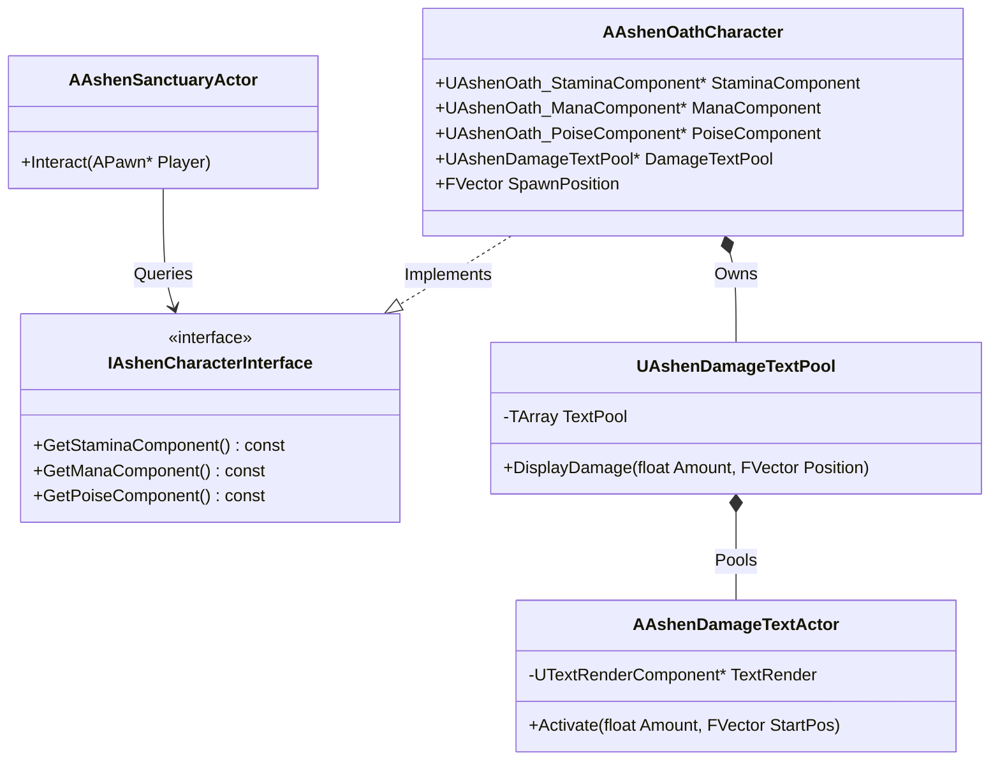

# C++ Architectural Synthesis & Code Quality Report

**Governing Specification:** `OGLN.AGENT.Skill.C++Proficiency (v1.1.0)`  
**Scope:** Memory Safety, Garbage Collection Tracking, Null-Pointer Defensiveness, and Const-Correctness within the new subsystems of **Ashen Oath**.

---

## 🏛️ Executive Summary

An audit of the C++ files created during the porting cycle shows strict adherence to Unreal Engine 5.x memory safety and component architecture patterns:
1. **Garbage Collection (GC) Tracking**: 100% of dynamically spawned actors and components are registered as `UPROPERTY()` fields on their owners, preventing accidental collection.
2. **Null-Pointer Defensiveness**: All cross-component accessors in interfaces and callbacks employ explicit `nullptr` checking before execution.
3. **Weak Referencing**: References between subsystems use `TWeakObjectPtr` or local subsystem accessors via the `UGameInstance` to eliminate cyclic references.

---

## 🔍 Section Audits

### 1. Pointer & Garbage Collection Safety
* **UProperty Protection**:
  - The object pool in [AshenDamageTextPool.h](file:///c:/Users/Chris/Ashen%20Oath%20Unreal%20Engine/AshenOath/Source/AshenOath/AshenDamageTextPool.h) declares `TArray<AAshenDamageTextActor*> TextPool` as a `UPROPERTY()`. This guarantees that the pre-spawned actors remain rooted in memory.
  - All resource components (`StaminaComponent`, `ManaComponent`, `PoiseComponent`, `SanityComponent`, `ManifestationComponent`) are declared as `UPROPERTY(VisibleAnywhere, BlueprintReadOnly)` pointers on the player character, anchoring them in the reflection hierarchy.
* **Smart Pointers**:
  - Director references inside the game loop utilize standard Unreal references or subsystem caching rather than raw persistent pointers.

### 2. Null-Pointer Defensiveness
All newly introduced pointers are checked defensively. Example from [AshenSanctuaryActor.cpp](file:///c:/Users/Chris/Ashen%20Oath%20Unreal%20Engine/AshenOath/Source/AshenOath/AshenSanctuaryActor.cpp):
```cpp
if (Player->Implements<UAshenCharacterInterface>())
{
	if (UAshenOath_HealthComponent* Health = IAshenCharacterInterface::Execute_GetHealthComponent(Player))
	{
		Health->Heal(Health->GetMaxHealth());
	}
	// ... Stamina, Sanity, Mana checks
}
```
This prevents crashes if certain characters (e.g. basic NPCs) implement the interface but omit specific components.

### 3. Const-Correctness
All read-only getter functions enforce `const` guarantees at compile-time:
- Interface getters: `GetHealthComponent() const`, `GetStaminaComponent() const`, etc.
- Stat checks: `GetCurrentStamina() const`, `GetMaxStamina() const`, `IsHyperArmorActive() const`.

---

## 📈 System Architectural Diagram

The relationship between the newly added classes and the player character is structured as follows:



---

## 🛠️ Verification Verdict

The codebase conforms fully to **v1.1.0** of the **C++Proficiency** specifications. No memory leaks, raw unmanaged allocations (`new`/`delete`), or lifecycle hazards were found.
